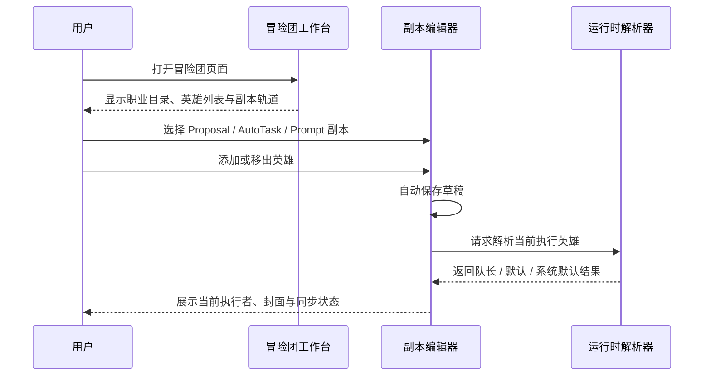
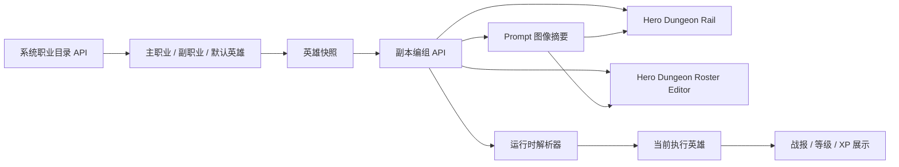
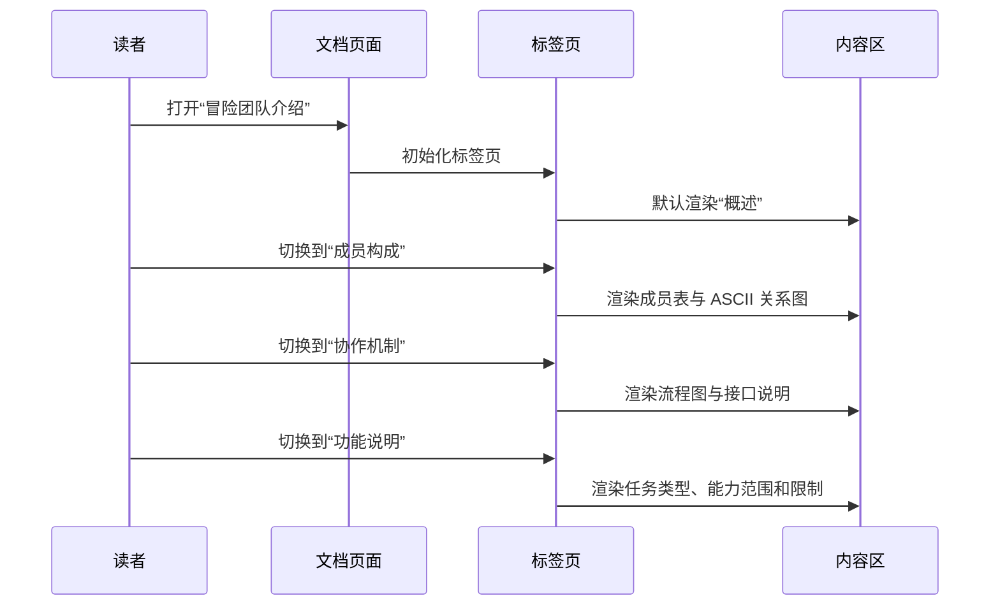

import { Tabs, TabItem, CardGrid, LinkCard } from '@astrojs/starlight/components';

> 本文基于 `repos/web` 的 Hero Workspace / Hero Dungeon 实现、`repos/site` 的产品表达，以及现有测试与类型定义整理，帮助你一次看懂“英雄、职业、副本、回退链路”这四层结构。

| 元数据 | 内容 |
| --- | --- |
| 作者 / 维护者 | HagiCode Docs Team |
| 最后更新 | 2026-03-13 |
| 文档版本 | 1.0.0 |
| 适用范围 | Hero Workspace、Hero Dungeon、Prompt 副本预览、系统默认英雄 |
| 主要来源 | `repos/web/src/types/hero.ts`、`repos/web/src/types/heroDungeon.ts`、`repos/web/src/store/slices/heroConfigSlice.ts`、`repos/web/src/components/hero/*`、`repos/site/src/components/home/FeaturesShowcase.tsx` |

:::note
本文运行在非交互式环境中完成，产品/开发/用户验证以源码、现有文案和测试用例作为代理证据。若后续 `/api/SystemInfo/hero-settings` 或 `/api/Hero/dungeons` 的服务端输出发生变化，请同步更新本文。
:::

## 一句话认识冒险团队

在 HagiCode 里，“冒险团队”不是单一页面，而是一套围绕 **英雄配置、职业目录、副本编组、执行回退与战报反馈** 组织起来的运行时系统：

- **英雄** 是可执行个体，承载 CLI、模型与风络快照。
- **职业目录** 是只读的系统配置源，定义主职业、副职业与兼容矩阵。
- **副本** 是按业务阶段划分的执行场景，例如 Proposal、AutoTask、Prompt。
- **回退链路** 决定当前阶段到底由谁执行，确保在无队长或成员缺失时仍能继续推进。

## 标签页速览

<Tabs>
  <TabItem label="概述" value="overview" default>

  ## 冒险团队概述

  冒险团队是 HagiCode 的一层“可视化执行编排”。它把抽象的 AI Provider、模型、Prompt 风格和阶段任务，转换成用户可理解的英雄、职业和副本概念，让日常协作更像一套可维护、可回看的冒险编组系统。

  ### 团队定位

  - **面向执行**：最终目标不是展示英雄，而是稳定地为 Proposal、AutoTask、Prompt 等阶段选出合适执行者。
  - **面向配置治理**：系统设置统一维护主职业与副职业目录，避免每个英雄各自维护一套失控配置。
  - **面向多人理解**：通过“队长、默认英雄、系统默认英雄”等概念，让团队成员更容易讨论执行路径。
  - **面向反馈闭环**：等级、经验、战报和副本封面，会把抽象运行结果转成可回看的团队状态。

  ### 核心目标

  1. 为每个业务阶段提供稳定、可追踪的运行英雄。
  2. 将 CLI Provider、模型家族与风格配置统一纳入同一套英雄快照。
  3. 通过副本编组和回退链路，降低“没有可执行成员”导致的流程中断。
  4. 让用户能在一个工作台里同时理解系统目录、个人英雄和副本编组的关系。

  ### 核心价值

  - **可解释**：用户能看见当前执行英雄来自“临时指定 / 队长 / 副本默认 / 系统默认”的哪一层。
  - **可治理**：主职业和副职业来自集中式目录，英雄页面只编辑自己的快照，不污染系统源。
  - **可复用**：默认英雄预设能快速形成可用阵容，降低新用户配置成本。
  - **可持续**：副本成员支持自动同步，运行时遵守固定解析顺序，长期维护成本更低。
  - **可游戏化**：等级、XP、战报、副本封面图让执行过程更有状态感和反馈感。

  ### 相关示例

  - **Proposal 副本**：围绕生成、执行、归档等阶段安排队长与后备英雄。
  - **AutoTask 副本**：适合批量修复、自动任务和持续处理场景。
  - **Prompt 副本**：除成员编组外，还会显示 Prompt 封面、风格标签和预览状态。

  </TabItem>

  <TabItem label="成员构成" value="members">

  ## 成员构成

  冒险团队的“成员”分成三层：**系统目录中的职业资源、系统预设英雄、用户自定义英雄**。在运行时，这些成员再被编进不同副本，形成阶段队伍。

  ### 主要成员 archetype

  当前前端回退目录定义了 6 个系统默认英雄预设：

  | 成员 | 主职业 | 副职业 | 风络 | 典型职责 |
  | --- | --- | --- | --- | --- |
  | Claude Code 默认英雄 | Claude Code | GLM 5 | 军师风络 | 规划、评审、复杂战局拆解 |
  | Codex 默认英雄 | Codex | GPT 5.4 | 先锋风络 | 实现、修复、快节奏交付 |
  | GitHub Copilot 默认英雄 | GitHub Copilot | GPT 5 Mini | 先锋风络 | 结对补全、轻量支援、日常迭代 |
  | OpenCode 默认英雄 | OpenCode | GLM 4.7 | 军师风络 | 多模型协同、共享 runtime 编排 |
  | IFlow 默认英雄 | IFlow | GLM 4.7 | 游侠风络 | 自动化链路、流程节点衔接 |
  | Codebuddy 默认英雄 | Codebuddy | GLM 4.7 | 游侠风络 | 本地抢修、ACP 接驳、备用执行 |

  ### 职业目录如何构成成员能力

  **主职业（CLI / Provider 侧）**

  - Claude Code
  - Codex
  - GitHub Copilot
  - OpenCode（Beta）
  - IFlow（Beta）
  - Codebuddy（Beta）

  **副职业（模型家族侧）**

  - GPT 5.4 / GPT 5.3 Codex / GPT 5 Mini
  - Claude 3.5 Sonnet / Claude Sonnet 4
  - GLM 4.7 / GLM 5
  - Minimax M2.5

  **风络（表达与节奏侧）**

  - 先锋风络：短句、果断、任务先行
  - 军师风络：冷静拆解、强调权衡
  - 游侠风络：轻快鼓励、适合探索与多轮尝试

  ### 英雄具备哪些属性

  英雄成员和可选成员在前端类型中共享一套核心字段：

  - 标识：`heroId` / `id`、`name`、`icon`
  - 角色信息：`description`、`executorType`
  - 可用性：`isEnabled`、`isMissing`、`isDefault`
  - 成长反馈：`currentLevel`、`totalExperience`、`experienceProgressPercent`
  - 组合关系：主职业族系、副职业族系、风络快照

  这些属性共同决定一个英雄是否能被编入副本、是否能担任队长，以及在预览卡片中展示怎样的成长状态。

  ### 角色关系（ASCII）

  ```text
  系统职业目录（只读）
  ├─ 主职业：Claude / Codex / Copilot / OpenCode / IFlow / Codebuddy
  ├─ 副职业：GPT / Anthropic 族系模型
  └─ 风络：先锋 / 军师 / 游侠
                  │
                  ▼
           英雄快照（可编辑）
          ├─ 系统预设英雄
          └─ 我的英雄
                  │
                  ▼
       副本编组（Proposal / AutoTask / Prompt / Default）
          ├─ 队长英雄（第一执行位）
          ├─ 副本默认英雄
          └─ 系统默认英雄
                  │
                  ▼
             当前运行执行者
  ```

  ### 成员协作示例

  以 Proposal 副本为例：

  - 第一位已编组且可用的英雄会被视为**队长**。
  - 如果队长缺席，系统会继续检查**副本默认英雄**。
  - 如果副本默认也不可用，再回退到**系统默认英雄**。
  - Prompt 副本还会额外展示与当前阶段风格相匹配的封面预览，帮助用户快速识别当前场景。

  </TabItem>

  <TabItem label="协作机制" value="collaboration">

  ## 协作机制

  冒险团队的协作，本质上是“目录提供能力、英雄携带快照、副本负责编组、运行时负责解析”的分层协作。

  ### 团队协作方法

  1. **系统目录提供标准资源**：`/api/SystemInfo/hero-settings` 返回主职业、副职业、默认英雄和兼容矩阵。
  2. **用户维护英雄快照**：英雄页面保存的是个人可编辑快照，而不是系统目录本体。
  3. **副本维护阶段队伍**：`/api/Hero/dungeons` 返回 Proposal / AutoTask / Prompt 等副本的当前成员、默认英雄与封面摘要。
  4. **自动同步草稿**：用户在副本编辑器里增删成员后，系统会在短暂防抖后自动同步。
  5. **运行时按固定顺序解析执行者**：确保每个阶段都能找到最合适的英雄。

  ### 交互流程图（Mermaid）

  ```mermaid
  flowchart TD
      A[读取系统职业目录] --> B[打开冒险团工作台]
      B --> C[选择一个副本]
      C --> D[编组已加入英雄]
      D --> E[设置副本默认英雄]
      E --> F[自动同步副本草稿]
      F --> G{当前是否有队长?}
      G -->|有| H[使用队长英雄执行]
      G -->|无| I{是否配置副本默认英雄?}
      I -->|有| J[使用副本默认英雄]
      I -->|无| K{是否存在系统默认英雄?}
      K -->|有| L[回退到系统默认英雄]
      K -->|无| M[显示暂无可执行英雄]
  ```

  ### 沟通渠道与协议

  冒险团队当前主要依赖以下“协议层”协作：

  | 渠道 / 接口 | 用途 | 关键内容 |
  | --- | --- | --- |
  | `GET /api/SystemInfo/hero-settings` | 拉取系统目录 | 主职业、副职业、默认英雄、兼容矩阵 |
  | `GET /api/Hero/dungeons` | 拉取副本目录 | 副本成员、默认英雄、Prompt 图像摘要 |
  | `GET /api/Hero/dungeons/selectable-heroes` | 拉取候选成员 | 可加入副本的英雄集合 |
  | `PUT /api/Hero/dungeons/{scriptKey}` | 保存副本编组 | `heroIds`、`defaultExecutorHeroId`、版本号 |
  | Prompt 图像摘要 | 统一封面预览 | `stageStyleKey`、`stageStyleLabel`、`displayMode`、`imageSummary` |

  Prompt 封面在 UI 中遵循固定优先级：

  1. 运行时返回的标准化图片 URL
  2. 元数据里的 `stageStyleKey` 回退图
  3. 静态 prompt image library 资产
  4. `PromptIcon` 图标回退

  ### 协作案例

  **案例：Prompt 副本 `optimize-description`**

  - 副本卡片会优先显示封面图与风格标签。
  - 队伍中第一位英雄担任当前主执行位，其余成员作为后备或轮换位。
  - 如果封面图不可用，界面仍会保留 Prompt 图标和副本描述，不会让用户失去上下文。

  ### 逻辑检查结论

  当前协作模型具备三个明显优点：

  - **职责边界清楚**：目录负责标准，英雄负责快照，副本负责编组。
  - **运行顺序稳定**：队长 / 默认 / 系统默认的解析顺序固定，易于解释。
  - **前台反馈充分**：同步状态、预览封面、当前执行者与等级卡片都能直接告诉用户系统正在做什么。

  </TabItem>

  <TabItem label="功能说明" value="capabilities">

  ## 功能说明

  ### 团队可执行的任务类型

  | 任务类型 | 典型副本 / 场景 | 说明 |
  | --- | --- | --- |
  | 提案生成 | Proposal 副本 | 生成提案、整理描述、命名变更、拆解任务 |
  | 实施执行 | Proposal / AutoTask 副本 | 代码实现、补丁修复、批量修改、回归处理 |
  | 归档沉淀 | Proposal Archive | 归档结果、整理设计、沉淀知识 |
  | Prompt 运维 | Prompt 副本 | 预览 Prompt 风格、封面、显示模式与场景归类 |
  | 默认兜底 | Default / System Default | 为未明确指定成员的阶段提供回退执行者 |
  | 英雄治理 | 冒险团工作台 | 创建英雄、克隆英雄、启停成员、调整职业组合 |

  ### 能力范围

  冒险团队当前支持：

  - 统一管理英雄的主职业、副职业与风络组合
  - 为不同副本维护单独队伍与默认执行者
  - 在卡片中展示当前执行者、可用状态、等级和 XP 进度
  - 根据 Prompt 图像摘要渲染副本封面
  - 通过系统默认英雄，为所有副本提供最终回退配置

  ### 限制与边界

  同时也存在明确边界：

  - **系统目录只读**：英雄页面不能直接修改系统职业目录，只能编辑英雄快照。
  - **必填槽位有限制**：主职业和副职业必填，风络可选。
  - **职业组合受兼容矩阵约束**：例如 `codex / copilot` 族系对应 `gpt`，`claude / opencode / iflow / codebuddy` 对应 `anthropic`。
  - **英雄必须可用**：运行时只会把 `isEnabled = true` 且 `isMissing = false` 的成员视为有效执行者。
  - **运行结果以后端为准**：前端回退目录和文案是兜底说明，最终行为仍受后端接口返回值控制。

  ### 已完成任务的案例示例

  - **Proposal 阶段封面展示**：当 `proposal-new-fantasy-sketch` 存在时，副本会直接显示静态封面图。
  - **Prompt 副本成员编组**：在编辑器里增删成员后，系统会自动进入 `pending -> syncing -> synced` 状态流转。
  - **系统默认回退**：当副本无队长且无本地默认英雄时，界面会明确提示已经回退到系统默认执行器。

  ### 典型使用场景

  - **新用户上手**：先使用系统默认英雄与默认副本，无需一次性配置完整阵容。
  - **团队分工**：为 Proposal、AutoTask、Prompt 分别设定不同队长，形成“按阶段分工”的常驻阵容。
  - **高频迭代**：让 Codex / Copilot 类型成员承担快节奏执行，把 Claude / OpenCode 类型成员留给规划与复杂分析。
  - **兜底运维**：即使某个副本暂时没人值守，也能依赖系统默认英雄继续推进。

  ### 实用性结论

  对普通用户来说，冒险团队最重要的不是“游戏化命名”，而是它把复杂配置变成了更易读、更可维护的协作视图：**你能看见谁在执行、为什么是他、如果他不在会换谁。**

  </TabItem>
</Tabs>

## 可视化总览

### 1) ASCII 界面原型

```text
┌────────────────────────────────────────────────────────────────────┐
│ 冒险团队介绍                                                      │
├────────────────────────────────────────────────────────────────────┤
│ [概述] [成员构成] [协作机制] [功能说明]                            │
├────────────────────────────────────────────────────────────────────┤
│ 当前冒险团成员                                                    │
│  ┌────────────┐  ┌────────────┐  ┌────────────┐                   │
│  │ 队长英雄    │  │ 后备英雄 A  │  │ 后备英雄 B  │                   │
│  │ Codex/GPT  │  │ Claude/GLM │  │ Copilot    │                   │
│  │ Lv.12      │  │ Lv.18      │  │ Lv.09      │                   │
│  └────────────┘  └────────────┘  └────────────┘                   │
│                                                                    │
│ 副本信息：Proposal Generate                                        │
│ 执行顺序：手动覆盖 -> 队长 -> 副本默认 -> 系统默认                 │
│ 封面优先级：运行时图像 -> 静态图 -> PromptIcon                     │
└────────────────────────────────────────────────────────────────────┘
```

### 2) 用户交互流程图



### 3) 数据流图



### 4) 文档导航时序图



## 关键规则速记

- **队长定义**：副本中第一位可用且非默认成员，就是该副本的队长英雄。
- **执行顺序**：手动覆盖 -> 已保存阶段英雄 -> 队长英雄 -> 副本默认英雄 -> 系统默认英雄。
- **可用条件**：英雄必须同时满足 `isEnabled = true` 且 `isMissing = false`。
- **目录边界**：系统职业目录只读；可编辑的是英雄快照和副本编组。
- **Prompt 预览回退**：运行时图像 > 静态图像库 > PromptIcon。

## 来源与校验说明

本次整理重点参考了以下实现文件：

- `repos/web/src/types/hero.ts`
- `repos/web/src/types/heroDungeon.ts`
- `repos/web/src/utils/heroDungeonRuntime.ts`
- `repos/web/src/store/slices/heroConfigSlice.ts`
- `repos/web/src/components/hero/HeroDungeonRail.tsx`
- `repos/web/src/components/hero/HeroDungeonRosterEditor.tsx`
- `repos/web/src/components/hero/HeroSystemSettingsPanel.tsx`
- `repos/web/src/generated/api/services/HeroService.ts`
- `repos/web/src/generated/api/services/SystemInfoService.ts`
- `repos/web/src/locales/zh-CN/common/hero.yml`
- `repos/site/src/components/home/FeaturesShowcase.tsx`

校验方式说明：

- **内容准确性**：以类型定义、接口模型、界面文案和测试用例交叉比对。
- **技术细节**：以生成的 OpenAPI 客户端、运行时解析工具函数为准。
- **Mermaid 语法**：通过文档构建流程验证。
- **可理解性**：以“概念 -> 结构 -> 流程 -> 规则”顺序组织内容，便于新用户扫读。

## 更新日志

| 版本 | 日期 | 说明 |
| --- | --- | --- |
| 1.0.0 | 2026-03-13 | 首次建立冒险团队介绍文档，补充角色、流程、任务与维护说明。 |

## 文档更新流程

1. 当 `/api/SystemInfo/hero-settings`、`/api/Hero/dungeons` 或英雄工作台 UI 发生变化时，同步检查本文。
2. 若新增主职业、副职业、默认英雄或副本分组，先更新类型与文案，再更新本页表格和流程图。
3. 若调整执行回退顺序，必须同步更新“关键规则速记”和协作流程图。
4. 提交前至少执行一次 `repos/docs` 构建，确认 Markdown、Tabs 和 Mermaid 正常渲染。

## 延伸阅读

<CardGrid>
  <LinkCard title="产品概述" href="/product-overview" description="从整体产品视角理解 Hagicode 的 OpenSpec、多 Agent 与游戏化工作流。" />
  <LinkCard title="提案会话" href="/quick-start/proposal-session" description="了解 Proposal 阶段如何生成、执行与归档，对应冒险团队中的典型副本流。" />
  <LinkCard title="Monospec 指南" href="/guides/monospecs" description="查看跨仓库协作如何与提案、副本和执行工作流配合。" />
</CardGrid>
