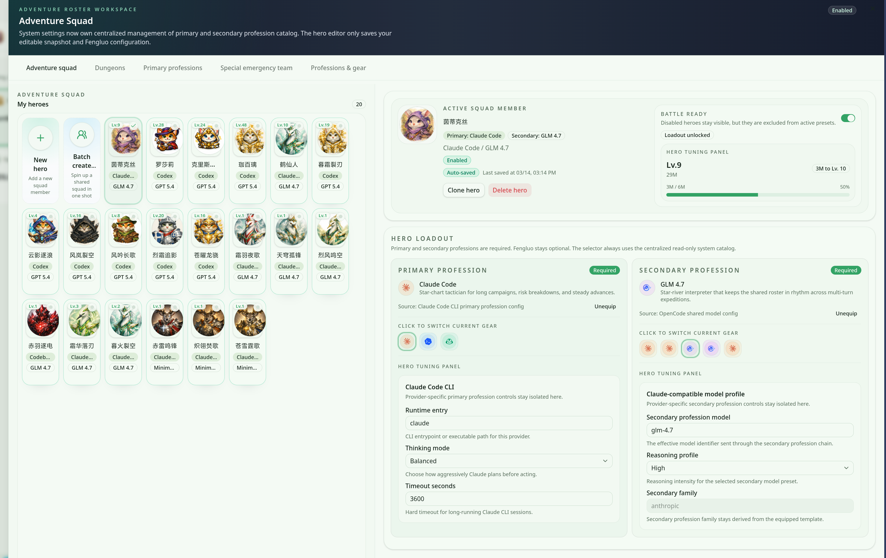

import { CardGrid, LinkCard } from '@astrojs/starlight/components';

“冒险团”页面把英雄编组、负载调优和副本推进放在同一个工作台里。本页只讲第一次接触时最该看懂的内容：它负责什么、如何协作、又该在什么场景里用。

## 功能概览

- 冒险团用于把“谁来执行任务、以什么配置执行、当前副本推进到哪里”放到同一个视图里统一查看。
- 当前这组截图重点覆盖两类信息：英雄编组与负载面板、以及副本卡片与编组编辑器之间的协作关系。
- 适合在提案执行、批量任务推进、或需要快速切换英雄职责时作为总览工作台使用。
- 这不是战斗动画或纯展示页面；它更像一个围绕副本目标组织执行者与配置的调度台。

## 成员与编组面板

这张截图最适合用来解释“成员编组”本身：左侧是可浏览的英雄 roster，中间是当前选中成员的详情状态，右侧则是和当前成员直接相关的职业负载与战备设置。用户在这里通常会完成三件事：

1. 先从 roster 中选出本轮任务的主力成员，确认哪些英雄已经准备好进入副本。
2. 再查看当前成员的状态详情，例如战备标识、角色信息和当前承担的职责。
3. 最后微调 profession / loadout 一类的配置，避免把不合适的英雄带入后续流程。

放到日常团队协作里，它更像一个“排班 + 装备检查”面板：先确认谁上场，再确认每个人是否以正确配置进入任务。

## 协作流程与副本推进

这张截图把“副本目标”与“成员配置”放在同一个工作流里：左侧的 dungeon proposal cards 表示当前可推进或待处理的副本任务，右侧的 roster editor 则负责把具体执行者绑定到选中的副本上下文。

可以把它理解为下面这条协作链：

1. 先在左侧选定本次要推进的副本或任务卡片。
2. 根据副本目标，在右侧调整参与成员、状态标识和已分配英雄。
3. 确认队伍后，再让 Proposal、AutoTask 或 Prompt 相关流程继续推进。

因此，“冒险团”的价值不是单独展示英雄，而是把任务上下文、成员编组和执行准备串成一条连续的推进路径。

## 功能边界与适用场景

### 它解决什么问题

- 在一个页面里同时看到副本上下文和执行 roster，减少来回切换视图的成本。
- 在进入后续自动执行前，先完成成员检查与配置校准。
- 为团队提供一个更容易复盘的“当前任务由谁负责、为什么这样分配”的可视化入口。

## 继续阅读

<CardGrid>
  <LinkCard
    title="初始化向导说明"
    href="/guides/initialization-wizard"
    description="继续了解新用户如何先完成职业配置、自定义英雄与项目创建。"
  />
  <LinkCard
    title="提案会话"
    href="/quick-start/proposal-session"
    description="查看冒险团如何和 Proposal 驱动的任务推进流程配合使用。"
  />
  <LinkCard
    title="产品概述"
    href="/product-overview"
    description="回到产品总览，了解 Hero Dungeon 与整个 Smart / Efficient / Interesting 叙事。"
  />
</CardGrid>
