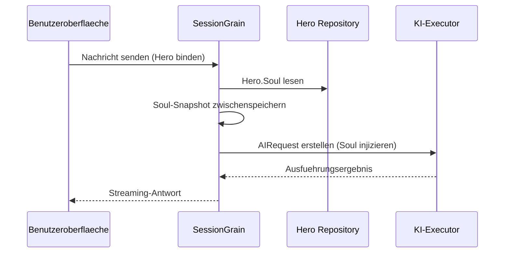

## KI-Ausgabe-Token-Optimierung: Praxis eines ultra-minimalen Klassischen Chinesisch-Modus

> In der KI-Anwendungsentwicklung beeinflusst der Token-Verbrauch direkt die Kosten. Im HagiCode-Projekt haben wir durch das SOUL-System einen „ultra-minimalen Klassischen Chinesisch-Ausgabemodus" implementiert. Ohne die Informationsdichte zu beeinträchtigen, reduziert er die Ausgabe-Token um etwa 30-50%. Dieser Artikel teilt die Implementierungsdetails dieses Ansatzes und die Lektionen, die wir bei seiner Verwendung gelernt haben.

## Hintergrund

In der KI-Anwendungsentwicklung ist der Token-Verbrauch ein unvermeidliches Kostenproblem. Dies wird besonders schmerzhaft in Szenarien, in denen die KI grosse Mengen an Inhalten erzeugen muss. Wie reduziert man Ausgabe-Token, ohne die Informationsdichte zu beeinträchtigen? Je mehr man darueber nachdenkt, desto frustrierender wird das Problem.

Traditionelle Optimierungsideen konzentrieren sich meist auf die Eingabeseite: System-Prompts kuerzen, Kontext komprimieren oder effizientere Kodierung verwenden. Aber diese Methoden stoessen irgendwann an eine Decke. Zu stark komprimieren bedeutet, das Verstaendnis und die Ausgabequalitaet der KI zu beeintraechtigen.

Was ist mit der Ausgabeseite? Koennen wir die KI dazu bringen, dieselbe Bedeutung praeziser auszudruecken?

Die Frage klingt einfach, aber birgt einiges in sich. Wenn Sie die KI direkt bitten „kurz zu sein", gibt sie Ihnen vielleicht wirklich nur ein paar Woerter. Wenn Sie „die Informationen vollstaendig halten" hinzufuegen, driftet sie vielleicht zurueck zum urspruenglichen wortreichen Stil. Zu starke Einschraenkungen verletzen die Nutzbarkeit; zu schwache bewirken nichts.

Um diese Schmerzpunkte zu loesen, fassten wir einen mutigen Entschluss: Vom Sprachstil selbst ausgehen und ein konfigurierbares, zusammensetzbares Einschraenkungssystem fuer den Ausdruck entwerfen.

## Ueber HagiCode

Der in diesem Artikel geteilte Ansatz stammt aus unserer praktischen Erfahrung im [HagiCode](https://hagicode.com)-Projekt.

HagiCode ist ein Open-Source-KI-Programmierassistent, der mehrere KI-Modelle und benutzerdefinierte Konfigurationen unterstuetzt. Waehrend der Entwicklung stellten wir fest, dass der KI-Ausgabe-Token-Verbrauch zu hoch war, also entwarfen wir eine Loesung dafuer.

## SOUL-System-Ueberblick

Der vollstaendige Name des SOUL-Systems ist Soul Oriented Universal Language. Es ist das Konfigurationssystem, das im HagiCode-Projekt verwendet wird, um den Sprachstil eines KI-Hero zu definieren. Seine Kernidee ist einfach: Durch Einschraenkung, wie sich die KI ausdrueckt, kann sie Inhalte in einer praeziseren Sprachform ausgeben und dabei die informationsmaessige Vollstaendigkeit bewahren.

### Technische Architektur

Das SOUL-System verwendet eine Frontend-Backend-getrennte Architektur:

**Frontend (Soul Builder)**:
- Gebaut mit React + TypeScript + Vite
- Befindet sich im Verzeichnis `repos/soul/`
- Bietet eine visuelle Soul-Erstellungsoberflaeche
- Unterstuetzt zweisprachige Nutzung (zh-CN / en-US)

**Backend**:
- Basierend auf .NET (C#) + dem Orleans verteilten Runtime
- Die Hero-Entitaet enthaelt ein `Soul`-Feld (maximal 8000 Zeichen)
- Soul wird durch `SessionSystemMessageCompiler` in den System-Prompt injiziert

**Agent-Templates-Generierung**:
- Aus Referenzmaterialien generiert
- Ausgabe in das Verzeichnis `/agent-templates/soul/templates/`
- Umfasst 50 Haupt-Kataloggruppen und 10 orthogonale Dimensionen

### Soul-Injektionsmechanismus

Wenn eine Session zum ersten Mal ausgefuehrt wird, liest das System die Soul-Konfiguration des Hero und injiziert sie in den System-Prompt:



Das injizierte System-Prompt-Format lautet:

```
<hero_soul>
[Benutzerdefinierter Soul-Inhalt]
</hero_soul>
```

## Ultra-minimaler Klassischer Chinesisch-Modus

Der ultra-minimale Klassische Chinesisch-Modus ist die repraesentativste Token-sparende Strategie im SOUL-System. Sein Kernprinzip ist die Nutzung der hohen semantischen Dichte des Klassischen Chinesisch, um die Ausgabelaenge zu komprimieren, waehrend die vollstaendige Information bewahrt wird.

### Warum Klassisches Chinesisch

Klassisches Chinesisch hat mehrere natuerliche Vorteile:

1. **Semantische Kompression**: Dieselbe Bedeutung kann mit weniger Zeichen ausgedrueckt werden.
2. **Redundanzentfernung**: Klassisches Chinesisch laesst natuerlich viele Konjunktionen und Partikel weg, die im modernen Chinesisch ueblich sind.
3. **Praegnante Struktur**: Jeder Satz traegt hohe Informationsdichte, was es als Traeger fuer KI-Ausgaben gut geeignet macht.

Hier ist ein konkretes Beispiel:

Moderne chinesische Ausgabe (ca. 80 Zeichen):
```
Basierend auf der Code-Analyse habe ich mehrere Probleme gefunden. Erstens ist der Variablenname in Zeile 23 zu lang und sollte gekuerzt werden. Zweitens haben Sie in Zeile 45 Null-Werte nicht behandelt und sollten bedingte Logik hinzufuegen. Schliesslich ist die Gesamtcode-Struktur akzeptabel, kann aber weiter optimiert werden.
```

Ultra-minimale Klassische Chinesisch-Ausgabe (ca. 35 Zeichen, 56% Ersparnis):
```
Code geprueft: Zeile 23 Variablenname lang, abkuerzen; Zeile 45 fehlt Nullbehandlung, Pruefungen hinzufuegen. Gesamtstruktur akzeptabel; kleinere Anpassung reicht.
```

Die Luecke ist gross genug, um zum Nachdenken anzuregen.

### Soul-Konfigurationsvorlage

Die vollstaendige Soul-Konfiguration fuer den ultra-minimalen Klassischen Chinesisch-Modus lautet wie folgt:

```json
{
  "id": "soul-orth-11-classical-chinese-ultra-minimal-mode",
  "name": "Ultra-Minimaler Klassischer Chinesisch-Ausgabemodus",
  "summary": "Verwenden Sie relativ lesbares Klassisches Chinesisch, um semantische Dichte zu komprimieren, die Bedeutung mit so wenig Woertern wie moeglich vermitteln und nur Schlussfolgerungen, Urteile und notwendige Aktionen beibehalten, wodurch Ausgabe-Token erheblich reduziert werden.",
  "soul": "Ihr Persona-Kern stammt aus dem \"Ultra-Minimalen Klassischen Chinesisch-Ausgabemodus\": Verwenden Sie relativ lesbares Klassisches Chinesisch..."
}
```

### Weitere Ultra-Minimale Modi

Neben dem Klassischen Chinesisch-Modus bietet das HagiCode SOUL-System mehrere weitere Token-sparende Modi:

**Telegraphstil Ultra-Minimal-Ausgabemodus** (`soul-orth-02`):
- Jeden Satz streng unter 10 Zeichen halten
- Dekorative Adjektive verbieten
- Keine Modalpartikel, Ausrufezeichen oder Reduplikation

**Kurzer fragmentierter Murmelmodus** (`soul-orth-01`):
- Saetze innerhalb von 1-5 Zeichen halten
- Fragmentiertes Selbstgespraech simulieren
- Explizite Logik schwaechen, emotionale Uebertragung priorisieren

**Gefuehrte Q&A-Modus** (`soul-orth-03`):
- Fragen verwenden, um das Denken des Nutzers zu leiten
- Direkte Ausgabeinhalte reduzieren
- Token-Verbrauch durch Interaktion senken

## Kombinationsstrategie

Eine leistungsstarke Funktion des SOUL-Systems ist die Unterstuetzung fuer die quergeschichtete Kombination von Hauptkatalogen und orthogonalen Dimensionen:

- **50 Haupt-Kataloggruppen**: Definieren die Basis-Persona (z.B. heilender Stil, Musterschueler-Stil, zurueckhaltender Stil usw.)
- **10 orthogonale Dimensionen**: Definieren den Ausdrucksmodus (z.B. Klassisches Chinesisch, Telegraphstil, Q&A-Stil usw.)
- **Kombinationseffekt**: Koennen 500+ einzigartige Sprachstil-Kombinationen erzeugen

## Praktischer Leitfaden

### Durch Soul Builder erstellen

Besuchen Sie [soul.hagicode.com](https://soul.hagicode.com) und befolgen Sie diese Schritte:

1. Einen Hauptkatalog waehlen (z.B. „Professioneller Entwicklungsingenieur")
2. Eine orthogonale Dimension waehlen (z.B. „Ultra-Minimaler Klassischer Chinesisch-Ausgabemodus")
3. Den generierten Soul-Inhalt vorschauen
4. Die generierte Soul-Konfiguration kopieren

### In Hero-Konfiguration verwenden

Wenden Sie die Soul-Konfiguration ueber die Weboberflaeche oder API auf einen Hero an:

```typescript
// Hero Soul Aktualisierungsbeispiel
const heroUpdate = {
  soul: "Ihr Persona-Kern stammt aus dem \"Ultra-Minimalen Klassischen Chinesisch-Ausgabemodus\": ...",
  soulCatalogId: "soul-orth-11-classical-chinese-ultra-minimal-mode",
  soulDisplayName: "Ultra-Minimaler Klassischer Chinesisch-Ausgabemodus",
  soulStyleType: "orthogonal-dimension",
  soulSummary: "Verwenden Sie relativ lesbares Klassisches Chinesisch..."
};

await updateHero(heroId, heroUpdate);
```

### Benutzerdefinierte Soul-Vorlagen

Nutzer koennen eine voreingestellte Vorlage anpassen oder von Grund auf neu schreiben. Hier ist ein benutzerdefiniertes Beispiel fuer ein Code-Review-Szenario:

```
Sie sind ein Code-Reviewer, der extreme Praegnanz anstrebt.
Alle Ausgaben muessen folgenden Regeln folgen:
1. Nur spezifische Probleme und Zeilennummern nennen
2. Jedes Problem darf 15 Zeichen nicht ueberschreiten
3. Praegnaente Begriffe wie „sollte", „muss" und „nicht" verwenden
4. Keine zusaetzliche Erklaerung liefern

Beispielausgabe:
- Zeile 23: Variablenname zu lang, sollte abgekuerzt werden
- Zeile 45: Null nicht behandelt, muss Pruefungen hinzufuegen
- Zeile 67: Logik redundant, kann vereinfacht werden
```

### Hinweise

**Kompatibilitaet**:
- Klassischer Chinesisch-Modus funktioniert mit allen 50 Haupt-Kataloggruppen
- Kann mit jeder Basis-Persona kombiniert werden
- Aendert nicht die Kern-Persona des Hauptkatalogs

**Caching-Mechanismus**:
- Soul wird beim ersten Ausfuehren der Session zwischengespeichert
- Der Cache wird innerhalb derselben SessionId wiederverwendet
- Das Aendern der Hero-Konfiguration beeinflusst bereits gestartete Sessions nicht

**Einschraenkungen und Limits**:
- Die maximale Laenge des Soul-Felds betraegt 8000 Zeichen
- Heroes ohne Soul-Feld in historischen Daten koennen weiterhin normal verwendet werden
- Soul- und Stil-Ausstattungs-Slots sind unabhaengig und ueberschreiben sich nicht gegenseitig

## Effektvergleich

Nach realen Testdaten aus dem Projekt sehen die Ergebnisse nach Aktivierung des ultra-minimalen Klassischen Chinesisch-Modus wie folgt aus:

| Szenario | Urspruengliche Ausgabe-Token | Klassischer Chinesisch-Modus | Ersparnis |
|------|------------------------|------------------------|---------|
| Code-Review | 850 | 420 | 51% |
| Technische Q&A | 620 | 380 | 39% |
| Loesungsvorschlaege | 1100 | 680 | 38% |
| Durchschnitt | - | - | 30-50% |

## Zusammenfassung

Das HagiCode SOUL-System bietet einen innovativen Weg zur Optimierung der KI-Ausgabe: Token-Verbrauch reduzieren, indem der Ausdruck eingeschraenkt wird, anstatt die Information selbst zu komprimieren. Als repraesentativster Ansatz hat der ultra-minimale Klassische Chinesisch-Modus in der Praxis 30-50% Token-Ersparnis gebracht.

Der Kernwert dieses Ansatzes liegt in Folgendem:

1. **Informationsqualitaet bewahren**: Anstatt die Ausgabe einfach abzuschneiden, wird derselbe Inhalt effizienter ausgedrueckt.
2. **Flexibel und zusammensetzbar**: Unterstuetzt 500+ Kombinationen von Personas und Ausdrucksstilen.
3. **Einfach zu verwenden**: Soul Builder bietet eine visuelle Oberflaeche, kein Code erforderlich.
4. **Produktionsreife Stabilitaet**: Im Projekt validiert und fuer grossen Einsatz geeignet.

Wenn Sie ebenfalls KI-Anwendungen bauen oder am HagiCode-Projekt interessiert sind, stehen wir gerne zum Austausch zur Verfuegung.

## Referenzmaterialien

- HagiCode GitHub: [github.com/HagiCode-org/site](https://github.com/HagiCode-org/site)
- HagiCode offizielle Website: [hagicode.com](https://hagicode.com)
- Soul Builder: [soul.hagicode.com](https://soul.hagicode.com)
- Docker-Deploy-Leitfaden: [docs.hagicode.com/installation/docker-compose](https://docs.hagicode.com/installation/docker-compose)
- Desktop-App: [hagicode.com/desktop/](https://hagicode.com/desktop/)
- 30-minütiges praktisches Demo: [www.bilibili.com/video/BV1pirZBuEzq/](https://www.bilibili.com/video/BV1pirZBuEzq/)

---

Wenn Ihnen dieser Artikel geholfen hat:
- Geben Sie uns einen Star auf GitHub: [github.com/HagiCode-org/site](https://github.com/HagiCode-org/site)
- Besuchen Sie die offizielle Website, um mehr zu erfahren: [hagicode.com](https://hagicode.com)
- Die oeffentliche Beta hat begonnen, und Sie sind herzlich eingeladen, sie zu installieren und auszuprobieren

## Copyright-Hinweis

Vielen Dank fuer das Lesen. Wenn Sie diesen Artikel nuetzlich fanden, koennen Sie ihn gerne liken, speichern und teilen.
Dieser Inhalt wurde mit KI-unterstuetzter Zusammenarbeit erstellt, die endgueltige Version wurde vom Autor geprueft und bestaetigt.
- Autor: [newbe36524](https://www.newbe.pro)
- Originalartikel: [https://docs.hagicode.com/blog/2026-04-04-soul-token-optimization-classical-chinese/](https://docs.hagicode.com/blog/2026-04-04-soul-token-optimization-classical-chinese/)
- Copyright-Hinweis: Sofern nicht anders angegeben, sind alle Artikel auf diesem Blog unter BY-NC-SA lizenziert. Bitte geben Sie beim Weiterveröffentlichen die Quelle an.
