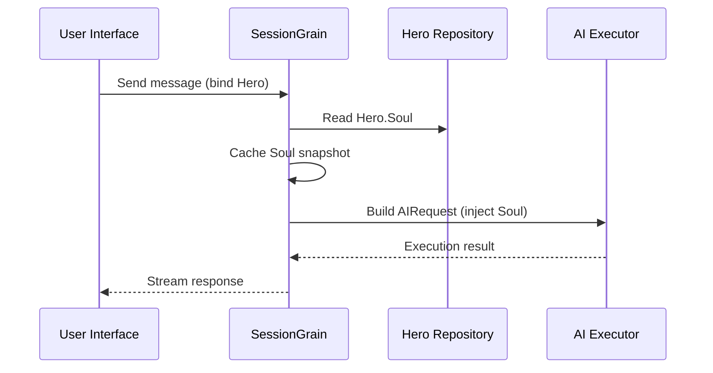

## AI Output Token Optimization: Practicing an Ultra-Minimal Classical Chinese Mode

> In AI application development, token consumption directly affects cost. In the HagiCode project, we implemented an "ultra-minimal Classical Chinese output mode" through the SOUL system. Without sacrificing information density, it reduces output tokens by roughly 30-50%. This article shares the implementation details of that approach and the lessons we learned using it.

## Background

In AI application development, token consumption is an unavoidable cost issue. This becomes especially painful in scenarios where the AI needs to produce large amounts of content. How do you reduce output tokens without sacrificing information density? The more you think about it, the more frustrating the problem can get.

Traditional optimization ideas mostly focus on the input side: trimming system prompts, compressing context, or using more efficient encoding. But these methods eventually hit a ceiling. Push compression too far, and you start hurting the AI's comprehension and output quality. That is basically just deleting content, which is not very meaningful.

So what about the output side? Could we get the AI to express the same meaning more concisely?

The question sounds simple, but there is quite a bit hidden beneath it. If you directly ask the AI to "be concise," it may really give you only a few words. If you add "keep the information complete," it may drift back to the original verbose style. Constraints that are too strong hurt usability; constraints that are too weak do nothing. Where exactly is the balance point? No one can say for sure.

To solve these pain points, we made a bold decision: start from language style itself and design a configurable, composable constraint system for expression. The impact of that decision may be even larger than you expect. I will get into the details shortly, and the result may surprise you a little.

## About HagiCode

The approach shared in this article comes from our practical experience in the [HagiCode](https://hagicode.com) project.

HagiCode is an open-source AI coding assistant that supports multiple AI models and custom configuration. During development, we discovered that AI output token usage was too high, so we designed a solution for it. If you find this approach valuable, that probably says something good about our engineering work. And if that is the case, HagiCode itself may also be worth your attention. Code does not lie.

## SOUL System Overview

The full name of the SOUL system is Soul Oriented Universal Language. It is the configuration system used in the HagiCode project to define the language style of an AI Hero. Its core idea is simple: by constraining how the AI expresses itself, it can output content in a more concise linguistic form while preserving informational completeness.

It is a bit like putting a linguistic mask on the AI... though honestly, it is not quite that mystical.

### Technical Architecture

The SOUL system uses a frontend-backend separated architecture:

**Frontend (Soul Builder)**:
- Built with React + TypeScript + Vite
- Located in the `repos/soul/` directory
- Provides a visual Soul building interface
- Supports bilingual use (zh-CN / en-US)

**Backend**:
- Built on .NET (C#) + the Orleans distributed runtime
- The Hero entity includes a `Soul` field (maximum 8000 characters)
- Injects Soul into the system prompt through `SessionSystemMessageCompiler`

**Agent Templates generation**:
- Generated from reference materials
- Output to the `/agent-templates/soul/templates/` directory
- Includes 50 main Catalog groups and 10 orthogonal dimensions

### Soul Injection Mechanism

When a Session executes for the first time, the system reads the Hero's Soul configuration and injects it into the system prompt:



The injected system prompt format is:

```
<hero_soul>
[User-defined Soul content]
</hero_soul>
```

This injection mechanism is implemented in `SessionSystemMessageCompiler.cs`:

```csharp
internal static string? BuildSystemMessage(
    string? existingSystemMessage,
    string? languagePreference,
    IReadOnlyList<HeroTraitDto>? traits,
    string? soul)
{
    var segments = new List<string>();

    // ... language preference and Traits handling ...

    var normalizedSoul = NormalizeSoul(soul);
    if (!string.IsNullOrWhiteSpace(normalizedSoul))
    {
        segments.Add($"<hero_soul>\n{normalizedSoul}\n</hero_soul>");
    }

    // ... other system messages ...

    return segments.Count == 0 ? null : string.Join("\n\n", segments);
}
```

Once you have seen the code and understood the principle, that is really all there is to it.

## Ultra-Minimal Classical Chinese Mode

Ultra-minimal Classical Chinese mode is the most representative token-saving strategy in the SOUL system. Its core principle is to use the high semantic density of Classical Chinese to compress output length while preserving complete information.

### Why Classical Chinese

Classical Chinese has several natural advantages:

1. **Semantic compression**: the same meaning can be expressed with fewer characters.
2. **Redundancy removal**: Classical Chinese naturally omits many conjunctions and particles common in modern Chinese.
3. **Concise structure**: each sentence carries high information density, making it well suited as a vehicle for AI output.

Here is a concrete example:

Modern Chinese output (about 80 characters):
```
Based on your code analysis, I found several issues. First, on line 23, the variable name is too long and should be shortened. Second, on line 45, you did not handle null values and should add conditional logic. Finally, the overall code structure is acceptable, but it can be further optimized.
```

Ultra-minimal Classical Chinese output (about 35 characters, saving 56%):
```
Code reviewed: line 23 variable name verbose, abbreviate; line 45 lacks null handling, add checks. Overall structure acceptable; minor tuning suffices.
```

The gap is large enough to make you stop and think.

### Soul Configuration Template

The complete Soul configuration for ultra-minimal Classical Chinese mode is as follows:

```json
{
  "id": "soul-orth-11-classical-chinese-ultra-minimal-mode",
  "name": "Ultra-Minimal Classical Chinese Output Mode",
  "summary": "Use relatively readable Classical Chinese to compress semantic density, convey the meaning with as few words as possible, and retain only conclusions, judgments, and necessary actions, thereby significantly reducing output tokens.",
  "soul": "Your persona core comes from the \"Ultra-Minimal Classical Chinese Output Mode\": use relatively readable Classical Chinese to compress semantic density, convey the meaning with as few words as possible, and retain only conclusions, judgments, and necessary actions, thereby significantly reducing output tokens.\nMaintain the following signature language traits: 1. Prefer concise Classical Chinese sentence patterns such as \"can\", \"should\", \"do not\", \"already\", \"however\", and \"therefore\", while avoiding obscure and difficult wording;\n2. Compress each sentence to 4-12 characters whenever possible, removing preamble, pleasantries, repeated explanation, and ineffective modifiers;\n3. Do not expand arguments unless necessary; if the user does not ask a follow-up, provide only conclusions, steps, or judgments;\n4. Do not alter the core persona of the main Catalog; only compress the expression into restrained, classical, ultra-minimal short sentences."
}
```

There are several key points in this template design:

1. **Clear constraints**: 4-12 characters per sentence, remove redundancy, prioritize conclusions.
2. **Avoid obscurity**: use concise Classical Chinese sentence patterns and avoid rare, difficult wording.
3. **Preserve persona**: only change the mode of expression, not the core persona.

When you keep adjusting configuration, it all comes down to a few parameters in the end.

### Other Ultra-Minimal Modes

Besides the Classical Chinese mode, the HagiCode SOUL system also provides several other token-saving modes:

**Telegraph-style ultra-minimal output mode** (`soul-orth-02`):
- Keep every sentence strictly within 10 characters
- Prohibit decorative adjectives
- No modal particles, exclamation marks, or reduplication throughout

**Short fragmented muttering mode** (`soul-orth-01`):
- Keep sentences within 1-5 characters
- Simulate fragmented self-talk
- Weaken explicit logic and prioritize emotional transmission

**Guided Q&A mode** (`soul-orth-03`):
- Use questions to guide the user's thinking
- Reduce direct output content
- Lower token usage through interaction

Each of these modes emphasizes a different design direction, but the core goal is the same: reduce output tokens while preserving information quality. There are many roads to Rome; some are simply easier to walk than others.

## Combination Strategy

One powerful feature of the SOUL system is support for cross-combining main Catalogs and orthogonal dimensions:

- **50 main Catalog groups**: define the base persona (such as healing style, top-student style, aloof style, and so on)
- **10 orthogonal dimensions**: define the mode of expression (such as Classical Chinese, telegraph-style, Q&A style, and so on)
- **Combination effect**: can generate 500+ unique language-style combinations

For example, you can combine "Professional Development Engineer" with "Ultra-Minimal Classical Chinese Output Mode" to create an AI assistant that is both professional and concise. This flexibility allows the SOUL system to adapt to many different scenarios. You can mix and match however you like; there are more combinations than you are likely to exhaust.

## Practical Guide

### Create Through Soul Builder

Visit [soul.hagicode.com](https://soul.hagicode.com) and follow these steps:

1. Select a main Catalog (for example, "Professional Development Engineer")
2. Select an orthogonal dimension (for example, "Ultra-Minimal Classical Chinese Output Mode")
3. Preview the generated Soul content
4. Copy the generated Soul configuration

It is mostly just point-and-click, so there is probably not much more to say.

### Use in Hero Configuration

Apply the Soul configuration to a Hero through the web interface or API:

```typescript
// Hero Soul update example
const heroUpdate = {
  soul: "Your persona core comes from the \"Ultra-Minimal Classical Chinese Output Mode\": ...",
  soulCatalogId: "soul-orth-11-classical-chinese-ultra-minimal-mode",
  soulDisplayName: "Ultra-Minimal Classical Chinese Output Mode",
  soulStyleType: "orthogonal-dimension",
  soulSummary: "Use relatively readable Classical Chinese to compress semantic density..."
};

await updateHero(heroId, heroUpdate);
```

### Custom Soul Templates

Users can fine-tune a preset template or write one from scratch. Here is a custom example for a code review scenario:

```
You are a code reviewer who pursues extreme concision.
All output must follow these rules:
1. Only point out specific problems and line numbers
2. Each issue must not exceed 15 characters
3. Use concise terms such as "should", "must", and "do not"
4. Do not provide extra explanation

Example output:
- Line 23: variable name too long, should abbreviate
- Line 45: null not handled, must add checks
- Line 67: logic redundant, can simplify
```

You can revise the template however you like. A template is only a starting point anyway.

### Notes

**Compatibility**:
- Classical Chinese mode works with all 50 main Catalog groups
- Can be combined with any base persona
- Does not change the core persona of the main Catalog

**Caching mechanism**:
- Soul is cached when the Session executes for the first time
- The cache is reused within the same SessionId
- Modifying Hero configuration does not affect Sessions that have already started

**Constraints and limits**:
- The maximum length of the Soul field is 8000 characters
- Heroes without a Soul field in historical data can still be used normally
- Soul and style equipment slots are independent and do not overwrite each other

## Effect Comparison

According to real test data from the project, the results after enabling ultra-minimal Classical Chinese mode are as follows:

| Scenario | Original output tokens | Classical Chinese mode | Savings |
|------|------------------------|------------------------|---------|
| Code review | 850 | 420 | 51% |
| Technical Q&A | 620 | 380 | 39% |
| Solution suggestions | 1100 | 680 | 38% |
| Average | - | - | 30-50% |

The data comes from actual usage statistics in the HagiCode project, and exact results vary by scenario. Still, the saved tokens add up, and your wallet will appreciate it.

## Conclusion

The HagiCode SOUL system offers an innovative way to optimize AI output: reduce token consumption by constraining expression rather than compressing the information itself. As its most representative approach, ultra-minimal Classical Chinese mode has delivered 30-50% token savings in real-world use.

The core value of this approach lies in the following:

1. **Preserve information quality**: instead of simply truncating output, it expresses the same content more efficiently.
2. **Flexible and composable**: supports 500+ combinations of personas and expression styles.
3. **Easy to use**: Soul Builder provides a visual interface, so no coding is required.
4. **Production-grade stability**: validated in the project and capable of large-scale use.

If you are also building AI applications, or if you are interested in the HagiCode project, feel free to reach out. The meaning of open source lies in progressing together, and we also look forward to seeing your own innovative uses. The saying may be old, but it remains true: one person may go fast, but a group goes farther.

## References

- HagiCode GitHub: [github.com/HagiCode-org/site](https://github.com/HagiCode-org/site)
- HagiCode official site: [hagicode.com](https://hagicode.com)
- Soul Builder: [soul.hagicode.com](https://soul.hagicode.com)
- Docker deployment guide: [docs.hagicode.com/installation/docker-compose](https://docs.hagicode.com/installation/docker-compose)
- Desktop app: [hagicode.com/desktop/](https://hagicode.com/desktop/)
- 30-minute hands-on demo: [www.bilibili.com/video/BV1pirZBuEzq/](https://www.bilibili.com/video/BV1pirZBuEzq/)

---

If this article helped you:
- Give us a Star on GitHub: [github.com/HagiCode-org/site](https://github.com/HagiCode-org/site)
- Visit the official site to learn more: [hagicode.com](https://hagicode.com)
- The public beta has started, and you are welcome to install and try it

## Copyright Notice

Thank you for reading. If you found this article useful, you are welcome to like, bookmark, and share it.
This content was created with AI-assisted collaboration, and the final version was reviewed and confirmed by the author.
- Author: [newbe36524](https://www.newbe.pro)
- Original article link: [https://docs.hagicode.com/blog/2026-04-04-soul-token-optimization-classical-chinese/](https://docs.hagicode.com/blog/2026-04-04-soul-token-optimization-classical-chinese/)
- Copyright notice: Unless otherwise stated, all articles on this blog are licensed under BY-NC-SA. Please cite the source when reposting.
