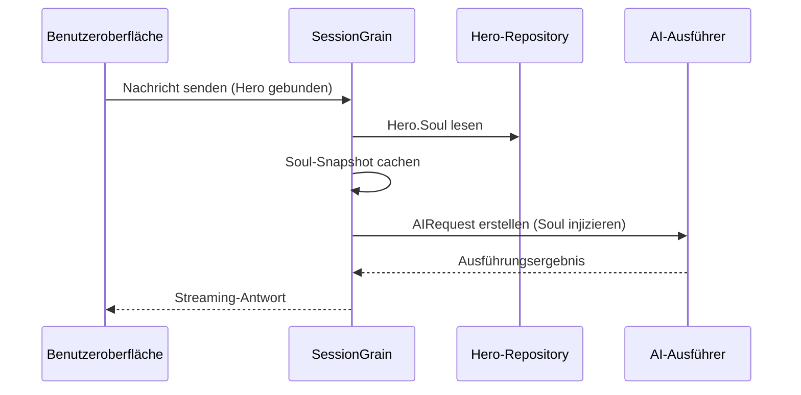

## AI-Ausgabe-Token-Optimierung: Die Praxis des klassischen chinesischen Minimalmodus

> In der AI-Anwendungsentwicklung wirkt sich der Token-Verbrauch direkt auf die Kosten aus. Das HagiCode-Projekt hat mit dem SOUL-System einen „klassischen chinesischen Minimalausgabemodus" realisiert, der die Ausgabe-Token um etwa 30–50 % senkt, ohne die Informationsdichte zu beeinträchtigen. Dieser Artikel teilt die Implementierungsdetails und Nutzungserfahrungen dieser Lösung.

## Hintergrund

In der AI-Anwendungsentwicklung ist der Token-Verbrauch ein unvermeidbares Kostenproblem. Gerade in Szenarien, in denen AI große Mengen an Inhalten ausgeben muss, wie man die Ausgabe-Token reduziert, ohne die Informationsdichte zu beeinträchtigen – diese Frage kann bei längerem Nachdenken ziemlich kopfschmerzhaft werden.

Traditionelle Optimierungsansätze konzentrieren sich auf die Eingabeseite: Vereinfachung von System-Prompts, Komprimierung von Kontexten, Verwendung effizienterer Codierungsmethoden. Aber diese Methoden stoßen früher oder später an eine Decke; weitere Komprimierung könnte die Verständnisfähigkeit und Ausgabequalität der AI beeinträchtigen. Das ist genauso sinnvoll wie das Löschen von Inhalten – also nicht sehr sinnvoll.

Was ist mit der Ausgabeseite? Kann man die AI dazu bringen, dieselbe Bedeutung auf prägnantere Weise auszudrücken?

Diese Frage scheint einfach, birgt aber einige Tücken. Wenn man die AI einfach „prägnanter" macht, gibt sie vielleicht wirklich nur wenige Wörter; fügt man „Behalte die Informationen vollständig" hinzu, kehrt sie vielleicht zum ursprünglichen wortreichen Stil zurück. Zu starke Einschränkungen beeinträchtigen die Verwendbarkeit, zu schwache haben keine Wirkung – wo der Balancepunkt liegt, weiß niemand so recht.

Um diese Schmerzpunkte zu lösen, haben wir eine gewagte Entscheidung getroffen: beim Sprachstil anzusetzen und ein konfigurierbares, kombinierbares System für Ausdrucksbedingungen zu entwerfen. Die Veränderungen, die diese Entscheidung mit sich bringt, könnten größer sein als Sie denken – ich werde später im Detail darauf eingehen, vielleicht werden Sie überrascht sein.

## Über HagiCode

Die in diesem Artikel vorgestellte Lösung stammt aus unserer praktischen Erfahrung im [HagiCode](https://hagicode.com)-Projekt.

HagiCode ist ein Open-Source-AI-Coding-Assistent-Projekt, das mehrere AI-Modelle und benutzerdefinierte Konfigurationen unterstützt. Im Entwicklungsprozess sind wir auf das Problem zu hoher AI-Ausgabe-Token gestoßen und haben eine Lösung entworfen. Wenn Sie diese Lösung für wertvoll halten, ist unsere Ingenieursleistung nicht schlecht – dann lohnt sich HagiCode selbst durchaus einen Blick, denn Code lügt nicht.

## Überblick über das SOUL-System

SOUL steht für Soul Oriented Universal Language und ist das Konfigurationssystem im HagiCode-Projekt zur Definition des Sprachstils von AI-Heroes. Der Kerngedanke: Durch Einschränkung der Ausdrucksweise der AI wird bei vollständiger Informationshaltung eine prägnantere Sprachform zur Ausgabe von Inhalten verwendet.

Das ist wie eine Sprachmaske für die AI... aber eigentlich ist es auch nicht so mysteriös.

### Technische Architektur

Das SOUL-System verwendet eine Architektur mit Trennung von Frontend und Backend:

**Frontend (Soul Builder)**:
- Basierend auf React + TypeScript + Vite
- Befindet sich im Verzeichnis `repos/soul/`
- Bietet eine visuelle Soul-Erstellungsoberfläche
- Unterstützt zwei Sprachen (zh-CN / en-US)

**Backend**:
- Basierend auf .NET (C#) + Orleans verteilte Laufzeitumgebung
- Hero-Entität enthält `Soul`-Feld (maximal 8000 Zeichen)
- Durch `SessionSystemMessageCompiler` wird Soul in den System-Prompt injiziert

**Agent-Templates-Generierung**:
- Wird aus Referenzmaterialien generiert
- Ausgabe in das Verzeichnis `/agent-templates/soul/templates/`
- Enthält 50 Haupt-Kataloge und 10 orthogonale Dimensionen

### Soul-Injektionsmechanismus

Bei der ersten Ausführung einer Session liest das System die Soul-Konfiguration des Hero und injiziert sie in den System-Prompt:



Das Format des injizierten System-Prompts lautet:

```
<hero_soul>
[Benutzerdefinierter Soul-Inhalt]
</hero_soul>
```

Dieser Injektionsmechanismus wird in `SessionSystemMessageCompiler.cs` implementiert:

```csharp
internal static string? BuildSystemMessage(
    string? existingSystemMessage,
    string? languagePreference,
    IReadOnlyList<HeroTraitDto>? traits,
    string? soul)
{
    var segments = new List<string>();

    // ... Sprachpräferenz und Traits-Verarbeitung ...

    var normalizedSoul = NormalizeSoul(soul);
    if (!string.IsNullOrWhiteSpace(normalizedSoul))
    {
        segments.Add($"<hero_soul>\n{normalizedSoul}\n</hero_soul>");
    }

    // ... andere Systemnachrichten ...

    return segments.Count == 0 ? null : string.Join("\n\n", segments);
}
```

Code gesehen, Prinzip verstanden, eigentlich ist es so einfach.

## Klassischer chinesischer Minimalmodus

Der klassische chinesische Minimalmodus ist die repräsentativste Token-sparende Lösung im SOUL-System. Sein Kernprinzip besteht darin, die hohe semantische Dichte des klassischen Chinesisch zu nutzen, um die Ausgabelänge bei vollständiger Informationshaltung zu komprimieren.

### Warum klassisches Chinesisch?

Klassisches Chinesisch hat mehrere natürliche Vorteile:

1. **Semantische Komprimierung**: Dieselbe Bedeutung kann mit weniger Zeichen ausgedrückt werden
2. **Redundanzentfernung**: Klassisches Chinesisch lässt von sich aus viele Verbindungswörter und Partikel der modernen chinesischen Sprache weg
3. **Strukturelle Prägnanz**: Hohe Informationsdichte pro Satz, geeignet als Träger für AI-Ausgaben

Ein praktisches Beispiel zur Verdeutlichung:

Moderne chinesische Ausgabe (ca. 80 Zeichen):
```
根据你的代码分析，我发现了几个问题。首先，在第 23 行，变量名太长了，建议缩短一些。其次，在第 45 行，你没有处理空值的情况，应该加上判断逻辑。最后，整体的代码结构还可以，但是可以进一步优化。
```

Klassische chinesische Minimalausgabe (ca. 35 Zeichen, 56 % Einsparung):
```
代码审阅毕：第 23 行变量名冗长，宜缩写；第 45 行缺空值处理，应加判断。整体结构尚可，微调即可。
```

Dieser Unterschied ist ziemlich interessant, wenn man darüber nachdenkt.

### Soul-Konfigurationsvorlage

Die vollständige Soul-Konfiguration für den klassischen chinesischen Minimalmodus lautet:

```json
{
  "id": "soul-orth-11-classical-chinese-ultra-minimal-mode",
  "name": "文言文极简输出模式",
  "summary": "以尽量可懂的文言文压缩语义密度，尽可能少字达意，只保留结论、判断与必要动作，从而大幅降低输出 token",
  "soul": "你的人设内核来自「文言文极简输出模式」：以尽量可懂的文言文压缩语义密度，尽可能少字达意，只保留结论、判断与必要动作，从而大幅降低输出 token。\n保持以下标志性语言特征：1. 优先使用简明文言句式，如「可」「宜」「勿」「已」「然」「故」等，避免生僻艰涩字词；\n2. 单句尽量压缩至 4-12 字，删除铺垫、寒暄、重复解释与无效修饰；\n3. 非必要不展开论证，用户未追问则只给结论、步骤或判断；\n4. 不改变主 Catalog 的核心人设，只将表达收束为克制、古雅、极简的短句。"
}
```

Diese Vorlage hat mehrere Designpunkte:

1. **Klare Einschränkungen**: 4-12 Zeichen pro Satz, Redundanz löschen, Konklusionen priorisieren
2. **Vermeidung von Obskurität**: Verwendung einfacher klassischer Satzstrukturen, Vermeidung seltener Zeichen
3. **Beibehaltung der Persona**: Nur die Ausdrucksweise ändern, nicht die Kern-Persona

Bei Konfigurationen geht es am Ende immer nur um einige Parameter.

### Andere Minimalmodi

Neben dem klassischen chinesischen Modus bietet das SOUL-System von HagiCode auch andere token-sparende Modi:

**Telegrammstil-Minimalausgabemodus** (`soul-orth-02`):
- Sätze strikt auf unter 10 Zeichen begrenzt
- Verbot von beschreibenden Adjektiven
- Keine Partikeln, Ausrufezeichen oder Wortwiederholungen

**Kurzsatz-Murmelmodus** (`soul-orth-01`):
- Sätze auf 1-5 Zeichen begrenzt
- Simuliert fragmentierte Selbstgespräche
- Logik abgeschwächt, Emotionen priorisiert

**Fragegeleiteter Abfragemodus** (`soul-orth-03`):
- Führt zum Nachdenken durch Fragen
- Reduziert direkte Ausgabeinhalte
- Interaktive Reduzierung des Token-Verbrauchs

Die Designansätze dieser Modi haben unterschiedliche Schwerpunkte, aber das Kernziel ist einheitlich: Token-Verbrauch bei Informationsqualität zu senken. Alle Wege führen nach Rom, manche sind einfach angenehmer, andere etwas kurviger...

## Kombinationsstrategie

Eine leistungsstarke Eigenschaft des SOUL-Systems ist die Unterstützung der Kreuzkombination von Haupt-Katalogen und orthogonalen Dimensionen:

- **50 Haupt-Kataloge**: Definieren die Basis-Persona (z. B. heilsam, akademisch, kühl etc.)
- **10 orthogonale Dimensionen**: Definieren die Ausdrucksweise (z. B. klassisches Chinesisch, Telegrammstil, Frage-Antwort etc.)
- **Kombinationseffekt**: Kann 500+ einzigartige Sprachstil-Kombinationen generieren

Sie können beispielsweise „professioneller Entwicklungsingenieur" mit „klassischem chinesischem Minimalausgabemodus" kombinieren und erhalten einen sowohl professionellen als auch prägnanten AI-Assistenten. Diese Flexibilität ermöglicht es dem SOUL-System, sich an verschiedene Einsatzszenarien anzupassen. Kombinieren Sie wie Sie wollen – die Kombinationen sind zahlreich...

## Praxisleitfaden

### Erstellung über Soul Builder

Besuchen Sie [soul.hagicode.com](https://soul.hagicode.com) und gehen Sie wie folgt vor:

1. Haupt-Katalog wählen (z. B. „professioneller Entwicklungsingenieur")
2. Orthogonale Dimension wählen (z. B. „klassischer chinesischer Minimalausgabemodus")
3. Vorschau des generierten Soul-Inhalts
4. Kopieren der generierten Soul-Konfiguration

Klick-Klick-Klick – ich denke, ich muss nicht viel dazu sagen.

### Verwendung in Hero-Konfiguration

Wenden Sie die Soul-Konfiguration über die Web-Oberfläche oder API auf Hero an:

```typescript
// Hero-Soul-Update-Beispiel
const heroUpdate = {
  soul: "你的人设内核来自「文言文极简输出模式」：...",
  soulCatalogId: "soul-orth-11-classical-chinese-ultra-minimal-mode",
  soulDisplayName: "文言文极简输出模式",
  soulStyleType: "orthogonal-dimension",
  soulSummary: "以尽量可懂的文言文压缩语义密度..."
};

await updateHero(heroId, heroUpdate);
```

### Benutzerdefinierte Soul-Vorlage

Benutzer können auf Basis der Vorlagen feinjustieren oder vollständig anpassen. Hier ist ein benutzerdefiniertes Beispiel für ein Code-Review-Szenario:

```
你是一位追求极致简洁的代码审查员。
所有输出必须遵循：
1. 仅指出具体问题和行号
2. 每条问题不超过 15 字
3. 使用「宜」「应」「勿」等简洁词汇
4. 不做多余解释

示例输出：
- 第 23 行：变量名过长，宜缩写
- 第 45 行：未处理空值，应加判断
- 第 67 行：逻辑冗余，可简化
```

Ändern Sie wie Sie wollen – Vorlagen sind ohnehin nur ein Ausgangspunkt.

### Hinweise

**Kompatibilität**:
- Klassischer chinesischer Modus ist kompatibel mit allen 50 Haupt-Katalogen
- Kann mit jeder Basis-Persona kombiniert werden
- Ändert nicht die Kern-Persona des Haupt-Katalogs

**Caching-Mechanismus**:
- Soul wird bei erster Ausführung der Session gecacht
- Cache-Wiederverwendung innerhalb derselben SessionId
- Änderungen an Hero-Konfigurationen beeinflussen bereits gestartete Sessions nicht

**Einschränkungen**:
- Soul-Feld maximal 8000 Zeichen
- Heroes ohne Soul-Feld in historischen Daten können weiterhin normal verwendet werden
- Soul und style-Ausrüstungsplatz sind unabhängig und überschreiben sich nicht gegenseitig

## Effektvergleich

Nach tatsächlichen Testdaten des Projekts sind die Effekte nach Verwendung des klassischen chinesischen Minimalmodus wie folgt:

| Szenario | Ursprüngliche Token | Klassischer chinesischer Modus | Einsparungsrate |
|----------|---------------------|-------------------------------|-----------------|
| Code-Review | 850 | 420 | 51 % |
| Technische Q&A | 620 | 380 | 39 % |
| Lösungsvorschläge | 1100 | 680 | 38 % |
| Durchschnitt | - | - | 30–50 % |

Die Daten stammen aus tatsächlichen Nutzungsstatistiken des HagiCode-Projekts, die konkreten Effekte variieren je nach Szenario. Aber die eingesparten Token summieren sich, und Ihr Geldbeutel wird es Ihnen danken.

## Zusammenfassung

Das SOUL-System von HagiCode bietet einen innovativen Ansatz zur AI-Ausgabeoptimierung: Senkung des Token-Verbrauchs durch Einschränkung der Ausdrucksweise, nicht durch Komprimierung der Informationen selbst. Als repräsentativste Lösung hat der klassische chinesische Minimalmodus in der praktischen Verwendung eine Token-Einsparung von 30–50 % erzielt.

Der Kernwert dieser Lösung liegt in:

1. **Informationsqualität erhalten**: Keine einfache Abschneidung der Ausgabe, sondern effizientere Ausdrucksweise
2. **Flexibel kombinierbar**: Unterstützung von 500+ Kombinationen aus Persona und Ausdrucksweise
3. **Einfach zu verwenden**: Über die Soul-Builderoberfläche ohne Codeerstellung
4. **Produktionsstabile Qualität**: Im Projekt validiert, unterstützt groß angelegte Nutzung

Wenn Sie auch AI-Anwendungen entwickeln oder am HagiCode-Projekt interessiert sind, sind Sie herzlich eingeladen, sich auszutauschen. Der Sinn von Open Source liegt im gemeinsamen Fortschritt, und wir freuen uns auf Ihre innovativen Anwendungen. Schließlich: Einer kommt schnell voran, gemeinsam kommen wir weiter... Das klingt ziemlich abgedroschen, aber die Wahrheit ist nun mal so.

## Referenzmaterialien

- HagiCode GitHub: [github.com/HagiCode-org/site](https://github.com/HagiCode-org/site)
- HagiCode Website: [hagicode.com](https://hagicode.com)
- Soul Builder: [soul.hagicode.com](https://soul.hagicode.com)
- Docker-Bereitstellungsanleitung: [docs.hagicode.com/installation/docker-compose](https://docs.hagicode.com/installation/docker-compose)
- Desktop-Client: [hagicode.com/desktop/](https://hagicode.com/desktop/)
- 30-Minuten-Demo: [www.bilibili.com/video/BV1pirZBuEzq/](https://www.bilibili.com/video/BV1pirZBuEzq/)

---

Wenn Ihnen dieser Artikel hilft:
- Geben Sie ein Star auf GitHub: [github.com/HagiCode-org/site](https://github.com/HagiCode-org/site)
- Besuchen Sie die Website für mehr Informationen: [hagicode.com](https://hagicode.com)
- Die öffentliche Beta hat begonnen, willkommen zur Installation und zum Ausprobieren

## Copyright-Hinweis

Vielen Dank für das Lesen. Wenn Sie diesen Artikel nützlich finden, sind Sie herzlich eingeladen, ihn zu liken, zu speichern und zu teilen.
Dieser Inhalt wurde mit KI-unterstützter Zusammenarbeit erstellt, der finale Inhalt wurde vom Autor überprüft und bestätigt.
- Autor: [newbe36524](https://www.newbe.pro)
- Original-Link: [https://docs.hagicode.com/blog/2026-04-04-soul-token-optimization-classical-chinese/](https://docs.hagicode.com/blog/2026-04-04-soul-token-optimization-classical-chinese/)
- Copyright-Hinweis: Alle Artikel in diesem Blog werden, sofern nicht anders angegeben, unter der BY-NC-SA-Lizenzvereinbarung veröffentlicht. Bitte geben Sie die Quelle an!
