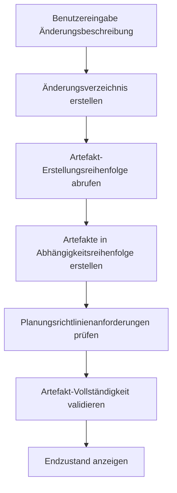
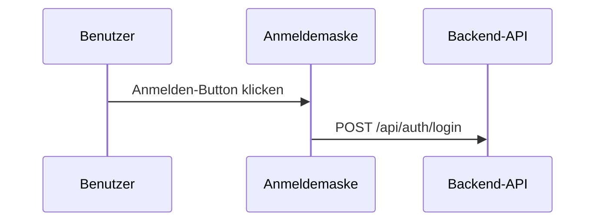

## Anpassung der OpenSpec-Schritte zur Verbesserung der KI-Generierungsergebnisse

> Bei der Verwendung von OpenSpec zur Verwaltung technischer Vorschläge stießen wir auf das Problem einer unzuverlässigen Qualität der KI-generierten Dokumente. Eigentlich gab es keinen anderen Weg, als die Prompt-Vorlagen selbst anzupassen. Dieser Artikel ist eine Aufzeichnung aus dieser Zeit.

## Hintergrund

OpenSpec ist ein System zur Verwaltung technischer Vorschläge. Die Kernidee ist einfach: Geben Sie eine Änderungsbeschreibung ein und automatisch werden verschiedene Dokumentartefakte generiert. Proposal, Design, Specs, Tasks – all das kann automatisch generiert werden. Klingt ziemlich schön, oder?

In der praktischen Verwendung stellten wir jedoch einige Probleme fest. Nun ja, nichts Schlimmes, aber das Generierte schmeckte irgendwie nicht recht.

Die generierte `design.md` fehlten notwendige visuelle Elemente – keine Mermaid-Flussdiagramme, keine Sequenzdiagramme und erst recht keine Architekturdiagramme. Solche Designdokumente ließen das technische Team den Kopf schütteln – wer will schon einen Haufen reinen Text lesen?

Auch `proposal.md` war nicht zufriedenstellend: Es fehlten Code-Änderungstabellen, es gab keine UI-Prototypen. Entscheidungsträger lasen lange und wussten immer noch nicht, was die Änderung eigentlich bewirkte.

Noch frustrierender war `tasks.md`, das mit verschiedenen Git-Operationsaufgaben durchsetzt war. Die Verantwortungsgrenzen wurden verschwommen, und Entwickler wussten nicht, was sie tun sollten und was nicht. Das ist auch etwas bedauerlich – schließlich weiß die KI nicht, wie die Teamaufteilung aussieht.

Die visuellen Anforderungen für verschiedene Dokumentebenen waren auch nicht klar. Welche Diagramme sollten proposal und design enthalten? Diese Frage beschäftigte das Team immer wieder.

Wo lag die Wurzel dieser Probleme? Nach unserer Analyse fanden wir den Schlüsselpunkt: Die Prompt-Vorlagen fehlten klare Einschränkungen und Anleitungen.

Das ist auch nicht weiter überraschend – schließlich sind Vorlagen von Natur aus generisch und können nicht perfekt an die Bedürfnisse jedes Teams angepasst werden.

## Über HagiCode

Die in diesem Artikel vorgestellte Lösung stammt aus unserer Praxis im [HagiCode](https://hagicode.com)-Projekt. HagiCode ist ein KI-Codierungs-Assistent-Projekt, und wir verwenden in der Entwicklungsphase umfangreich OpenSpec zur Verwaltung technischer Vorschläge.

Gerade diese tatsächlichen Erfahrungen führten zur Entstehung dieser Verbesserungslösung. Eigentlich ist es nichts Großes – man stößt auf ein Problem und löst es.

## Analyse: Prompt-Systemarchitektur

Um Probleme zu lösen, muss man das System verstehen. Lassen Sie uns sehen, wie das Prompt-System von OpenSpec funktioniert.

OpenSpec verwendet das Handlebars-Vorlagensystem. Jeder Prompt besteht aus zwei Teilen:

**JSON-Metadatendatei**: Definiert Parameter, Szenarien, Versionsinformationen
**Handlebars-Vorlagendatei**: Enthält den tatsächlichen Prompt-Inhalt

```
Resources/Prompts/
├── openspec-v1-ff.zh-CN.json    # Metadaten
├── openspec-v1-ff.zh-CN.hbs     # Vorlageninhalt
├── openspec-v1-ff.en-US.json
└── openspec-v1-ff.en-US.hbs
```

Die Vorteile dieses Trennungsdesigns sind offensichtlich: Metadaten und Inhalt werden separat verwaltet, was die Wartung und Lokalisierung erleichtert. Das ist ein bisschen wie beim Schreiben von Code – Trennung von Logik und Präsentation, das verstehen alle.

Der FF (Fast Forward)-Workflow ist der Kerngenerierungsprozess von OpenSpec:



Dieser Prozess sieht perfekt aus, aber das Problem liegt beim Schritt „Planungsrichtlinienanforderungen“ – er gibt keine ausreichend klaren Anleitungen.

Das ist auch etwas bedauerlich – bei der Systemgestaltung konnte man nicht die spezifischen Bedürfnisse aller Teams berücksichtigen.

## Planungsrichtungssystem

Das Planungsrichtungssystem ist der Kernanpassungsmechanismus von OpenSpec und ermöglicht Benutzern die Auswahl verschiedener Generierungsoptionen. Im HagiCode-Projekt sind folgende Richtungen definiert:

| Richtungs-ID | Funktion | Standardmäßig aktiviert |
|-------------|---------|-------------------------|
| `explore` | Erkundungsmodus | Ja |
| `change-map` | Änderungslandkarte | Ja |
| `flowchart` | Interaktives Flussdiagramm | Ja |
| `prototype` | UI-Prototyp | Ja |
| `architecture` | Architekturdiagramm | Ja |
| `sequence` | API-Sequenzdiagramm | Ja |

Jede Richtung definiert eine stabile Kennung, einen Standardaktivierungszustand, ein Anzeigelabel sowie chinesische und englische Prompt-Fragmente.

Dieses System ist raffiniert gestaltet, aber in der Praxis von HagiCode stellten wir fest, dass Definitionen allein nicht ausreichen – die Richtlinien müssen explizit in den Prompt-Vorlagen verwendet werden.

Das ist ein bisschen wie bei vielen Dingen im Leben – Optionen zu haben bedeutet nicht, dass man eine Wahl trifft; jemand muss Ihnen sagen, wie Sie wählen sollen.

## Lösung: Klare Einschränkungen und Beispiele

Unser Verbesserungsansatz ist direkt: Fügen Sie in den Prompt-Vorlagen klare Einschränkungen und Referenzbeispiele hinzu.

Eigentlich ist nichts Besonderes dabei – man sagt einfach klar, was gemeint ist.

### 1. Dokumentvisualisierungsanforderungen hinzufügen

In der `openspec-v1-ff.zh-CN.hbs`-Vorlage haben wir klare Inhaltsumfangseinschränkungen hinzugefügt:

```markdown
### tasks.md Inhaltsumfangseinschränkungen

Beim Erstellen von `tasks.md`-Artefakten müssen folgende Inhaltsumfangseinschränkungen eingehalten werden:

Muss enthalten:
- Geschäftslogikaufgaben (Code-Implementierung, Feature-Entwicklung)
- Technische Implementierungsaufgaben (Komponentenintegration, API-Entwicklung)
- Testaufgaben (Unit-Tests, Integrationstests)
- Dokumentationsaufgaben (Dokumentation aktualisieren, Kommentare hinzufügen)

Darf nicht enthalten:
- Git-Commit-Operationen (git add, git commit, git push)
- Versionskontrollverwaltungsworkflows
- Bereitstellungs- und Veröffentlichungsvorgänge
```

Verwenden Sie normative „Muss/Darf nicht“-Sprache anstelle von „sollte“ oder „kann“, damit die KI die Einschränkungen genauer versteht.

Das ist ein bisschen wie bei der Kindererziehung – was gesagt wird, gilt, ohne Mehrdeutigkeiten.

### 2. Referenzbeispiele für jede Richtung bereitstellen

Nur zu sagen „enthält Flussdiagramm“ reicht nicht. Wir haben für jede aktivierte Richtung konkrete Ausgabbeispiele bereitgestellt.

Schließlich sind Worte ohne Taten nutzlos – mit einem konkreten Beispiel kann die KI es besser verstehen.

**Beispiel für Änderungslandkarten-Richtung**:
```markdown
| Dateipfad | Änderungstyp | Änderungsgrund | Auswirkungsbereich |
|----------|------------|---------------|-------------------|
| Path/to/file | Neu | Beschreibung | Modulname |
```

**Beispiel für Prototyp-Richtung**:
```
┌─────────────────────────────────────────┐
│ Benutzeranmeldung                            [×] │
├─────────────────────────────────────────┤
│  E-Mail-Adresse *                             │
│ ┌─────────────────────────────────────┐ │
│ │ user@example.com                   │ │
│ └─────────────────────────────────────┘ │
└─────────────────────────────────────────┘
```

**Beispiel für Flussdiagramm-Richtung**:


Diese Beispiele ermöglichen der KI, das erwartete Ausgabeformat genau zu verstehen, anstatt selbst kreativ zu werden.

Das ist ein bisschen wie bei Prüfungen mit Referenzantworten – obwohl sie nicht genau gleich sein müssen, sollte das Format stimmen.

### 3. Normative Sprache für klare Anforderungen verwenden

Für die Visualisierungsanforderungen verschiedener Dokumenttypen verwenden wir normative Sprache zur Einschränkung:

```markdown
Für proposal.md:
- Muss Code-Änderungstabelle enthalten (wenn change-map-Richtung aktiviert)
- Muss UI-Prototyp-Diagramm enthalten (bei UI-Änderungen und aktivierter prototype-Richtung)
- Darf keine detaillierten Architekturdiagramme enthalten (diese sollten in design.md stehen)

Für design.md:
- Muss alle Inhalte von proposal.md enthalten (detailliertere Version)
- Muss Architekturdiagramm enthalten (wenn architecture-Richtung aktiviert)
- Muss Datenflussdiagramm enthalten (wenn flowchart-Richtung aktiviert)
```

Diese klaren Einschränkungen verbesserten die Generierungsqualität erheblich.

Eigentlich nichts Besonderes – man sagt einfach klar, was gemeint ist, ohne die KI raten zu lassen.

## Praxis: Code-Implementierung

Nach der Theorie sehen wir, wie es im HagiCode-Projekt implementiert wurde.

### Planungsrichtungen definieren

Definition der Planungsrichtungen in `ProposalPlanningDirections.cs`:

```csharp
public static class ProposalPlanningDirections
{
    private static readonly ProposalPlanningDirectionDefinition[] Catalog =
    [
        new(
            ChangeMapId,
            "Change map",
            DefaultEnabled: true,
            EnglishPromptFragment:
            "- Change map: include structured file-impact views...",
            ChinesePromptFragment:
            "- 变更地图：加入结构化的文件影响视图..."),
        // ... andere Richtungen
    ];

    public static string RenderInstructionBlock(
        IEnumerable<ProposalPlanningDirectionState> directions,
        string? locale)
    {
        var enabledDirections = directions
            .Where(direction => direction.Enabled)
            .ToArray();

        if (enabledDirections.Length == 0)
        {
            return string.Empty;
        }

        var heading = IsChineseLocale(locale)
            ? "本次生成启用以下规划方向："
            : "Apply the following planning directions:";

        return string.Join(Environment.NewLine,
            [heading, .. enabledDirections.Select(d => d.GetPromptFragment(locale))]);
    }
}
```

Dieser Code enthält mehrere bemerkenswerte Designpunkte:

1. Verwendung eines Arrays statt einer Liste, da Definitionen zur Laufzeit nicht geändert werden
2. Verzögertes Rendern – Text wird nur generiert, wenn aktivierte Richtlinien vorhanden sind
3. Mehrsprachunterstützung mit Auswahl des geeigneten Prompt-Fragments basierend auf locale

Eigentlich nichts Besonderes – nur einige reguläre Code-Designs.

### Vorlagenparametrisierung

Verwendung von Bedingungsanweisungen in Handlebars-Vorlagen:

```handlebars
{{#if planningDirectionInstructions}}
## Planungsrichtungen für diese Generierung

{{{planningDirectionInstructions}}}
{{/if}}

**Schritte**
1. **Wenn keine Eingabe bereitgestellt wird, angemessene Standardwerte verwenden**
2. **Änderungsverzeichnis erstellen**
3. **Artefakt-Erstellungsreihenfolge abrufen**
4. **Artefakte in Reihenfolge erstellen bis apply-ready**
   a. Für jedes ready-Artefakt:
      - Anweisungen abrufen
      - Abhängigkeitsdateien lesen
      - Artefaktdatei erstellen
```

Beachten Sie `{{{planningDirectionInstructions}}}` – drei geschweifte Klammern bedeuten, dass HTML nicht maskiert wird, sodass Formate wie Mermaid-Codeblöcke erhalten bleiben.

Das ist ein bisschen wie Kompromisse im Leben – manchmal muss man einige ursprüngliche Dinge bewahren, nicht alles maskieren.

### Prompt-Ladung-Implementierung

Parametrisiertes Laden von Prompts durch `FilePromptProvider`:

```csharp
public async Task<string> GetOpenspecV1FfPromptAsync(
    string changeName,
    string changeDescription,
    string locale = "en-US",
    string? planningDirectionInstructions = null,
    CancellationToken cancellationToken = default)
{
    var parameters = new Dictionary<string, object>
    {
        { "planningDirectionInstructions",
          ResolvePlanningDirectionInstructions(locale, planningDirectionInstructions) }
    };

    if (!string.IsNullOrWhiteSpace(changeName))
    {
        parameters["changeName"] = changeName;
    }

    return await GetPromptWithParametersAsync(
        PromptScenario.OpenspecV1Ff,
        locale,
        cancellationToken,
        parameters) ?? string.Empty;
}
```

Dieses Design ist flexibel: `planningDirectionInstructions` ist optional – wenn nicht bereitgestellt, verwendet das System die Standardkonfiguration.

Schließlich möchte niemand jedes Mal einen Haufen Parameter übergeben – ein Standardwert ist immer gut.

## Validierung und Tests

Nach der Implementierung führte das HagiCode-Team eine umfassende Validierung durch:

### Bei aktivierung spezifischer Richtlinien

- Prüfen, ob generierte proposal.md Code-Änderungstabellen enthält
- Prüfen, ob generierte design.md Architekturdiagramme enthält
- Validieren, dass tasks.md keine Git-Operationsaufgaben enthält

### Bei Deaktivierung spezifischer Richtlinien

- Validieren, dass entsprechende visuelle Inhalte nicht generiert werden
- Sicherstellen, dass andere Richtlinien-Ausgaben nicht beeinträchtigt werden

### Grenzfälle

- Verhalten wenn alle Richtlinien deaktiviert sind
- Fehlerbehandlung bei ungültigen Richtlungs-IDs

Diese Tests stellten die Stabilität und Vorhersagbarkeit des Systems sicher – entscheidend für die Teamakzeptanz neuer Tools.

Eigentlich nichts Besonderes – einfach testen, was getestet werden muss. Schließlich will niemand nach dem Inbetriebnehmen Probleme haben.

## Hinweise

Bei der Implementierung dieser Lösung sollten einige Fallstricke vermieden werden:

**Vorlagensynchronisation**: Bei Änderungen an Vorlagen auf die Synchronisation mit Upstream achten. Das HagiCode-Team hatte einmal einen Vorlagenkonflikt, der einen halben Tag zur Lösung benötigte. Das ist auch bedauerlich – Updates bringen immer einige Kompatibilitätsprobleme mit sich.

**Zweisprachige Konsistenz**: Sicherstellen, dass die Struktur und Einschränkungen der chinesischen und englischen Vorlagen konsistent sind. Wir hatten einmal eine Situation, in der die chinesische Version Einschränkungen hatte, die englische nicht, was zu inkonsistenter Dokumentqualität führte. Das ist auch etwas peinlich – schließlich weiß niemand, welche Sprache Benutzer verwenden werden.

**Leistungseinfluss**: Das Rendern von Planungsrichtungen sollte im Mikrosekundenbereich完成. Wenn die Renderzeit zu lang ist, wird die Benutzererfahrung beeinträchtigt. Schließlich will niemand ewig warten, um Ergebnisse zu sehen.

**Rückwärtskompatibilität**: Unterstützung für alte API-Versionen beibehalten. Zum Beispiel der `enableExploreMode`-Parameter – obwohl wir jetzt das Planungsrichtungssystem verwenden, nutzen alter Code ihn noch. Das ist auch bedauernd – man kann nicht immer von allen verlangen, dass sie upgraden.

**Klare Ausdrucksweise**: Verwendung normativer Sprache (MUSS/ERSCHEINT) statt empfehlender Sprache. Dieser Punkt wurde in der Praxis von HagiCode voll validiert. Eigentlich nichts Besonderes – einfach klar sagen, was gemeint ist.

## Zusammenfassung

Durch die Anpassung der OpenSpec-Prompt-Schritte verbesserten wir erfolgreich die Qualität der KI-generierten Dokumente. Die wichtigsten Verbesserungen umfassen:

1. Hinzufügen klare Einschränkungsbedingungen in Prompt-Vorlagen
2. Bereitstellung konkreter Ausgabbeispiele für jede Planungsrichtung
3. Verwendung normativer Sprache (MUSS/DARF NICHT) zur Einschränkung des KI-Verhaltens
4. Flexibles parametrisiertes Laden von Prompts durch Code-Implementierung

Diese Lösung wurde im HagiCode-Projekt validiert, und die Qualität der generierten Dokumente verbesserte sich deutlich: Designdokumente enthalten vollständige visuelle Elemente, Vorschlagsdokumente haben klare Code-Änderungstabellen, Aufgabenlisten haben klare Verantwortlichkeiten.

Eigentlich nichts Großes – einfach das Problem gelöst.

Wenn Sie auch ähnliche KI-unterstützte Dokumentengenerierungssysteme verwenden, hoffe ich, dass diese Erfahrungen für Sie hilfreich sind. Denken Sie daran: Klare Einschränkungen und konkrete Beispiele sind der Schlüssel zu hochwertigen Ausgaben.

Manche Dinge sollten einfach klar gesagt werden......

## Referenzen

- [HagiCode-Projekt-URL](https://github.com/HagiCode-org/site)
- [OpenSpec-Dokumentation](https://docs.hagicode.com)
- [Handlebars-Vorlagensyntax](https://handlebarsjs.com/)
- [Mermaid-Diagrammsyntax](https://mermaid.js.org/)
