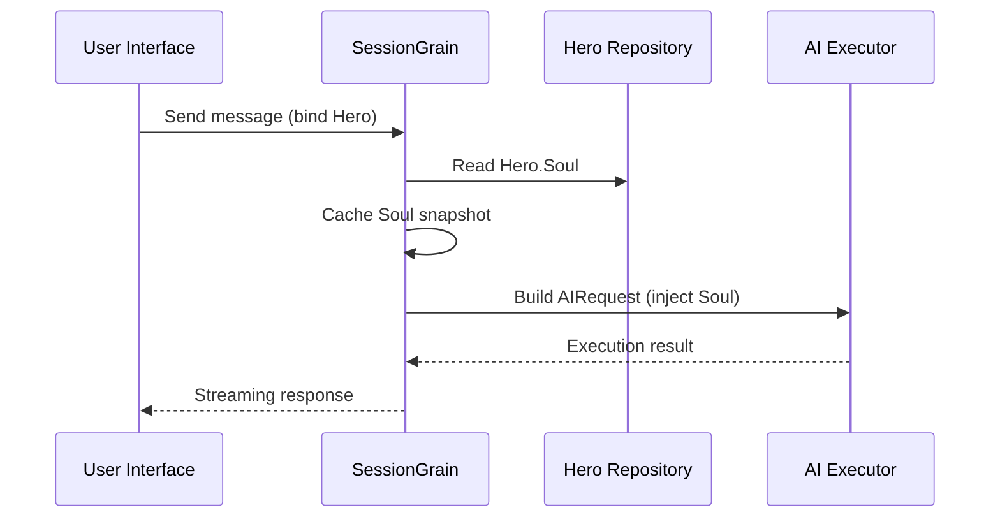

## AI Output Token Optimization: Classical Chinese Ultra-Minimal Mode Practice

> In AI application development, token consumption directly impacts costs. The HagiCode project implements a "Classical Chinese Ultra-Minimal Output Mode" through the SOUL system, reducing output tokens by approximately 30-50% without compromising information density. This article shares the implementation details and usage experience of this solution.

## Background

In AI application development, token consumption is an unavoidable cost issue. Especially in scenarios requiring AI to output large amounts of content, figuring out how to reduce output tokens without compromising information density can be quite a headache.

Traditional optimization approaches focus on the input side: streamlining system prompts, compressing context, and using more efficient encoding methods. However, these methods eventually hit a ceiling—further compression may affect AI's understanding capabilities and output quality. This is tantamount to deleting content, which isn't very meaningful.

What about the output side? Can we make AI express the same meaning more concisely?

This question seems simple but actually holds many complexities. Simply asking AI to "be concise" might result in just a few words; adding "maintain complete information" might revert it to the original verbose style. Too strong constraints affect usability, too weak constraints have no effect—where's the balance point? No one can say for sure.

To address these pain points, we made a bold decision: start from language style and design a configurable, composable expression constraint system. The changes brought by this decision might be bigger than you imagine—I'll explain in detail shortly, and you might be surprised.

## About HagiCode

The solution shared in this article comes from our practical experience in the [HagiCode](https://hagicode.com) project.

HagiCode is an open-source AI code assistant project that supports multiple AI models and custom configurations. During development, we identified the issue of high AI output tokens and designed a solution. If you find this solution valuable, it shows our engineering capabilities are decent—so HagiCode itself is worth attention, after all, code doesn't lie.

## SOUL System Overview

SOUL stands for Soul Oriented Universal Language, a configuration system in the HagiCode project for defining AI Hero language styles. Its core idea is to use more concise language forms to output content while maintaining information integrity by constraining AI's expression methods.

This thing is like putting a language mask on AI... well, it's not that mysterious actually.

### Technical Architecture

The SOUL system adopts a frontend-backend separated architecture:

**Frontend (Soul Builder)**:
- Built with React + TypeScript + Vite
- Located in `repos/soul/` directory
- Provides visual Soul building interface
- Supports bilingual (zh-CN / en-US)

**Backend**:
- Based on .NET (C#) + Orleans distributed runtime
- Hero entity contains `Soul` field (maximum 8000 characters)
- Injects Soul into system prompts through `SessionSystemMessageCompiler`

**Agent Templates Generation**:
- Generated from reference materials
- Output to `/agent-templates/soul/templates/` directory
- Contains 50 main Catalog groups and 10 orthogonal dimension groups

### Soul Injection Mechanism

When Session executes for the first time, the system reads the Hero's Soul configuration and injects it into the system prompt:



The injected system prompt format is:

```
<hero_soul>
[User-defined Soul content]
</hero_soul>
```

This injection mechanism is implemented in `SessionSystemMessageCompiler.cs`:

```csharp
internal static string? BuildSystemMessage(
    string? existingSystemMessage,
    string? languagePreference,
    IReadOnlyList<HeroTraitDto>? traits,
    string? soul)
{
    var segments = new List<string>();

    // ... Language preference and Traits processing ...

    var normalizedSoul = NormalizeSoul(soul);
    if (!string.IsNullOrWhiteSpace(normalizedSoul))
    {
        segments.Add($"<hero_soul>\n{normalizedSoul}\n</hero_soul>");
    }

    // ... Other system messages ...

    return segments.Count == 0 ? null : string.Join("\n\n", segments);
}
```

Code reviewed, principles understood—it's really just that.

## Classical Chinese Ultra-Minimal Mode

Classical Chinese Ultra-Minimal Mode is the most representative token-saving solution in the SOUL system. Its core principle is to utilize the high semantic density of Classical Chinese to compress output length while maintaining information integrity.

### Why Classical Chinese

Classical Chinese has several natural advantages:

1. **Semantic Compression**: The same meaning can be expressed with fewer characters
2. **Removing Redundancy**: Classical Chinese itself omits many conjunctions and particles found in modern Chinese
3. **Concise Structure**: High information density per sentence, suitable as AI output carrier

Let's illustrate with a practical example:

Modern Chinese output (approximately 80 characters):
```
根据你的代码分析，我发现了几个问题。首先，在第 23 行，变量名太长了，建议缩短一些。其次，在第 45 行，你没有处理空值的情况，应该加上判断逻辑。最后，整体的代码结构还可以，但是可以进一步优化。
```

Classical Chinese ultra-minimal output (approximately 35 characters, 56% savings):
```
代码审阅毕：第 23 行变量名冗长，宜缩写；第 45 行缺空值处理，应加判断。整体结构尚可，微调即可。
```

This difference is quite interesting when you think about it.

### Soul Configuration Template

The complete Soul configuration for Classical Chinese Ultra-Minimal Mode is as follows:

```json
{
  "id": "soul-orth-11-classical-chinese-ultra-minimal-mode",
  "name": "文言文极简输出模式",
  "summary": "以尽量可懂的文言文压缩语义密度，尽可能少字达意，只保留结论、判断与必要动作，从而大幅降低输出 token",
  "soul": "你的人设内核来自「文言文极简输出模式」：以尽量可懂的文言文压缩语义密度，尽可能少字达意，只保留结论、判断与必要动作，从而大幅降低输出 token。\n保持以下标志性语言特征：1. 优先使用简明文言句式，如「可」「宜」「勿」「已」「然」「故」等，避免生僻艰涩字词；\n2. 单句尽量压缩至 4-12 字，删除铺垫、寒暄、重复解释与无效修饰；\n3. 非必要不展开论证，用户未追问则只给结论、步骤或判断；\n4. 不改变主 Catalog 的核心人设，只将表达收束为克制、古雅、极简的短句。"
}
```

This template design has several key points:

1. **Clear Constraints**: 4-12 characters per sentence, remove redundancy, conclusion first
2. **Avoid Obscurity**: Use simple Classical Chinese sentence patterns, avoid rare words
3. **Maintain Persona**: Only change expression method, not core persona

Configuration tuning involves just a few parameters, really.

### Other Ultra-Minimal Modes

In addition to Classical Chinese Mode, HagiCode's SOUL system provides other token-saving modes:

**Telegram-style Ultra-Minimal Output Mode** (`soul-orth-02`):
- Strictly control each sentence within 10 characters
- Prohibit decorative adjectives
- No tone particles, exclamation marks, or reduplication throughout

**Short Sentence Rambling Mode** (`soul-orth-01`):
- Sentences controlled to 1-5 characters
- Simulate fragmented self-talk expression
- Weaken logic, prioritize conveying emotions

**Guided Q&A Mode** (`soul-orth-03`):
- Guide user thinking through questions
- Reduce direct output content
- Interactively reduce token consumption

These modes have different design focuses, but the core goal is consistent: reduce output tokens while maintaining information quality. All roads lead to Rome—some are easier to walk, others slightly more winding.

## Combination Strategy

A powerful feature of the SOUL system is supporting cross-combination of main Catalogs with orthogonal dimensions:

- **50 Main Catalog Groups**: Define basic personas (healing, academic, cool, etc.)
- **10 Orthogonal Dimensions**: Define expression methods (Classical Chinese, telegram-style, Q&A style, etc.)
- **Combination Effect**: Generate 500+ unique language style combinations

For example, you can combine "Professional Development Engineer" with "Classical Chinese Ultra-Minimal Output Mode" to get an AI assistant that is both professional and concise. This flexibility allows the SOUL system to adapt to various usage scenarios. Configure as you like—there are more combinations than you can possibly try...

## Practice Guide

### Creating via Soul Builder

Visit [soul.hagicode.com](https://soul.hagicode.com) and follow these steps:

1. Select main Catalog (e.g., "Professional Development Engineer")
2. Select orthogonal dimension (e.g., "Classical Chinese Ultra-Minimal Output Mode")
3. Preview generated Soul content
4. Copy generated Soul configuration

It's just clicking around—shouldn't need much explanation.

### Using in Hero Configuration

Apply Soul configuration to Hero via Web interface or API:

```typescript
// Hero Soul update example
const heroUpdate = {
  soul: "你的人设内核来自「文言文极简输出模式」：...",
  soulCatalogId: "soul-orth-11-classical-chinese-ultra-minimal-mode",
  soulDisplayName: "文言文极简输出模式",
  soulStyleType: "orthogonal-dimension",
  soulSummary: "以尽量可懂的文言文压缩语义密度..."
};

await updateHero(heroId, heroUpdate);
```

### Custom Soul Templates

Users can fine-tune based on preset templates or completely customize. Here's a custom example for code review scenarios:

```
你是一位追求极致简洁的代码审查员。
所有输出必须遵循：
1. 仅指出具体问题和行号
2. 每条问题不超过 15 字
3. 使用「宜」「应」「勿」等简洁词汇
4. 不做多余解释

示例输出：
- 第 23 行：变量名过长，宜缩写
- 第 45 行：未处理空值，应加判断
- 第 67 行：逻辑冗余，可简化
```

Modify as you like—templates are just a starting point anyway.

### Notes

**Compatibility**:
- Classical Chinese mode is compatible with all 50 main Catalog groups
- Can be combined with any basic persona
- Does not change the core persona of the main Catalog

**Cache Mechanism**:
- Soul is cached when Session executes for the first time
- Cache is reused within the same SessionId
- Modifying Hero configuration does not affect already started Sessions

**Limitation Constraints**:
- Soul field maximum length is 8000 characters
- Heroes without Soul field in historical data can still be used normally
- Soul and style equipment slots are independent and won't overwrite each other

## Effect Comparison

According to actual test data from the project, the effects after using Classical Chinese Ultra-Minimal Mode are as follows:

| Scenario | Original Output Tokens | Classical Chinese Mode | Savings Ratio |
|----------|----------------------|------------------------|---------------|
| Code Review | 850 | 420 | 51% |
| Technical Q&A | 620 | 380 | 39% |
| Solution Recommendations | 1100 | 680 | 38% |
| Average | - | - | 30-50% |

Data comes from actual usage statistics of the HagiCode project, specific effects vary by scenario. However, the saved tokens add up, and your wallet will thank you.

## Summary

HagiCode's SOUL system provides an innovative AI output optimization approach: reducing token consumption by constraining expression methods rather than compressing information itself. As the most representative solution, Classical Chinese Ultra-Minimal Mode has achieved 30-50% token savings in actual use.

The core value of this solution lies in:

1. **Maintain Information Quality**: Not simply truncating output, but expressing more efficiently
2. **Flexible and Composable**: Supports 500+ combinations of personas and expression methods
3. **Easy to Use**: Through Soul Builder visual interface, no coding required
4. **Production-Grade Stability**: Verified in the project, supports large-scale usage

If you're also developing AI applications or interested in the HagiCode project, welcome to exchange ideas. The meaning of open source is progress together, and I look forward to seeing your innovative usage. After all, one person walks fast, a group walks far... this sounds cliché, but the principle holds.

## References

- HagiCode GitHub: [github.com/HagiCode-org/site](https://github.com/HagiCode-org/site)
- HagiCode Official Site: [hagicode.com](https://hagicode.com)
- Soul Builder: [soul.hagicode.com](https://soul.hagicode.com)
- Docker Deployment Guide: [docs.hagicode.com/installation/docker-compose](https://docs.hagicode.com/installation/docker-compose)
- Desktop Client: [hagicode.com/desktop/](https://hagicode.com/desktop/)
- 30-Minute Practical Demo: [www.bilibili.com/video/BV1pirZBuEzq/](https://www.bilibili.com/video/BV1pirZBuEzq/)

---

If this article helps you:
- Give a Star on GitHub: [github.com/HagiCode-org/site](https://github.com/HagiCode-org/site)
- Visit the official site for more: [hagicode.com](https://hagicode.com)
- Public beta has started, welcome to install and experience

## Copyright Notice

Thank you for reading. If you find this article useful, welcome to like, bookmark, and share for support.
This content was created with AI assistance, final content reviewed and confirmed by the author.
- Author: [newbe36524](https://www.newbe.pro)
- Original Link: [https://docs.hagicode.com/blog/2026-04-04-soul-token-optimization-classical-chinese/](https://docs.hagicode.com/blog/2026-04-04-soul-token-optimization-classical-chinese/)
- Copyright Notice: Unless otherwise stated, all articles in this blog are licensed under BY-NC-SA. Please indicate the source when reprinting!
