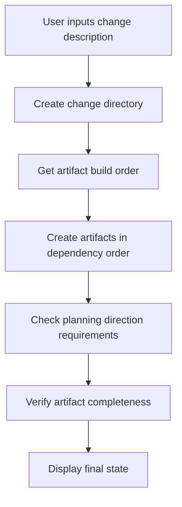
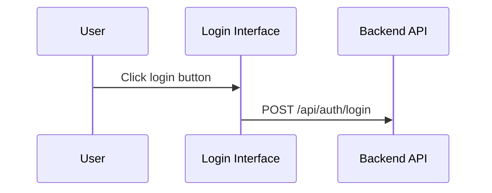

## Customizing OpenSpec Steps to Improve AI Generation Results

> When using OpenSpec to manage technical proposals, we encountered issues with inconsistent AI-generated documentation quality. There was really no other way but to modify the prompt templates ourselves. This article documents those days.

## Background

OpenSpec is a system for managing technical proposals. The core idea is simple: input change descriptions, automatically generate various documentation artifacts. Proposals, designs, specs, tasks—all can be automatically generated. Sounds pretty ideal, doesn't it?

However, in actual use, we discovered some problems. How should I put it—nothing major, just that the generated content didn't quite hit the mark.

The generated `design.md` lacked necessary visual elements—no Mermaid flowcharts, no sequence diagrams, and certainly no architecture diagrams. Such design documents made the technical team shake their heads; after all, who wants to look at a pile of plain text?

The `proposal.md` was also unsatisfactory, missing code change tables and UI prototypes. Decision-makers would stare at it for ages and still not understand what the changes actually modified.

Even more headache-inducing was `tasks.md`, which included various Git operation tasks. Responsibility boundaries became unclear, and developers looking at these tasks didn't know what they should or shouldn't do. This was also somewhat helpless—after all, AI doesn't know your team's division of labor.

Visualization requirements for different document levels were also unclear. What charts should proposal and design contain exactly? This question constantly plagued the team.

Where was the root of these problems? After analysis, we discovered the key point: the prompt templates lacked clear constraints and guidance.

This isn't surprising—after all, templates are inherently generic and cannot fully adapt to every team's needs.

## About HagiCode

The solution shared in this article comes from our practical experience in the [HagiCode](https://hagicode.com) project. HagiCode is an AI coding assistant project, and we heavily use OpenSpec to manage technical proposals during development.

It was precisely these practical stumbling experiences that led to the creation of this improvement solution. Actually, it's nothing remarkable—just encountering problems and solving them.

## Analysis: Prompt System Architecture

To solve the problem, first understand the system. Let's look at how OpenSpec's prompt system works.

OpenSpec uses the Handlebars template system, where each prompt contains two parts:

**JSON metadata file**: defines parameters, scenarios, version information
**Handlebars template file**: contains the actual prompt content

```
Resources/Prompts/
├── openspec-v1-ff.zh-CN.json    # metadata
├── openspec-v1-ff.zh-CN.hbs     # template content
├── openspec-v1-ff.en-US.json
└── openspec-v1-ff.en-US.hbs
```

The advantages of this separation design are obvious: metadata and content are managed separately,便于维护和本地化. This is also a bit like writing code—separating logic and presentation, everyone understands this principle.

The FF (Fast Forward) workflow is OpenSpec's core generation process:



This process looks perfect, but the problem lies in the "planning direction requirements" step—it lacks sufficiently clear guidance.

This is also somewhat helpless—after all, when designing the system, it's impossible to consider every team's specific needs.

## Planning Direction System

The planning direction system is OpenSpec's core customization mechanism, allowing users to choose different generation options. The HagiCode project defines the following directions:

| Direction ID | Function | Default Enabled |
|---------|------|---------|
| `explore` | Explore mode | Yes |
| `change-map` | Change map | Yes |
| `flowchart` | Flowchart | Yes |
| `prototype` | UI prototype | Yes |
| `architecture` | Architecture diagram | Yes |
| `sequence` | API sequence diagram | Yes |

Each direction defines stable identifiers, default enabled states, display labels, and Chinese/English prompt fragments.

This system design is quite ingenious, but in HagiCode's practice, we found that having definitions alone wasn't enough—these directions need to be explicitly used in the prompt templates.

This is also a bit like many things in life—having options doesn't mean you'll make the right choice; someone still needs to tell you how to choose.

## Solution: Clear Constraints and Examples

Our improvement approach was straightforward: add clear constraints and reference examples to the prompt templates.

Actually, there's nothing special about it—just making things clear.

### 1. Add Documentation Visualization Requirements

In the `openspec-v1-ff.zh-CN.hbs` template, we added clear content scope constraints:

```markdown
### tasks.md Content Scope Constraints

When creating `tasks.md` artifacts, the following content scope constraints must be observed:

Must include:
- Business logic tasks (code implementation, feature development)
- Technical implementation tasks (component integration, API development)
- Testing tasks (unit tests, integration tests)
- Documentation tasks (updating documentation, adding comments)

Must not include:
- Git commit operations (git add, git commit, git push)
- Version control management workflows
- Deployment and release operations
```

Using normative "MUST/MUST NOT" language rather than "suggest" or "may" allows AI to more accurately understand constraints.

This is also a bit like teaching children—say what you mean, no ambiguity allowed.

### 2. Provide Reference Examples for Each Direction

Just saying "include flowcharts" wasn't enough, so we provided specific output examples for each enabled direction.

After all, talk is cheap—give a concrete example and AI can better understand.

**Change map direction example**:
```markdown
| File path | Change type | Change reason | Impact scope |
|---------|---------|---------|---------|
| Path/to/file | Add | Description | Module name |
```

**Prototype direction example**:
```
┌─────────────────────────────────────────┐
│ User Login                            [×] │
├─────────────────────────────────────────┤
│  Email address *                       │
│ ┌─────────────────────────────────────┐ │
│ │ user@example.com                   │ │
│ └─────────────────────────────────────┘ │
└─────────────────────────────────────────┘
```

**Flowchart direction example**:


These examples allow AI to accurately understand the expected output format rather than improvising.

This is also a bit like providing reference answers during an exam—while the content can't be exactly the same, the format should at least be correct.

### 3. Use Normative Language to Clarify Requirements

For visualization requirements of different document types, we used normative language to constrain:

```markdown
For proposal.md:
- Must include code change table (when change-map direction is enabled)
- Must include UI prototype diagram (when involving UI changes and prototype direction is enabled)
- Must not include detailed architecture diagrams (these should be in design.md)

For design.md:
- Must include all proposal.md content (more detailed version)
- Must include architecture diagram (when architecture direction is enabled)
- Must include data flow diagram (when flowchart direction is enabled)
```

These clear constraints significantly improved generation quality.

Actually, there's nothing else—just making things clear so AI doesn't have to guess.

## Practice: Code Implementation

Theory aside, let's see how it's implemented in the HagiCode project.

### Define Planning Directions

Define planning directions in `ProposalPlanningDirections.cs`:

```csharp
public static class ProposalPlanningDirections
{
    private static readonly ProposalPlanningDirectionDefinition[] Catalog =
    [
        new(
            ChangeMapId,
            "Change map",
            DefaultEnabled: true,
            EnglishPromptFragment:
            "- Change map: include structured file-impact views...",
            ChinesePromptFragment:
            "- 变更地图：加入结构化的文件影响视图..."),
        // ... other directions
    ];

    public static string RenderInstructionBlock(
        IEnumerable<ProposalPlanningDirectionState> directions,
        string? locale)
    {
        var enabledDirections = directions
            .Where(direction => direction.Enabled)
            .ToArray();

        if (enabledDirections.Length == 0)
        {
            return string.Empty;
        }

        var heading = IsChineseLocale(locale)
            ? "本次生成启用以下规划方向："
            : "Apply the following planning directions:";

        return string.Join(Environment.NewLine,
            [heading, .. enabledDirections.Select(d => d.GetPromptFragment(locale))]);
    }
}
```

This code has several noteworthy design points:

1. Using an array instead of a list, since definitions don't change at runtime
2. Lazy rendering—only generate text when there are enabled directions
3. Multi-language support, selecting appropriate prompt fragments based on locale

Actually, there's nothing special—just some常规的 code design.

### Template Parameterization

Use conditional statements in Handlebars templates:

```handlebars
{{#if planningDirectionInstructions}}
## Planning Directions for This Generation

{{{planningDirectionInstructions}}}
{{/if}}

**Steps**
1. **If input is not provided, use reasonable defaults**
2. **Create change directory**
3. **Get artifact build order**
4. **Create artifacts in order until apply-ready**
   a. For each ready artifact:
      - Get instructions
      - Read dependency files
      - Create artifact file
```

Note that `{{{planningDirectionInstructions}}}`—three curly braces mean don't escape HTML, which preserves formats like Mermaid code blocks.

This is also a bit like compromises in life—sometimes you need to preserve some原始的东西, can't escape everything.

### Prompt Loading Implementation

Implement parameterized prompt loading through `FilePromptProvider`:

```csharp
public async Task<string> GetOpenspecV1FfPromptAsync(
    string changeName,
    string changeDescription,
    string locale = "en-US",
    string? planningDirectionInstructions = null,
    CancellationToken cancellationToken = default)
{
    var parameters = new Dictionary<string, object>
    {
        { "planningDirectionInstructions",
          ResolvePlanningDirectionInstructions(locale, planningDirectionInstructions) }
    };

    if (!string.IsNullOrWhiteSpace(changeName))
    {
        parameters["changeName"] = changeName;
    }

    return await GetPromptWithParametersAsync(
        PromptScenario.OpenspecV1Ff,
        locale,
        cancellationToken,
        parameters) ?? string.Empty;
}
```

This design is flexible: `planningDirectionInstructions` is optional, and if not provided, the system uses default configuration.

After all, no one wants to pass a bunch of parameters every time—having a default value is always good.

## Validation and Testing

After implementation, the HagiCode team conducted comprehensive validation:

### When Specific Directions Are Enabled

- Check if generated proposal.md contains code change tables
- Check if generated design.md contains architecture diagrams
- Verify tasks.md doesn't include Git operation tasks

### When Specific Directions Are Disabled

- Verify that corresponding visualization content is not generated
- Ensure that other directions' output is not affected

### Edge Cases

- Behavior when all directions are disabled
- Error handling for invalid direction IDs

These tests ensured system stability and predictability—critical for team adoption of new tools.

Actually, there's nothing special—just test everything that should be tested, after all, no one wants problems after going live.

## Considerations

When implementing this solution, there are several pitfalls to avoid:

**Template synchronization**: When modifying templates, keep them in sync with upstream. The HagiCode team once encountered a template conflict that took half a day to resolve. This is also somewhat helpless—after all, upgrades always bring some compatibility issues.

**Bilingual consistency**: Ensure Chinese and English templates have consistent structure and constraints. We once encountered a situation where the Chinese version had constraints but the English version didn't, causing inconsistent documentation quality. This was also a bit awkward—after all, who knows which language users will use.

**Performance impact**: Rendering of planning directions should complete in microseconds. If rendering takes too long, it affects user experience. After all, who wants to wait ages to see results?

**Backward compatibility**: Maintain support for old version APIs. For example, the `enableExploreMode` parameter—although we now use the planning direction system, old code still uses it. This is also somewhat helpless—after all, we can't always require everyone to upgrade.

**Clear expression**: Use normative language (MUST/SHALL) rather than suggestive language. This point was fully validated in HagiCode's practice. Actually, there's nothing else—just making things clear.

## Summary

By customizing OpenSpec prompt steps, we successfully improved the quality of AI-generated documentation. Key improvements include:

1. Adding clear constraint conditions to prompt templates
2. Providing specific output examples for each planning direction
3. Using normative language (MUST/MUST NOT) to constrain AI behavior
4. Implementing flexible prompt parameterized loading through code

This solution was validated in the HagiCode project, and the generated documentation quality significantly improved: design documents included complete visualization elements, proposal documents had clear code change tables, and task lists had clear responsibilities.

Actually, it's nothing remarkable—just solving the problem.

If you're also using similar AI-assisted documentation generation systems, I hope this experience helps you. Remember: clear constraints and specific examples are key to obtaining high-quality output.

After all, some things are better said clearly...

## References

- [HagiCode Project](https://github.com/HagiCode-org/site)
- [OpenSpec Documentation](https://docs.hagicode.com)
- [Handlebars Template Syntax](https://handlebarsjs.com/)
- [Mermaid Diagram Syntax](https://mermaid.js.org/)
