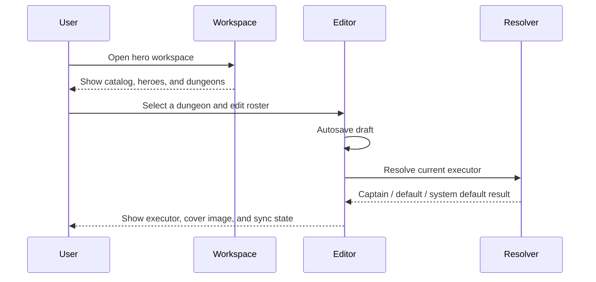
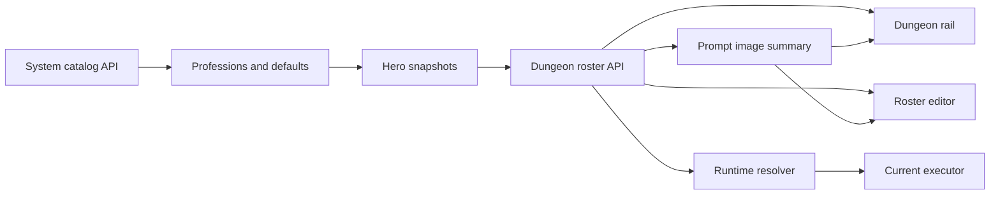
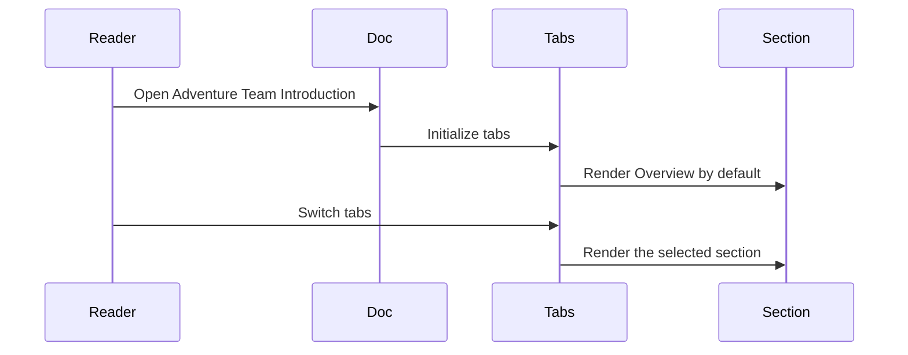

import { Tabs, TabItem, CardGrid, LinkCard } from '@astrojs/starlight/components';

> This page summarizes the adventure team model from the Hero Workspace / Hero Dungeon implementation in `repos/web`, product positioning in `repos/site`, and related tests and API models.

| Metadata | Value |
| --- | --- |
| Owner | HagiCode Docs Team |
| Last updated | 2026-03-13 |
| Version | 1.0.0 |
| Scope | Hero Workspace, Hero Dungeon, Prompt dungeon previews, system default heroes |
| Primary sources | `repos/web/src/types/hero.ts`, `repos/web/src/types/heroDungeon.ts`, `repos/web/src/store/slices/heroConfigSlice.ts`, `repos/web/src/components/hero/*`, `repos/site/src/components/home/FeaturesShowcase.tsx` |

:::note
This page was prepared in a non-interactive environment. Product, developer, and usability validation were approximated by checking source code, existing product copy, and tests.
:::

## What the adventure team means

In HagiCode, the “adventure team” is the runtime collaboration layer that turns AI providers, model families, prompt styles, and stage routing into a readable system of **heroes, professions, dungeons, and fallback rules**.

- **Heroes** are executable members carrying CLI, model, and style snapshots.
- **Profession catalogs** are read-only system sources.
- **Dungeons** are stage-specific execution contexts such as Proposal, AutoTask, and Prompt.
- **Fallback rules** guarantee that each stage can still resolve an executor when the captain is missing.

## Tab Overview

<Tabs>
  <TabItem label="Overview" value="overview" default>

  ## Team overview

  The adventure team is a visual execution orchestration system. It helps users understand who is running a task, why that hero was selected, and what the next fallback layer is.

  ### Positioning

  - **Execution-oriented**: the system exists to select the right runtime hero for each stage.
  - **Governance-oriented**: primary and secondary professions come from a centralized catalog.
  - **Readable by teams**: captains, dungeon defaults, and system defaults make routing easier to explain.
  - **Feedback-oriented**: level, XP, battle reports, and dungeon covers make progress visible.

  ### Core goals

  1. Provide a stable, traceable hero for each execution stage.
  2. Keep CLI providers, models, and styles inside a unified hero snapshot model.
  3. Reduce workflow interruption by using fixed fallback layers.
  4. Let users understand system catalogs, personal heroes, and dungeon rosters in one workspace.

  ### Core values

  - Explainable runtime resolution
  - Governed configuration boundaries
  - Reusable default presets
  - Stable long-term maintenance
  - Game-like feedback without hiding real execution logic

  </TabItem>

  <TabItem label="Members" value="members">

  ## Member composition

  The team has three member layers: **system professions, built-in default heroes, and user-created heroes**. These are then organized into dungeon rosters.

  ### Main preset members

  | Member | Primary profession | Secondary profession | Style | Typical duty |
  | --- | --- | --- | --- | --- |
  | Claude Code default hero | Claude Code | GLM 5 | Strategist | Planning, review, complex analysis |
  | Codex default hero | Codex | GPT 5.4 | Vanguard | Implementation, fixing, rapid delivery |
  | GitHub Copilot default hero | GitHub Copilot | GPT 5 Mini | Vanguard | Pairing, completion, lightweight support |
  | OpenCode default hero | OpenCode | GLM 4.7 | Strategist | Shared runtime orchestration |
  | IFlow default hero | IFlow | GLM 4.7 | Ranger | Automation flow transitions |
  | Codebuddy default hero | Codebuddy | GLM 4.7 | Ranger | Local repair and ACP bridging |

  ### Profession structure

  **Primary professions**: Claude Code, Codex, GitHub Copilot, OpenCode, IFlow, Codebuddy.

  **Secondary professions**: GPT 5.4, GPT 5.3 Codex, GPT 5 Mini, Claude 3.5 Sonnet, Claude Sonnet 4, GLM 4.7, GLM 5, Minimax M2.5.

  **Styles**: Vanguard, Strategist, Ranger.

  ### Member attributes

  Core hero fields include identity, role information, availability, and progression:

  - `heroId` / `id`, `name`, `icon`
  - `description`, `executorType`
  - `isEnabled`, `isMissing`, `isDefault`
  - `currentLevel`, `totalExperience`, `experienceProgressPercent`

  ### Relationship map

  ```text
  Read-only profession catalogs
      -> editable hero snapshots
      -> dungeon rosters
      -> runtime executor
  ```

  </TabItem>

  <TabItem label="Collaboration" value="collaboration">

  ## Collaboration mechanism

  ### Working model

  1. `/api/SystemInfo/hero-settings` provides the centralized profession catalog.
  2. Users edit hero snapshots rather than system catalog entries.
  3. `/api/Hero/dungeons` returns dungeon rosters, defaults, and prompt cover summaries.
  4. Roster changes are autosaved after a debounce window.
  5. Runtime resolution follows a fixed order.

  ### Interaction flow

  ```mermaid
  flowchart TD
      A[Load profession catalog] --> B[Open hero workspace]
      B --> C[Select dungeon]
      C --> D[Adjust roster]
      D --> E[Autosave roster]
      E --> F{Captain available?}
      F -->|Yes| G[Use captain]
      F -->|No| H{Dungeon default available?}
      H -->|Yes| I[Use dungeon default]
      H -->|No| J{System default available?}
      J -->|Yes| K[Fallback to system default]
      J -->|No| L[Show no executor available]
  ```

  ### Main collaboration channels

  - `GET /api/SystemInfo/hero-settings`
  - `GET /api/Hero/dungeons`
  - `GET /api/Hero/dungeons/selectable-heroes`
  - `PUT /api/Hero/dungeons/{scriptKey}`
  - Prompt image summary metadata for dungeon covers

  Prompt image precedence is:

  1. normalized runtime image URL
  2. metadata-derived `stageStyleKey`
  3. static prompt image library asset
  4. `PromptIcon` fallback

  </TabItem>

  <TabItem label="Capabilities" value="capabilities">

  ## Functional scope

  ### Task types

  - Proposal generation and structuring
  - Implementation and automated fixes
  - Archive-stage knowledge capture
  - Prompt preview and style management
  - System-default fallback execution
  - Hero creation, cloning, enablement, and roster maintenance

  ### Scope and limits

  - System catalogs are read-only.
  - Primary and secondary professions are required; style is optional.
  - Compatibility follows the profession matrix.
  - Heroes must be enabled and not missing to be executable.
  - Final runtime behavior is controlled by backend responses.

  ### Typical scenarios

  - onboarding with system default heroes
  - assigning different captains to Proposal / AutoTask / Prompt dungeons
  - reserving Codex-like heroes for rapid implementation
  - using system defaults as a safe fallback layer

  </TabItem>
</Tabs>

## Visuals

### ASCII prototype

```text
+--------------------------------------------------------------+
| Adventure Team                                               |
| [Overview] [Members] [Collaboration] [Capabilities]          |
| Captain -> Dungeon Default -> System Default                 |
| Prompt cover -> Current executor -> XP / Level feedback      |
+--------------------------------------------------------------+
```

### User flow



### Data flow



### Document navigation



## Key rules at a glance

- Captain = the first eligible non-default assigned hero in a dungeon.
- Resolution order = manual override -> saved stage hero -> captain -> dungeon default -> system default.
- Eligible heroes must be enabled and not missing.
- Prompt cover fallback = runtime image -> static library -> icon.
- System catalogs remain read-only; editable data lives in hero snapshots and roster state.

## Sources and validation

Primary source files:

- `repos/web/src/types/hero.ts`
- `repos/web/src/types/heroDungeon.ts`
- `repos/web/src/utils/heroDungeonRuntime.ts`
- `repos/web/src/store/slices/heroConfigSlice.ts`
- `repos/web/src/components/hero/HeroDungeonRail.tsx`
- `repos/web/src/components/hero/HeroDungeonRosterEditor.tsx`
- `repos/web/src/components/hero/HeroSystemSettingsPanel.tsx`
- `repos/web/src/generated/api/services/HeroService.ts`
- `repos/web/src/generated/api/services/SystemInfoService.ts`
- `repos/web/src/locales/en/common/hero.yml`
- `repos/site/src/components/home/FeaturesShowcase.tsx`

## Changelog

| Version | Date | Notes |
| --- | --- | --- |
| 1.0.0 | 2026-03-13 | First published adventure team overview for docs. |

## Update process

1. Re-check this page whenever hero settings, dungeon APIs, or UI routing change.
2. Update tables and diagrams when professions, defaults, or dungeon groups change.
3. Rebuild `repos/docs` before merging to verify Markdown, tabs, and Mermaid rendering.

## Related reading

<CardGrid>
  <LinkCard title="Product Overview" href="/en/product-overview" description="See the full HagiCode product picture, including OpenSpec and multi-agent execution." />
  <LinkCard title="Proposal Sessions" href="/en/quick-start/proposal-session" description="Understand the proposal flow that maps naturally to proposal dungeons." />
  <LinkCard title="Monospec Guide" href="/en/guides/monospecs" description="Learn how multi-repository coordination connects with proposal and execution workflows." />
</CardGrid>
