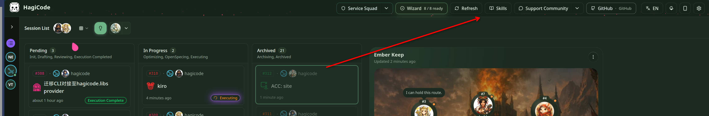
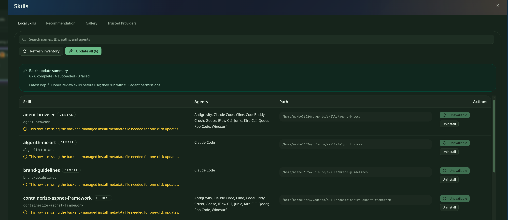
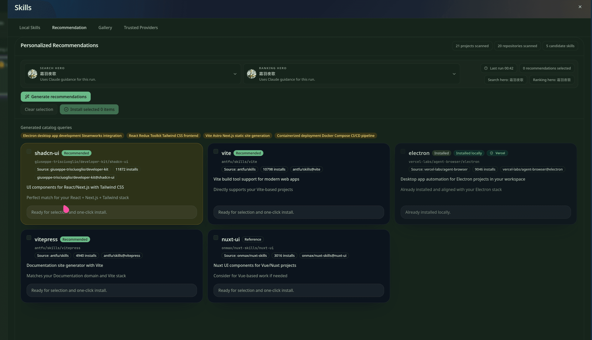
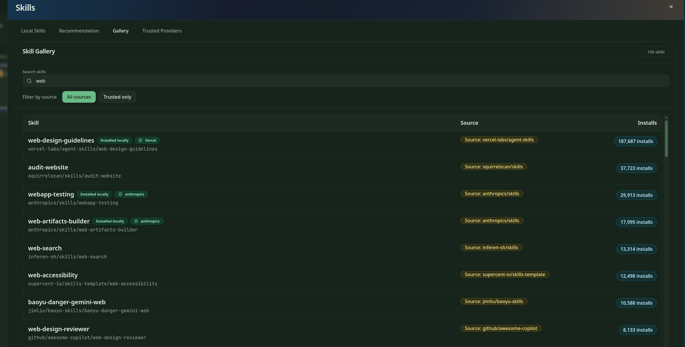
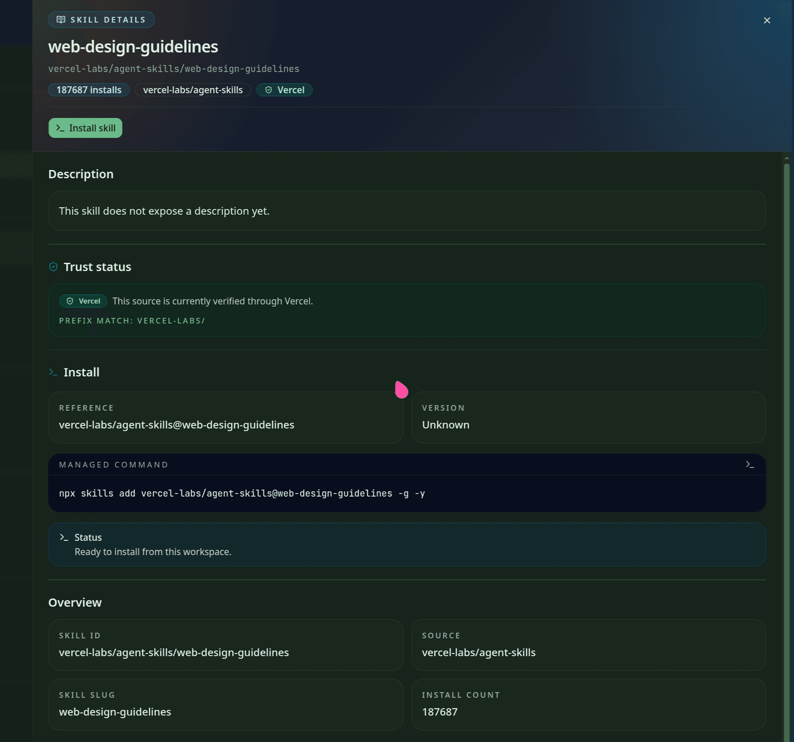
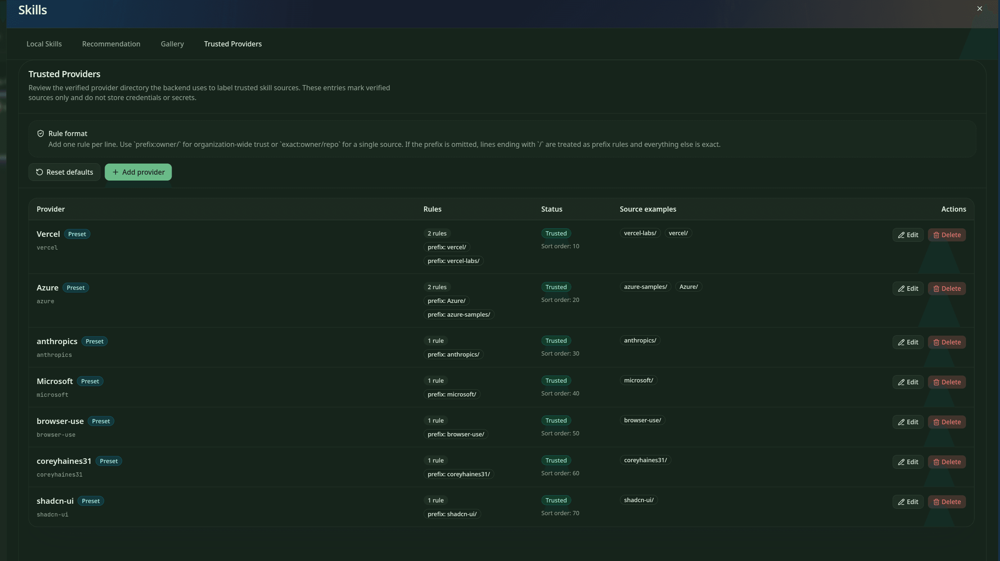

import { CardGrid, LinkCard } from '@astrojs/starlight/components';

This guide covers the `Skills` panel in HagiCode.

Open Skills when you want to:

- see which skills are already installed on this machine
- get recommended skills based on your current projects and repositories
- search the wider skill library
- confirm the source, trust state, and actual install command before installing
- manage which sources are labeled as trusted

## What Skills is for

Skills is HagiCode's built-in skill browsing and installation panel. It gives you one place to review locally available skills, discover recommendations, search the gallery, and inspect installation details before you install anything.

Use it when:

- you are new to HagiCode and want to see what is already available
- you know the kind of work you are doing and want better matching helper skills
- you want to install a new skill but need to verify the source first
- you want to avoid reinstalling something that is already available locally

:::tip[Recommended reading order]
On a first pass, start with `Local Skills`, then move to `Recommendation` and `Gallery`, and only then review the details panel before installing.
:::

## 1. Open Skills

In the top navigation bar of the HagiCode workspace, click the `Skills` button to open the panel.

The red arrow in the screenshot highlights the entry point.

After opening the panel, you will see four main tabs:

- `Local Skills`
- `Recommendation`
- `Gallery`
- `Trusted Providers`

:::note[When to open Skills]
You do not need to leave your current project, session, or onboarding flow. Skills opens from the top bar inside the same workspace.
:::

## 2. Review locally installed skills

`Local Skills` answers two common questions: **What is already installed?** and **Which of these skills can be updated right now?**

The most important areas on this page are:

- **Search box**: filter local skills by name, ID, path, or agent
- **`Refresh inventory`**: rescan what is currently installed on this machine
- **`Update all`**: run batch updates for skills that support managed updates
- **`Batch update summary`**: review the latest batch result and status log

Each row usually shows:

- the skill name
- compatible agents
- the local install path
- available actions

If a row warns that backend-managed install metadata is missing, that skill cannot use one-click updates and should be reviewed manually.

:::caution[Batch update still needs human review]
`Update all` only means the update flow is executed in bulk. It does not mean the listed skills have already been safety-reviewed for your use case.
:::

## 3. Get recommended skills

`Recommendation` builds a candidate list from your current projects and repositories. It is useful when you know what kind of work you are doing, but you have not decided which skills to install yet.

A practical reading order is:

1. Check the hero selectors at the top to understand what context drives the recommendation
2. Click `Generate recommendations`
3. Review the query chips to see why these candidates were chosen
4. Compare the candidate cards before opening the details panel

Common labels on recommendation cards mean:

- `Recommended`: currently suggested by the system
- `Installed`: already installed
- `Installed locally`: already available in the local environment and usually does not need reinstalling

:::note[What `installed locally` means]
This label means "you already have it." It is not a prompt telling you to install it now.
:::

## 4. Search and compare in the gallery

If you already know what you are looking for, or you want to compare similar skills from different sources, use `Gallery`.

`Gallery` is the best place to:

- search by keyword
- filter to trusted sources first
- compare similar skills from different sources
- check install counts and local install state

Start with three fields:

- **`Source`**: who provides the skill
- **`Installs`**: the install count, which can act as a supporting signal
- **`Installed locally`**: whether the skill is already available on your machine

:::tip[Check the source before the install count]
Popularity can help, but it should not replace source review. Start with `Source`, then use `Installs` as extra context.
:::

## 5. Review skill details before installing

When you open a skill, HagiCode shows the details panel. This is the most important screen to review before installation.

Pay special attention to:

- **name, source, and install count**: make sure you opened the intended item
- **`Trust status`**: why this source is considered trusted
- **`Managed command`**: the actual command HagiCode is prepared to run
- **`Status`**: whether the current workspace can install this skill
- **`Overview`**: supporting identifiers such as skill ID, slug, source, and install count

`Managed command` matters because it is the real installation command, not decorative text.

:::caution[`trusted` does not mean "skip the review"]
Even when a source is marked `trusted`, you should still read both `Trust status` and `Managed command` before installing.
:::

## 6. Manage trusted providers

`Trusted Providers` controls which sources receive the `trusted` label. Open it when you want to know why a source is trusted, or when you need to adjust your trust rules.

On this page:

- **`Rule format`** explains how rules are written
- **`Add provider`** lets you add a provider rule set
- **`Reset defaults`** restores the default presets
- the **`Rules`**, **`Status`**, and **`Source examples`** columns show the matching rules, current state, and example matches

Common rule styles include:

- `prefix:owner/` for prefix-based trust
- `exact:owner/repo` for a single exact source

:::note[Trusted Providers is not a credentials page]
This page only decides which sources are labeled as trusted. It does not store tokens, passwords, or other secrets.
:::

## Check these 4 things before installing

Before you install a skill, review at least these four signals:

| Check | Where to look | What it tells you |
| --- | --- | --- |
| Whether the source is trusted | `Trusted Providers`, plus `Trust status` in the details panel | Why this source is labeled as trusted |
| Whether it is already installed | status labels in `Recommendation` and `Gallery` | If it says `installed locally`, you usually do not need to reinstall it |
| Batch update result | `Batch update summary` in `Local Skills` | Whether the last bulk update succeeded and whether anything needs manual review |
| Actual install command | `Managed command` in the details panel | What HagiCode is actually going to run |

## A common user path

A common first-time flow is:

1. Open `Local Skills` and review what is already available
2. Use `Recommendation` to find candidates that fit your current work
3. Use `Gallery` to search and compare sources
4. Open the details panel to verify trust state and install command
5. If needed, review or adjust trust rules in `Trusted Providers`

## Related reading

<CardGrid>
  <LinkCard
    title="Product Overview"
    href="/en/product-overview"
    description="See where Skills fits in the larger HagiCode workspace and workflow."
  />
  <LinkCard
    title="Initialization Wizard Guide"
    href="/en/guides/initialization-wizard"
    description="If you are just getting started, review the onboarding flow before returning to Skills."
  />
  <LinkCard
    title="Desktop Installation Guide"
    href="/en/installation/desktop"
    description="If you are still finishing installation or first launch, continue with the desktop setup guide."
  />
</CardGrid>
