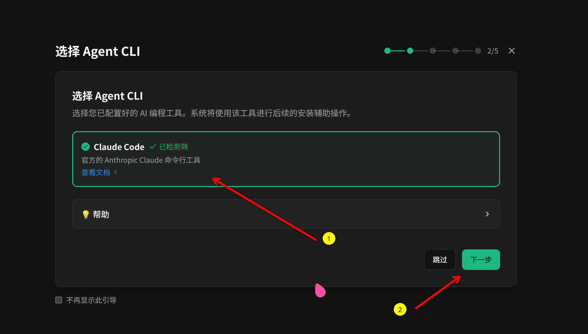
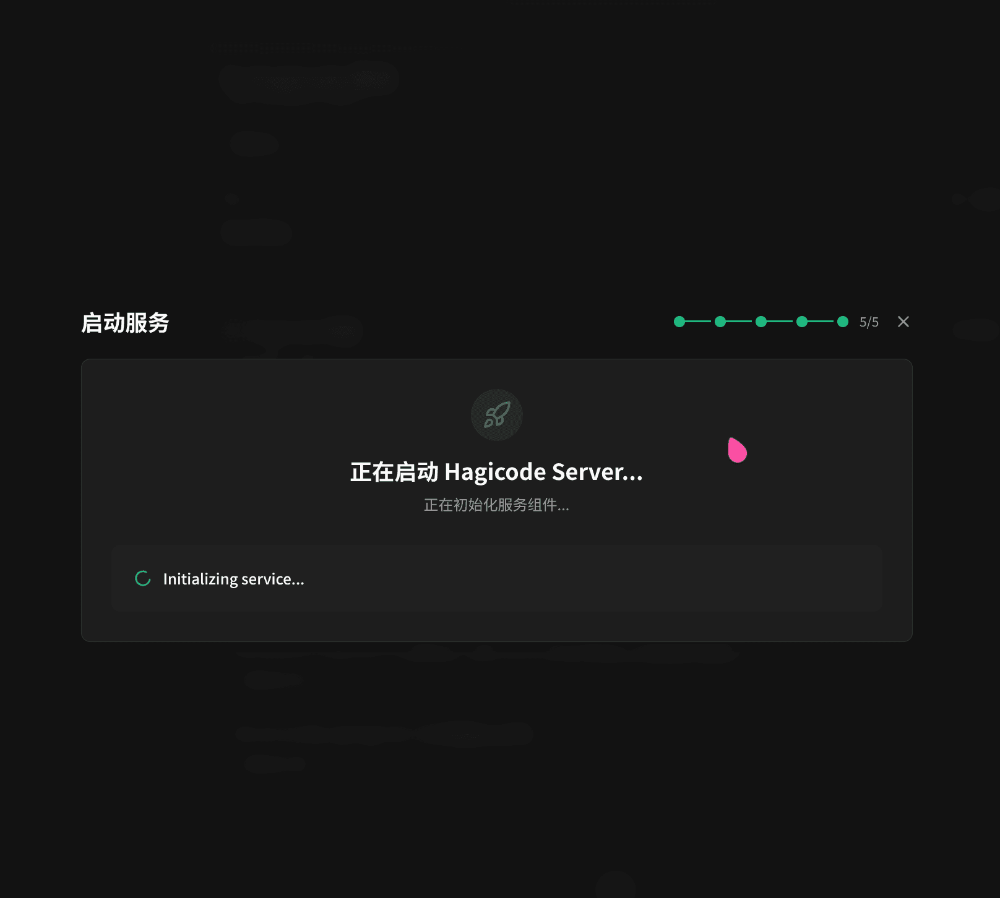
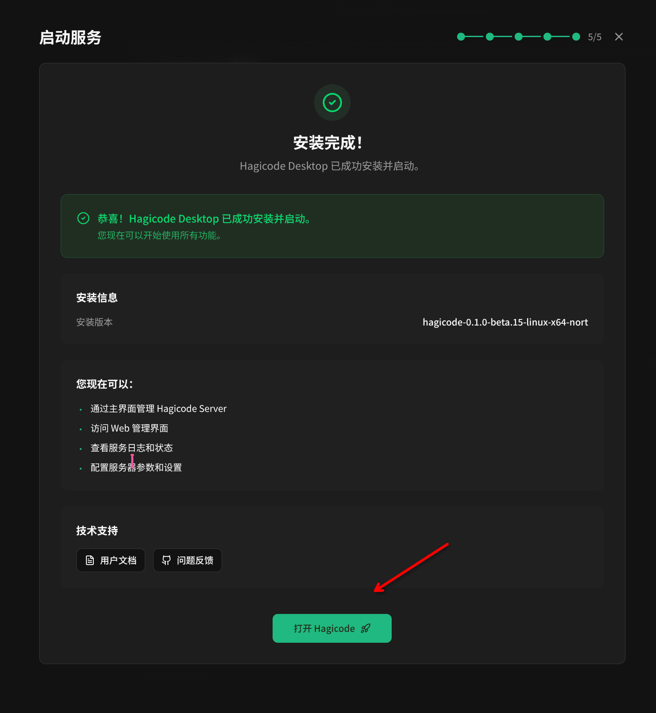
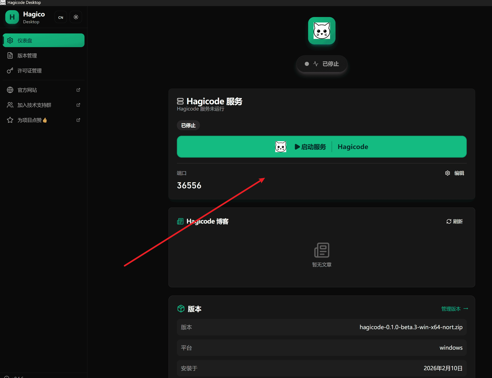

import { LinkCard, CardGrid } from '@astrojs/starlight/components';
import InstallButton from '../../../../components/InstallButton';

This guide explains how to install and use the Hagicode Desktop application. Hagicode Desktop is a powerful and easy-to-use desktop application that provides you with a complete Hagicode experience.

:::tip[Recommended Method]
Hagicode Desktop is the most suitable installation method for individual users and developers, with the following advantages:
- One-click installation, no need to configure complex environments
- Automatic dependency and service management
- Graphical interface, simple and intuitive operation
- Built-in version management, easy to switch between different versions
- Local operation, complete control of your data
:::

## What is Hagicode Desktop?

Hagicode Desktop is Hagicode's official desktop application, designed for Windows, macOS, and Linux systems. It integrates all of Hagicode's core features and makes the installation process simple and fast through an installation wizard.

### Main Advantages

- **One-click Installation**: Complete all configuration steps automatically through the installation wizard
- **Automatic Runtime Preparation**: The default installer already includes the runtime it needs, so you do not need to install a separate `.NET` runtime first
- **Service Management**: Built-in Hagicode Server management, easily start and stop services
- **Version Switching**: Support for multi-version management, freely switch between different versions
- **Local Operation**: All data is stored locally, protecting your privacy
- **Automatic Updates**: Automatically detects and downloads the latest version

### Applicable Scenarios

Hagicode Desktop is suitable for the following scenarios:
- Individual developers who want to use Hagicode locally
- Users who need to use Hagicode offline
- Non-technical users who want to simplify the installation process
- Developers who need to frequently switch between different versions

## Download Desktop

### Quick Download

Select the version suitable for your operating system and download the installer directly:

{/* Use client:visible directive to ensure components hydrate correctly on the client, avoiding React Hook errors during SSR phase */}
<InstallButton variant="full" client:visible locale="en" />

### Other Download Methods

You can also get the Hagicode Desktop installer from the following channels:

1. **Official Release Page**: Visit [Hagicode GitHub Releases](https://github.com/Hagicode-org/releases) to download the latest version
2. **Official Website**: Visit [Hagicode Website](https://hagicode.com/) to get download links

### Choose the Correct Version

Select the corresponding installer for your operating system:
- **Windows**: Download the `.exe` installer
- **macOS**: Download the `.dmg` installer
- **Linux**: Download the `.AppImage` or `.deb` installer package

:::note[System Requirements]
- **Windows**: Windows 10 or higher version (64-bit)
- **macOS**: macOS 10.15 or higher
- **Linux**: Mainstream Linux distributions (Ubuntu 20.04+, Fedora 33+, etc.)
:::

:::tip[Default Prerequisites]
For the latest HagiCode local installation flow, you usually do not need to install PostgreSQL manually in advance, and you do not need to prepare a separate `.NET` runtime. Desktop already bundles the runtime required for the default flow. Only review the PostgreSQL guide if you plan to use an external database, follow an advanced deployment path, or connect HagiCode to a separately managed database.
:::

## Run the Installer

After downloading, run the installer. You will see the Hagicode Desktop installer welcome screen.

:::caution[macOS Gatekeeper Notice]
If you already installed the app to the default path `/Applications/Hagicode.app` but macOS shows "app is damaged", "can't be opened", or a similar Gatekeeper warning on first launch, the usual cause is the `com.apple.quarantine` attribute that macOS adds to apps downloaded from the internet, not a failure in the Hagicode Desktop installer itself.

Run the following command in Terminal. It requires administrator privileges and recursively removes the quarantine attribute from the app in the default installation path:

```bash
sudo xattr -dr com.apple.quarantine /Applications/Hagicode.app
```

After the command finishes, relaunch Hagicode Desktop.
:::

## Installation Wizard Steps

Hagicode Desktop provides a three-step installation wizard to guide you through the complete installation process. Here are detailed instructions for each step:

### Step 1: Select Pre-configured AgentCLI

The installation wizard will guide you to select a pre-configured AgentCLI for installation.



**This Step Explains**:
- View the list of available AgentCLI options
- Select your pre-configured AgentCLI
- Confirm selection and continue to next step

:::note[Pre-configuration]
Before using the Hagicode Desktop installation wizard, please ensure you have completed the AgentCLI configuration work. If you haven't configured AgentCLI yet, please complete the related configuration steps first.
:::

### Step 2: Download Hagicode

After configuration is complete, the wizard will automatically download the latest version of Hagicode.


**This Step Explains**:
- Wizard automatically detects and downloads the latest stable version
- Download progress is displayed in real-time
- Automatically proceeds to next step after download completes

:::note[Network Requirements]
Ensure your network connection is normal. The installer needs to download components from the internet. If download fails, please check your network settings or try again later.
:::

### Step 3: Start Service

After Hagicode finishes downloading, the wizard will launch the Hagicode Server service.



**This Step Explains**:
- Hagicode Server starts automatically in the background
- Startup usually takes only a few seconds
- After startup completes, you can start using Hagicode

#### Service Startup Complete

When Hagicode Server successfully starts, you will see the following interface.



Click the "Open Hagicode" button to start using.

## First Use

After you first enter Hagicode, the current initialization wizard takes over. It turns "prepare available capabilities," "organize the default executor lineup," and "land the first project" into one guided sequence instead of the older split between creating a project and manually importing repositories.

### Step 1: Profession management


**This Step Explains**:
- Review the profession / CLI capabilities currently available
- Confirm version details, configuration notes, and enabled state
- Decide which capabilities stay active for the rest of the onboarding flow

### Step 2: Custom hero setup


**This Step Explains**:
- Choose or organize the default hero lineup for first use
- Bind profession loadouts and shared capabilities to specific roles
- Confirm the executor defaults that later sessions and projects will inherit

### Step 3: Project creation


**This Step Explains**:
- Choose whether to create a new project or take over an existing project entry
- Fill in the project name, path, and other required details
- Save the initialization result so the rest of the quick-start flow points to a real working directory

:::tip[Further Reading]
If you want a screen-by-screen explanation of the current initialization wizard, continue with the [Initialization Wizard Guide](/en/guides/initialization-wizard/).
:::

## Version Management

Hagicode Desktop supports multi-version management, allowing you to freely switch between different versions.


### Switch Version

1. Open Hagicode Desktop
2. Go to "Version Management" page
3. Select the version you want to switch
4. Click "Switch Version" button
5. Wait for switch to complete

:::note[Version Switching Notes]
- Switching versions will automatically restart Hagicode Server
- Ensure you save all work before switching
- Project configurations may differ between versions
:::

## Start and Stop Service

Hagicode Desktop provides a simple way to manage Hagicode Server service.

### Start Service

On the home page of the Desktop application, click the "Start Service" button to start Hagicode Server.



### Stop Service

To stop Hagicode Server, click the "Stop Service" button on the home page.

:::tip[Service Status]
The Desktop application displays Hagicode Server's running status in real-time, including:
- Service status (running/stopped)
- Service port number
- Current version information
:::

## Next Steps

After installation is complete, you can continue with the following steps:

<CardGrid>

<LinkCard title="Create Your First Project" href="/en/quick-start/create-first-project"
    description="Initialize your Hagicode project, configure basic settings, and begin your AI-assisted development journey."
/>

<LinkCard title="Create Conversation Session" href="/en/quick-start/conversation-session"
    description="Start interacting with AI, experience read-only and edit dual modes, and let AI become your capable programming partner."
/>

<LinkCard title="Create Proposal Session" href="/en/quick-start/proposal-session"
    description="Learn about the proposal-driven development workflow, transforming abstract ideas into structured implementation plans."
/>

</CardGrid>

## Troubleshooting

### Installation Failure

If you encounter issues during installation:

1. **Check Network Connection**: Ensure you can access the internet
2. **Check Disk Space**: Ensure you have sufficient disk space
3. **Run as Administrator**: On Windows, right-click the installer and select "Run as administrator"
4. **View Log Files**: The installer generates detailed log files that can help diagnose issues

### Dependency Installation Failure

If dependency installation fails:

1. **Check System Compatibility**: Ensure your operating system meets minimum requirements
2. **Check Network and Firewall Settings**: Ensure the installer can reach required downloads and is not blocked by your firewall
3. **Confirm Installer Permissions**: On Windows, try running the installer as administrator so it has sufficient permissions
4. **Restart the App and Retry**: Close and reopen Hagicode Desktop, then retry the installation step
5. **View Logs**: Review detailed error logs in the Desktop application

### Service Startup Failure

If Hagicode Server fails to start:

1. **Check Port Occupancy**: Ensure port 45000 is not occupied by other programs
2. **Check Firewall Settings**: Ensure firewall allows Hagicode Server network access
3. **Restart Application**: Try restarting Hagicode Desktop
4. **View Logs**: View detailed error logs in the Desktop application

### Need More Help?

If you encounter issues not covered here:

1. Check [GitHub Issues](https://github.com/HagiCode-org/site/issues) for similar problems
2. Visit our [Community Forum](https://github.com/HagiCode-org/site/discussions) for help
3. Submit a new Issue, describing your problem in detail
