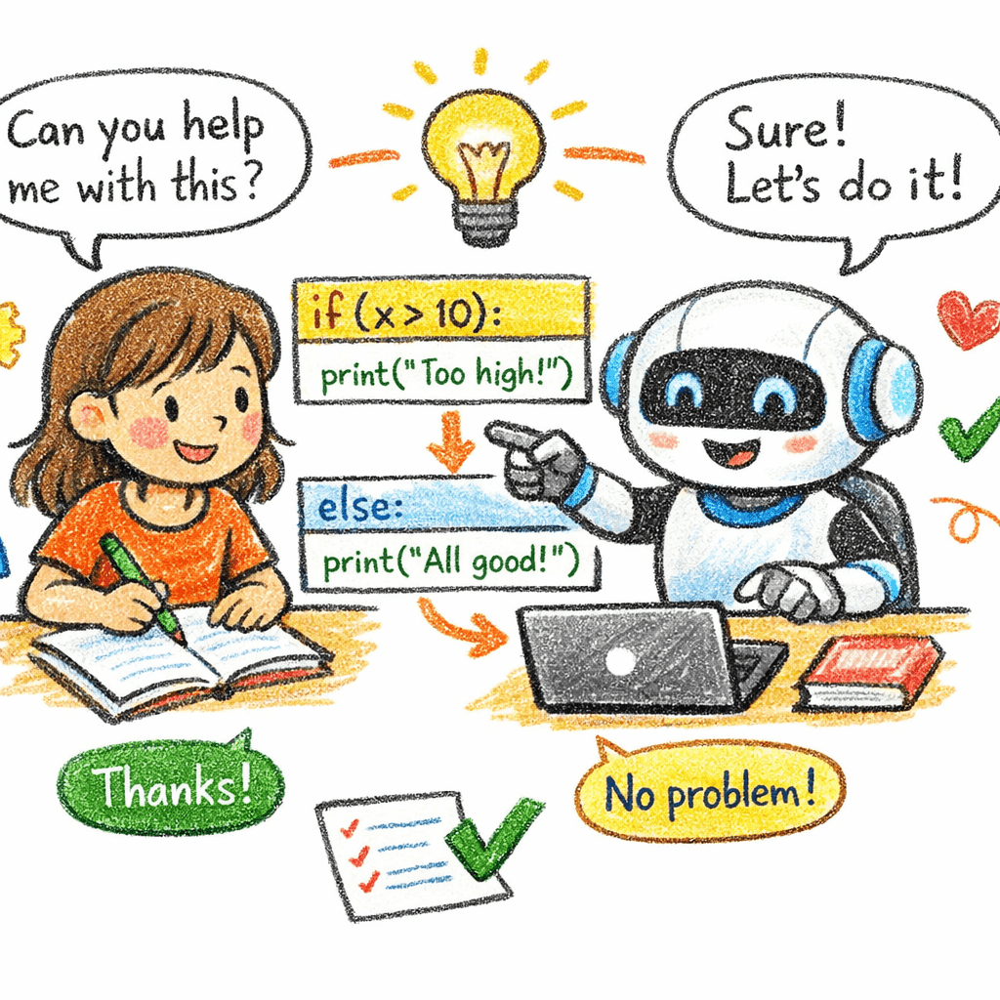
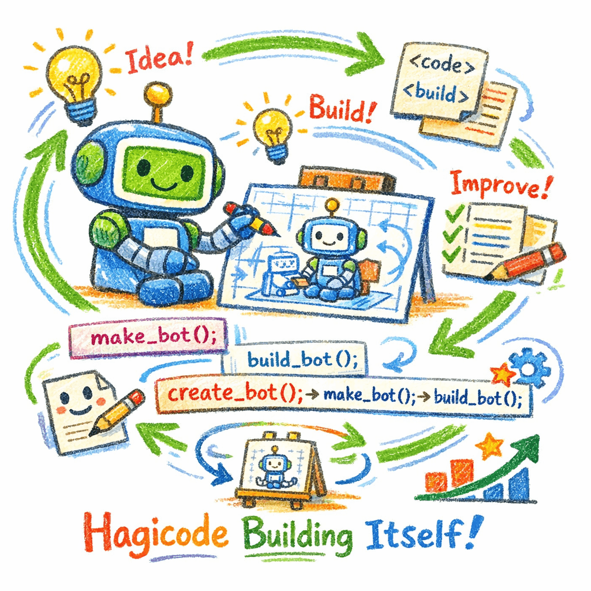
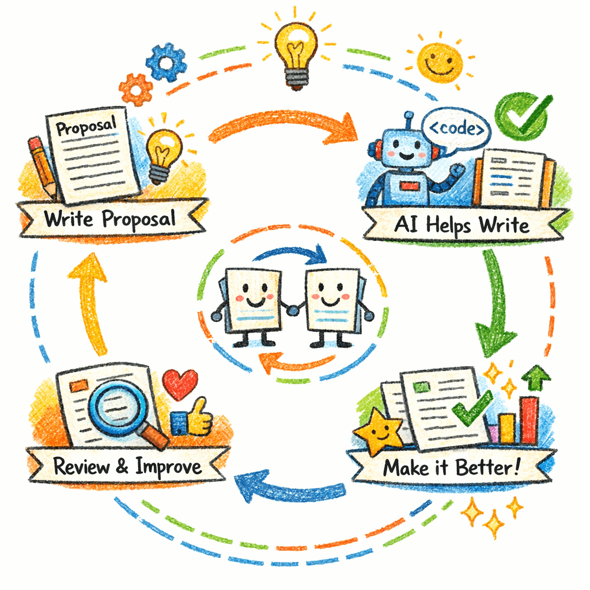
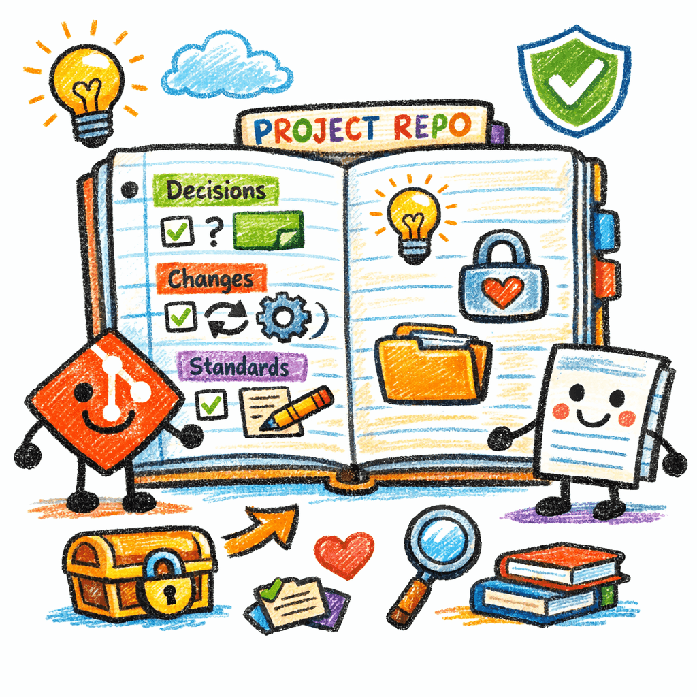
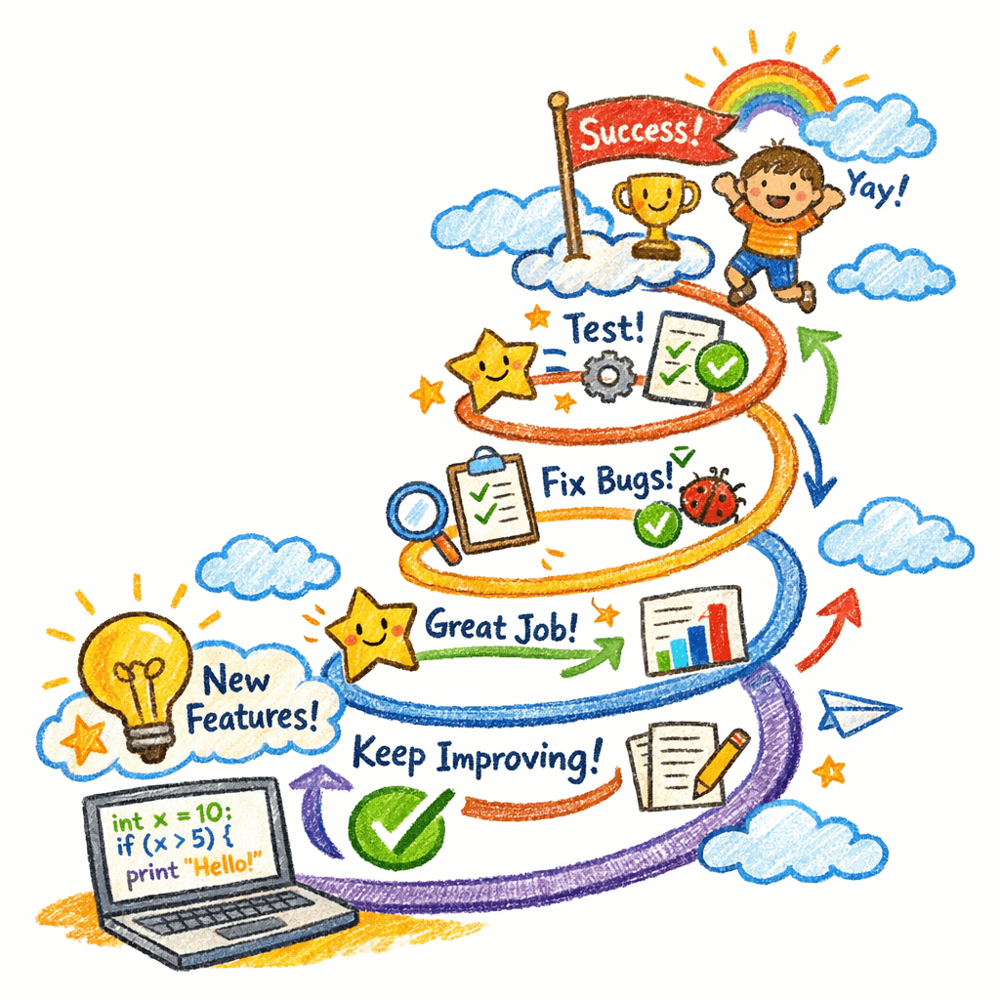
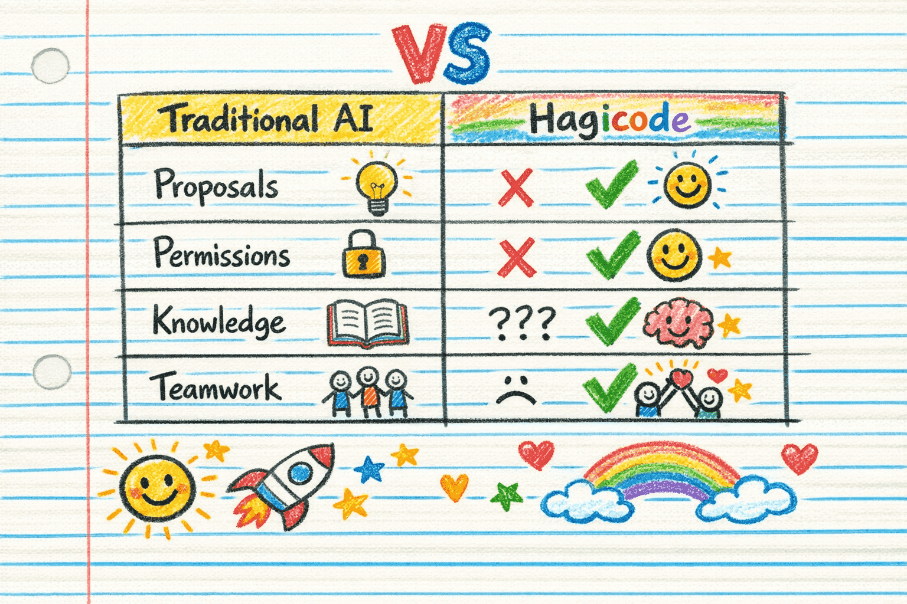
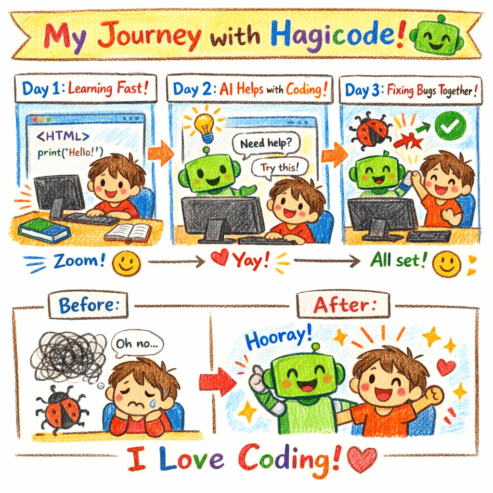
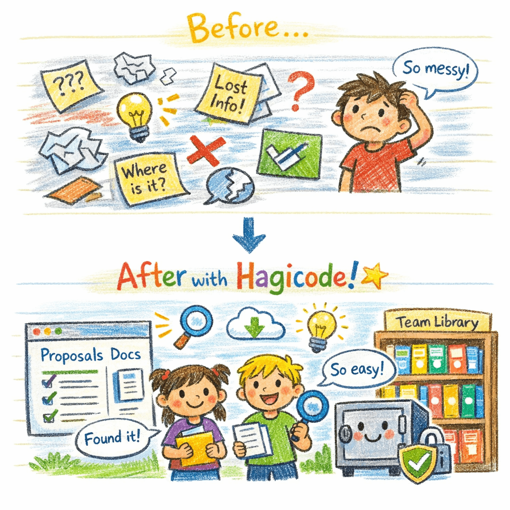
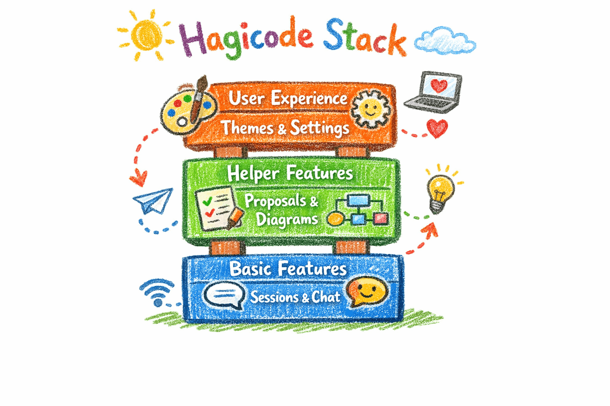
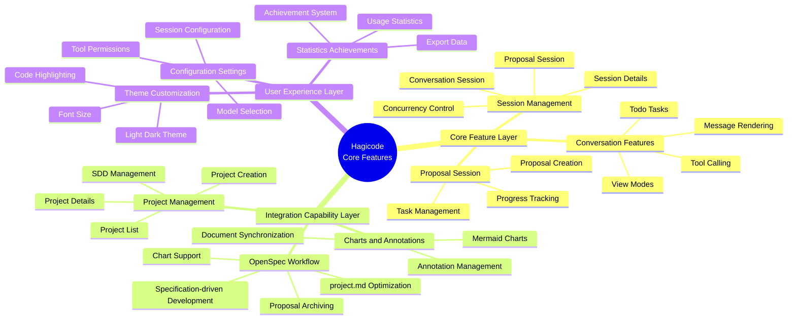

This overview document will help you comprehensively understand Hagicode, an AI-driven code development assistant tool, from multiple dimensions including product positioning, core capabilities, technical architecture, and usage scenarios.

## Why Choose Hagicode?

Among the many AI programming assistant options, have you ever encountered the following confusions?

---

### Do you find AI operations to be chaotic and autonomous during development, or does the generated code not meet your expectations?

**Dilemma of Traditional AI Assistants**:
You say "optimize database performance," and AI directly modifies 10 files, but the direction of changes is completely different from what you expected. You want to say "wait, let me see the plan first," but AI has already started executing.

**Hagicode's Solution: Proposal-driven Development**

Hagicode's **proposal session mode** transforms abstract ideas into structured implementation plans:
- **Clear goals and scope definition** - AI first asks you specifically what you want to optimize, confirms the scope before starting
- **Executable task list** - Generates a detailed task list that you can review and adjust
- **Clear validation criteria** - How to verify completion is clarified in advance
- **Complete design decision records** - Why things are done this way is documented and traceable


> "A standardized path from ideas to code, making every change traceable, reviewable, and reusable."

---

### Are you worried that AI might accidentally modify files when analyzing code, or afraid to let AI touch complex projects?

**Dilemma of Traditional AI Assistants**:
You want AI to help understand the architecture of an unfamiliar project, but you're worried AI might modify files indiscriminately. You want to safely explore the code, but the AI assistant always "can't help" wanting to modify something.

**Hagicode's Solution: Read-only/Edit Dual Mode**

Hagicode's innovative **dual-mode design** lets you choose the most suitable working method for different scenarios:
- **Read-only mode**: AI deeply analyzes the codebase, explains architectural logic, finds potential issues, but **never modifies any files**—suitable for safely exploring and understanding complex projects
- **Edit mode**: AI implements features, fixes bugs, performs refactoring—suitable for rapid development and iterative optimization


> "Fine-grained permission control allows you to explore boldly and practice with confidence."

---

### Do you feel AI is just a "code generator" lacking deep understanding of the entire project?

**Dilemma of Traditional AI Assistants**:
AI can help you write functions and components, but knows nothing about the project's overall architecture, business logic, or design patterns. Every time, you have to explain the context in detail, which is inefficient.

**Hagicode's Solution: Deep Code Understanding Programming Partner**

Hagicode is not just a "code generator," but your "programming partner":
- **Deep code understanding** - AI analyzes the entire codebase, understanding project architecture, design patterns, and business logic
- **Intelligent conversation interaction** - Supports rich text messages, tool calls, task management, like collaborating with an experienced colleague
- **Concurrent multi-session** - Handle multiple tasks simultaneously, switch freely between sessions



> "An intelligent assistant that goes beyond code generation—truly understanding your code."

---

### Have you ever doubted: Is this tool really good to use? If the developers themselves don't use it, why should I?

**Dilemma of Traditional AI Assistants**:
Many AI tools are hyped, but you find that developers themselves don't use them at all. If a tool can't be effectively used by its own developers, how can it help others?

**Hagicode's Proof: Self-bootstrapping Feature**

Hagicode's most unique advantage: **It built itself using its own tech stack**. This is not marketing rhetoric, but fact:
- Hagicode's **documentation system** was created and optimized using this tool
- Hagicode's **repository management** uses this tool for proposal management
- Hagicode's **continuous iteration** is planned through this tool's proposal sessions



The document you are reading now is the result of optimization using Hagicode.

> "The best proof that a tool is developed with the tool—we use it ourselves."

---

### Who is Hagicode Best For?

If you match any of the following descriptions, Hagicode was built for you:

- **New Engineers** - Quickly understand unfamiliar codebases, shorten the time from onboarding to independent development
- **Technical Leads** - Manage complex changes through proposal workflow, ensuring code quality and architectural consistency
- **Open Source Maintainers** - Efficiently handle PRs, automate code reviews, manage project standards and knowledge
- **Independent Developers** - Get full-stack development support, a one-stop AI assistant from design to implementation

## A Real Scenario

Imagine you just joined a new team, facing a repository with hundreds of thousands of lines of code. Following the traditional approach, you would spend several days reading documentation, debugging code, and asking colleagues everywhere, barely understanding the project structure.

Now imagine another way: You open Hagicode, create a "read-only session," and ask AI: "What is the core architecture of this project?" Within minutes, you not only get a clear architecture diagram, but also understand the design ideas and business logic of key modules. When you're ready to implement your first feature, you switch to "edit mode," and AI helps you complete the coding, explaining the intent of each modification.

This is no longer science fiction—this is the experience Hagicode can bring you.

## Self-bootstrapping Proof - Tool Developing Tool

Hagicode's most unique advantage is: **It built itself using its own tech stack**. This is not marketing rhetoric, but fact—Hagicode's documentation system, repository management, and continuous iteration all use this tool for development.

### Documentation Self-bootstrapping

The document you are reading now was created and optimized using Hagicode:



- **Proposal-driven**: Documentation optimization is implemented through OpenSpec proposal process, including structured plans and acceptance criteria
- **AI-assisted writing**: Content drafts are generated by AI based on requirements, developers review and adjust
- **Automatic optimization**: AI analyzes document structure, proposes improvements and executes optimization

You can check the [openspec/changes/product-overview-optimization/](https://github.com/newbe36524/pcode-docs/tree/newdocs/openspec/changes/product-overview-optimization/) proposal to understand how this document was optimized.

### Repository Management Self-bootstrapping

Hagicode's project management and SDD (Software Design Document) features are also managing its own development:



- **Project knowledge accumulation**: Every feature's design decisions are recorded in OpenSpec proposals
- **Change traceability**: Complete recording of the development process from requirements analysis to code implementation
- **Specification-driven**: Strictly follows self-defined development specifications and best practices

When you use Hagicode to manage projects, you're using exactly the features Hagicode itself uses.

### Continuous Iteration Self-bootstrapping

Hagicode's feature iteration also uses its own tools:



- **New feature proposals**: New features are created and planned through proposal sessions
- **Code review**: AI automatically checks code quality, proposes improvement suggestions
- **Documentation synchronization**: Documentation automatically updates when features update

This "self-bootstrapping" feature proves Hagicode's practicality and maturity—if a tool can't effectively develop itself, how can it help developers?

## Product Positioning

### What is Hagicode?

**Hagicode** is an AI programming assistant deeply integrated into the development workflow. It not only helps you write code but also helps you manage ideas, track progress, and accumulate knowledge.

Unlike traditional AI programming assistants, Hagicode focuses on **standardized management and knowledge accumulation**, especially suitable for team projects requiring long-term maintenance.

### AI Assistant Compatibility

Hagicode currently supports two mainstream AI assistant systems:

- **Codex (OpenAI)**: Best for developers already working in the OpenAI ecosystem, with both ChatGPT account login and API Key configuration
- **Claude (Anthropic)**: Best for Claude Code-oriented workflows or scenarios requiring domestic provider mapping support

You can switch between them based on project and team needs. See setup guides:

- [Install and Configure Codex](/en/related-software-installation/codex/setup-codex)
- [Set Up Claude Code](/en/related-software-installation/claude-code/setup-claude-code-with-domestic-providers)
- [Install and Configure GitHub Copilot CLI](/en/related-software-installation/copilot/setup-copilot)

### Differentiation from Competitors

You may already know about VS Code Copilot, Cursor AI, Kilo, or Claude Code—they're all excellent. But Hagicode has some unique advantages:



| Feature | Traditional AI Assistant | Hagicode |
|---------|------------------------|----------|
| **Development Mode** | Direct conversation and code modification | Proposal session-driven, plan before implement |
| **Permission Control** | AI can directly modify files | Read-only/Edit dual mode, fine-grained permission control |
| **Knowledge Management** | Rely on git history and comments | OpenSpec workflow automatically accumulates design decisions |
| **Change Traceability** | Scattered in commit history and chat records | Archived proposals completely record design ideas and implementation process |
| **Team Collaboration** | Personal efficiency tool | Built-in project management and team knowledge sharing features |
| **Applicable Scenarios** | Quick coding assistance | Complex change management, team knowledge accumulation |

### Applicable Scenarios

Hagicode is especially suitable for the following scenarios:

- **Complex Feature Development** - Complex changes requiring multi-step implementation, managed through proposal sessions
- **Team Knowledge Management** - Need to accumulate design decisions and implementation reasons, avoid knowledge loss
- **Codebase Understanding** - New team members quickly understand unfamiliar codebases, shorten onboarding time
- **Specification-driven Development** - Teams needing to follow specifications, ensuring changes are traceable and reviewable

## Core Feature Highlights

Beyond the basic OpenSpec workflow and read-only/edit dual mode, Hagicode provides two powerful advanced features to help you manage projects and code more efficiently.

### Monospec - Multi-repository Unified Management

Monospec is Hagicode's multi-repository management solution, allowing you to uniformly manage multiple code repositories in one interface, achieving cross-repository specification collaboration and automated workflows.

#### Core Value

- **Unified code standards** - Maintain consistent code style and configuration across all repositories
- **AI cross-repository analysis** - AI can analyze multiple repositories simultaneously, providing a global perspective
- **One-click sync and deployment** - Unifiedly trigger cross-repository synchronization and deployment operations

#### Usage Scenarios

- **Microservices architecture** - Manage code repositories for multiple services
- **Multi-module projects** - Uniformly manage different modules of a project
- **Open source project maintenance** - Efficiently maintain and manage related open source repositories

[Learn more about Monospec](/en/guides/monospecs)

---

### AI Compose Commit - Intelligent Git Commit Message Generation

AI Compose Commit lets AI help you generate commit messages that comply with Conventional Commits standards, saying goodbye to vague descriptions like "update" and "fix," improving codebase readability.

#### Core Value

- **Compliant format** - Automatically generates standard prefixes like `feat:`, `fix:`, `docs:`
- **AI intelligent analysis** - Deeply analyzes code changes, generates accurate commit descriptions
- **One-click generation** - Batch generate multiple commit messages, saving time

#### Usage Scenarios

- **Large code changes** - Handling batch commits across multiple files
- **Multi-person collaboration** - Maintaining consistency in team commit history
- **Standardized commit history** - Generate clear commit history for easier code review

[Learn more about AI Compose Commit](/en/guides/ai-compose-commit)

## Real Usage Stories

### Story 1: Newcomer Onboarding No Longer Anxious

**Role**: Xiao Wang, a software engineer who just joined the team

**Challenge**: Facing an unfamiliar e-commerce system codebase (50,000+ lines of code), needing to complete a new feature for the order module within 5 working days



**Traditional approach**: Xiao Wang spent the first 3 days reading documentation, debugging code, asking 50+ questions in the team chat, barely understanding the existing architecture. Started coding on day 4, and because unfamiliarity with the codebase, created 3 bugs, spending another 2 days fixing them.

**After using Hagicode**:
- **Day 1**: Xiao Wang created a read-only session and asked AI: "What is the core flow of the order module?" AI not only explained the flow but also drew a sequence diagram, pointing out 15 key files and 5 potential risk points. Understanding time shortened from 3 days to 4 hours.
- **Day 2**: Xiao Wang switched to edit mode, discussed the implementation plan with AI, AI helped complete 80% of the core code, and explained the intent of each modification.
- **Day 3**: Xiao Wang used AI to review the code, found and fixed 4 boundary condition issues, submitted code and passed review.

**Result**: Originally 5 days of work completed in 3 days (40% efficiency improvement), code quality score improved from 75 to 90.

### Story 2: Complex Changes No Longer Chaotic

**Role**: Manager Li, Technical Lead

**Challenge**: Team proposes the idea to "refactor payment system," involving 20+ files, worried about introducing new problems


**Traditional approach**: Manager Li wrote a 15-page design document, listed 30+ tasks, assigned to 3 team members. During implementation:
- 2 boundary cases were missed
- 1 member misunderstood design intent
- 8 issues found during code review
- Rework took 3 days

**After using Hagicode**:
- Manager Li created a proposal session, described: "Refactor payment system, support multiple payment methods, improve scalability"
- AI automatically generated a structured proposal (proposal.md), containing 1 goal, 3 scopes, 28 tasks, and 12 validation criteria
- Team members reviewed the proposal, adjusted 5 details, then implemented step by step according to the task list
- After each task completion, progress was automatically marked, when encountering 3 issues, AI provided solutions
- After completion, all 12 validation criteria passed, proposal archived to `changes/archive/`

**Result**: Change process was orderly and standardized, code review time reduced by 60%, new members could understand design ideas through archived proposals in 30 minutes.

### Story 3: Team Knowledge No Longer Lost

**Role**: Director Zhang, Project Manager

**Challenge**: Core developer left, taking away a lot of tacit knowledge, 2 new members had difficulty taking over



**Traditional approach**: Knowledge scattered in 100+ code comments, 50+ personal notes, countless chat records. New members could only guess while working:
- Average 20+ questions per person per day
- Reimplemented existing features 3 times
- Inconsistent code style

**After using Hagicode**:
- Every feature implemented through OpenSpec workflow, automatically recording design ideas, implementation process, and decision reasons
- Historical proposals archived in `openspec/changes/archive/`, containing 25 completed proposals, can be viewed by time and function category
- When new members joined, Director Zhang let new members read 5 related proposals, quickly understanding "why it was done this way"
- SDD documents automatically maintained, always kept in latest state, containing design documents for 15 core modules

**Result**: Knowledge no longer lost, new member onboarding time shortened from 3 weeks to 5 days (70% efficiency improvement), team questions reduced by 80%.

## Core Features Detailed

Hagicode's features are organized in a three-layer architecture, from core capabilities to integrated experience, providing developers with complete development support.



### Core Feature Layer - Foundation of Development Workflow

#### Session Management

- **Conversation Session** - Traditional chat-style interaction with AI, supporting code analysis, review, and modification
  - Read-only mode: AI can read, analyze, describe code, but cannot modify—suitable for safely exploring codebases
  - Edit mode: AI has file modification permissions, can implement features, fix bugs, perform refactoring—suitable for rapid development
- **Proposal Session** - Structured workflow based on ideas, transforming abstract ideas into concrete implementation plans
- **Session Details** - View session history, message records, and execution results
- **Concurrency Control** - Manage multiple simultaneously running sessions, avoiding resource conflicts

#### Conversation Features

- **Message Rendering** - Rich text message display supporting Markdown code blocks, syntax highlighting, tables, and lists
- **Tool Calling** - AI can call various tools to execute file operations, run commands, search code, etc.
- **Todo Tasks** - AI can create and manage task lists, track implementation progress
- **View Modes** - Support different message view modes, adapting to different screens and reading preferences

#### Proposal Session

- **Proposal Creation** - Transform ideas into structured proposal documents, including goals, scopes, tasks, and validation criteria
- **Task Management** - Implement step by step according to plan, every change is traceable
- **Progress Tracking** - Real-time view of task completion status, timely adjustment when encountering issues

### Integration Capability Layer - Extension of Project Development

#### OpenSpec Workflow

- **Specification-driven development** - Follow the specification process of proposal→implementation→archive, ensuring change traceability and quality
- **Chart support** - Use Mermaid to draw architecture diagrams, flowcharts, state diagrams, visualizing design ideas
- **project.md optimization** - AI automatically analyzes and optimizes project configuration files, adding domain context and prompt configuration
- **Proposal archiving** - Completed proposals are automatically archived, forming a project knowledge base

#### Charts and Annotations

- **Mermaid Charts** - Support mindmaps, flowcharts, sequence diagrams, and other chart types
- **Annotation Management** - Add and manage annotations in code, helping AI better understand code intent
- **Document Synchronization** - Charts and annotations automatically sync to documents, keeping documents consistent with code

#### Project Management

- **Project List** - View and manage all projects, quickly switch workspaces
- **Project Details** - Deeply understand project structure, SDD status, and configuration information
- **Project Creation** - Add new projects in a few simple steps, automatically identify Git repositories
- **SDD Management** - Initialize and manage software design documents, accumulating project knowledge

### User Experience Layer - Personalized Development Environment

#### Configuration and Settings

- **Session Configuration** - Customize session behavior, set read-only/edit mode defaults
- **Model Selection** - Choose different AI models, balancing performance and cost
- **Tool Permissions** - Configure tools and operation permissions available to AI

#### Theme Customization

- **Light/Dark Theme** - Support automatic system theme switching
- **Code Highlighting** - Customize syntax highlighting styles for code blocks
- **Font Size** - Adjust interface text size, adapting to different reading habits

#### Statistics and Achievements

- **Usage Statistics** - View session counts, message numbers, task completion status
- **Achievement System** - Unlock usage achievements, record development milestones
- **Export Data** - Export usage data and session records

### Core Features Mindmap



## Usage Examples

Understand how to use Hagicode's core features through specific examples.

### Proposal-driven Development Example

Suppose you need to "refactor user authentication module to support multi-factor authentication."

**Traditional approach**:
1. Write design document yourself
2. List task list
3. Assign to team
4. Easily miss boundary cases during implementation
5. Find issues during code review, rework required

**Using Hagicode Proposal Session**:

1. **Create Proposal Session**:
```
User: Refactor user authentication module to support multi-factor authentication

AI: I'll help you create a structured proposal.

[Generate proposal.md, containing:]
- Goal: Refactor authentication module to support SMS, email, TOTP multi-factor authentication
- Scope: Authentication service, database models, frontend interface
- Task list:
  1. Design new authentication flow
  2. Update database models
  3. Implement multi-factor authentication backend
  4. Update frontend login interface
  5. Write unit tests
  6. Update documentation
- Validation criteria:
  - All authentication methods work correctly
  - Test coverage > 80%
  - Documentation fully updated
```

2. **Review and Adjust Proposal**:
```
User: Looks good, but also need to add recovery code functionality

AI: Okay, I'll update the proposal, adding recovery code generation and verification functionality.
```

3. **Implement According to Plan**:
```
User: Start implementing the first task

AI: Implementing task 1: Design new authentication flow...
[Show flowchart, explain design ideas]
```

**Advantage**: The entire process is orderly and standardized, traceable, code review is easier.

### Dual Mode Session Example

Hagicode's read-only/edit modes let you choose the most suitable working method in different scenarios.

**Scenario 1: Read-only Mode - Safely Explore Codebase**

You just took over a new project and want to understand the order processing flow:

```
User: What is the core flow of the order module? (Read-only mode)

AI: Let me analyze the order module's code...

[Analysis results:]
Order processing flow:
1. User places order → OrderService.createOrder()
2. Inventory check → InventoryService.checkStock()
3. Payment processing → PaymentService.processPayment()
4. Order confirmation → OrderService.confirmOrder()

Key files:
- src/services/OrderService.ts
- src/services/InventoryService.ts
- src/services/PaymentService.ts

Potential risks:
- Possible race condition between inventory check and payment processing
- Suggest adding distributed locks

Note: Currently in read-only mode, I have not modified any files.
```

**Scenario 2: Edit Mode - Quickly Implement Features**

You understand the codebase and are ready to add a new feature:

```
User: Add order cancellation feature (Edit mode)

AI: Okay, I'll implement the order cancellation feature.

[Modifying files:]
- Update OrderService.ts, add cancelOrder() method
- Update database models, add order status field
- Update API routes

[Completed:]
Order cancellation feature implemented:
- Only unpaid orders can be cancelled
- Inventory automatically released after cancellation
- Send cancellation notification to user

Do you need me to write tests?
```

**Advantage**: First read-only to understand, then edit to implement, safe and efficient.

### AI-assisted Coding Example

Hagicode doesn't just generate code, it's your programming partner.

**Scenario: Complex Algorithm Implementation**

You need to implement an efficient cache eviction strategy:

```
User: Implement LRU cache eviction algorithm

AI: Okay, I'll implement LRU (Least Recently Used) cache.

[Implementation idea:]
Use hash map + doubly linked list:
- Hash map: O(1) lookup
- Doubly linked list: O(1) insertion and deletion

[Generate code:]
class LRUCache {
  constructor(capacity) {
    this.capacity = capacity;
    this.cache = new Map();
  }

  get(key) {
    if (!this.cache.has(key)) return -1;
    // Re-insert to update order
    const value = this.cache.get(key);
    this.cache.delete(key);
    this.cache.set(key, value);
    return value;
  }

  put(key, value) {
    if (this.cache.has(key)) {
      this.cache.delete(key);
    } else if (this.cache.size >= this.capacity) {
      // Delete least recently used item
      const firstKey = this.cache.keys().next().value;
      this.cache.delete(firstKey);
    }
    this.cache.set(key, value);
  }
}

[Test cases:]
const cache = new LRUCache(2);
cache.put(1, 'a');
cache.put(2, 'b');
cache.get(1); // Returns 'a'
cache.put(3, 'c'); // Evicts key 2
cache.get(2); // Returns -1 (evicted)

Time complexity:
- get: O(1)
- put: O(1)

Space complexity: O(capacity)
```

**Advantage**: AI not only generates code but also explains design ideas and complexity analysis.

import { LinkCard, CardGrid } from '@astrojs/starlight/components';

## Get Started Here

Choose the reading path that best suits your role and needs.

### Recommended Path for New Users

<CardGrid>

<LinkCard title="Create Your First Project" href="/en/quick-start/create-first-project"
    description="Initialize your Hagicode project, configure basic settings, and begin your AI-assisted development journey."
/>

<LinkCard title="Create Conversation Session" href="/en/quick-start/conversation-session"
    description="Start interacting with AI, experience read-only and edit dual modes, and let AI become your capable programming partner."
/>

<LinkCard title="Create Proposal Session" href="/en/quick-start/proposal-session"
    description="Understand the proposal-driven development workflow, transforming abstract ideas into structured implementation plans."
/>

</CardGrid>

### Choose Installation Method

Choose the installation method that best suits your needs:

<CardGrid>

<LinkCard title="Desktop Version" href="/en/installation/desktop"
    description="One-click installation, graphical interface, automatic dependency management. Suitable for individual developers and users who want to get started quickly."
/>

<LinkCard title="Docker Compose" href="/en/installation/docker-compose"
    description="Containerized deployment, environment isolation, easy management. Suitable for development and testing environments, as well as scenarios requiring multi-environment deployment."
/>

</CardGrid>

### Quick Entry for Different Roles

<CardGrid>

<LinkCard title="Developer" href="/en/quick-start/conversation-session"
    description="Start by creating a conversation session, experience read-only and edit modes, and quickly get started with AI-assisted development."
/>

<LinkCard title="Technical Lead" href="/en/quick-start/proposal-session"
    description="Start by creating a proposal session, understand specification-driven development, and manage complex changes and team knowledge."
/>

<LinkCard title="Project Manager" href="/en/product-overview"
    description="Understand Hagicode's product positioning and core features, learn how to use the proposal workflow to manage project changes and accumulate team knowledge."
/>

</CardGrid>

### Feature Guides

Explore Hagicode's advanced features, deeply understand usage methods and best practices for core features.

<CardGrid>

<LinkCard title="Monospec" href="/en/guides/monospecs"
    description="Multi-repository unified management solution, achieving cross-repository specification collaboration and automated workflows."
/>

<LinkCard title="AI Compose Commit" href="/en/guides/ai-compose-commit"
    description="Intelligently generate Git commit messages that comply with standards, improving commit quality and consistency."
/>

</CardGrid>

---

**Need Help?**

If you have any questions while reading this document, or find areas that need improvement, please:
- Open an Issue on GitHub to report problems or suggestions
- Check other quick start documentation for more details
- Contact the team for support
