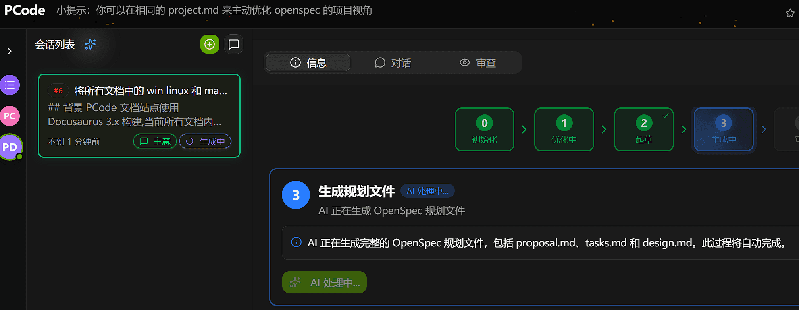
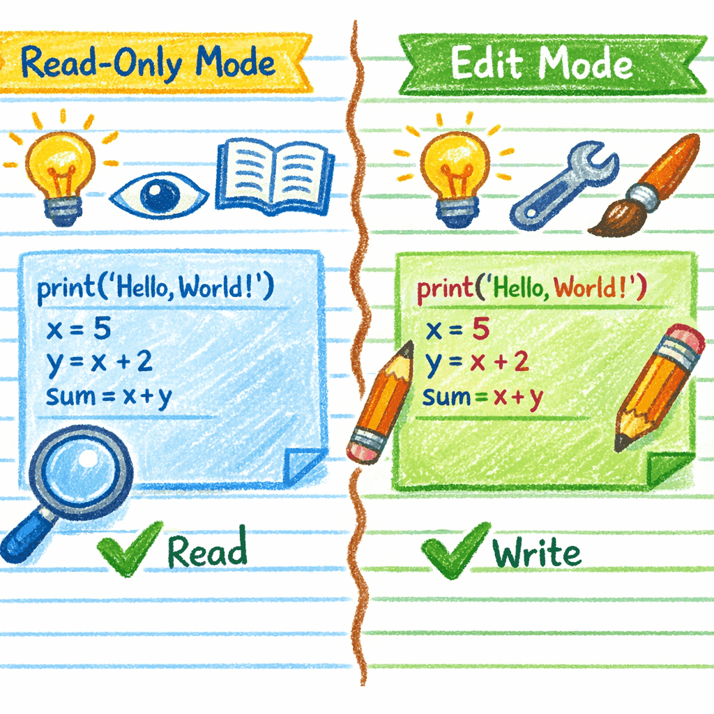
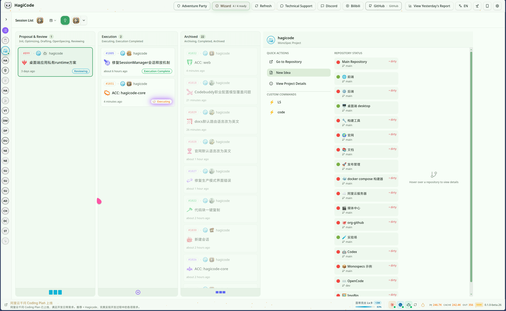
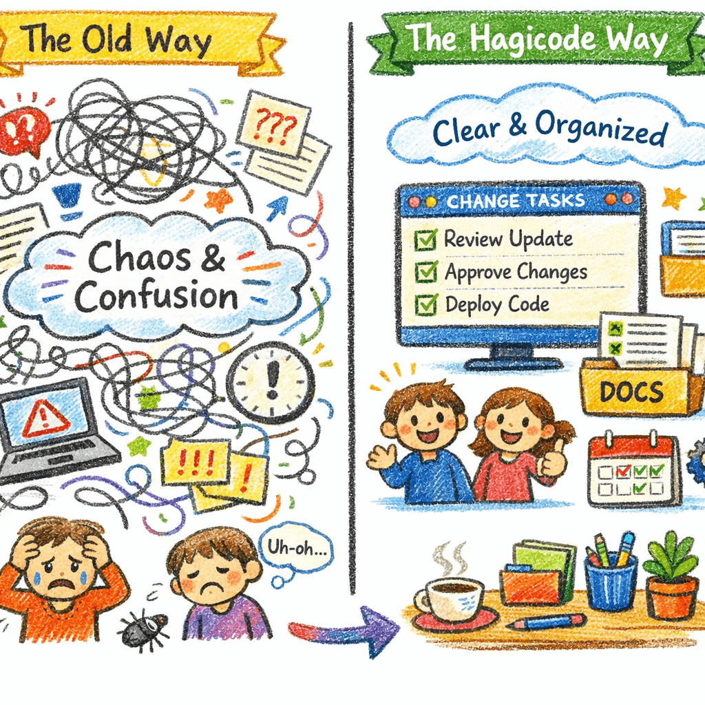
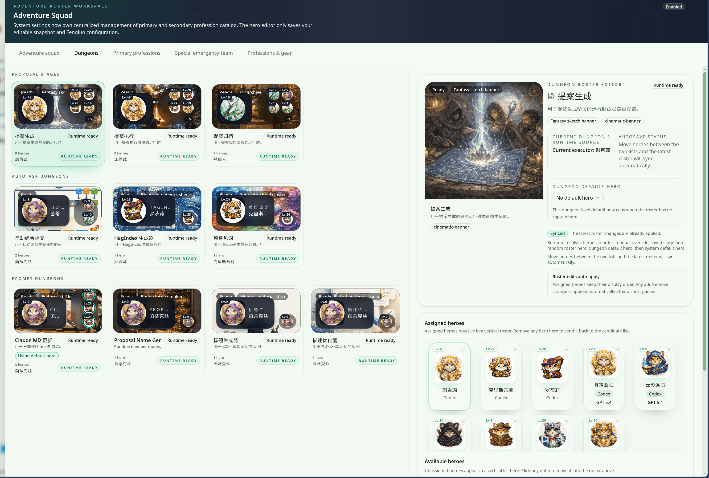

import { LinkCard, CardGrid } from '@astrojs/starlight/components';

If you only remember one sentence about **Hagicode**: it is an AI coding assistant built around real development workflows, helping teams understand code, plan changes, execute tasks, and retain knowledge.

Instead of listing every module, this page explains the product through three themes: **Smart, Efficient, and Fun**.

## What is Hagicode?

Hagicode is not just a tool for generating a few lines of code. It is a workspace for the broader development loop:

- **Understand codebases** before changing them
- **Turn ideas into structured changes** with proposals, tasks, and validation
- **Keep work traceable** so decisions can be reviewed and reused later
- **Connect to multiple AI tools** including Codex, Claude, OpenCode, and CodeBuddy

## Smart: understand first, then act

The “Smart” part of Hagicode is less about flashy demos and more about making AI useful in real projects.

> Align on goals, scope, and validation before implementation starts.

> In the current product, proposal work is already broken into visible planning stages so users can see what AI is doing.

### 1. Proposal-driven instead of blindly editing

For larger changes, Hagicode can turn an idea into a proposal before implementation starts. That gives you a shared view of:

- the goal
- the scope
- the task breakdown
- the validation criteria

This makes AI feel more like a planning partner than an auto-editor.

### 2. Read-only / edit dual mode

Sometimes you want analysis, not changes. Hagicode separates those two cases clearly:

- **Read-only mode** for exploring unfamiliar code, tracing bugs, and understanding architecture
- **Edit mode** for implementing features, fixing defects, and refactoring with intent

That boundary makes it easier to trust the workflow.

### 3. Project context matters

Hagicode focuses on project-level understanding instead of isolated code snippets:

- it looks at repository structure and existing patterns
- it supports multi-turn conversation, task tracking, and tool usage
- it works better as a long-running engineering partner

### 4. Team knowledge stays visible

Proposal and archive flows help preserve the reason behind a change, not just the final diff. That is especially useful when teams grow, hand off work, or revisit earlier decisions.

## Efficient: turn common actions into one smooth flow

The “Efficient” part of Hagicode is about reducing context switching and helping work move in a natural sequence.

> Understand first, then choose whether the AI should move into editing work.

> The current product already combines session progress, project status, and repository context into one board.

### 1. One workflow from understanding to delivery

A common workflow looks like this:

1. import or create a project
2. inspect the code in a read-only session
3. break the change down in a proposal session
4. switch to edit mode to implement
5. generate a better commit message with AI

That is simpler than spreading the same work across disconnected tools.

### 2. Monospec for multi-repository work

If your work spans more than one repository, Monospec gives you a unified view:

- coordinate multiple repositories in one place
- keep conventions aligned across repos
- give AI a wider context for cross-repo analysis

It is especially useful for microservices, multi-module products, and long-lived platform work.

### 3. AI Compose Commit for cleaner history

Good code changes still need clear commit history. Hagicode helps generate commit messages that are easier to read and easier to maintain:

- closer to Conventional Commits style
- clearer for reviewers and teammates
- more useful for release notes, rollback, and audits

### 4. Clear setup paths

Whether you prefer Desktop, Docker Compose, or a specific AI CLI stack, the docs aim to keep the setup path explicit so you can start faster with less guesswork.

## Fun: make progress and collaboration feel alive

The “Fun” part of Hagicode is not cosmetic. It gives daily collaboration more presence, feedback, and rhythm.

> Make complex delivery feel more visible, reviewable, and collaborative.

> The current product already includes an Adventure Squad roster editor, showing that the fun layer exists in the real workflow, not only in concept art.

### 1. Hero Dungeon as workflow expression

Hero Dungeon turns proposals, AutoTask runs, and prompt workbench activity into a more readable adventure-style loop:

- teams can see what is being pushed forward right now
- ownership and roles are easier to understand
- progress and results are easier to revisit

### 2. Achievements, reports, and feedback

Hagicode also makes the process itself more visible:

- progress is easier to notice
- daily work gains a stronger sense of cadence
- long-term usage feels more cumulative and rewarding

### 3. Fun should support delivery

These mechanics are meant to support coordination, not distract from it. The goal is to make teamwork more legible and more engaging while staying grounded in real execution.

## Who is Hagicode for?

| Role | What you get |
| --- | --- |
| New engineers | Faster onboarding into unfamiliar codebases |
| Developers | Less switching between analysis, implementation, and commit cleanup |
| Technical leads | Better control over complex changes and decision traceability |
| Multi-repo teams | A more unified way to coordinate work across repositories |

## Start here

### Quick start

<CardGrid>
  <LinkCard
    title="Wizard Setup"
    href="/en/quick-start/wizard-setup"
    description="The current canonical entry: finish first-project onboarding in the wizard and bind it to a real repository."
  />
  <LinkCard
    title="Create a Conversation Session"
    href="/en/quick-start/conversation-session"
    description="Try read-only and edit modes to see how AI fits into everyday development."
  />
  <LinkCard
    title="Create a Proposal Session"
    href="/en/quick-start/proposal-session"
    description="Turn vague ideas into an executable plan for larger or collaborative work."
  />
</CardGrid>

### Installation options

<CardGrid>
  <LinkCard
    title="Desktop"
    href="/en/installation/desktop"
    description="A guided desktop flow for users who want to get started quickly."
  />
  <LinkCard
    title="Docker Compose"
    href="/en/installation/docker-compose"
    description="A better fit for isolated environments, shared setups, or team deployment."
  />
</CardGrid>

### Explore key capabilities

<CardGrid>
  <LinkCard
    title="Monospec"
    href="/en/guides/monospecs"
    description="See how Hagicode approaches multi-repository collaboration."
  />
  <LinkCard
    title="AI Compose Commit"
    href="/en/guides/ai-compose-commit"
    description="Learn how AI can help produce cleaner, more useful commit messages."
  />
  <LinkCard
    title="Adventure Team"
    href="/en/adventure-team-introduction"
    description="See how Hero Dungeon roles and collaboration loops are presented."
  />
  <LinkCard
    title="Initialization Wizard"
    href="/en/guides/initialization-wizard"
    description="Review the first-run flow and the main setup decisions in the product."
  />
</CardGrid>

---

If you want to go deeper, the easiest path is: quick start first, then read the guide for the specific capability you plan to use next.
