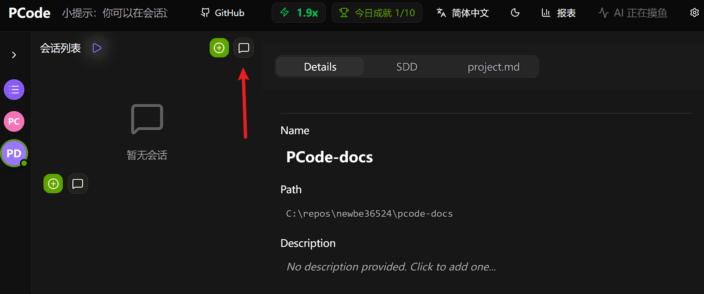
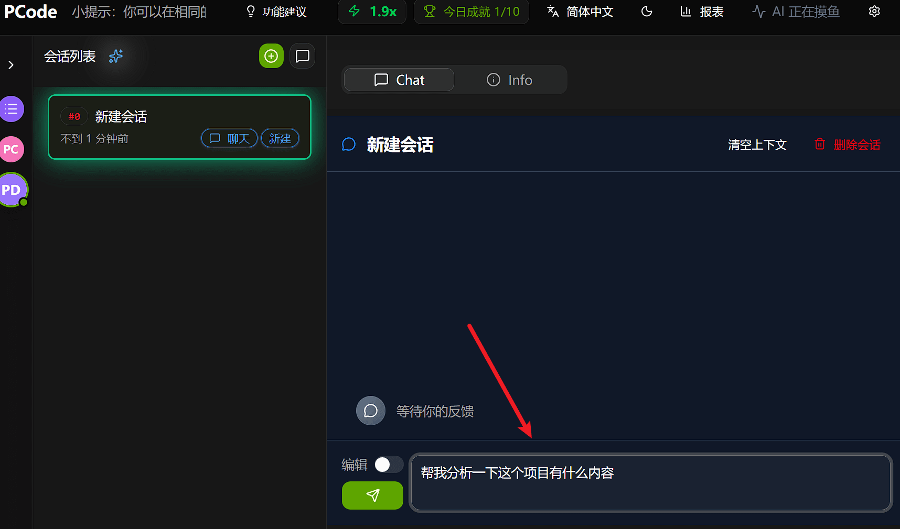
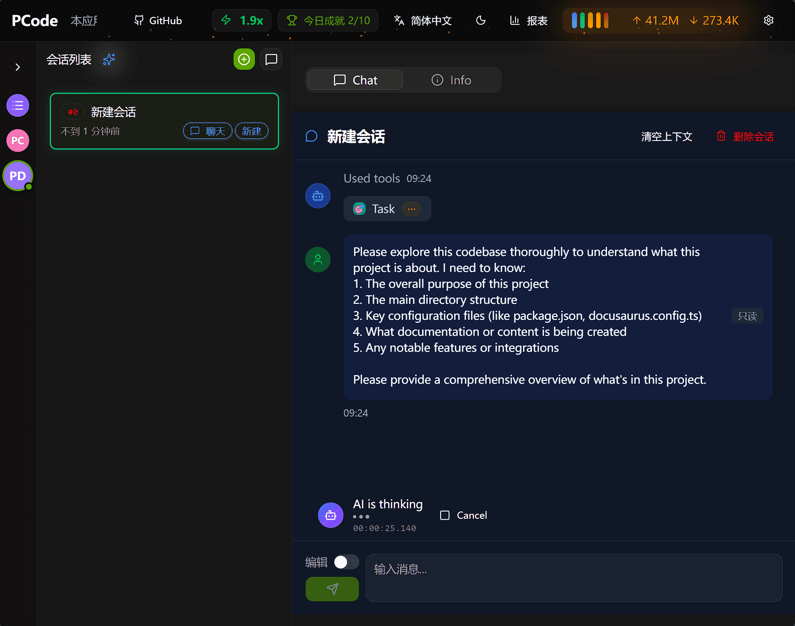
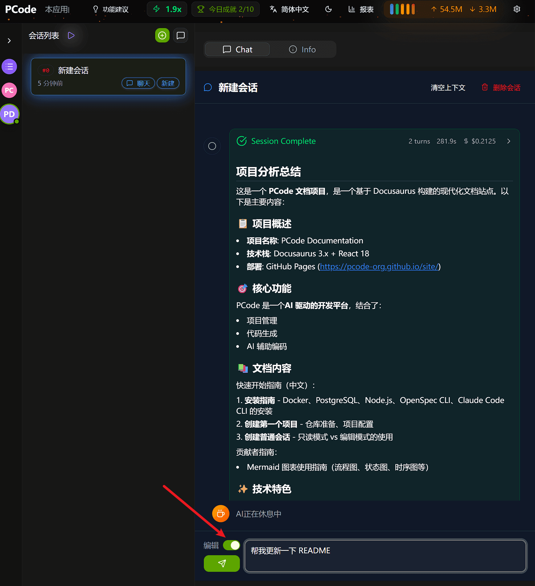
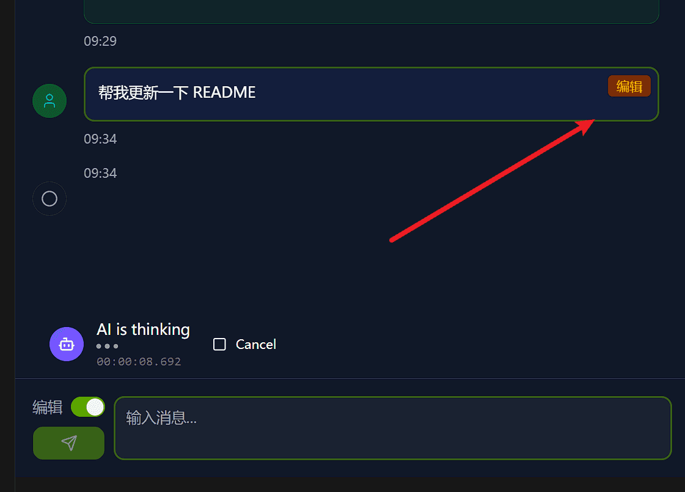
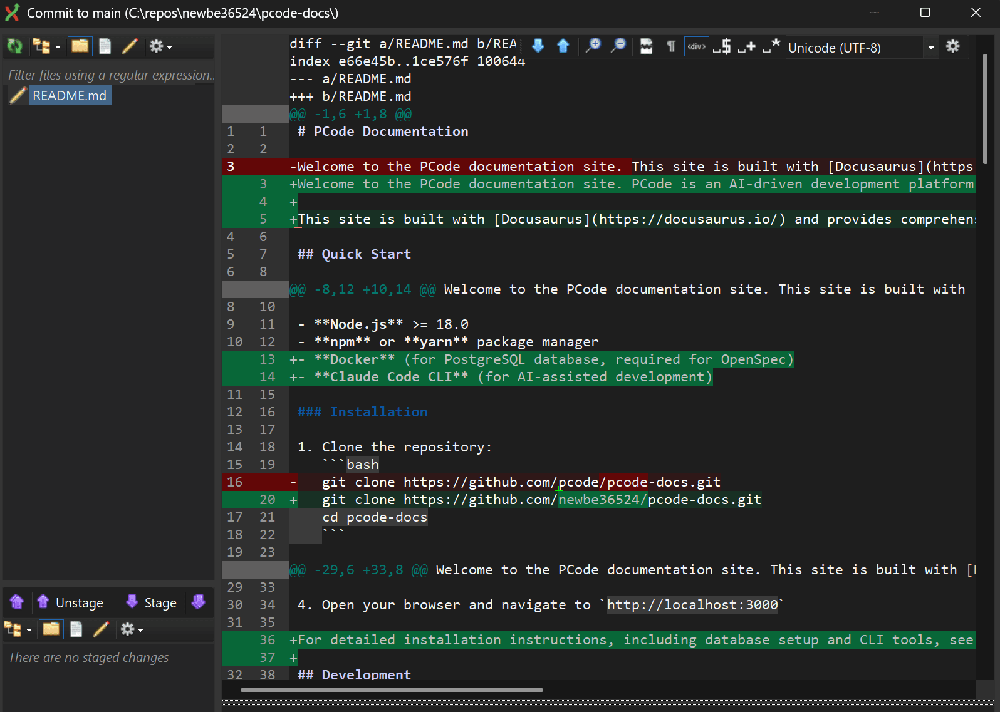
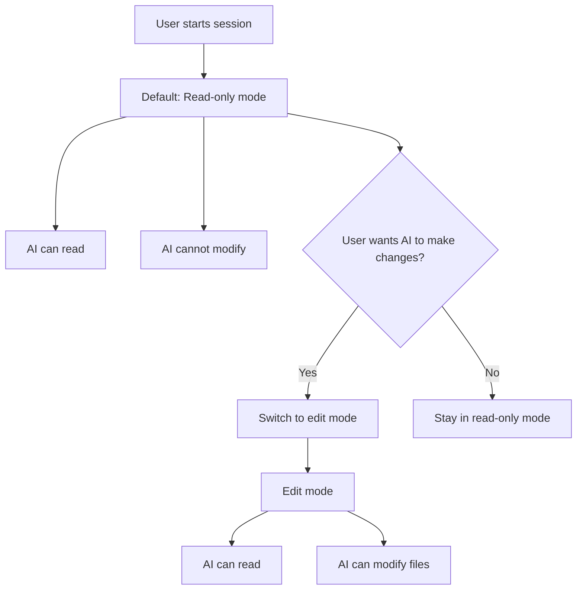
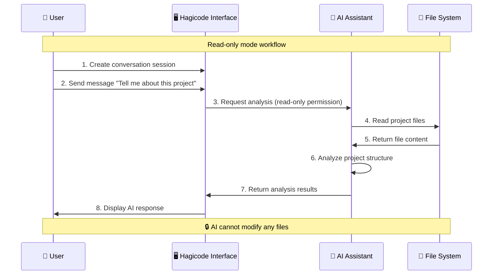
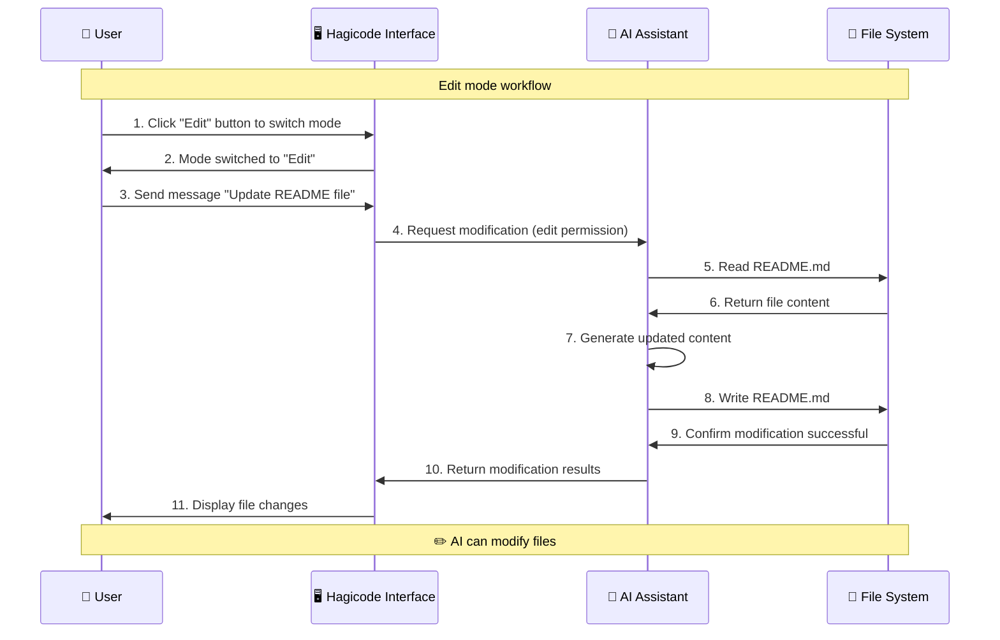
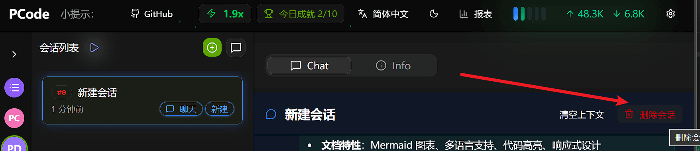

Ready to chat with AI? This guide will show you how to create and use conversation sessions in Hagicode. Conversation sessions are your primary way to interact with AI for code analysis, review, planning, and modification—just as natural as talking with an experienced colleague.

## Prerequisites

Before creating a conversation session, make sure you have:

- Created a project (see [Create Your First Project](/en/quick-start/create-first-project))

## Session Types in Hagicode

Hagicode supports two session types, each designed for different workflows:

### Conversation Session (This Guide)

Conversation sessions are traditional chat-style interactions with AI. They are suitable for:

- Asking questions about the codebase
- Getting code explanations and summaries
- Planning and designing implementations
- Code review and feedback
- Making code modifications in edit mode

### Proposal Session

Proposal sessions (introduced in the next guide) provide a structured workflow for transforming ideas into executed changes. They include planning, breakdown, and execution phases.

## Create Conversation Session

Follow these steps to create a new conversation session:

### Step 1: Click "Add Chat" Button

At the top of the session list on the left side of the Hagicode interface, click the **+ Add Chat** button. This will directly create a new conversation session.



### Step 2: Start Chatting

After creating a conversation session, you can start vibeCoding with AI by entering messages in the input box under the Chat tab.



## Understanding Modes

Hagicode conversation sessions operate in two different modes with different capabilities and security implications.

### Read-only Mode (Default)

When you create a new conversation session, it starts in **read-only mode**. This is the safest mode for exploring and understanding the codebase.

:::tip[Read-only mode is the default mode]
Newly created conversation sessions default to read-only mode, which means AI can read and analyze your code but cannot make any modifications.
:::

#### Read-only Mode Demo

Let's understand how read-only mode works through a practical example. Suppose you want to understand the project structure:

1. **Send read-only message**: Enter "Tell me about this project" in the chat input box
2. **AI analyzes project**: AI will read project files and analyze the structure
3. **View analysis results**: AI returns a detailed description of the project structure



In read-only mode, AI will analyze your project and return structured information:


**What AI can do in read-only mode:**

- Read and analyze files in the project
- Answer questions about code structure and logic
- Provide explanations and summaries
- Review code and provide improvement suggestions
- Plan implementation methods

**What AI cannot do in read-only mode:**

- Modify any files
- Create new files
- Delete existing files
- Run commands that change the project

### Edit Mode

**Edit mode** grants AI permission to modify files in the project. You must manually enable this mode when you want AI to make changes.

:::caution[Security Warning]
Edit mode allows AI to modify your files. Only enable this mode when you trust AI's suggestions and want to apply changes to the codebase.
:::

#### How to Switch to Edit Mode

Conversation sessions default to read-only mode, and you can switch to edit mode at any time:

1. Find the **mode switch button** in the conversation window (usually near the input box)
2. Click the button to switch from "read-only" mode to "edit" mode
3. The mode indicator will update to show that edit mode is activated



#### Edit Mode Demo

Let's understand how edit mode works through a practical example. Suppose you want AI to update the README file:

1. **Switch to edit mode**: Click the edit button to enable edit permissions
2. **Send edit request**: Enter "Update README file" or specific modification requirements
3. **AI executes modification**: AI will read the file, apply changes, and save
4. **View file changes**: AI returns modification results, and you can view specific changes



In edit mode, AI will directly modify your files. You can see specific change content:



**When to use edit mode:**

- You want AI to implement a feature
- You need to apply a bug fix
- You want to perform refactoring
- You need to create new files

### Mode Switching Flow

Here's a comparison between read-only mode and edit mode:

| Feature | Read-only Mode | Edit Mode |
|---------|----------------|-----------|
| **Icon** | 🔒 Read-only | ✏️ Edit |
| **Default State** | ✅ Yes | ❌ No |
| **Read Files** | ✅ Supports | ✅ Supports |
| **Analyze Code** | ✅ Supports | ✅ Supports |
| **Modify Files** | ❌ Not supported | ✅ Supports |
| **Create Files** | ❌ Not supported | ✅ Supports |
| **Delete Files** | ❌ Not supported | ✅ Supports |
| **Security** | 🔒 Safe | ⚠️ Use with caution |
| **Use Cases** | Understanding code, review, planning | Implementing features, fixing bugs |



#### Read-only Mode Workflow



#### Edit Mode Workflow



## Typical Usage Scenarios

### Analysis and Understanding

Use conversation sessions in read-only mode to understand your codebase. For example, you can ask AI "Tell me about this project", as shown in the previous [Read-only Mode Demo](#read-only-mode-demo):

- **Project summary**: "Give me an overview of this project's architecture"
- **Code explanation**: "Explain how the authentication system works"
- **Architecture questions**: "What design patterns are used in this codebase?"

Example:
```
User: Can you explain how the user service handles registration?

AI: The user service handles registration through a multi-step process...
[Detailed explanation of registration process]
```

### Review and Feedback

Get AI feedback about your code in read-only mode:

- **Code review**: "Review this function for potential issues"
- **Best practices**: "Does this code follow best practices?"
- **Bug discovery**: "Are there any bugs in this implementation?"

Example:
```
User: Review the UserService.cs file for potential issues

AI: I have reviewed UserService.cs and found several areas for improvement...
[List specific issues and suggestions]
```

### Planning and Design

Use sessions to plan your work before implementation:

- **Task breakdown**: "Break down the implementation of a new feature"
- **Implementation planning**: "What's the best way to add caching?"
- **Design discussion**: "Should I use factory pattern or builder pattern here?"

Example:
```
User: I need to add file upload functionality. Can you help me plan?

AI: Here's a suggested approach for implementing file upload...
[Step-by-step implementation plan]
```

### Code Changes (Edit Mode)

When you're ready to make changes, switch to edit mode. Refer to the previous [Edit Mode Demo](#edit-mode-demo) to understand how to make file modifications:

- **Refactoring**: "Refactor this class to use dependency injection"
- **Bug fixing**: "Fix null reference exception in this method"
- **Feature implementation**: "Implement user profile update endpoint"

Example:
```
User: [Switch to edit mode] Please add input validation to the CreateUser method

AI: I will add validation to the CreateUser method...
[Apply changes to files]
```

## Session Management

### Delete Session

When you no longer need a session, you can delete it to keep the session list clean:

1. Find the session you want to delete in the session list
2. Click the **Delete** button in the upper right corner of the session (usually a trash icon)
3. Confirm the deletion



:::tip[Impact of deleting a session]
Deleting a session only deletes the chat history of that session and does not affect your project files or code.
:::

## Next Steps

Now that you understand conversation sessions, continue exploring:

import { LinkCard, CardGrid } from '@astrojs/starlight/components';

<CardGrid>

<LinkCard title="Create Your First Project" href="/en/quick-start/create-first-project"
    description="Set up your first project and understand the basic concepts and configuration of Hagicode projects."
/>

<LinkCard title="Create Proposal Session" href="/en/quick-start/proposal-session"
    description="Learn about the proposal-driven development workflow, transforming abstract ideas into structured implementation plans."
/>

</CardGrid>

## Tips for Effective Conversations

1. **Be specific**: Clear questions lead to better answers
   - *Good*: "How does the authentication middleware validate tokens?"
   - *Vague*: "How does authentication work?"

2. **Provide context**: Reference specific files or components
   - *Good*: "In UserService.cs line 45, why is the user checked twice?"
   - *Vague*: "Why is there a duplicate check?"

3. **Start in read-only mode**: Explore and understand before making changes

4. **Use edit mode intentionally**: Only switch when you're ready to apply changes

5. **Iterate**: Use conversation history to refine your understanding and approach
