Have a great idea but don't know how to implement it? Proposal sessions are here to help! This guide will show you how to use proposal sessions (also known as idea sessions) to transform abstract ideas into executable code through OpenSpec's structured workflow.

## Prerequisites

Before using proposal sessions, make sure you have:

- Created a project and initialized OpenSpec (see [Create Your First Project](/en/quick-start/create-first-project))
- Basic understanding of conversation sessions (see [Create Conversation Session](/en/quick-start/conversation-session))

## What is a Proposal Session?

A proposal session is a structured workflow that guides you through the process of transforming abstract ideas into executed code.

### Proposal Session vs. Conversation Session

Understanding the differences between them is crucial when choosing which session type to use:

| Feature | Conversation Session | Proposal Session |
|----------|----------------------|------------------|
| **Working Method** | Free conversation, ask and answer | Structured 9-stage lifecycle |
| **Use Cases** | Quick consultation, code explanation, simple modifications | Complex feature development, architecture design, multi-file changes |
| **Planning Level** | Minimal planning, direct execution | Complete proposals, tasks, design documents |
| **Review Process** | No formal review process | Three-tier annotation system (inline, file, global) |
| **Iterative Optimization** | Relies on you actively suggesting improvements | AI automatically optimizes descriptions, supports multi-round annotation adjustments |
| **Traceability** | Only retains conversation history | Generates complete OpenSpec documents (proposals, tasks, specifications) |
| **History Utilization** | Cannot effectively utilize historical experience | Uses "memory fragments" system, continuously learns and improves |
| **Code Quality** | Depends on single conversation quality | Higher quality through planning, review, and iteration |
| **Team Collaboration** | Difficult to share and collaborate | Planning documents can be shared, facilitating team review |

### Why Are Proposal Sessions So Important?

**1. Structured Thinking, Avoid Omissions**

Proposal sessions force you to think through 9 stages:
- ✅ What exactly do I want to implement? (Stage 0-1: Clarify requirements)
- ✅ How to implement? (Stage 3: Generate detailed planning)
- ✅ Is the planning reasonable? (Stage 4: Review and annotate)
- ✅ Are you satisfied with the results? (Stage 6: Verify and adjust)

**2. Multi-round Optimization, Continuous Improvement**

Unlike the "one-time output" of conversation sessions, proposal sessions support:
- 🔄 AI automatically optimizes your vague descriptions
- 🔄 Precisely adjust planning through three-tier annotation system
- 🔄 Can continue optimizing in edit mode after execution
- 🔄 Multiple iterations until completely satisfied

**3. Memory Fragments, Get Smarter with Use**

After each proposal is archived, OpenSpec saves:
- 📦 Proposal document (what you want to implement)
- 📦 Task list (steps for implementation)
- 📦 Design document (why design this way)
- 📦 Specification files (technical specifications and constraints)

**Next time when proposing, AI will:**
- 🧠 Reference historical architecture decisions, maintain consistency
- 🧠 Reuse existing code patterns and specifications
- 🧠 Avoid re-implementing existing functionality
- 🧠 Understand the project's technical debt and design trade-offs

**4. Team Collaboration, Knowledge Inheritance**

Generated OpenSpec documents can:
- 👥 Serve as reference descriptions for Pull Requests
- 👥 Help new members understand architecture decisions
- 👥 Record the thinking process of "why implement this way"
- 👥 Form the project's technical knowledge base

### When to Use Proposal Sessions?

**✅ Recommended scenarios for using proposal sessions:**
- Need to create new functional modules
- Systematic changes involving multiple files
- Need architecture design and technology selection
- Want to retain detailed design documents
- Team projects, need traceable change records
- Implementation of complex business logic

**❌ Recommended scenarios for using conversation sessions:**
- Simple code question consultation
- Single-file bug fixes
- Quick code explanation or learning
- Temporary code snippet generation

### The 9-Stage Lifecycle of Proposal Sessions

Proposal sessions follow the defined 9-stage lifecycle:

- **Stage 0**: Initialization - Define your idea
- **Stage 1**: Optimizing - AI refines your description
- **Stage 2**: Draft - Review and manual editing
- **Stage 3**: Generating - AI creates detailed planning
- **Stage 4**: Reviewing - Annotate and approve changes
- **Stage 5**: Executing - AI implements changes
- **Stage 6**: Execution Complete - Verify in IDE
- **Stage 7**: Archiving - Finalize proposal
- **Stage 8**: Archived - Lifecycle complete

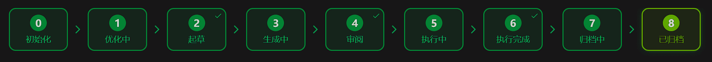

## Stage 0: Initialization

The first step is to create a new idea and provide an initial description.

### Create New Idea

1. On the session list dashboard, click the **+ New Idea** button

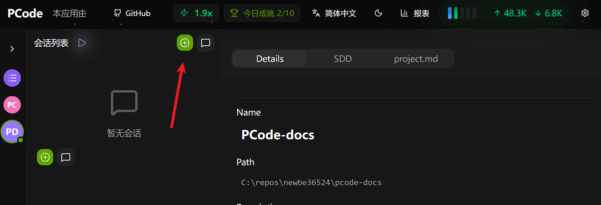

2. Enter the proposal title
3. Describe what you want to accomplish

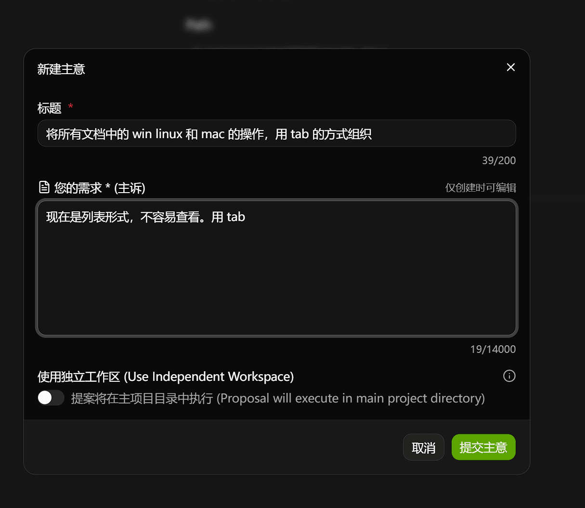

### Tips for Writing Good Initial Descriptions

- **Keep it simple**: Ideas don't need detailed planning, just describe the problem in simple language
- **Colloquial expression**: Just talk directly about your needs like talking to a developer
- **Focus on problems**: Explain the problems you encounter or want to improve
- **Don't worry about details**: AI will automatically optimize the description based on the actual project situation in subsequent stages

**Example** (as shown in the screenshot):
```
Use list format instead of commas, easier to view, please use tabs
```

Such a simple description is sufficient! AI will automatically optimize it into a complete technical proposal.

## Stage 1: Optimizing (AI Automatic)

After submitting the idea, AI will automatically process and refine it.

### What Happens During Optimization

AI analyzes your description and:

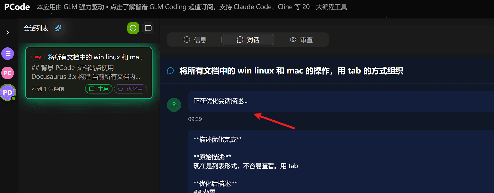

- **Clarify vague requirements**
- **Suggest appropriate technologies**
- **Identify potential edge cases**
- **Generate proposal name**

### No User Action Required

This stage is fully automated. You will see a loading indicator while AI is working.

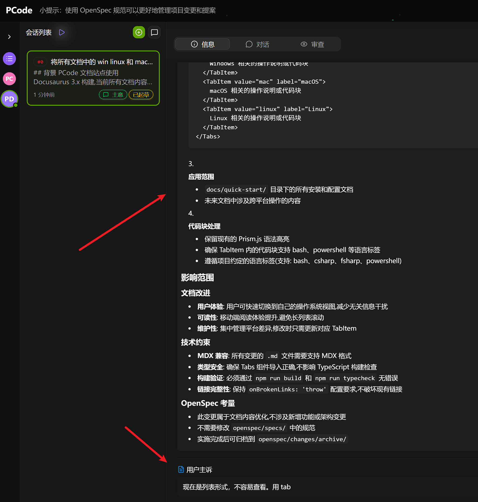

- Generated proposal name
- Refined description with additional details
- Identified scope and boundaries

## Stage 2: Draft (User Manual)

Now you have the opportunity to review the proposal before planning begins.

You can click on the description content to edit, or directly click "Generate Plan" to continue to the next step.

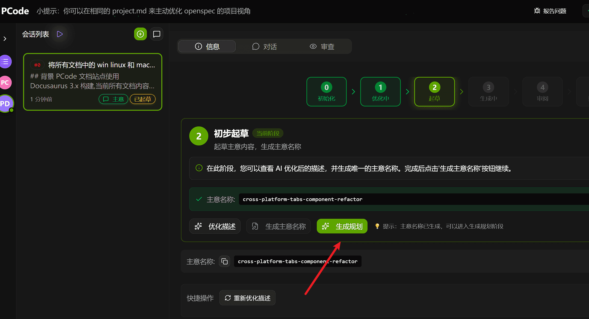

## Stage 3: Generating (AI Automatic)

After approving the draft, AI will automatically generate detailed implementation planning.

### Plan Generation Process

After clicking the **Generate Plan** button, the system will show the automatically generated status:


You can view the generation progress in real-time in the conversation tab:

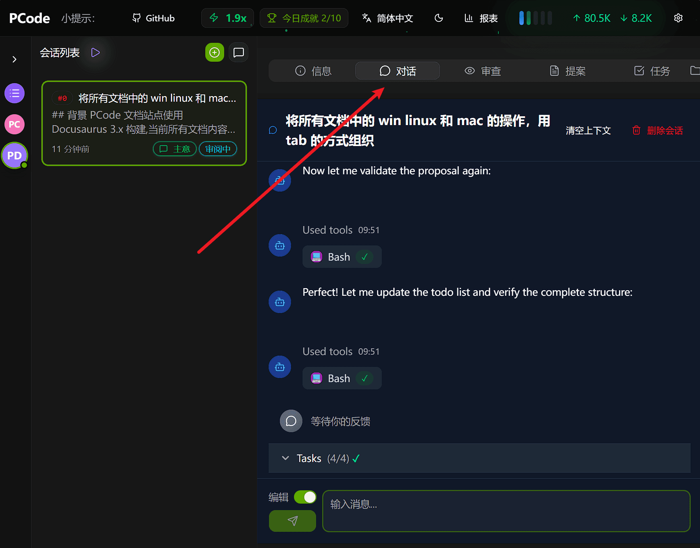

### Generated Document Types

AI creates multiple documents:

| Document | Type | Description |
|----------|------|-------------|
| **Proposal** | Main | Describes the functionality and goals to be implemented |
| **Tasks** | Main | Specific implementation task list |
| **Design** | Optional | Architecture design document (if needed) |
| **Specification** | Reference | OpenSpec-related specification files, saved as memory fragments |

**Annotation focus**: You usually only need to annotate the **Proposal**, **Tasks**, and **Design** sections. The specification files (specs) section usually doesn't need attention.

## Stage 4: Reviewing (User Manual)

This is the most critical stage, where you review, annotate, and approve the implementation plan.

### Current Stage Display:

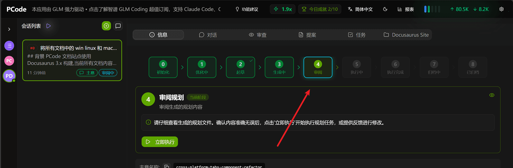

You can click on the tabs to view the generated files and make annotations:

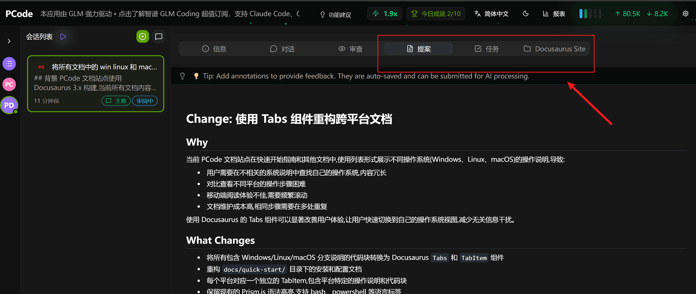

### Three-tier Annotation System

Hagicode provides three levels of annotations to provide feedback.

### 1. Inline Annotations

Highlight specific text and add comments:

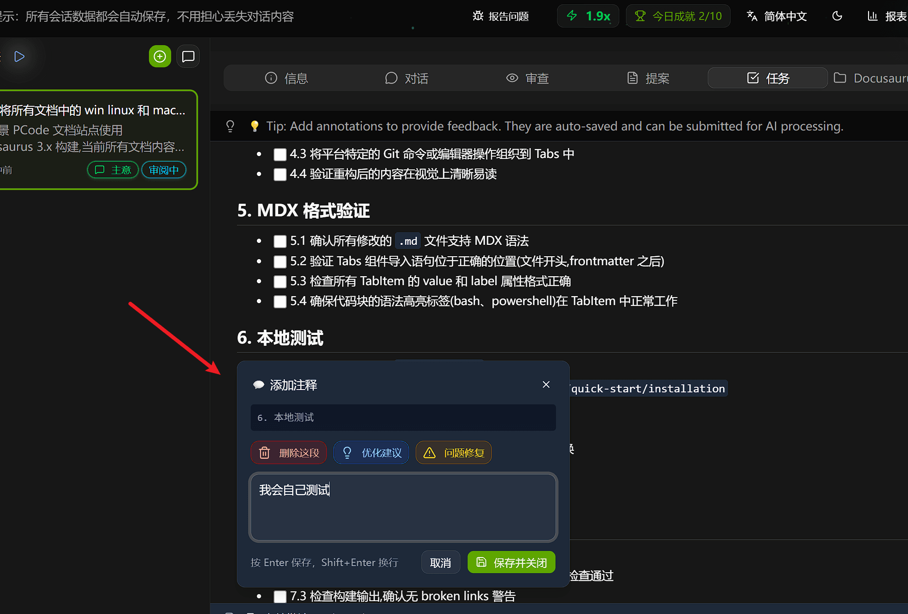

### 2. File Annotations

Add feedback at the document level:

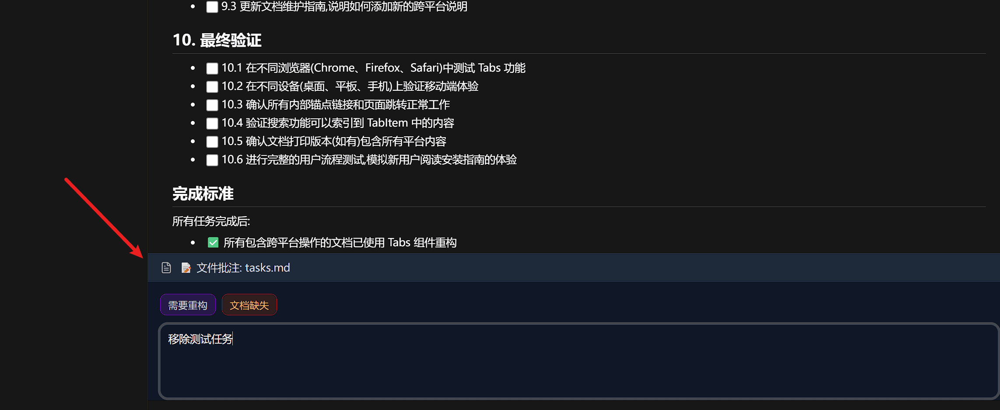

After adding annotations, you can click the button in the upper right corner or directly click the "Review" tab to view and submit all annotations:

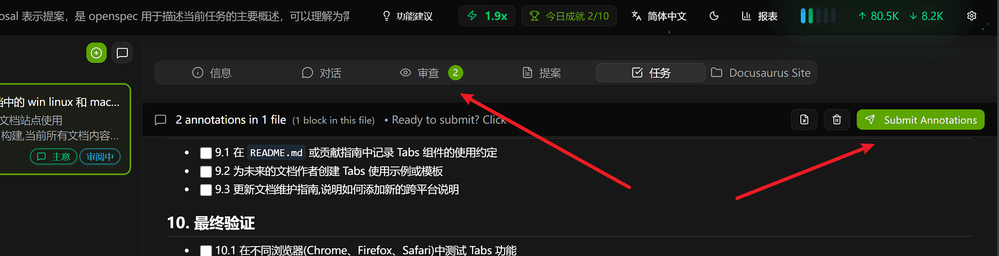

### 3. Global Annotations

Provide overall feedback for the proposal:

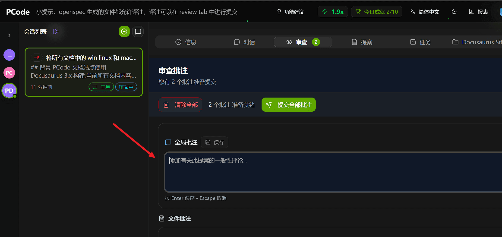

**Note**: Global annotations need to click the "Save" button to take effect.

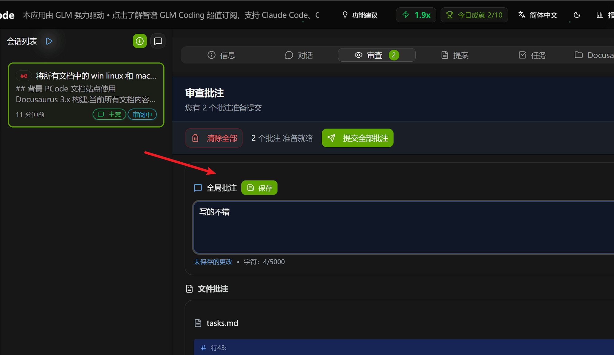

### Submit Annotations

After confirming annotations, you can click the submit all annotations button, and AI will modify the plan based on your annotations:

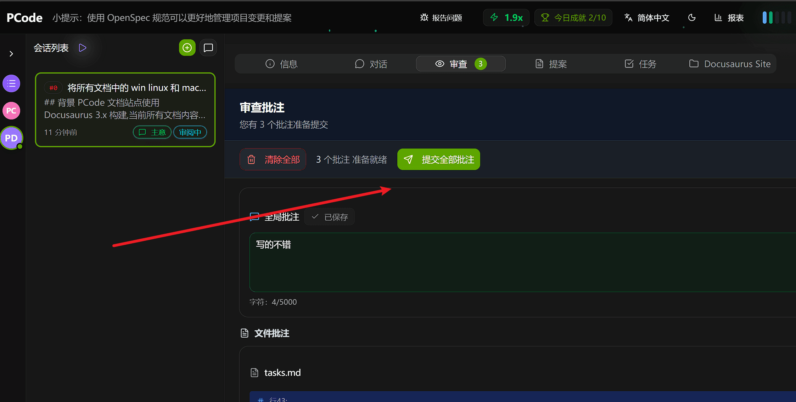

You can view the process of AI processing annotations in the conversation tab:

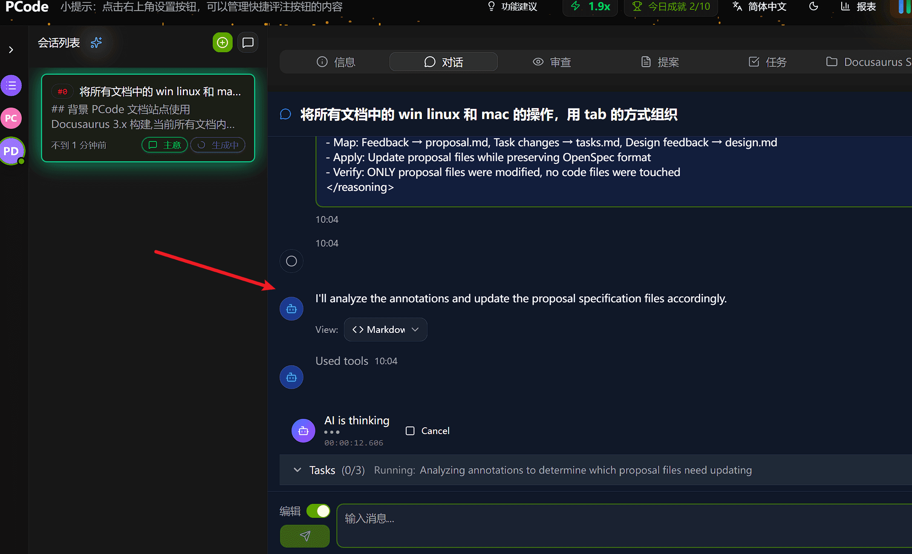

### Annotation Loop

Annotation is an iterative process. You can continuously add annotations, submit, wait for AI to process, and then review the updated plan until satisfied:

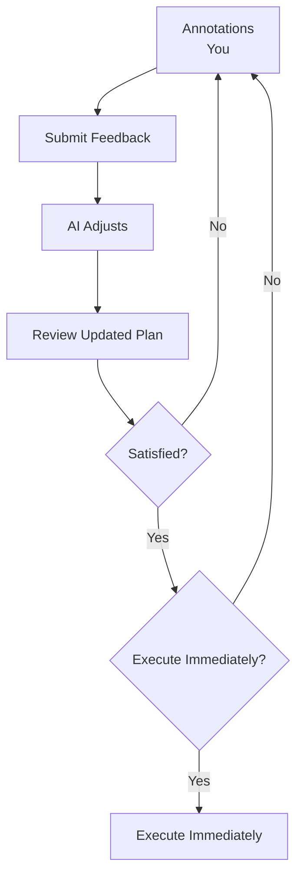
```mermaid
flowchart TD
    A[Annotations<br/>You] --> B[Submit Feedback]
    B --> C[AI Adjusts]
    C --> D[Review Updated Plan]
    D --> E{Satisfied?}
    E -->|No| A
    E -->|Yes| F{Execute Immediately?}
    F -->|Yes| G[Execute Immediately]
    F -->|No| A
```

### Approve Execution

When satisfied with the plan:
1. Ensure all key feedback has been addressed
2. Click **Approve and Execute**
3. Proposal enters execution stage

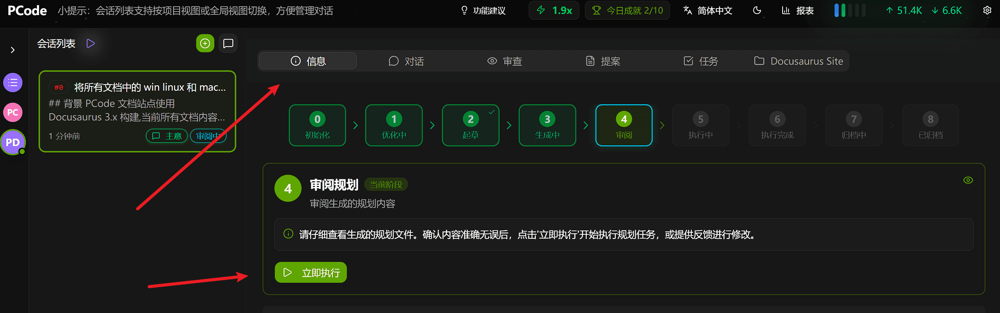

## Stage 5: Executing (AI Automatic)

AI is now automatically implementing the approved plan.

### Execution Status

Execution panel display effect:

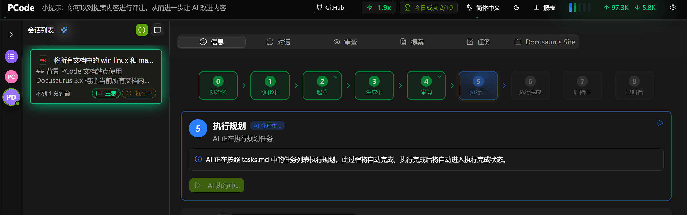

### What Happens During Execution

AI:
- Creates new files according to specifications
- Modifies existing files to make changes
- Follows implementation plan step by step
- Shows progress for each operation

### Execution Complete

After execution is complete, you will see:
- Summary of created/modified files
- Any warnings or issues encountered
- Links to view changes

## Stage 6: Execution Complete

AI has completed implementation. Now it's time to verify the changes.

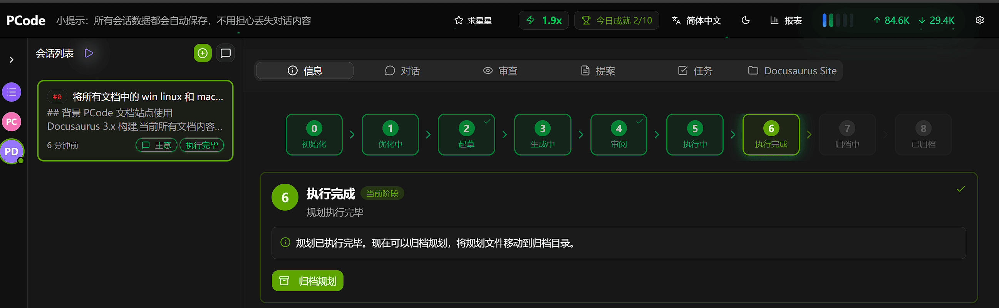

### Review in IDE

Open the project in your preferred IDE for review.


### Edit Mode Conversation

Stage 6 enables a special edit mode conversation for post-execution adjustments.

If you are not satisfied with the execution results, you can explain to AI in the conversation in edit mode what needs to be adjusted. AI will continue to complete edits until the adjustment results meet your requirements. You can perform multiple rounds of adjustments until completely satisfied:

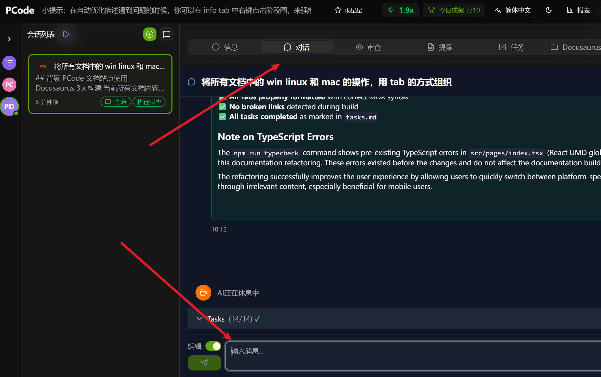

### Verification Checklist

Before continuing:
- [ ] Review all file changes in IDE
- [ ] Test new functionality locally
- [ ] Run any existing tests
- [ ] Request any final adjustments through edit mode
- [ ] Ensure compliance with code quality standards

## Stage 7: Archiving (AI Automatic)

After being satisfied with the implementation, AI will archive the proposal.

### Click "Archive Plan"

Clicking the **Archive Plan** button completes:

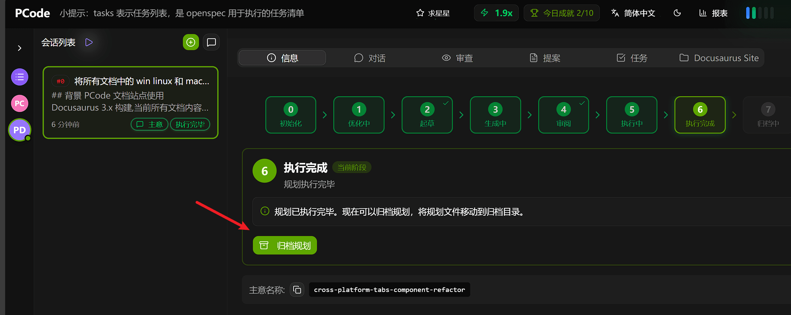

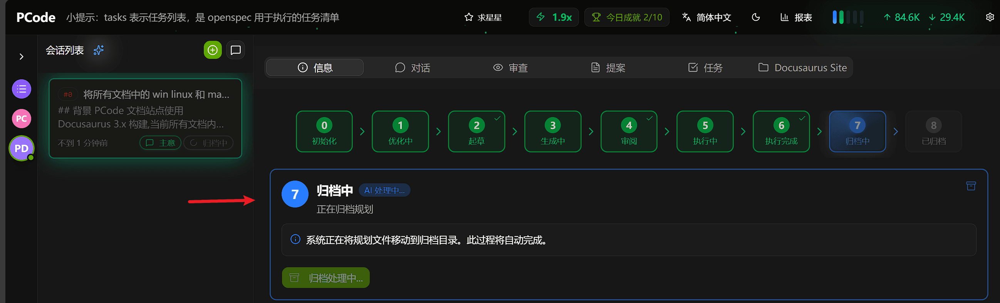

### What Happens During Archiving

AI:
- Marks the proposal as complete
- Creates change summary
- Generates commit message suggestions
- Moves proposal to archive

:::note[No code commit]
Archiving does not automatically commit code to your repository. You should review changes and commit manually using git.
:::

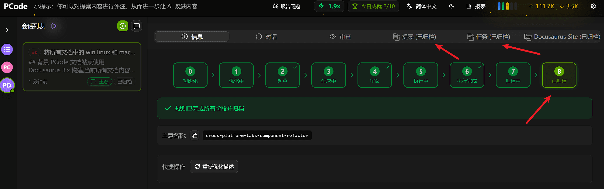

## Stage 8: Archived

The proposal lifecycle is complete. The proposal is now in the archive.

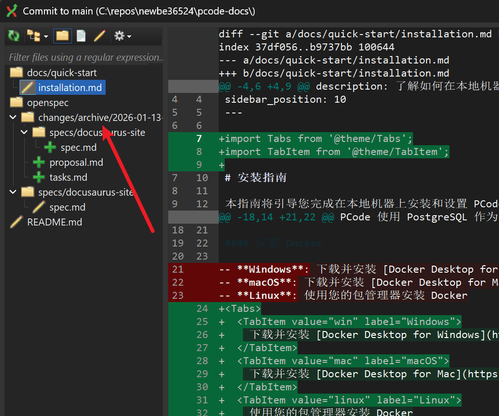

### Commit Your Changes

Remember to commit the implemented changes and archived planning files:

:::重要提示
**Commit Archived Planning Files**

Besides code changes, you should also commit the archived planning files to your Git repository. These files include:
- Proposal (proposal.md)
- Tasks (tasks.md)
- Design (design.md, if any)
- Specification files (specs/)

**Why commit planning files?**

OpenSpec uses archived proposals and specification files as "memory fragments" to reference these historical records in subsequent proposals and implementations. This way:
1. ✅ AI can understand the project's architecture decisions and historical changes
2. ✅ Maintain consistency in code style and patterns
3. ✅ Avoid re-implementing existing functionality
4. ✅ Each proposal's results will get better and better

Even if not committing to a central repository, at least ensure these files are kept locally so OpenSpec can continuously learn and improve.
:::

```bash
cd /path/to/your/project
# Add code changes and planning files
git add .
git commit -m "Add JWT authentication system"

- Implemented AuthService with JWT token generation
- Added JWT middleware for route protection
- Created authentication endpoints (register, login, logout)
- Integrated bcrypt for password hashing
- Archived proposal planning: openspec/changes/add-jwt-auth/"
```

## Status Reference

| Stage | Name | Type | Description |
|---------|------|------|-------------|
| 0 | Initialization | User | Create new idea with title and description |
| 1 | Optimizing | AI | AI refines description and generates name |
| 2 | Draft | User | Review and manually edit proposal |
| 3 | Generating | AI | AI creates detailed implementation planning |
| 4 | Reviewing | User | Annotate plan and approve execution |
| 5 | Executing | AI | AI implements approved changes |
| 6 | Execution Complete | User | Verify changes and make adjustments |
| 7 | Archiving | AI | AI completes and archives proposal |
| 8 | Archived | - | Proposal lifecycle complete |

## Reference Resources

Learn more about OpenSpec:

- **OpenSpec Specifications**: Understand how OpenSpec works and best practices
- **OpenSpec Document Structure**: Learn how to organize and manage proposal, task, and specification files
- **OpenSpec Memory Fragments System**: Deep dive into how to use historical proposals to improve future development
