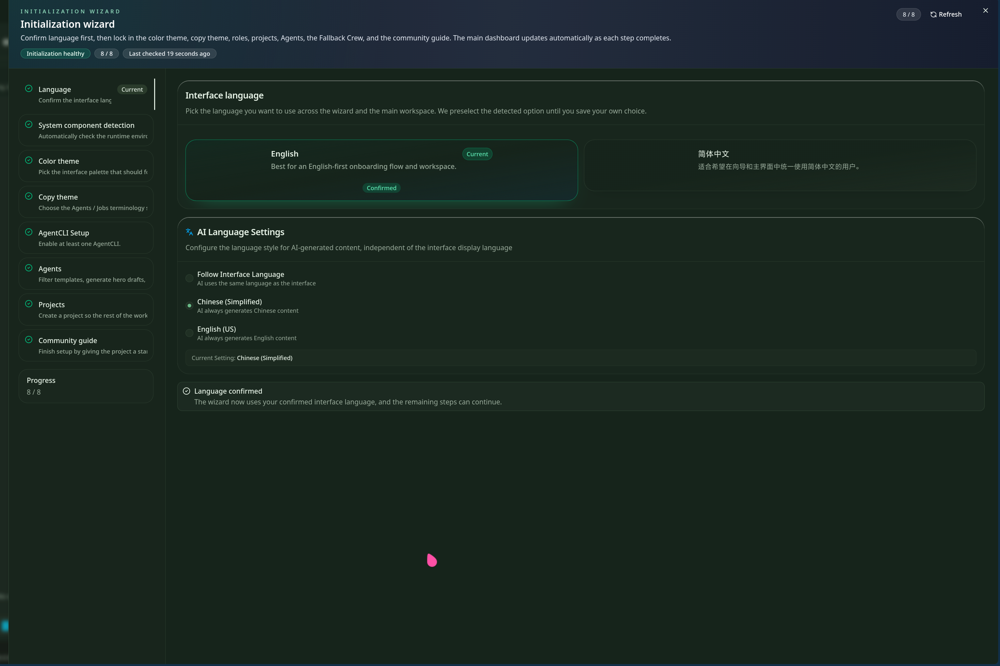
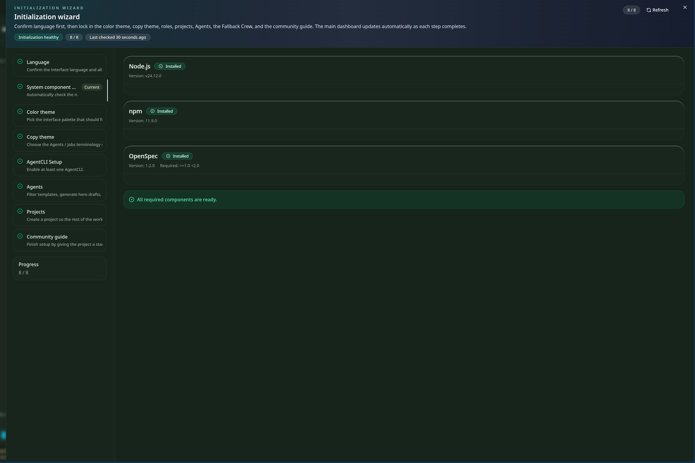
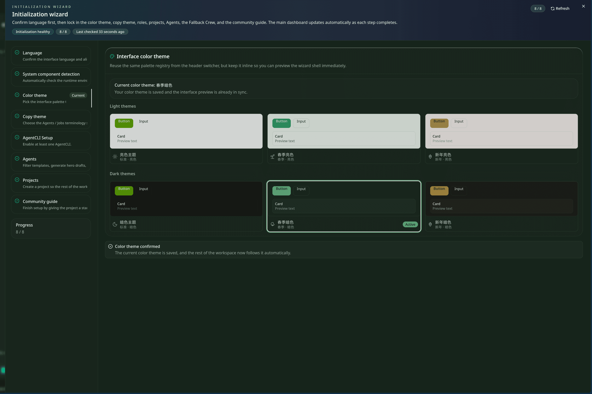
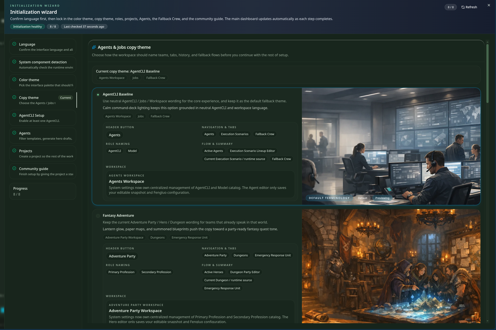
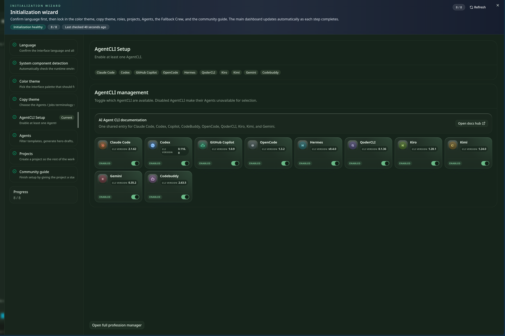
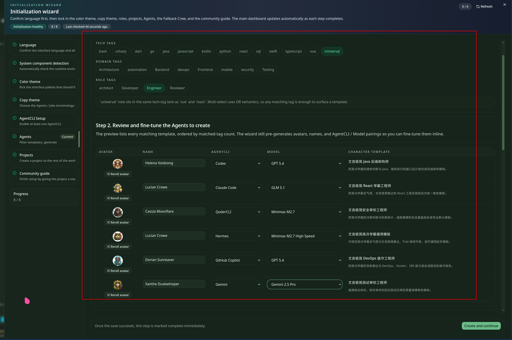
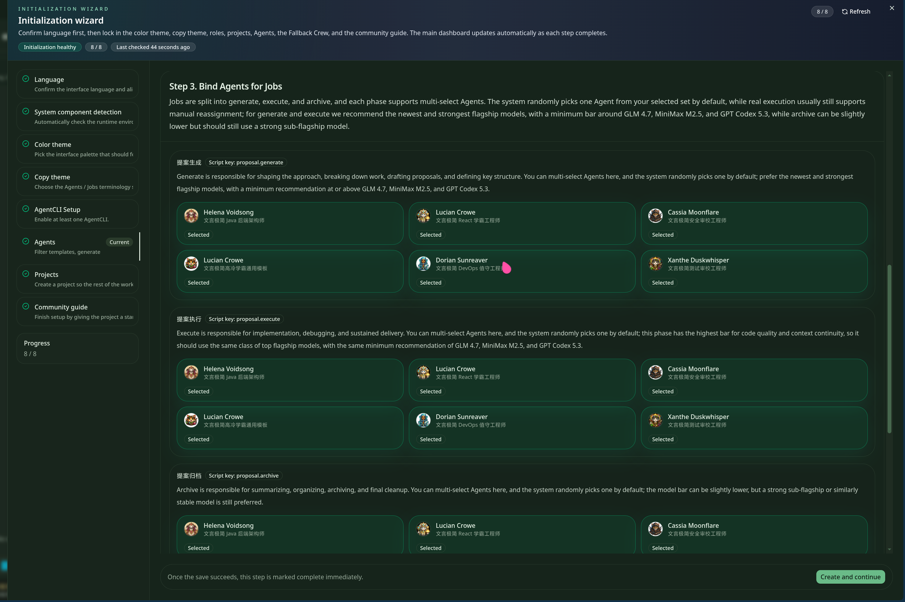
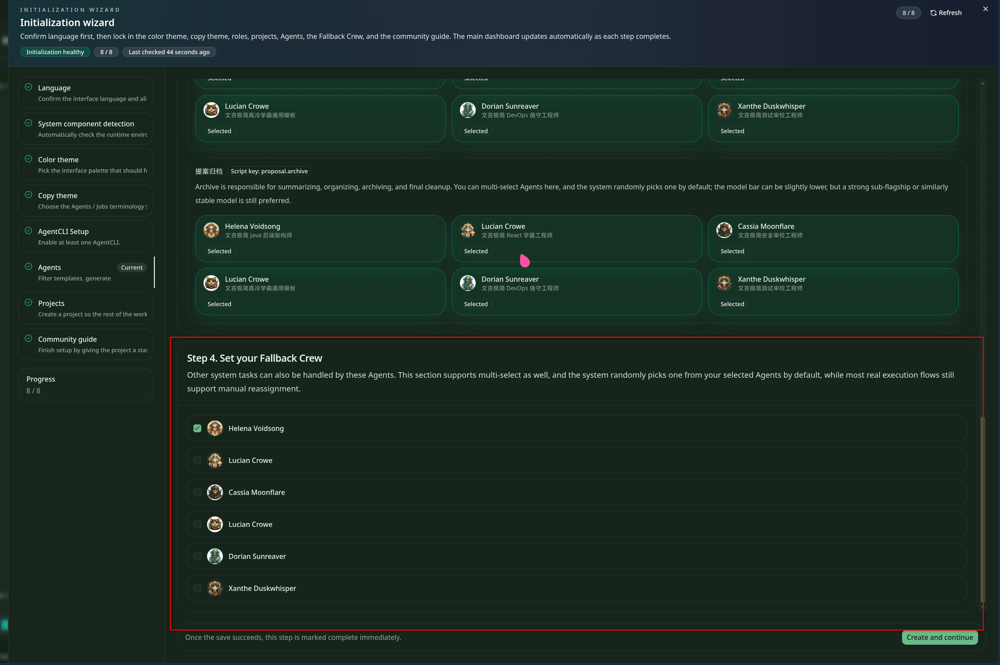
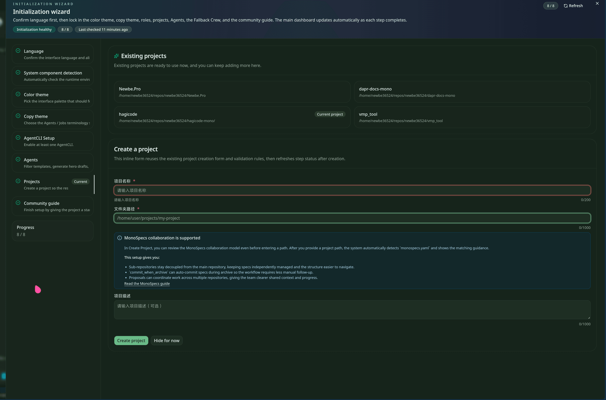
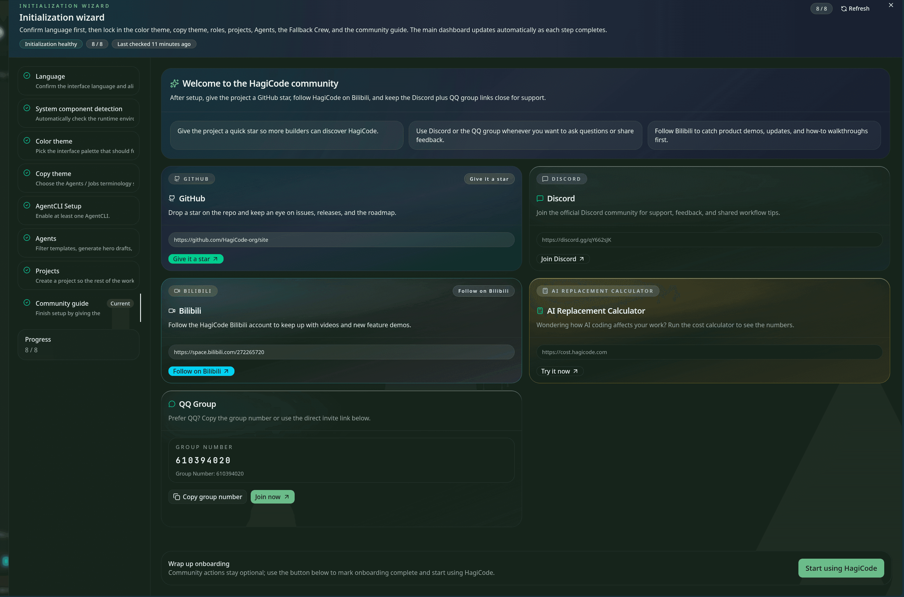

import { CardGrid, LinkCard } from '@astrojs/starlight/components';

After Desktop installation and the first launch, Hagicode opens the initialization wizard automatically. The current flow no longer breaks first-run work into disconnected entry points. It keeps the setup path linear: prepare the tools, organize the default executors, create the first project, and then move on.

:::note[How to read this page]
This guide follows the current wizard in article order and references managed screenshots directly. The Agents stage uses three screenshots, but they still belong to one main step.
:::

## Wizard overview

The current initialization wizard moves through these stages:

1. Choose the interface language and AI copy language
2. Check required system components such as Node.js, npm, and OpenSpec
3. Choose the interface color theme
4. Choose the copy theme
5. Enable and review AgentCLI capabilities
6. Configure Agents, including members, role assignment, and fallback / backup
7. Create the first project and bind the wizard output to a real working directory
8. Open community entry points for updates, tutorials, and discussion

## Step 1: Language

The language step defines how you want to interact with Hagicode. In practice it usually confirms two related settings:

- **Interface language** for Desktop and other product surfaces
- **AI copy language** for generated guidance, descriptions, and default text

If your team uses multiple languages, start with the one you read most comfortably and adjust later if needed.

## Step 2: Dependency check

The second step verifies that the current machine already has the system pieces needed by the rest of the wizard. The screenshot shows checks for Node.js, npm, OpenSpec, and similar prerequisites.

This page is not asking you to install everything by hand. Its job is to confirm that the environment is ready before the workflow continues to AgentCLI and project setup.

## Step 3: Color theme

The color theme step controls the visual style of the product UI, such as a light or dark interface. That choice affects the long-running reading experience in Desktop and related work surfaces.

If you spend a lot of time in terminals, logs, and code views, choose the theme that already matches your daily working habits.

## Step 4: Copy theme

The copy theme changes the narrative style of onboarding text, role descriptions, and other default product copy. The screenshot shows different selectable cards, including a more neutral baseline style and a more world-building-oriented Fantasy Adventure style.

Think of this as choosing the product's default voice: the feature set stays the same, but the wording and presentation change.

## Step 5: AgentCLI Setup

AgentCLI Setup decides which command-line execution capabilities are part of the default environment. Typical actions here include:

- enabling or disabling a specific AgentCLI provider
- reviewing its status, notes, and intended usage
- confirming which capabilities later Agents can rely on

This step defines what the later roles are actually able to do. If you want different Agents to use different CLI backends, make that foundation clear here first.

## Step 6: Agents

The Agents stage turns the available AgentCLI capabilities into a usable default team. The UI shows several continuous sub-states, but together they still form one main wizard step.

### 6.1 Add members

First, add the members. The table shows fields such as member name, AgentCLI, model, and character template. The goal here is to decide which default executors should exist at all.

If your workflow needs different roles for planning, execution, review, or archiving, this is where the initial member pool is established.

### 6.2 Assign roles

After the members exist, assign them to concrete jobs. The screenshot shows bindings for responsibilities such as generation, execution, and archiving.

Role assignment turns “who exists” into “who is responsible for what.” That directly shapes the default division of labor in later sessions and proposal workflows.

### 6.3 fallback / backup

The last part of the Agents stage defines fallback / backup members. These are the replacements the system should use when the preferred default member cannot continue.

This keeps the workflow from stalling when one member, backend, or model becomes unavailable. It matters even more when you enable multiple AgentCLI providers or model options.

## Step 7: Projects

The Projects step binds all earlier decisions to a real project. Here you can:

- create a new project entry
- fill in the project name, path, and description
- connect the prepared Agents and CLI defaults to an actual working directory

This is the point where setup becomes usable context. After it is done, the rest of the quick-start documentation can move forward with a real repository.

## Step 8: Community guide

The final step no longer changes local configuration. Instead, it exposes follow-up entry points such as GitHub, Discord, Bilibili, QQ Group, and similar official channels.

After the first installation, this page is mainly useful for two reasons:

- save the official entry points for later release notes and updates
- join the community or tutorial channels so support and feedback paths are easy to find

## Next steps

<CardGrid>
  <LinkCard
    title="Create Proposal Session"
    href="/en/quick-start/proposal-session"
    description="Click here to see how to start a proposal session after initialization is complete."
  />
</CardGrid>
