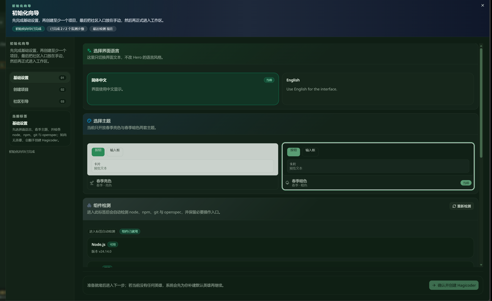
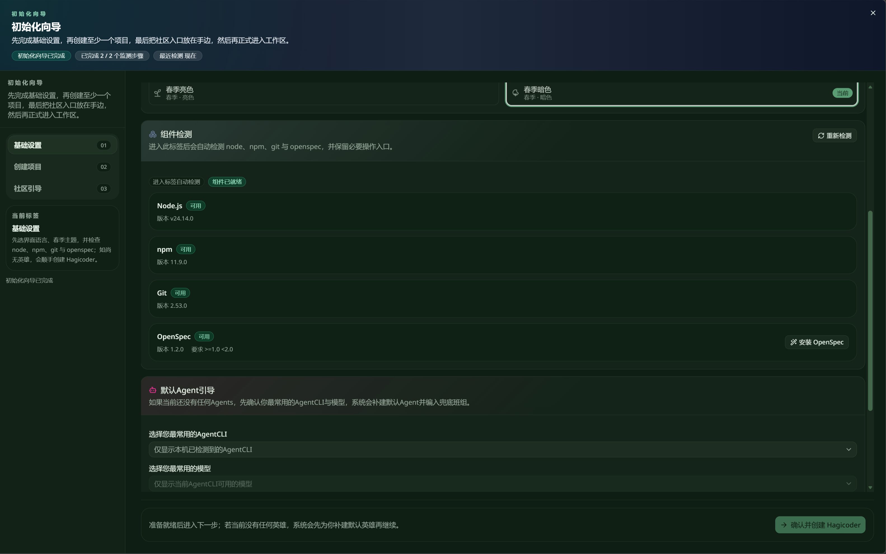
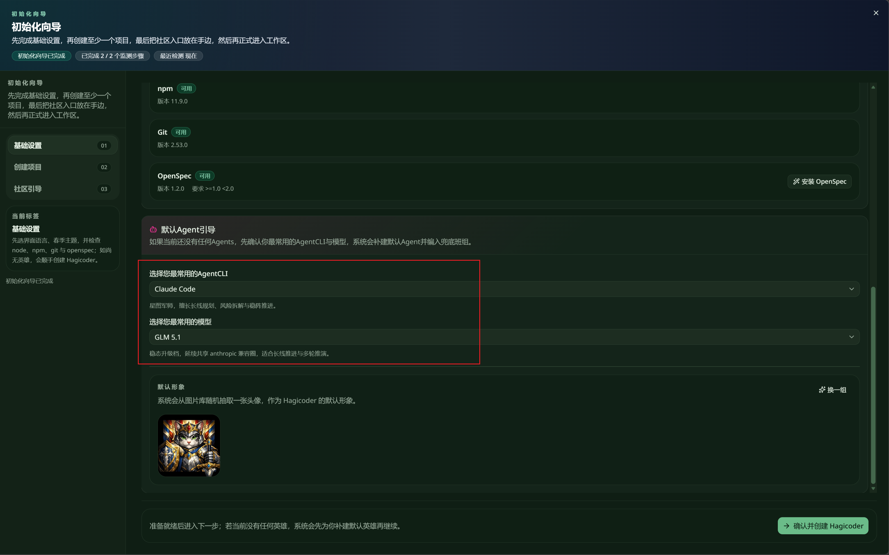

import { CardGrid, LinkCard } from '@astrojs/starlight/components';

After Desktop installation and the first launch, Hagicode opens the new initialization wizard automatically. The current version no longer follows the older long multi-step guide. Instead, it is organized into 3 main stages: finish the foundation settings, create at least one project, and keep the community entry points nearby before entering the real workspace.

:::note[How to read this page]
This rewrite uses the managed screenshot library under `repos/docs/src/content/docs/img/screenshots/quick-start/wizard-setup/` as the source of truth. The current managed set only includes 3 screenshots for the `Foundation settings` stage, so this page explains that part in detail and keeps the later 2 stages at a high level.
:::

## Wizard overview

The current initialization wizard moves through these 3 main stages:

1. **Foundation settings**: choose the interface language, choose the theme, check dependencies, and create a default Agent when none exists.
2. **Create project**: create at least one project so the wizard output connects to a real working directory.
3. **Community guide**: keep GitHub and the other follow-up entry points within reach before entering the normal workspace.

## Stage 1: Foundation settings

The left navigation already labels the first stage as `基础设置` and summarizes its purpose clearly: choose the interface language, keep the spring theme, verify `node`, `npm`, `git`, and `OpenSpec`, and create the default `Hagicoder` if no hero exists yet. Conclusion: this stage merges the old scattered preparation work into one continuous setup surface.

### 1.1 Choose the interface language and theme

The first screenshot shows the top of the foundation settings screen. It begins with `选择界面语言`, and the helper text makes the scope explicit: this changes the **interface copy only**, not the language style of the Hero. In the example, `简体中文` is marked as `当前`, while `English` remains available on the right.

The same screen immediately continues into `选择主题`. The current build exposes spring light and spring dark variants, and the example marks the right theme card as `当前`. The key change is structural: language and theme are now handled as one continuous section instead of separate jumps from the older guide.

### 1.2 Check dependencies and keep install actions nearby

The second screenshot scrolls into `组件检测`. This area automatically checks `Node.js`, `npm`, `Git`, and `OpenSpec`, and renders each item with its current availability. The top-right corner keeps a `重新检测` action, and the `OpenSpec` row also keeps an `安装 OpenSpec` entry.

The logic is direct: the wizard tells you whether the current machine is ready instead of forcing you to remember every prerequisite manually. Once those core components are available, you can continue to default Agent creation and then move on to project creation.

### 1.3 Pick the most-used CLI and model, then create the default Agent

The third screenshot shows `默认Agent引导`. When no Agents exist yet, the wizard asks for the most-used `AgentCLI` and model first, then auto-creates a default Agent and carries it into the later configuration group. In the example, the selected defaults are `Claude Code` and `GLM 5.1`.

This screen also handles the default identity. The lower area previews the avatar, offers a `换一组` action, and places the main CTA on the bottom-right as `确认并创建 Hagicoder`. So the current wizard no longer opens the old multi-screen role table first; it first guarantees that one usable default executor exists.

## Stage 2: Create project

The left navigation labels the second stage as `创建项目`. The page-level summary already makes its role explicit: this is not a casual optional stop. You are expected to create **at least one project** so the language, theme, dependency state, and default Agent produced in foundation settings can attach to a real working directory.

The current managed screenshot set does not yet include a dedicated screenshot for this stage, so this page keeps the explanation high level for now: once you reach it, connect a real repository or working folder before moving on.

## Stage 3: Community guide

The third stage in the left navigation is `社区引导`. The header summary states the sequence clearly: finish the foundation settings, create at least one project, and **keep the community entry points nearby** before entering the actual workspace.

Because the current managed screenshot set also lacks a dedicated screenshot for this stage, the documentation keeps only the flow meaning here: it is the closing stage for follow-up entry points, not the place for the core initialization decisions.

## Next steps

<CardGrid>
  <LinkCard
    title="Create Proposal Session"
    href="/en/quick-start/proposal-session"
    description="Click here to see how to start a proposal session after initialization is complete."
  />
</CardGrid>
