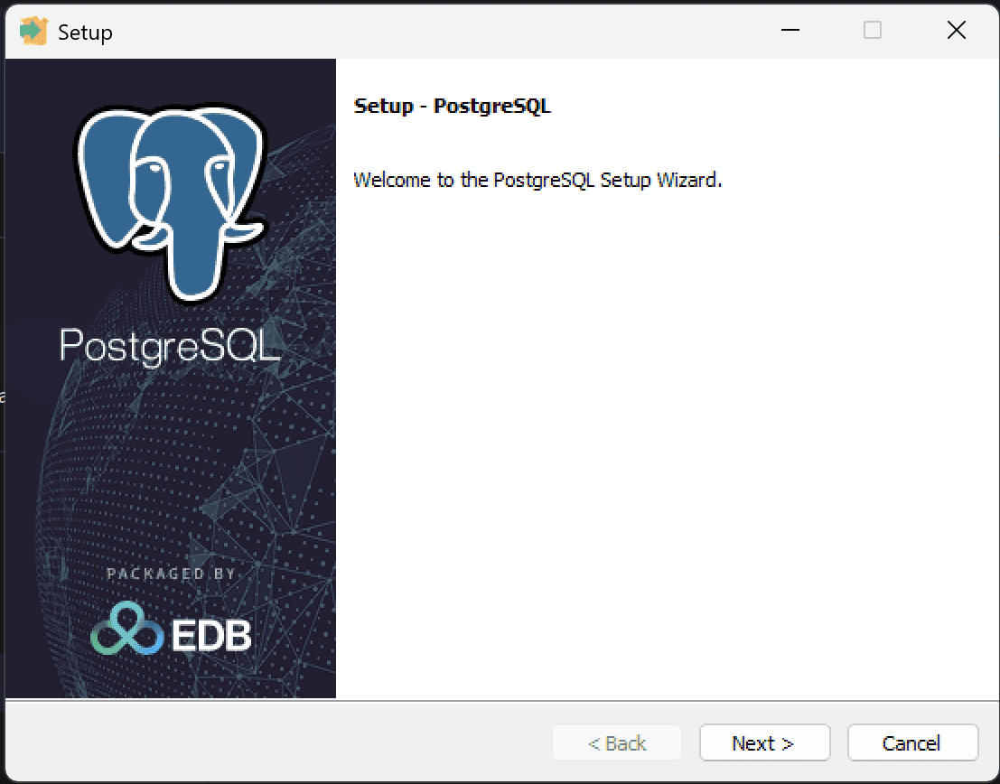
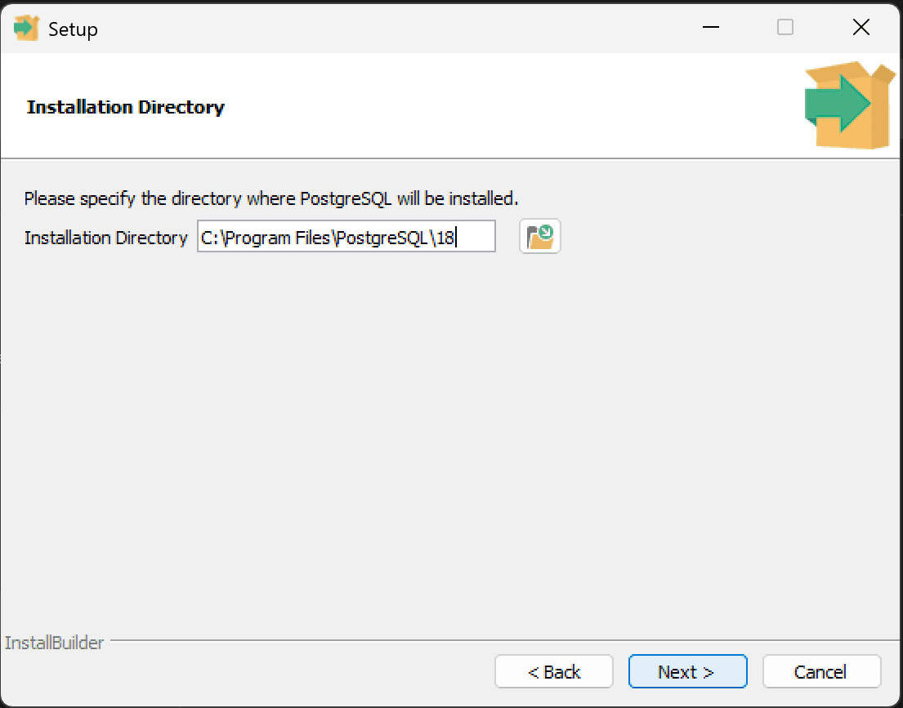
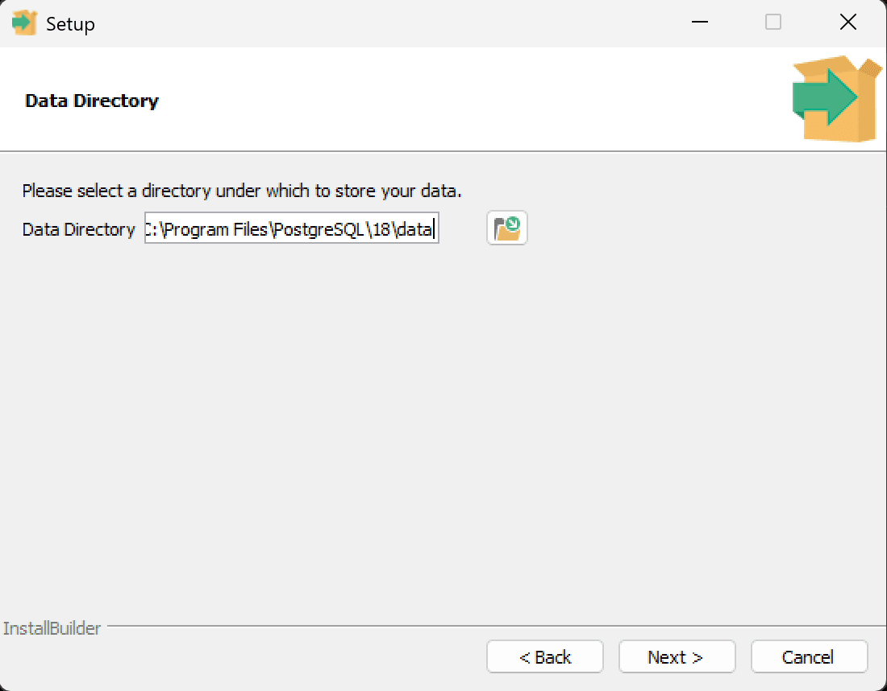
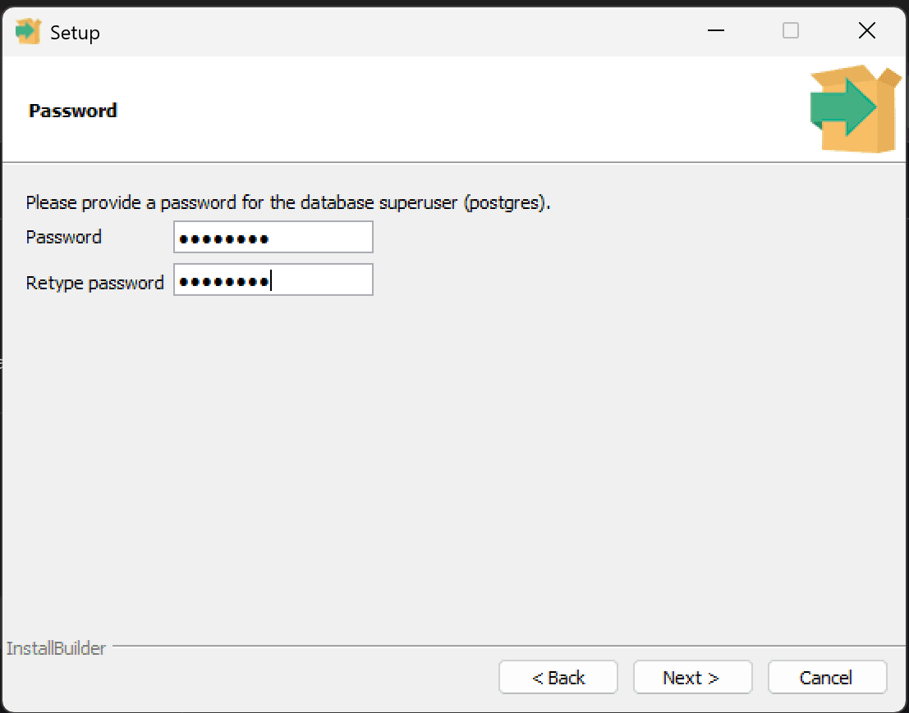
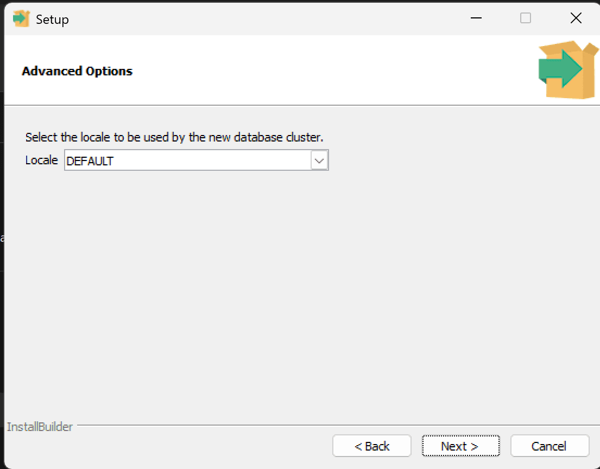
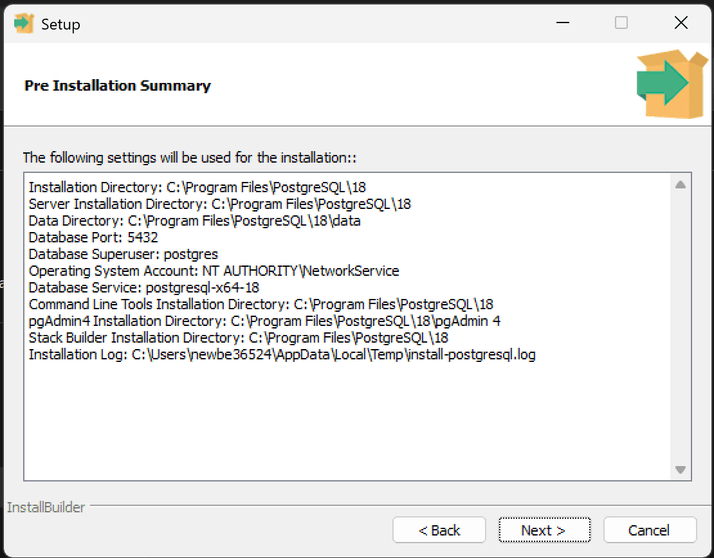
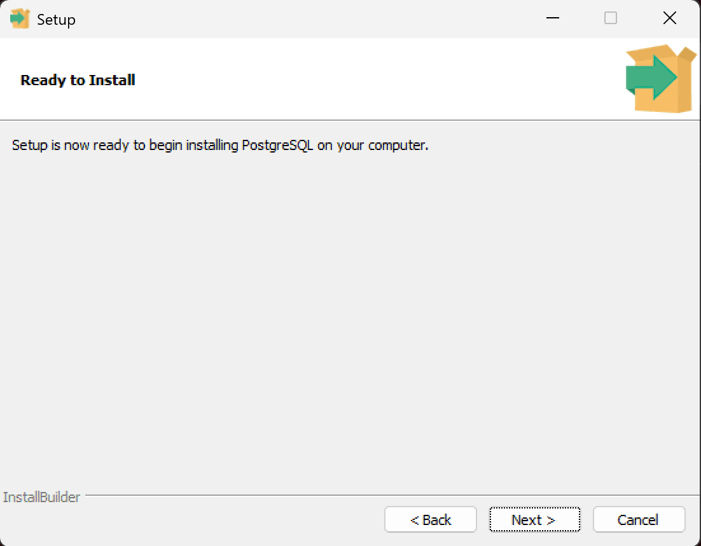
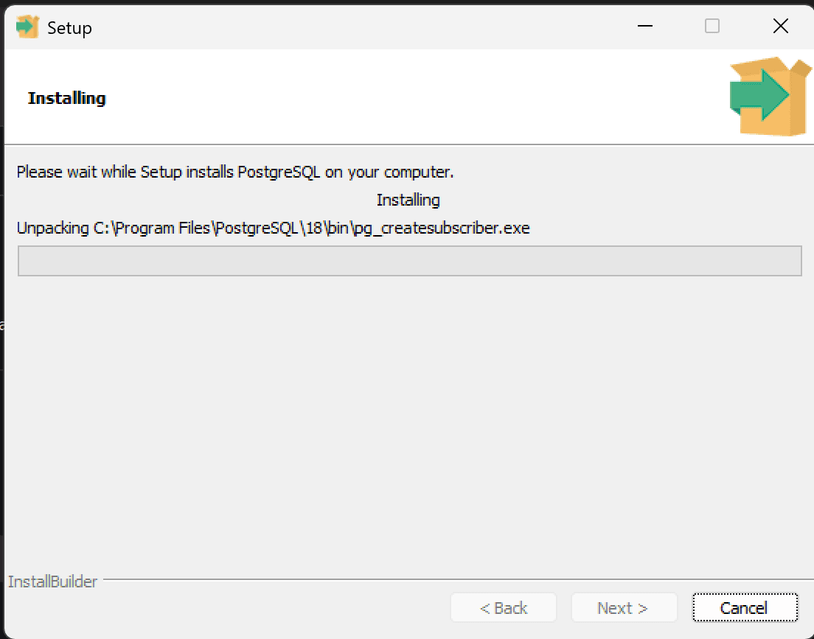

This guide explains how to install PostgreSQL on Windows when you need a standalone database for advanced deployment, external database management, or troubleshooting.

:::tip[This is an optional path]
For the latest default HagiCode local setup, you usually do not need to install PostgreSQL manually first. Continue with this guide only if you explicitly plan to connect HagiCode to a separately managed PostgreSQL instance.
:::

## When to Use This Guide

Before starting the installation, make sure your situation matches one of these cases:

- You plan to connect HagiCode to an external PostgreSQL database
- You are following an advanced deployment path outside the default local setup
- You need to install and maintain a standalone PostgreSQL instance manually

Also ensure:

- You are using Windows 10 or higher
- You have administrator privileges to install software
- Your hard drive has at least 500MB of available space

## Downloading the PostgreSQL Installer

1. Visit the [EnterpriseDB PostgreSQL Download Page](https://www.enterprisedb.com/downloads/postgres-postgresql-downloads)
2. Select the PostgreSQL version you need (recommended to use the latest stable version)
3. Select the operating system as "Windows"
4. Download the installer suitable for your system:
   - **x86-64** (Recommended): For 64-bit Windows systems
   - **x86-32**: For 32-bit Windows systems
5. Run the downloaded `.exe` installer

:::tip
It is recommended to download PostgreSQL 16 or higher for best performance and security.
:::

## Installation Steps

### Step 1: Launch the Setup Wizard

After double-clicking the installer, you will see the PostgreSQL installation wizard interface.

Click "Next" to continue the installation process.

### Step 2: Choose Install Location

Choose the PostgreSQL installation directory. The default installation path is `C:\Program Files\PostgreSQL\16`.

:::tip
It is recommended to use the default path unless you have specific needs to install in another location.
:::

Click "Next" to continue.

### Step 3: Select Components

Select the components to install. By default, the following components are selected:

- PostgreSQL Server - Database server
- pgAdmin 4 - Graphical management tool
- Stack Builder - Package manager
- Command Line Tools - Command line tools

It is recommended to keep the default selections and click "Next" to continue.

### Step 4: Choose Data Directory

Specify the database data storage directory. The default path is `C:\Program Files\PostgreSQL\16\data`.

:::note
The data directory will contain all database files, please ensure sufficient disk space.
:::

Click "Next" to continue.

### Step 5: Set Password for Initial Database User

Set the password for the PostgreSQL superuser (postgres). This is the database administrator password, please keep it safe.

:::warning Security Recommendations
- Use a strong password (at least 8 characters, containing uppercase, lowercase, numbers, and special characters)
- Do not forget this password, as you will need it when connecting to the database
- Do not use simple passwords in production environments
:::

Click "Next" to continue.

### Step 6: Set Database Port

Set the port that the PostgreSQL service will listen on. The default port is `5432`.

:::tip
- Keep the default port 5432 unless that port is already occupied by another application
- If you change the port, remember the new port number, as you will need it when connecting
:::

Click "Next" to continue.

### Step 7: Set Database Locale and Character Set

Set the database locale and character set.

:::tip
- **Keep the default selection [default]**, no changes needed
- The default option will automatically select the appropriate locale based on your system
- This ensures best compatibility and performance
:::

Click "Next" to continue.

### Step 8: Review Pre-Installation Summary

The installer will display a summary of all configuration information. Please carefully review:

- Installation path
- Data directory
- Port number
- Locale settings

After confirming the information is correct, click "Next" to start installation.

### Step 9: Ready to Install

The installer is now ready to begin copying files and configuring the system.

Click "Next" to start the installation process.

### Step 10: Installation Progress

The installer will display an installation progress bar. This process may take a few minutes.

Please wait patiently for the installation to complete.

### Step 11: Installation Complete

After installation completes, you will see the success prompt interface.

Uncheck "Launch Stack Builder at exit?" (unless you need additional extensions) and click "Finish" to exit the installation wizard.

## Next Steps

If you are setting up HagiCode with an external database, continue with the main installation flow after PostgreSQL is ready:

- [Return to Desktop Installation](/en/installation/desktop)
- [Review Docker Compose Deployment](/en/installation/docker-compose)

If you only want the latest default HagiCode local setup, you typically do not need to continue with PostgreSQL installation at all.
