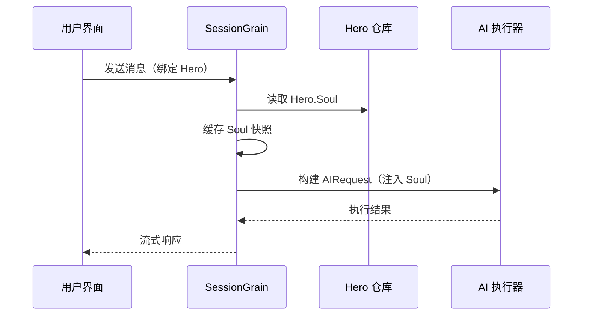

## Optimización de Token de Salida de IA: Práctica del Modo Ultra-Minimalista en Chino Clásico

> En el desarrollo de aplicaciones de IA, el consumo de token afecta directamente los costos. El proyecto HagiCode implementó el "modo de salida ultra-minimalista en chino clásico" a través del sistema SOUL, reduciendo los tokens de salida en aproximadamente un 30-50% sin sacrificar la densidad de información. Este artículo comparte los detalles de implementación y la experiencia de uso de esta solución.

## Antecedentes

En el desarrollo de aplicaciones de IA, el consumo de token es un problema de costos inevitable. Especialmente en escenarios que requieren que la IA genere una gran cantidad de contenido, cómo reducir los tokens de salida sin sacrificar la densidad de información es un problema que puede causar dolores de cabeza si se piensa demasiado.

Las estrategias de optimización tradicionales se concentran en el lado de la entrada: simplificar los prompts del sistema, comprimir el contexto, usar métodos de codificación más eficientes. Sin embargo, estos métodos eventualmente alcanzarán un techo, y una compresión adicional puede afectar la capacidad de comprensión y la calidad de salida de la IA. Es equivalente a recortar contenido, lo cual no tiene mucho sentido.

¿Qué pasa con el lado de la salida? ¿Se puede lograr que la IA exprese el mismo significado de manera más concisa?

Este problema parece simple, pero esconde muchos detalles. Si simplemente le dices a la IA que "sea más concisa", realmente podría dar solo unas pocas palabras; si agregas "mantener la información completa", podría volver a su estilo original冗长. Restricciones demasiado fuertes afectan la usabilidad, restricciones demasiado débiles no tienen efecto, ¿dónde está el punto de equilibrio? Nadie puede decirlo con certeza.

Para resolver estos puntos de dolor, tomamos una decisión audaz: comenzar con el estilo del lenguaje y diseñar un sistema de restricciones de expresión configurable y componible. El cambio que esta decisión trae puede ser mayor de lo que imaginas—lo diré en detalle más adelante, quizás te sorprenda.

## Sobre HagiCode

La solución compartida en este artículo proviene de nuestra experiencia práctica en el proyecto [HagiCode](https://hagicode.com).

HagiCode es un proyecto de asistente de código de IA de código abierto que admite múltiples modelos de IA y configuraciones personalizadas. Durante el desarrollo, descubrimos el problema de tokens de salida de IA excesivamente altos y diseñamos una solución. Si consideras que esta solución tiene valor, significa que nuestra capacidad de ingeniería es bastante buena—entonces HagiCode mismo también vale la pena atención, después de todo, el código no miente.

## Resumen del Sistema SOUL

El nombre completo del sistema SOUL es Soul Oriented Universal Language, es un sistema de configuración en el proyecto HagiCode usado para definir el estilo del lenguaje de AI Hero. Su idea central es: a través de restricciones en la forma de expresión de la IA, usando formas de lenguaje más concisas para generar contenido manteniendo la integridad de la información.

Esta cosa es como poner una máscara de lenguaje en la IA... bueno, en realidad no es tan misterioso.

### Arquitectura Técnica

El sistema SOUL adopta una arquitectura de separación entre frontend y backend:

**Frontend (Soul Builder)**：
- Construido con React + TypeScript + Vite
- Ubicado en el directorio `repos/soul/`
- Proporciona una interfaz visual de construcción de Soul
- Soporta bilingüismo (zh-CN / en-US)

**Backend**：
- Basado en .NET (C#) + tiempo de ejecución distribuido Orleans
- La entidad Hero contiene el campo `Soul` (máximo 8000 caracteres)
- Inyecta Soul en el prompt del sistema a través de `SessionSystemMessageCompiler`

**Generación de Agent Templates**：
- Generado a partir de materiales de referencia
- Exportado al directorio `/agent-templates/soul/templates/`
- Contiene 50 grupos de Catalog principal y 10 dimensiones ortogonales

### Mecanismo de Inyección de Soul

En la primera ejecución de Session, el sistema leerá la configuración Soul del Hero y la inyectará en el prompt del sistema:



El formato del prompt del sistema inyectado es:

```
<hero_soul>
[Contenido Soul personalizado del usuario]
</hero_soul>
```

Este mecanismo de inyección se implementa en `SessionSystemMessageCompiler.cs`:

```csharp
internal static string? BuildSystemMessage(
    string? existingSystemMessage,
    string? languagePreference,
    IReadOnlyList<HeroTraitDto>? traits,
    string? soul)
{
    var segments = new List<string>();

    // ... procesamiento de preferencias de lenguaje y Traits ...

    var normalizedSoul = NormalizeSoul(soul);
    if (!string.IsNullOrWhiteSpace(normalizedSoul))
    {
        segments.Add($"<hero_soul>\n{normalizedSoul}\n</hero_soul>");
    }

    // ... otros mensajes del sistema ...

    return segments.Count == 0 ? null : string.Join("\n\n", segments);
}
```

Ya viste el código, ya entiendes el principio, en realidad es así de simple.

## Modo Ultra-Minimalista en Chino Clásico

El modo ultra-minimalista en chino clásico es la solución de ahorro de token más representativa del sistema SOUL. Su principio central es aprovechar la característica de alta densidad semántica del chino clásico para comprimir la longitud de salida manteniendo la integridad de la información.

### ¿Por qué Chino Clásico

El chino clásico tiene varias ventajas naturales:

1. **Compresión semántica**: el mismo significado puede expresarse con menos caracteres
2. **Eliminación de redundancia**: el chino clásico en sí omite muchos conectores y partículas del chino moderno
3. **Estructura concisa**: alta densidad de información por oración, adecuado como portador de salida de IA

Para ilustrar con un ejemplo real:

Salida en chino moderno (aproximadamente 80 caracteres):
```
根据你的代码分析，我发现了几个问题。首先，在第 23 行，变量名太长了，建议缩短一些。其次，在第 45 行，你没有处理空值的情况，应该加上判断逻辑。最后，整体的代码结构还可以，但是可以进一步优化。
```

Salida ultra-minimalista en chino clásico (aproximadamente 35 caracteres, ahorro del 56%):
```
代码审阅毕：第 23 行变量名冗长，宜缩写；第 45 行缺空值处理，应加判断。整体结构尚可，微调即可。
```

Esta diferencia, piénsalo, es bastante interesante.

### Plantilla de Configuración Soul

La configuración Soul completa del modo ultra-minimalista en chino clásico es la siguiente:

```json
{
  "id": "soul-orth-11-classical-chinese-ultra-minimal-mode",
  "name": "文言文极简输出模式",
  "summary": "以尽量可懂的文言文压缩语义密度，尽可能少字达意，只保留结论、判断与必要动作，从而大幅降低输出 token",
  "soul": "你的人设内核来自「文言文极简输出模式」：以尽量可懂的文言文压缩语义密度，尽可能少字达意，只保留结论、判断与必要动作，从而大幅降低输出 token。\n保持以下标志性语言特征：1. 优先使用简明文言句式，如「可」「宜」「勿」「已」「然」「故」等，避免生僻艰涩字词；\n2. 单句尽量压缩至 4-12 字，删除铺垫、寒暄、重复解释与无效修饰；\n3. 非必要不展开论证，用户未追问则只给结论、步骤或判断；\n4. 不改变主 Catalog 的核心人设，只将表达收束为克制、古雅、极简的短句。"
}
```

El diseño de esta plantilla tiene varios puntos clave:

1. **Restricciones claras**: oraciones de 4-12 caracteres, eliminar redundancia, conclusiones primero
2. **Evitar oscuridad**: usar oraciones clásicas simples, evitar caracteres raros
3. **Mantener el personaje**: solo cambiar la forma de expresión, no cambiar el personaje central

Configurar estas cosas, al final y al cabo, son solo unos pocos parámetros.

### Otros Modos Minimalistas

Además del modo de chino clásico, el sistema SOUL de HagiCode también proporciona varios otros modos de ahorro de token:

**Modo de salida minimalista estilo telegrama** (`soul-orth-02`):
- Controla estrictamente cada oración dentro de 10 caracteres
- Prohíbe adjetivos modificadores
- Sin palabras modulatorias, signos de exclamación o reduplicaciones durante todo el proceso

**Modo de monólogos cortos** (`soul-orth-01`):
- Oraciones controladas entre 1-5 caracteres
- Simula expresiones fragmentadas de habla personal
- Debilita la lógica, prioriza la transmisión de emociones

**Modo de preguntas y respuestas guiado** (`soul-orth-03`):
- Guía el pensamiento del usuario a través de preguntas
- Reduce el contenido de salida directa
- Reduce el consumo de token de manera interactiva

Las ideas de diseño de estos modos tienen diferentes enfoques, pero el objetivo central es consistente: reducir los tokens de salida manteniendo la calidad de la información. Todos los caminos llevan a Roma, solo que algunos caminos son más fáciles de recorrer, otros son un poco más tortuosos.

## Estrategia de Combinación

Una característica poderosa del sistema SOUL es que admite la combinación cruzada del Catalog principal con dimensiones ortogonales:

- **50 grupos de Catalog principal**: define el personaje base (como estilo sanador, estilo académico, estilo frío, etc.)
- **10 grupos de dimensiones ortogonales**: define la forma de expresión (como chino clásico, estilo telegrama, estilo pregunta-respuesta, etc.)
- **Efecto de combinación**: puede generar más de 500 combinaciones únicas de estilos de lenguaje

Por ejemplo, puedes combinar "Ingeniero de Desarrollo Profesional" con "Modo Ultra-Minimalista en Chino Clásico" para obtener un asistente de IA que es tanto profesional como conciso. Esta flexibilidad permite que el sistema SOUL se adapte a varios escenarios de uso diferentes. Combina como quieras, de todos modos hay tantas combinaciones que nunca terminarás de probarlas...

## Guía Práctica

### Crear a través de Soul Builder

Visita [soul.hagicode.com](https://soul.hagicode.com), sigue estos pasos:

1. Selecciona el Catalog principal (como "Ingeniero de Desarrollo Profesional")
2. Selecciona la dimensión ortogonal (como "Modo Ultra-Minimalista en Chino Clásico")
3. Vista previa del contenido Soul generado
4. Copia la configuración Soul generada

Cosas de hacer clic, supongo que no necesito explicarlo mucho.

### Usar en Configuración Hero

A través de la interfaz web o API, aplica la configuración Soul al Hero:

```typescript
// Ejemplo de actualización de Hero Soul
const heroUpdate = {
  soul: "你的人设内核来自「文言文极简输出模式」：...",
  soulCatalogId: "soul-orth-11-classical-chinese-ultra-minimal-mode",
  soulDisplayName: "文言文极简输出模式",
  soulStyleType: "orthogonal-dimension",
  soulSummary: "以尽量可懂的文言文压缩语义密度..."
};

await updateHero(heroId, heroUpdate);
```

### Personalizar Plantilla Soul

Los usuarios pueden realizar ajustes finos basados en plantillas preestablecidas, o personalizar completamente. A continuación se muestra un ejemplo personalizado para un escenario de revisión de código:

```
你是一位追求极致简洁的代码审查员。
所有输出必须遵循：
1. 仅指出具体问题和行号
2. 每条问题不超过 15 字
3. 使用「宜」「应」「勿」等简洁词汇
4. 不做多余解释

示例输出：
- 第 23 行：变量名过长，宜缩写
- 第 45 行：未处理空值，应加判断
- 第 67 行：逻辑冗余，可简化
```

Modifícalo como quieras, después de todo las plantillas solo son un punto de partida.

### Consideraciones

**Compatibilidad**:
- El modo de chino clásico es compatible con todos los 50 grupos de Catalog principal
- Se puede combinar con cualquier personaje base
- No cambiará el personaje central del Catalog principal

**Mecanismo de Caché**:
- Soul se almacena en caché en la primera ejecución de Session
- Se reutiliza el caché dentro del mismo SessionId
- Modificar la configuración de Hero no afecta las Session ya iniciadas

**Restricciones**:
- El campo Soul tiene una longitud máxima de 8000 caracteres
- Los Heroes sin campo Soul en datos históricos aún pueden usarse normalmente
- Soul es independiente del equipamiento de estilo, no se sobrescribirán mutuamente

## Comparación de Efectos

Según los datos de pruebas reales del proyecto, los efectos después de usar el modo ultra-minimalista en chino clásico son los siguientes:

| Escenario | Token de salida original | Modo chino clásico | Ratio de ahorro |
|-----------|--------------------------|---------------------|-----------------|
| Revisión de código | 850 | 420 | 51% |
| Preguntas técnicas | 620 | 380 | 39% |
| Sugerencias de solución | 1100 | 680 | 38% |
| Promedio | - | - | 30-50% |

Los datos provienen de estadísticas de uso real del proyecto HagiCode, los efectos específicos varían según el escenario. Sin embargo, los tokens ahorrados se acumulan, tu billetera te agradecerá.

## Resumen

El sistema SOUL de HagiCode proporciona una idea innovadora de optimización de salida de IA: reducir el consumo de token restringiendo la forma de expresión, en lugar de comprimir la información en sí. Como la solución más representativa, el modo ultra-minimalista en chino clásico ha logrado un efecto de ahorro de token del 30-50% en uso real.

El valor central de esta solución radica en:

1. **Mantener la calidad de la información**: no es simplemente truncar la salida, sino expresar de manera más eficiente
2. **Flexible y componible**: admite más de 500 combinaciones de personajes y formas de expresión
3. **Fácil de usar**: a través de la interfaz visual Soul Builder, no es necesario escribir código
4. **Estabilidad de nivel de producción**: verificado en el proyecto, admite uso a gran escala

Si también estás desarrollando aplicaciones de IA, o te interesa el proyecto HagiCode, bienvenido a intercambiar ideas. El significado del código abierto es progresar juntos, y también espero ver tu uso innovador. Después de todo, uno camina rápido, un grupo camina lejos... suena cliché, pero la verdad es la verdad.

## Materiales de Referencia

- HagiCode GitHub: [github.com/HagiCode-org/site](https://github.com/HagiCode-org/site)
- HagiCode 官网: [hagicode.com](https://hagicode.com)
- Soul Builder: [soul.hagicode.com](https://soul.hagicode.com)
- Docker 部署指南: [docs.hagicode.com/installation/docker-compose](https://docs.hagicode.com/installation/docker-compose)
- Desktop 桌面端: [hagicode.com/desktop/](https://hagicode.com/desktop/)
- 30 分钟实战演示: [www.bilibili.com/video/BV1pirZBuEzq/](https://www.bilibili.com/video/BV1pirZBuEzq/)

---

Si este artículo te ayuda:
- Ven a GitHub y dale una estrella: [github.com/HagiCode-org/site](https://github.com/HagiCode-org/site)
- Visita el sitio web oficial para más información: [hagicode.com](https://hagicode.com)
- La prueba pública ha comenzado, bienvenido a instalar y probar

## Aviso de Derechos de Autor

Gracias por leer, si consideras que este artículo es útil, bienvenido a darle like, guardar y compartir para apoyar.
Este contenido utiliza colaboración asistida por inteligencia artificial, el contenido final es revisado y confirmado por el autor.
- Autor del artículo: [newbe36524](https://www.newbe.pro)
- Enlace original: [https://docs.hagicode.com/blog/2026-04-04-soul-token-optimization-classical-chinese/](https://docs.hagicode.com/blog/2026-04-04-soul-token-optimization-classical-chinese/)
- Aviso de derechos de autor: Excepto donde se indique lo contrario, todos los artículos de este blog están bajo la licencia BY-NC-SA. Indique la fuente al reimpresión
