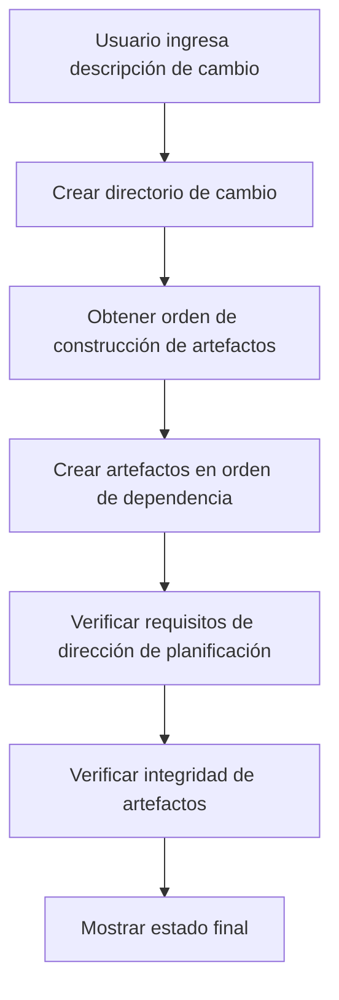
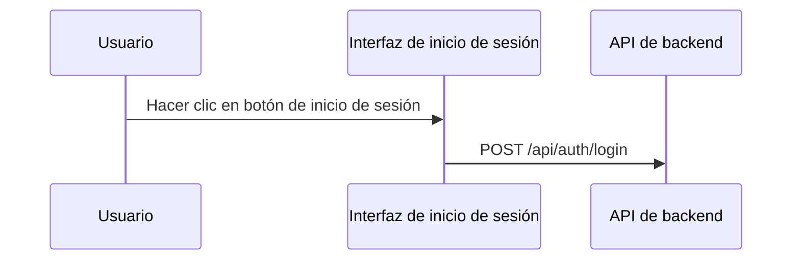

## Personalizar pasos de OpenSpec para mejorar los resultados de generación con IA

> Al usar OpenSpec para gestionar propuestas técnicas, nos encontramos con el problema de la calidad inestable de los documentos generados por IA. En realidad, no hay otra opción más que modificar las plantillas de prompts uno mismo. Este artículo es el registro de esos días.

## Antecedentes

OpenSpec es un sistema para gestionar propuestas técnicas. La idea central es muy simple: ingresar una descripción del cambio y generar automáticamente varios artefactos de documentación. proposal, design, specs, tasks, todo se puede generar automáticamente. Suena ideal, ¿verdad?

Pero en el uso real, descubrimos algunos problemas. Digamos que no son problemas graves, pero lo que se genera no tiene el sabor correcto.

El `design.md` generado carece de los elementos de visualización necesarios: sin diagramas de flujo Mermaid, sin diagramas de secuencia, y mucho menos sin diagramas de arquitectura. Los ingenieros del equipo técnico ven estos documentos y niegan con la cabeza, después de todo, ¿quién quiere leer un montón de texto puro?

El `proposal.md` tampoco es satisfactorio, carece de tablas de cambios de código, sin prototipos de interfaz. Los responsables de la toma de decisiones lo miran durante mucho tiempo y todavía no saben exactamente qué cambia esta modificación.

Lo que es más doloroso es `tasks.md`, que se mezcla con varias tareas de operación de Git. Los límites de responsabilidad se vuelven vagos, y los desarrolladores miran estas tareas sin saber cuáles deben hacer y cuáles no. Esto también es un poco desesperanzador, después de todo, la IA tampoco sabe cómo está dividido el trabajo de tu equipo.

Los requisitos de visualización para diferentes niveles de documentos tampoco están claros. ¿Qué diagramas deben incluir proposal y design? Este problema siempre ha preocupado al equipo.

¿Cuál es la raíz de estos problemas? Después de analizar, descubrimos el punto clave: las plantillas de prompts carecen de restricciones y orientación claras.

Esto tampoco es sorprendente, después de todo, las plantillas en sí son genéricas y no pueden adaptarse completamente a las necesidades de cada equipo.

## Sobre HagiCode

La solución compartida en este artículo proviene de nuestra experiencia práctica en el proyecto [HagiCode](https://hagicode.com). HagiCode es un proyecto de asistente de código con IA, y usamos ampliamente OpenSpec en el proceso de desarrollo para gestionar propuestas técnicas.

Fueron precisamente estas experiencias prácticas de enfrentar problemas lo que impulsó el nacimiento de este plan de mejora. En realidad, no es gran cosa, solo se trata de encontrar problemas y resolverlos.

## Análisis: Arquitectura del sistema de prompts

Para resolver el problema, primero debemos entender el sistema. Veamos cómo funciona el sistema de prompts de OpenSpec.

OpenSpec usa el sistema de plantillas Handlebars, cada prompt contiene dos partes:

**Archivo de metadatos JSON**: define parámetros, escenarios, información de versión
**Archivo de plantilla Handlebars**: contiene el contenido real del prompt

```
Resources/Prompts/
├── openspec-v1-ff.zh-CN.json    # Metadatos
├── openspec-v1-ff.zh-CN.hbs     # Contenido de plantilla
├── openspec-v1-ff.en-US.json
└── openspec-v1-ff.en-US.hbs
```

La ventaja de este diseño de separación es obvia: metadatos y contenido se gestionan por separado, lo que facilita el mantenimiento y la localización. Esto también es un poco como escribir código, separar lógica y presentación, todos entienden este principio.

El flujo de trabajo FF (Fast Forward) es el proceso de generación central de OpenSpec:



Este proceso se ve perfecto, pero el problema está en el paso de "requisitos de dirección de planificación": no tiene una guía suficientemente clara.

Esto también es un poco desesperanzador, después de todo, al diseñar el sistema, es imposible considerar las necesidades específicas de todos los equipos.

## Sistema de direcciones de planificación

El sistema de direcciones de planificación es el mecanismo de personalización central de OpenSpec, que permite a los usuarios elegir diferentes opciones de generación. En el proyecto HagiCode se definen las siguientes direcciones:

| ID de dirección | Función | Habilitado por defecto |
|---------|------|---------|
| `explore` | Modo de exploración | Sí |
| `change-map` | Mapa de cambios | Sí |
| `flowchart` | Diagrama de flujo de interacción | Sí |
| `prototype` | Prototipo de UI | Sí |
| `architecture` | Diagrama de arquitectura | Sí |
| `sequence` | Diagrama de secuencia de API | Sí |

Cada dirección define un identificador estable, estado de habilitación predeterminado, etiqueta de visualización, y fragmentos de prompts en chino e inglés.

Este sistema está diseñado de manera muy ingeniosa, pero en la práctica de HagiCode, descubrimos que solo con la definición no es suficiente: es necesario usar estas direcciones explícitamente en las plantillas de prompts.

Esto también es un poco como muchas cosas en la vida, tener opciones no equivale a hacer una elección, todavía alguien necesita decirte cómo elegir.

## Solución: Restricciones claras y ejemplos

Nuestra idea de mejora es muy directa: agregar restricciones claras y ejemplos de referencia en las plantillas de prompts.

En realidad, no hay nada especial, solo se trata de decir las cosas con claridad.

### 1. Agregar requisitos de visualización de documentos

En la plantilla `openspec-v1-ff.zh-CN.hbs`, agregamos restricciones claras de alcance de contenido:

```markdown
### Restricciones de alcance de contenido para tasks.md

Al crear artefactos `tasks.md`, deben cumplirse las siguientes restricciones de alcance de contenido:

Debe incluir:
- Tareas de lógica de negocio (implementación de código, desarrollo de funciones)
- Tareas de implementación técnica (integración de componentes, desarrollo de API)
- Tareas de prueba (pruebas unitarias, pruebas de integración)
- Tareas de documentación (actualizar documentación, agregar comentarios)

Prohibido incluir:
- Operaciones de commit de Git (git add, git commit, git push)
- Flujos de trabajo de gestión de control de versiones
- Operaciones de despliegue y lanzamiento
```

Usar lenguaje normativo de "DEBE/PROHIBIDO" en lugar de "sugerido" o "puede" permite que la IA entienda las restricciones con mayor precisión.

Esto también es un poco como educar a los niños, decir lo que se dice sin ambigüedad.

### 2. Proporcionar ejemplos de referencia para cada dirección

Solo decir "incluir diagrama de flujo" no es suficiente, proporcionamos ejemplos de salida específicos para cada dirección habilitada.

Después de todo, hablar sin practicar es falso, dar un ejemplo concreto permite que la IA entienda mejor.

**Ejemplo de dirección de mapa de cambios**:
```markdown
| Ruta de archivo | Tipo de cambio | Razón de cambio | Alcance de impacto |
|---------|---------|---------|---------|
| Path/to/file | Nuevo | Descripción | Nombre del módulo |
```

**Ejemplo de dirección de prototipo**:
```
┌─────────────────────────────────────────┐
│ Iniciar sesión de usuario                            [×] │
├─────────────────────────────────────────┤
│  Dirección de correo electrónico *                             │
│ ┌─────────────────────────────────────┐ │
│ │ user@example.com                   │ │
│ └─────────────────────────────────────┘ │
└─────────────────────────────────────────┘
```

**Ejemplo de dirección de diagrama de flujo**：


Estos ejemplos permiten que la IA entienda con precisión el formato de salida esperado, en lugar de improvisar.

Esto también es un poco como dar respuestas de referencia durante un examen, aunque no pueden ser exactamente iguales, el formato debe ser correcto.

### 3. Usar lenguaje normativo para requisitos claros

Para los requisitos de visualización de diferentes tipos de documentos, usamos lenguaje normativo para restringir:

```markdown
Para proposal.md:
- Debe incluir tabla de cambios de código (cuando la dirección change-map está habilitada)
- Debe incluir prototipo de UI (cuando involucra cambios de UI y la dirección prototype está habilitada)
- Prohibido incluir diagramas de arquitectura detallados (estos deben estar en design.md)

Para design.md:
- Debe incluir todo el contenido de proposal.md (versión más detallada)
- Debe incluir diagrama de arquitectura (cuando la dirección architecture está habilitada)
- Debe incluir diagrama de flujo de datos (cuando la dirección flowchart está habilitada)
```

Estas restricciones claras mejoraron enormemente la calidad de generación.

En realidad, no hay nada más, solo se trata de decir las cosas con claridad y no dejar que la IA adivine.

## Práctica: Implementación de código

Terminada la teoría, veamos cómo se implementa en el proyecto HagiCode.

### Definir direcciones de planificación

Definir direcciones de planificación en `ProposalPlanningDirections.cs`:

```csharp
public static class ProposalPlanningDirections
{
    private static readonly ProposalPlanningDirectionDefinition[] Catalog =
    [
        new(
            ChangeMapId,
            "Change map",
            DefaultEnabled: true,
            EnglishPromptFragment:
            "- Change map: include structured file-impact views...",
            ChinesePromptFragment:
            "- 变更地图：加入结构化的文件影响视图..."),
        // ... otras direcciones
    ];

    public static string RenderInstructionBlock(
        IEnumerable<ProposalPlanningDirectionState> directions,
        string? locale)
    {
        var enabledDirections = directions
            .Where(direction => direction.Enabled)
            .ToArray();

        if (enabledDirections.Length == 0)
        {
            return string.Empty;
        }

        var heading = IsChineseLocale(locale)
            ? "本次生成启用以下规划方向："
            : "Apply the following planning directions:";

        return string.Join(Environment.NewLine,
            [heading, .. enabledDirections.Select(d => d.GetPromptFragment(locale))]);
    }
}
```

Este código tiene varios puntos de diseño dignos de mención:

1. Usar matriz en lugar de lista, porque las definiciones no cambian en tiempo de ejecución
2. Renderizado diferido: solo genera texto cuando hay direcciones habilitadas
3. Soporte multilingüe, selecciona el fragmento de prompt apropiado según locale

En realidad, no hay nada especial, solo algunos diseños de código convencionales.

### Parametrización de plantillas

Usar declaraciones condicionales en plantillas Handlebars:

```handlebars
{{#if planningDirectionInstructions}}
## 本次生成的规划方向

{{{planningDirectionInstructions}}}
{{/if}}

**Pasos**
1. **Si no se proporciona entrada, usar valores predeterminados razonables**
2. **Crear directorio de cambio**
3. **Obtener orden de construcción de artefactos**
4. **Crear artefactos en orden hasta apply-ready**
   a. Para cada artefacto listo:
      - Obtener instrucciones
      - Leer archivos de dependencia
      - Crear archivo de artefacto
```

Nota ese `{{{planningDirectionInstructions}}}`: tres llaves significan no escapar HTML, lo que puede preservar formatos como bloques de código Mermaid.

Esto también es un poco como el compromiso en la vida, a veces necesitas preservar algunas cosas originales, no puedes escapar de todo.

### Implementación de carga de prompts

Implementar carga parametrizada de prompts a través de `FilePromptProvider`:

```csharp
public async Task<string> GetOpenspecV1FfPromptAsync(
    string changeName,
    string changeDescription,
    string locale = "en-US",
    string? planningDirectionInstructions = null,
    CancellationToken cancellationToken = default)
{
    var parameters = new Dictionary<string, object>
    {
        { "planningDirectionInstructions",
          ResolvePlanningDirectionInstructions(locale, planningDirectionInstructions) }
    };

    if (!string.IsNullOrWhiteSpace(changeName))
    {
        parameters["changeName"] = changeName;
    }

    return await GetPromptWithParametersAsync(
        PromptScenario.OpenspecV1Ff,
        locale,
        cancellationToken,
        parameters) ?? string.Empty;
}
```

Este diseño es muy flexible: `planningDirectionInstructions` es opcional, si no se proporciona, el sistema usará la configuración predeterminada.

Después de todo, nadie quiere pasar un montón de parámetros cada vez, tener un valor predeterminado siempre es bueno.

## Verificación y pruebas

Después de la implementación, el equipo de HagiCode realizó una verificación completa:

### Al habilitar direcciones específicas

- Verificar que el proposal.md generado contenga la tabla de cambios de código
- Verificar que el design.md generado contenga el diagrama de arquitectura
- Verificar que tasks.md no contenga tareas de operación de Git

### Al deshabilitar direcciones específicas

- Verificar que no se genere el contenido de visualización correspondiente
- Asegurar que no afecte la salida de otras direcciones

### Casos límite

- Comportamiento cuando todas las direcciones están deshabilitadas
- Manejo de errores cuando los IDs de dirección son inválidos

Estas pruebas aseguran la estabilidad y previsibilidad del sistema, lo cual es crucial para que el equipo adopte nuevas herramientas.

En realidad, no hay nada especial, solo se trata de probar todo lo que se debe probar, después de todo, nadie quiere que surjan problemas después del lanzamiento.

## Consideraciones

Al implementar este plan, hay varios obstáculos que evitar:

**Sincronización de plantillas**: Al modificar plantillas, mantén la sincronización con upstream. El equipo de HagiCode se encontró una vez con un conflicto de plantillas que tomó medio día resolver. Esto también es un poco desesperanzador, después de todo, las actualizaciones siempre traen algunos problemas de compatibilidad.

**Consistencia bilingüe**: Asegura que la estructura y las restricciones de las plantillas en chino e inglés sean consistentes. Nos encontramos una vez con una situación donde la versión china tenía restricciones pero la versión en inglés no, lo que causó que la calidad de los documentos generados fuera inconsistente. Esto también es un poco incómodo, después de todo, nadie sabe qué idioma usarán los usuarios.

**Impacto en el rendimiento**: El renderizado de direcciones de planificación debe completarse en microsegundos. Si el tiempo de renderizado es demasiado largo, afectará la experiencia del usuario. Después de todo, quién quiere esperar mucho tiempo para ver los resultados.

**Compatibilidad con versiones anteriores**: Mantener soporte para versiones anteriores de la API. Por ejemplo, el parámetro `enableExploreMode`, aunque ahora usamos el sistema de direcciones de planificación, el código antiguo todavía lo usa. Esto también es un poco desesperanzador, después de todo, no siempre puedes pedir que todos actualicen.

**Expresión clara**: Usar lenguaje normativo (MUST/SHALL) en lugar de lenguaje sugestivo. Este punto se verificó completamente en la práctica de HagiCode. En realidad, no hay nada más, solo se trata de decir las cosas con claridad.

## Conclusión

Al personalizar los pasos de prompts de OpenSpec, mejoramos con éxito la calidad de los documentos generados por IA. Los puntos clave de mejora incluyen:

1. Agregar condiciones de restricción claras en las plantillas de prompts
2. Proporcionar ejemplos de salida específicos para cada dirección de planificación
3. Usar lenguaje normativo (MUST/MUST NOT) para restringir el comportamiento de la IA
4. Implementar carga parametrizada flexible de prompts a través de código

Este plan se verificó en el proyecto HagiCode, y la calidad de los documentos generados mejoró significativamente: los documentos de diseño contienen elementos de visualización completos, los documentos de propuesta tienen tablas de cambios de código claras, y las listas de tareas tienen responsabilidades claras.

En realidad, no es gran cosa, solo se trata de resolver los problemas.

Si también estás usando un sistema similar de generación de documentos asistido por IA, espero que esta experiencia te sea útil. Recuerda: las restricciones claras y los ejemplos específicos son la clave para obtener resultados de alta calidad.

Después de todo, algunas cosas es mejor decirlas con claridad......

## Referencias

- [Repositorio del proyecto HagiCode](https://github.com/HagiCode-org/site)
- [Documentación de OpenSpec](https://docs.hagicode.com)
- [Sintaxis de plantillas Handlebars](https://handlebarsjs.com/)
- [Sintaxis de diagramas Mermaid](https://mermaid.js.org/)
