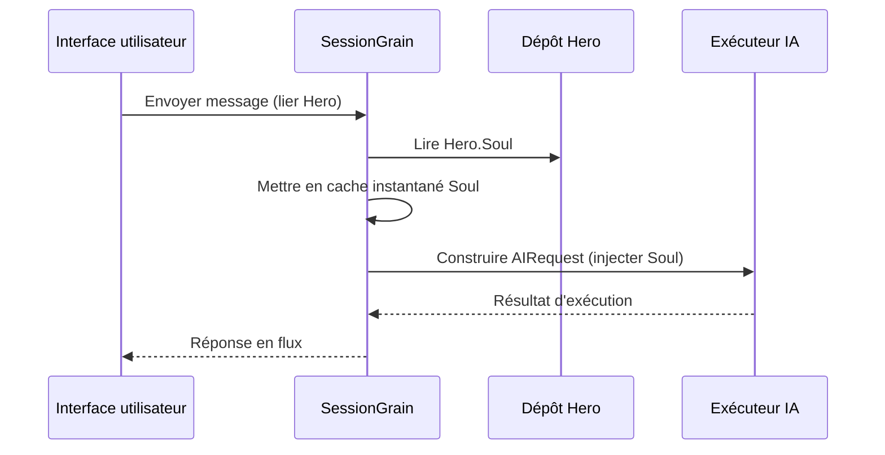

## Optimisation des tokens de sortie IA : Pratique du mode ultra-minimaliste en chinois classique

> Dans le développement d'applications IA, la consommation de tokens affecte directement les coûts. Le projet HagiCode a implémenté le « mode de sortie ultra-minimaliste en chinois classique » via le système SOUL, réduisant les tokens de sortie d'environ 30-50 % sans perte de densité d'information. Cet article partage les détails de mise en œuvre et l'expérience d'utilisation de cette solution.

## Contexte

Dans le développement d'applications IA, la consommation de tokens est un problème de coût incontournable. Surtout dans les scénarios nécessitant une grande quantité de contenu généré par l'IA, comment réduire les tokens de sortie sans sacrifier la densité d'information — c'est une question qui peut devenir assez casse-tête.

Les approches d'optimisation traditionnelles se concentrent toutes sur l'entrée : simplifier les invites système, compresser le contexte, utiliser des méthodes d'encodage plus efficaces. Mais ces méthodes finissent par atteindre un plafond, et une compression supplémentaire risque d'affecter la capacité de compréhension de l'IA et la qualité de sortie. Cela revient à supprimer du contenu, ce qui n'a pas grand sens.

Et du côté de la sortie ? Pourquoi ne pas demander à l'IA d'exprimer la même signification de manière plus concise ?

Cette question semble simple, mais cache beaucoup de subtilités. Demander directement à l'IA d'être « concise », elle pourrait vraiment ne donner que quelques mots ; en ajoutant « garder l'information complète », elle pourrait revenir à son style verbeux original. Des contraintes trop strictes affectent la convivialité, des contraintes trop faibles n'ont aucun effet — où se trouve l'équilibre, personne ne peut le dire avec certitude.

Pour résoudre ces points de douleur, nous avons pris une décision audacieuse : partir du style linguistique et concevoir un système de contraintes d'expression configurable et composable. Les changements apportés par cette décision pourraient être plus importants que vous ne l'imaginez — j'en parlerai en détail bientôt, et vous pourriez être surpris.

## À propos de HagiCode

La solution partagée dans cet article provient de notre expérience pratique dans le projet [HagiCode](https://hagicode.com).

HagiCode est un projet d'assistant de code IA open source prenant en charge plusieurs modèles d'IA et configurations personnalisées. Au cours du développement, nous avons identifié le problème des tokens de sortie IA trop élevés et avons conçu une solution. Si vous trouvez cette solution valuable, cela montre que nos compétences en ingénierie ne sont pas mal — alors HagiCode lui-même mérite également votre attention, après tout, le code ne ment pas.

## Aperçu du système SOUL

Le système SOUL (Soul Oriented Universal Language) est le système de configuration du projet HagiCode utilisé pour définir le style linguistique des AI Heros. Son idée centrale est : en contraignant le mode d'expression de l'IA, utiliser une forme linguistique plus concise pour sortir du contenu tout en maintenant l'intégrité de l'information.

C'est comme mettre un masque linguistique à l'IA... enfin, ce n'est pas si mystérieux que ça.

### Architecture technique

Le système SOUL adopte une architecture séparée frontend/backend :

**Frontend (Soul Builder)** :
- Construit avec React + TypeScript + Vite
- Situé dans le répertoire `repos/soul/`
- Fournit une interface visuelle de construction de Soul
- Prend en charge le bilinguisme (zh-CN / en-US)

**Backend** :
- Basé sur .NET (C#) + runtime distribué Orleans
- L'entité Hero contient un champ `Soul` (maximum 8000 caractères)
- Injecte Soul dans les invites système via `SessionSystemMessageCompiler`

**Génération des Agent Templates** :
- Généré à partir de matériaux de référence
- Sorti vers le répertoire `/agent-templates/soul/templates/`
- Contient 50 Catalog principaux et 10 dimensions orthogonales

### Mécanisme d'injection Soul

Lors de la première exécution d'une Session, le système lit la configuration Soul du Hero et l'injecte dans l'invite système :



Le format de l'invite système injectée est :

```
<hero_soul>
[Contenu Soul personnalisé par l'utilisateur]
</hero_soul>
```

Ce mécanisme d'injection est implémenté dans `SessionSystemMessageCompiler.cs` :

```csharp
internal static string? BuildSystemMessage(
    string? existingSystemMessage,
    string? languagePreference,
    IReadOnlyList<HeroTraitDto>? traits,
    string? soul)
{
    var segments = new List<string>();

    // ... Traitement des préférences linguistiques et Traits ...

    var normalizedSoul = NormalizeSoul(soul);
    if (!string.IsNullOrWhiteSpace(normalizedSoul))
    {
        segments.Add($"<hero_soul>\n{normalizedSoul}\n</hero_soul>");
    }

    // ... Autres messages système ...

    return segments.Count == 0 ? null : string.Join("\n\n", segments);
}
```

Le code est vu, le principe est compris, en fait c'est aussi simple que ça.

## Mode ultra-minimaliste en chinois classique

Le mode ultra-minimaliste en chinois classique est la solution d'économie de tokens la plus représentative du système SOUL. Son principe central est d'exploiter la haute densité sémantique du chinois classique pour compresser la longueur de sortie tout en maintenant l'intégrité de l'information.

### Pourquoi le chinois classique

Le chinois classique présente plusieurs avantages naturels :

1. **Compression sémantique** : La même signification peut être exprimée avec moins de caractères
2. **Élimination des redondances** : Le chinois classique omet naturellement de nombreuses conjonctions et particules du chinois moderne
3. **Structure concise** : Densité d'information élevée par phrase, adaptée comme vecteur de sortie IA

Prenons un exemple concret pour illustrer :

Sortie en chinois moderne (environ 80 caractères) :
```
根据你的代码分析，我发现了几个问题。首先，在第 23 行，变量名太长了，建议缩短一些。其次，在第 45 行，你没有处理空值的情况，应该加上判断逻辑。最后，整体的代码结构还可以，但是可以进一步优化。
```

Sortie ultra-minimaliste en chinois classique (environ 35 caractères, économie de 56 %) :
```
代码审阅毕：第 23 行变量名冗长，宜缩写；第 45 行缺空值处理，应加判断。整体结构尚可，微调即可。
```

Cette différence, quand on y pense, est assez intéressante.

### Modèle de configuration Soul

La configuration Soul complète du mode ultra-minimaliste en chinois classique est la suivante :

```json
{
  "id": "soul-orth-11-classical-chinese-ultra-minimal-mode",
  "name": "文言文极简输出模式",
  "summary": "以尽量可懂的文言文压缩语义密度，尽可能少字达意，只保留结论、判断与必要动作，从而大幅降低输出 token",
  "soul": "你的人设内核来自「文言文极简输出模式」：以尽量可懂的文言文压缩语义密度，尽可能少字达意，只保留结论、判断与必要动作，从而大幅降低输出 token。\n保持以下标志性语言特征：1. 优先使用简明文言句式，如「可」「宜」「勿」「已」「然」「故」等，避免生僻艰涩字词；\n2. 单句尽量压缩至 4-12 字，删除铺垫、寒暄、重复解释与无效修饰；\n3. 非必要不展开论证，用户未追问则只给结论、步骤或判断；\n4. 不改变主 Catalog 的核心人设，只将表达收束为克制、古雅、极简的短句。"
}
```

La conception de ce modèle présente plusieurs points clés :

1. **Contraintes claires** : Phrases de 4-12 caractères, supprimer les redondances, conclusions prioritaires
2. **Éviter l'obscurité** : Utiliser des formes classiques simples, éviter les caractères rares
3. **Maintenir la personnalité** : Changer seulement le mode d'expression, pas la personnalité centrale

La configuration, c'est finalement juste quelques paramètres à régler.

### Autres modes minimalistes

Outre le mode chinois classique, le système SOUL de HagiCode propose plusieurs autres modes d'économie de tokens :

**Mode de sortie télégraphique ultra-minimaliste** (`soul-orth-02`) :
- Phrases strictement limitées à 10 caractères maximum
- Adjectifs modificateurs interdits
- Aucune particule modale, point d'exclamation ou répétition

**Mode monologue en phrases courtes** (`soul-orth-01`) :
- Phrases contrôlées entre 1-5 caractères
- Simule l'expression fragmentée du monologue intérieur
- Logique affaiblie, transmission d'émotions priorisée

**Mode de questions-réponses guidées** (`soul-orth-03`) :
- Guide la réflexion de l'utilisateur par des questions
- Réduit le contenu de sortie directe
- Réduction interactive de la consommation de tokens

Ces modes ont des approches de conception différentes, mais l'objectif central est le même : réduire les tokens de sortie tout en maintenant la qualité de l'information. Tous les chemins mènent à Rome, certains sont juste plus faciles à parcourir que d'autres...

## Stratégie de combinaison

Une fonctionnalité puissante du système SOUL est la prise en charge de la combinaison croisée des Catalog principaux avec les dimensions orthogonales :

- **50 Catalog principaux** : Définissent les personnalités de base (guérisseur, érudit, froid, etc.)
- **10 dimensions orthogonales** : Définissent les modes d'expression (chinois classique, télégraphique, questions-réponses, etc.)
- **Effet de combinaison** : Peut générer plus de 500 combinaisons de styles linguistiques uniques

Par exemple, vous pouvez combiner « Ingénieur développement professionnel » avec « Mode ultra-minimaliste en chinois classique » pour obtenir un assistant IA à la fois professionnel et concis. Cette flexibilité permet au système SOUL de s'adapter à divers scénarios d'utilisation. Combinez comme vous voulez, il y a tellement de combinaisons que vous ne pourrez pas toutes les essayer...

## Guide pratique

### Création via Soul Builder

Visitez [soul.hagicode.com](https://soul.hagicode.com) et suivez ces étapes :

1. Sélectionnez un Catalog principal (par exemple « Ingénieur développement professionnel »)
2. Sélectionnez une dimension orthogonale (par exemple « Mode ultra-minimaliste en chinois classique »)
3. Prévisualisez le contenu Soul généré
4. Copiez la configuration Soul générée

C'est juste une question de clics, je n'ai pas besoin d'en dire plus.

### Utilisation dans la configuration Hero

Via l'interface Web ou l'API, appliquez la configuration Soul à un Hero :

```typescript
// Exemple de mise à jour Hero Soul
const heroUpdate = {
  soul: "你的人设内核来自「文言文极简输出模式」：...",
  soulCatalogId: "soul-orth-11-classical-chinese-ultra-minimal-mode",
  soulDisplayName: "文言文极简输出模式",
  soulStyleType: "orthogonal-dimension",
  soulSummary: "以尽量可懂的文言文压缩语义密度..."
};

await updateHero(heroId, heroUpdate);
```

### Modèles Soul personnalisés

Les utilisateurs peuvent affiner les modèles prédéfinis ou créer complètement leurs propres configurations. Voici un exemple personnalisé pour un scénario de révision de code :

```
你是一位追求极致简洁的代码审查员。
所有输出必须遵循：
1. 仅指出具体问题和行号
2. 每条问题不超过 15 字
3. 使用「宜」「应」「勿」等简洁词汇
4. 不做多余解释

示例输出：
- 第 23 行：变量名过长，宜缩写
- 第 45 行：未处理空值，应加判断
- 第 67 行：逻辑冗余，可简化
```

Modifiez comme vous voulez, après tout les modèles ne sont qu'un point de départ.

### Points d'attention

**Compatibilité** :
- Le mode chinois classique est compatible avec les 50 Catalog principaux
- Peut être combiné avec aucune personnalité de base
- Ne change pas la personnalité centrale du Catalog principal

**Mécanisme de cache** :
- Soul est mis en cache lors de la première exécution de Session
- Le cache est réutilisé dans le même SessionId
- Modifier la configuration Hero n'affecte pas les Session déjà démarrées

**Limites et contraintes** :
- Longueur maximale du champ Soul : 8000 caractères
- Les Hero sans champ Soul dans les données historiques peuvent toujours être utilisés normalement
- Soul est indépendant de l'emplacement d'équipement style, pas de surcharge mutuelle

## Comparaison des effets

Selon les données de test réelles du projet, les effets après utilisation du mode ultra-minimaliste en chinois classique sont les suivants :

| Scénario | Tokens de sortie originaux | Mode chinois classique | Taux d'économie |
|----------|---------------------------|------------------------|-----------------|
| Révision de code | 850 | 420 | 51 % |
| Questions techniques | 620 | 380 | 39 % |
| Recommandations de solutions | 1100 | 680 | 38 % |
| Moyenne | - | - | 30-50 % |

Les données proviennent des statistiques d'utilisation réelles du projet HagiCode, les effets spécifiques varient selon les scénarios. Mais les tokens économisés s'accumulent, et votre portefeuille vous remerciera.

## Conclusion

Le système SOUL de HagiCode propose une approche innovante d'optimisation de la sortie IA : réduire la consommation de tokens en contraignant le mode d'expression, plutôt qu'en compressant l'information elle-même. Le mode ultra-minimaliste en chinois classique, comme solution la plus représentative, a permis d'économiser 30-50 % de tokens dans l'utilisation réelle.

La valeur centrale de cette solution réside dans :

1. **Maintenir la qualité de l'information** : Il ne s'agit pas de simplement tronquer la sortie, mais d'exprimer de manière plus efficace
2. **Flexible et composable** : Prend en charge plus de 500 combinaisons de personnalités et de modes d'expression
3. **Facile à utiliser** : Via l'interface visuelle Soul Builder, aucun codage requis
4. **Stabilité de niveau production** : Vérifié dans le projet, prend en charge une utilisation à grande échelle

Si vous développez également des applications IA ou si vous êtes intéressé par le projet HagiCode, n'hésitez pas à échanger. Le sens de l'open source est le progrès commun, et j'attends aussi de voir vos utilisations innovantes. Après tout, seul on va plus vite, ensemble on va plus loin... c'est un cliché, mais c'est la vérité.

## Références

- HagiCode GitHub : [github.com/HagiCode-org/site](https://github.com/HagiCode-org/site)
- Site officiel HagiCode : [hagicode.com](https://hagicode.com)
- Soul Builder : [soul.hagicode.com](https://soul.hagicode.com)
- Guide de déploiement Docker : [docs.hagicode.com/installation/docker-compose](https://docs.hagicode.com/installation/docker-compose)
- Desktop : [hagicode.com/desktop/](https://hagicode.com/desktop/)
- Démo pratique de 30 minutes : [www.bilibili.com/video/BV1pirZBuEzq/](https://www.bilibili.com/video/BV1pirZBuEzq/)

---

Si cet article vous a aidé :
- Venez mettre une étoile sur GitHub : [github.com/HagiCode-org/site](https://github.com/HagiCode-org/site)
- Visitez le site officiel pour en savoir plus : [hagicode.com](https://hagicode.com)
- La bêta publique a commencé, bienvenu pour installer et essayer

## Notice de copyright

Merci de votre lecture, si vous trouvez cet article utile, n'hésitez pas à liker,收藏 et partager pour soutenir.
Ce contenu est réalisé avec la collaboration de l'IA, le contenu final est examiné et confirmé par l'auteur.
- Auteur de l'article : [newbe36524](https://www.newbe.pro)
- Lien vers l'article original : [https://docs.hagicode.com/blog/2026-04-04-soul-token-optimization-classical-chinese/](https://docs.hagicode.com/blog/2026-04-04-soul-token-optimization-classical-chinese/)
- Déclaration de copyright : Sauf indication contraire, tous les articles de ce blog sont sous licence BY-NC-SA. Veuillez indiquer la source pour toute reproduction !
