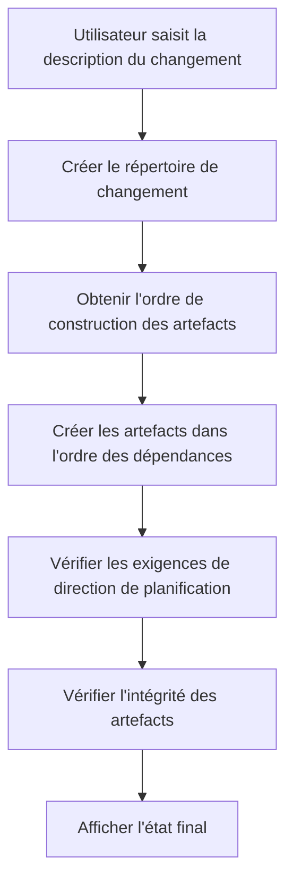
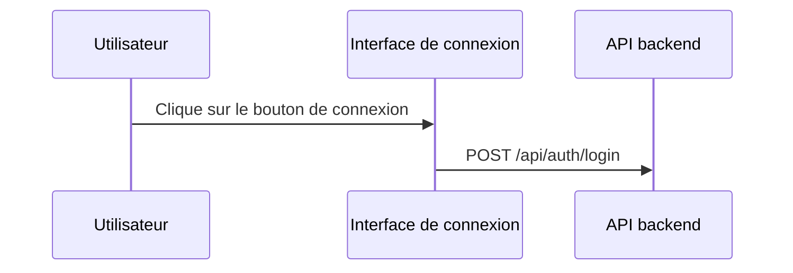

## Personnaliser les étapes OpenSpec pour améliorer les résultats de génération IA

> Lors de l'utilisation d'OpenSpec pour gérer les propositions techniques, nous avons rencontré un problème de qualité instable des documents générés par l'IA. En fait, il n'y avait pas d'autre solution, nous devions modifier les modèles de prompts nous-mêmes. Cet article est le compte rendu de cette période.

## Contexte

OpenSpec est un système de gestion des propositions techniques, l'idée centrale est très simple : saisir une description des changements, générer automatiquement divers artefacts de documentation. proposal, design, specs, tasks, tout peut être généré automatiquement. Ça sonne plutôt bien, non ?

Cependant, dans l'utilisation réelle, nous avons découvert quelques problèmes. Comment dire, ce n'est pas un problème majeur, mais les générations n'étaient pas tout à fait ce qu'elles devaient être.

Le `design.md` généré manquait d'éléments visuels nécessaires — pas de diagrammes de flux Mermaid, pas de diagrammes de séquence, et encore moins de diagrammes d'architecture. Une telle documentation de conception, l'équipe technique secouait la tête en la voyant, après tout, qui veut lire un tas de texte brut ?

Le `proposal.md` n'était pas non plus satisfaisant, manquant de tableaux de changements de code, pas de prototypes d'interface. Les décideurs ont regardé pendant un moment sans comprendre ce que ce changement modifiait vraiment.

Ce qui était encore plus frustrant, c'était `tasks.md`, qui contenait diverses tâches d'opération Git. Les frontières de responsabilité sont devenues floues, les développeurs regardaient ces tâches sans savoir ce qu'ils devaient ou ne devaient pas faire. C'est un peu impuissant, après tout l'IA ne connaît pas la division du travail de votre équipe.

Les exigences de visualisation pour différents niveaux de documentation n'étaient pas claires non plus. Quels diagrammes proposal et design devraient-ils contenir ? Ce problème a toujours tourmenté l'équipe.

Quelle est la source de ces problèmes ? Après analyse, nous avons découvert le point clé : les modèles de prompts manquent de contraintes et d'orientations claires.

Ce n'est pas surprenant, après tout les modèles eux-mêmes sont génériques et ne peuvent pas parfaitement s'adapter aux besoins de chaque équipe.

## À propos de HagiCode

La solution partagée dans cet article provient de notre expérience pratique dans le projet [HagiCode](https://hagicode.com). HagiCode est un projet d'assistant de code IA, nous utilisons largement OpenSpec pour gérer les propositions techniques pendant le développement.

Ce sont précisément ces expériences pratiques qui ont conduit à la création de cette solution d'amélioration. En fait, ce n'est pas grand-chose, juste rencontrer des problèmes et les résoudre.

## Analyse : Architecture du système de prompts

Pour résoudre le problème, il faut d'abord comprendre le système. Voyons comment fonctionne le système de prompts d'OpenSpec.

OpenSpec utilise le système de modèles Handlebars, chaque prompt contient deux parties :

**Fichier de métadonnées JSON** : définit les paramètres, scénarios, informations de version
**Fichier de modèle Handlebars** : contient le contenu réel du prompt

```
Resources/Prompts/
├── openspec-v1-ff.zh-CN.json    # Métadonnées
├── openspec-v1-ff.zh-CN.hbs     # Contenu du modèle
├── openspec-v1-ff.en-US.json
└── openspec-v1-ff.en-US.hbs
```

Les avantages de cette conception de séparation sont évidents : métadonnées et contenu gérés séparément, faciles à maintenir et à localiser. C'est aussi un peu comme écrire du code, séparer la logique de la présentation, tout le monde comprend ce principe.

Le workflow FF (Fast Forward) est le processus de génération central d'OpenSpec :



Ce processus semble parfait, mais le problème se situe à l'étape "exigences de direction de planification" — il n'a pas d'orientation suffisamment claire.

C'est un peu impuissant, après tout lors de la conception du système, il est impossible de prendre en compte les besoins spécifiques de toutes les équipes.

## Système de direction de planification

Le système de direction de planification est le mécanisme de personnalisation central d'OpenSpec, permettant aux utilisateurs de choisir différentes options de génération. Dans le projet HagiCode, les directions suivantes sont définies :

| ID de direction | Fonction | Activé par défaut |
|----------------|----------|-------------------|
| `explore` | Mode exploration | Oui |
| `change-map` | Carte des changements | Oui |
| `flowchart` | Diagramme de flux d'interaction | Oui |
| `prototype` | Prototype UI | Oui |
| `architecture` | Diagramme d'architecture | Oui |
| `sequence` | Diagramme de séquence API | Oui |

Chaque direction définit un identifiant stable, un état d'activation par défaut, une étiquette d'affichage, et des fragments de prompts en chinois et anglais.

Ce système est très bien conçu, mais dans la pratique de HagiCode, nous avons découvert que la définition seule ne suffit pas — il faut utiliser ces directions explicitement dans les modèles de prompts.

C'est un peu comme beaucoup de choses dans la vie, avoir des options ne signifie pas faire un choix, il faut encore que quelqu'un vous dise comment choisir.

## Solution : Contraintes claires et exemples

Notre approche d'amélioration est très directe : ajouter des contraintes claires et des exemples de référence dans les modèles de prompts.

En fait, il n'y a rien de spécial, il s'agit juste de clarifier les choses.

### 1. Ajouter des exigences de visualisation de documents

Dans le modèle `openspec-v1-ff.zh-CN.hbs`, nous avons ajouté des contraintes claires sur la portée du contenu :

```markdown
### Contraintes de portée du contenu tasks.md

Lors de la création de l'artefact `tasks.md`, les contraintes de portée de contenu suivantes doivent être respectées :

Doit inclure :
- Tâches logiques métier (implémentation de code, développement de fonctionnalités)
- Tâches d'implémentation technique (intégration de composants, développement d'API)
- Tâches de test (tests unitaires, tests d'intégration)
- Tâches de documentation (mise à jour de la documentation, ajout de commentaires)

Ne doit pas inclure :
- Opérations de commit Git (git add, git commit, git push)
- Workflows de gestion de contrôle de version
- Opérations de déploiement et de publication
```

Utiliser un langage normatif "DOIT/NE DOIT PAS" au lieu de "suggéré" ou "peut" permet à l'IA de mieux comprendre les contraintes.

C'est un peu comme éduquer un enfant, ce qui est dit est ce qui est, pas d'ambiguïté.

### 2. Fournir des exemples de référence pour chaque direction

Dire simplement "inclure un diagramme de flux" ne suffit pas, nous avons fourni des exemples de sortie spécifiques pour chaque direction activée.

Après tout, parler sans agir n'est qu'un exercice, donner un exemple concret permet à l'IA de mieux comprendre.

**Exemple de direction de carte des changements** :
```markdown
| Chemin de fichier | Type de changement | Raison du changement | Portée de l'impact |
|-------------------|--------------------|----------------------|--------------------|
| Path/to/file | Ajout | Description | Nom du module |
```

**Exemple de direction de prototype** :
```
┌─────────────────────────────────────────┐
│ Connexion utilisateur                    [×] │
├─────────────────────────────────────────┤
│  Adresse e-mail *                             │
│ ┌─────────────────────────────────────┐ │
│ │ user@example.com                   │ │
│ └─────────────────────────────────────┘ │
└─────────────────────────────────────────┘
```

**Exemple de direction de diagramme de flux** :


Ces exemples permettent à l'IA de comprendre précisément le format de sortie attendu, plutôt que d'improviser.

C'est un peu comme donner une réponse de référence lors d'un examen, bien que ce ne soit pas exactement la même chose, le format doit être correct.

### 3. Utiliser un langage normatif pour clarifier les exigences

Pour les exigences de visualisation de différents types de documents, nous utilisons un langage normatif pour contraindre :

```markdown
Pour proposal.md :
- Doit inclure le tableau des changements de code (lorsque la direction change-map est activée)
- Doit inclure le prototype UI (lorsqu'il implique des changements UI et que la direction prototype est activée)
- Ne doit pas inclure de diagrammes d'architecture détaillés (ceux-ci doivent être dans design.md)

Pour design.md :
- Doit inclure tout le contenu de proposal.md (version plus détaillée)
- Doit inclure les diagrammes d'architecture (lorsque la direction architecture est activée)
- Doit inclure les diagrammes de flux de données (lorsque la direction flowchart est activée)
```

Ces contraintes claires ont considérablement amélioré la qualité de génération.

En fait, il n'y a rien d'autre, il s'agit juste de clarifier les choses, ne pas laisser l'IA deviner.

## Pratique : Implémentation du code

La théorie est terminée, voyons comment cela a été implémenté dans le projet HagiCode.

### Définir les directions de planification

Définir les directions de planification dans `ProposalPlanningDirections.cs` :

```csharp
public static class ProposalPlanningDirections
{
    private static readonly ProposalPlanningDirectionDefinition[] Catalog =
    [
        new(
            ChangeMapId,
            "Change map",
            DefaultEnabled: true,
            EnglishPromptFragment:
            "- Change map: include structured file-impact views...",
            ChinesePromptFragment:
            "- 变更地图：加入结构化的文件影响视图..."),
        // ... autres directions
    ];

    public static string RenderInstructionBlock(
        IEnumerable<ProposalPlanningDirectionState> directions,
        string? locale)
    {
        var enabledDirections = directions
            .Where(direction => direction.Enabled)
            .ToArray();

        if (enabledDirections.Length == 0)
        {
            return string.Empty;
        }

        var heading = IsChineseLocale(locale)
            ? "本次生成启用以下规划方向："
            : "Apply the following planning directions:";

        return string.Join(Environment.NewLine,
            [heading, .. enabledDirections.Select(d => d.GetPromptFragment(locale))]);
    }
}
```

Il y a quelques points de conception值得 noter dans ce code :

1. Utiliser un tableau au lieu d'une liste, car les définitions ne changent pas à l'exécution
2. Rendu différé — générer du texte uniquement lorsqu'il y a des directions activées
3. Support multilingue, sélectionner le fragment de prompt approprié selon la locale

En fait, il n'y a rien de spécial, juste quelques conceptions de code régulières.

### Paramétrage du modèle

Utiliser des instructions conditionnelles dans les modèles Handlebars :

```handlebars
{{#if planningDirectionInstructions}}
## Directions de planification pour cette génération

{{{planningDirectionInstructions}}}
{{/if}}

**Étapes**
1. **Si aucune entrée n'est fournie, utiliser des valeurs par défaut raisonnables**
2. **Créer le répertoire de changement**
3. **Obtenir l'ordre de construction des artefacts**
4. **Créer les artefacts dans l'ordre jusqu'à apply-ready**
   a. Pour chaque artefact ready :
      - Obtenir les instructions
      - Lire les fichiers de dépendances
      - Créer le fichier d'artefact
```

Notez ce `{{{planningDirectionInstructions}}}` — trois accolades signifient ne pas échaper le HTML, ce qui permet de conserver des formats comme les blocs de code Mermaid.

C'est un peu comme le compromis dans la vie, parfois il faut préserver certaines choses originales, ne pas tout échapper.

### Implémentation du chargement des prompts

Implémenter le chargement paramétré des prompts via `FilePromptProvider` :

```csharp
public async Task<string> GetOpenspecV1FfPromptAsync(
    string changeName,
    string changeDescription,
    string locale = "en-US",
    string? planningDirectionInstructions = null,
    CancellationToken cancellationToken = default)
{
    var parameters = new Dictionary<string, object>
    {
        { "planningDirectionInstructions",
          ResolvePlanningDirectionInstructions(locale, planningDirectionInstructions) }
    };

    if (!string.IsNullOrWhiteSpace(changeName))
    {
        parameters["changeName"] = changeName;
    }

    return await GetPromptWithParametersAsync(
        PromptScenario.OpenspecV1Ff,
        locale,
        cancellationToken,
        parameters) ?? string.Empty;
}
```

Cette conception est très flexible : `planningDirectionInstructions` est optionnel, s'il n'est pas fourni, le système utilisera la configuration par défaut.

Après tout, personne ne veut passer un tas de paramètres à chaque fois, avoir une valeur par défaut est toujours bon.

## Vérification et tests

Après implémentation, l'équipe HagiCode a effectué une vérification complète :

### Lors de l'activation de directions spécifiques

- Vérifier que le proposal.md généré contient le tableau des changements de code
- Vérifier que le design.md généré contient les diagrammes d'architecture
- Vérifier que tasks.md ne contient pas de tâches d'opération Git

### Lors de la désactivation de directions spécifiques

- Vérifier que le contenu de visualisation correspondant n'est pas généré
- S'assurer que cela n'affecte pas la sortie des autres directions

### Cas limites

- Comportement lorsque toutes les directions sont désactivées
- Gestion des erreurs lors d'ID de direction invalides

Ces tests assurent la stabilité et la prévisibilité du système — ce qui est crucial pour l'adoption d'un nouvel outil par l'équipe.

En fait, il n'y a rien de spécial, il faut tout tester, après tout personne ne veut de problèmes après la mise en production.

## Points d'attention

Lors de la mise en œuvre de cette solution, il y a quelques pièges à éviter :

**Synchronisation des modèles** : attention à maintenir la synchronisation avec l'amont lors de la modification des modèles. L'équipe HagiCode a rencontré une fois un conflit de modèles, qui a pris une demi-journée à résoudre. C'est un peu impuissant, après tout les mises à niveau apportent toujours quelques problèmes de compatibilité.

**Cohérence bilingue** : assurer que la structure et les contraintes des modèles chinois et anglais sont cohérentes. Nous avons rencontré une fois le cas où la version chinoise avait des contraintes mais pas la version anglaise, entraînant une qualité de document générée incohérente. C'est un peu gênant, après tout qui sait quelle langue les utilisateurs utiliseront.

**Impact sur les performances** : le rendu des directions de planification doit se terminer au niveau microseconde. Si le temps de rendu est trop long, cela affectera l'expérience utilisateur. Après tout qui veut attendre longtemps pour voir le résultat.

**Compatibilité descendante** : maintenir le support pour les anciennes versions de l'API. Par exemple le paramètre `enableExploreMode`, bien que nous utilisions maintenant le système de direction de planification, l'ancien code est toujours utilisé. C'est un peu impuissant, après tout on ne peut pas toujours demander à tout le monde de mettre à niveau.

**Expression claire** : utiliser un langage normatif (MUST/SHALL) plutôt qu'un langage suggestif. Ce point a été pleinement vérifié dans la pratique de HagiCode. En fait, il n'y a rien d'autre, il s'agit juste de clarifier les choses.

## Conclusion

En personnalisant les étapes de prompts OpenSpec, nous avons réussi à améliorer la qualité des documents générés par l'IA. Les points d'amélioration clés incluent :

1. Ajouter des conditions de contrainte claires dans les modèles de prompts
2. Fournir des exemples de sortie spécifiques pour chaque direction de planification
3. Utiliser un langage normatif (MUST/MUST NOT) pour contraindre le comportement de l'IA
4. Implémenter un chargement paramétré flexible des prompts via le code

Cette solution a été vérifiée dans le projet HagiCode, la qualité des documents générés s'est considérablement améliorée : les documents de conception contiennent des éléments de visualisation complets, les documents de proposition ont des tableaux de changements de code clairs, les listes de tâches ont des responsabilités claires.

En fait, ce n'est pas grand-chose, juste résoudre le problème.

Si vous utilisez également un système similaire de génération de documentation assistée par l'IA, j'espère que cette expérience vous aidera. Rappelez-vous : des contraintes claires et des exemples spécifiques sont la clé pour obtenir une sortie de haute qualité.

Après tout, certaines choses sont mieux quand elles sont claires......

## Références

- [Adresse du projet HagiCode](https://github.com/HagiCode-org/site)
- [Documentation OpenSpec](https://docs.hagicode.com)
- [Syntaxe des modèles Handlebars](https://handlebarsjs.com/)
- [Syntaxe des diagrammes Mermaid](https://mermaid.js.org/)
