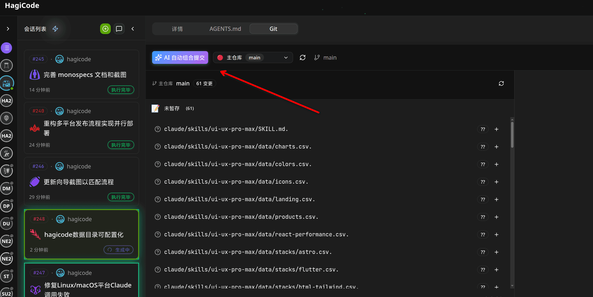
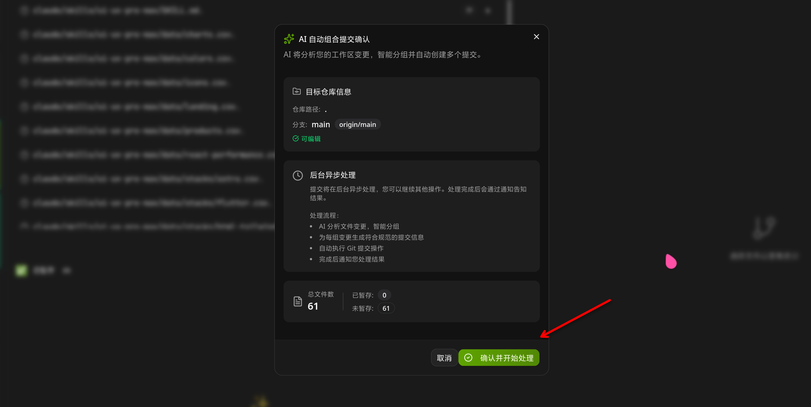
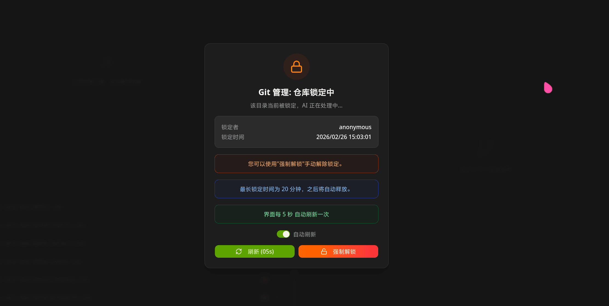

## 概述

### 什么是 AI Compose Commit

AI Compose Commit（AI 组合提交）是 HagiCode 提供的一项 AI 辅助功能，它可以智能分析你的代码变更，自动生成符合规范的 Git 提交信息。通过这项功能，你可以节省编写提交信息的时间，同时确保提交历史的清晰性和一致性。

这项功能特别适合以下场景：
- 大量代码变更需要快速提交
- 希望保持提交信息的规范格式
- 需要处理多个相关文件的组合提交
- 使用 monospecs 管理的多仓库项目

### 与传统手动提交的对比

| 特性 | 传统手动提交 | AI Compose Commit |
|------|-------------|-------------------|
| **提交质量** | 依赖个人经验和习惯，质量参差不齐 | 基于最佳实践自动生成，质量稳定 |
| **提交速度** | 需要仔细思考和组织语言 | 一键触发，AI 自动分析生成 |
| **一致性** | 容易出现风格不一致的问题 | 遵循统一格式，保持风格一致 |
| **多仓库处理** | 需要分别提交到各仓库 | 自动识别并提交到正确的仓库 |
| **提交分组** | 手动决定哪些变更放在一起 | AI 智能分析，合理分组提交 |

### 主要优势

- **节省时间**：无需手动编写提交信息，一键即可完成提交
- **提高质量**：基于代码变更的上下文智能生成，更准确反映变更内容
- **统一风格**：自动遵循 Conventional Commits 规范，保持提交历史整洁
- **智能分组**：AI 能够识别相关变更，将其组织成合理的多个提交
- **多仓库支持**：在 monospecs 管理的项目中，自动将变更提交到正确的子仓库
- **可追溯性**：自动添加 Co-Authored-By 标签，清晰标注 AI 参与贡献

## 快速开始

### 触发功能

在 HagiCode 的 Git 标签页中，找到"AI 自动组合提交"按钮并点击。



这个按钮位于 Git 操作区域的显著位置，通常在常规提交操作旁边。

**重要提示**：点击此按钮后，系统会自动分析并提交工作区的所有变更。如需回滚，请自行处理。

### 二次确认

首次使用或未同意风险提示时，系统会显示确认对话框。



对话框中包含以下选项：
- **确认并开始处理**：同意使用 AI 功能，开始分析变更
- **了解风险，不再提示此确认对话框**：勾选后，下次将不再显示此确认

建议首次使用时仔细阅读风险提示，确认无误后再勾选"不再提示"选项，后续使用会更加便捷。

### 查看结果

AI 处理完成后，会显示"✓ 处理完成"的成功提示。此时提交已经执行完成。

**注意**：AI Compose Commit 会自动执行 Git 提交命令，无需你再手动执行任何 `git commit` 操作。如果需要查看提交结果，可以：

1. 在 Git 标签页查看生成的提交历史
2. 在终端使用 `git log` 命令查看详细提交信息
3. 使用 `git show <commit-hash>` 查看单个提交的完整内容

## 功能详解

### AI 分析逻辑

AI Compose Commit 通过以下步骤分析你的代码变更：

1. **读取工作区变更**：系统收集所有已修改、新增和删除的文件
2. **分析文件内容**：AI 深入理解每个文件的变更内容
3. **识别变更关联性**：根据变更内容和文件路径，识别哪些变更应该组合在一起
4. **生成提交结构**：将变更分组为多个逻辑提交，每个提交代表一个独立的功能或修复
5. **编写提交信息**：为每个提交生成符合 Conventional Commits 规范的描述性信息

### 提交信息格式

AI 生成的提交信息遵循 Conventional Commits 规范，格式如下：

```
<type>(<scope>): <subject>

<body>

<footer>
```

- **type**：提交类型（如 feat、fix、docs、style、refactor、test、chore）
- **scope**：影响范围（可选）
- **subject**：简短的变更描述
- **body**：详细的变更说明（可选）
- **footer**：破坏性变更说明或关联 issues（可选）

示例：
```
feat(auth): add user login functionality

Implemented OAuth2 authentication with Google and GitHub providers.
The login component now supports:
- Google OAuth integration
- GitHub OAuth integration
- Session management with JWT tokens

Co-Authored-By: Claude Opus 4.6 <noreply@anthropic.com>
```

### 子仓库支持

在使用 monospecs 管理的项目中，AI Compose Commit 能够：

1. **读取 monospecs.yaml**：自动识别项目中的所有子仓库配置
2. **匹配文件路径**：将每个变更文件匹配到对应的子仓库
3. **智能分组**：根据子仓库将变更分组，确保每个提交只包含单一仓库的变更
4. **分别提交**：在每个子仓库中创建独立的提交，保持仓库历史的独立性

例如，你的修改涉及 `repos/frontend` 和 `repos/backend` 两个子仓库，AI 会：

- 分析前端的变更，生成一个提交提交到 `repos/frontend`
- 分析后端的变更，生成一个提交提交到 `repos/backend`
- 确保两个仓库的提交信息都准确反映各自的变更内容

### Co-Authored-By 标签

每个由 AI 生成的提交都会包含 `Co-Authored-By` 标签，格式如下：

```
Co-Authored-By: HagiCode <noreply@hagicode.com>
```

这个标签的作用包括：
- **明确贡献者**：清晰标注 AI 参与了此次提交
- **遵循规范**：符合 Git 对多人协作的贡献标注标准
- **版本追溯**：便于追踪 AI 生成的内容版本
- **版权说明**：在某些开源项目中，此标签有助于满足贡献声明要求

在提交过程中，你会在界面上看到仓库锁定提示，表明系统正在处理提交操作。



此时请勿进行其他 Git 操作，等待处理完成。

## 注意事项

### 使用限制

AI Compose Commit 功能存在以下限制：

1. **网络依赖**：需要连接到 AI 服务才能使用，确保网络连接稳定
2. **文件大小**：对于特别大的文件或大量变更，处理时间可能较长
3. **复杂逻辑**：对于极度复杂的业务逻辑变更，AI 可能无法完全理解上下文
4. **首次使用**：首次使用需要通过风险确认，后续使用更便捷
5. **仓库状态**：仅分析工作区的已暂存和未暂存变更，不会自动暂存文件

### 不适用的场景

以下情况建议手动提交而非使用 AI 功能：

1. **敏感变更**：涉及安全、隐私或合规性的关键变更
2. **需要详细说明**：需要特别详细的提交说明或关联多个 issues
3. **紧急修复**：需要快速修复 bug，不想等待 AI 处理
4. **代码审查**：在团队代码审查流程中，可能需要特定的提交信息格式
5. **回滚风险**：如果不希望 AI 自动提交，需要保留未提交的变更用于回滚

### 最佳实践

为了获得最佳的 AI 提交效果，建议遵循以下实践：

1. **保持变更专注**：每次提交尽量保持变更的相关性，避免混杂不相关的修改
2. **清晰的代码注释**：在关键代码中添加注释，帮助 AI 理解你的意图
3. **合理的文件命名**：使用清晰的文件命名约定，便于 AI 识别文件用途
4. **定期 review**：定期检查 AI 生成的提交信息，必要时进行微调
5. **结合手动提交**：对于重要的里程碑提交，可以考虑手动编写提交信息

### 获得最佳效果的建议

- **小批量提交**：建议在变更量适中时使用 AI 功能，大批量变更可以分多次处理
- **及时提交**：在完成一个功能单元后及时提交，避免变更堆积
- **使用描述性变量名**：清晰的变量和函数名有助于 AI 理解代码意图
- **添加必要的注释**：对于复杂的业务逻辑，添加注释可以帮助 AI 更好地理解

## 常见问题

### FAQ

**Q：AI Compose Commit 会修改我的代码吗？**

A：不会。AI 仅分析代码变更并生成提交信息，不会修改任何代码内容。

**Q：生成的提交信息可以修改吗？**

A：可以。AI 生成提交后，你可以使用 `git commit --amend` 或 `git rebase` 来修改提交信息。

**Q：AI 功能需要付费吗？**

A：AI Compose Commit 是 HagiCode 的免费功能，无需额外付费即可使用。

**Q：首次使用需要准备什么？**

A：确保已将项目添加到 HagiCode，并完成风险确认步骤即可开始使用。

**Q：处理大量变更需要多久？**

A：处理时间取决于变更数量和网络状况。一般情况下的变更可以在几秒到几十秒内完成。

**Q：如果 AI 生成的提交信息不准确怎么办？**

A：你可以手动修改提交信息，或在下次使用前尝试优化代码的命名和注释，帮助 AI 更好地理解。

**Q：可以使用 AI Compose Commit 提交已暂存的文件吗？**

A：可以。AI 会同时分析已暂存和未暂存的变更，建议在提交前先暂存相关文件以获得更准确的分组结果。

### 故障排除

**问题：点击按钮后没有反应**

- 检查网络连接是否正常
- 确认 HagiCode 应用是否正常运行
- 尝试重启应用后再试

**问题：处理时间过长**

- 检查变更文件的数量和大小
- 确认网络连接稳定
- 如果长时间无响应，可以取消操作，分批次提交

**问题：提示"风险确认"但无法找到确认对话框**

- 检查应用是否有其他窗口遮挡
- 尝试最小化和恢复应用窗口
- 查看应用设置中的隐私和权限配置

**问题：提交后看不到 Co-Authored-By 标签**

- 使用 `git log --format=full` 查看完整提交信息
- 确认提交是由 AI 功能生成的
- 手动修改的提交不会包含此标签
