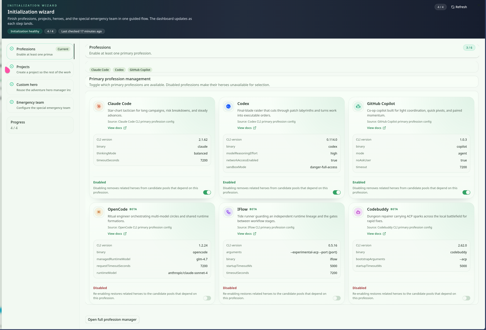
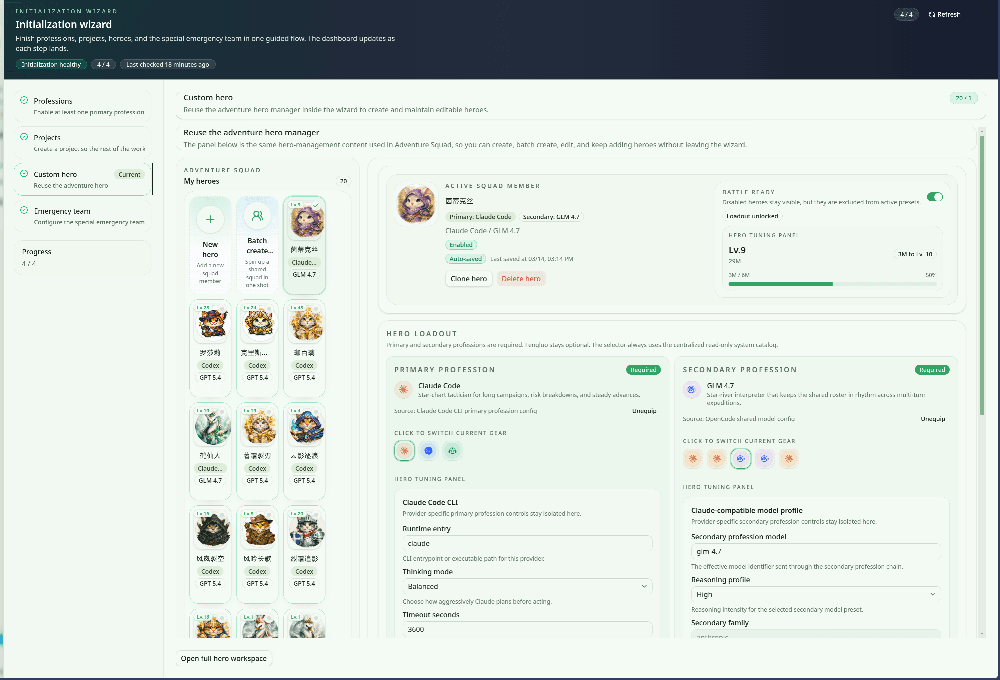
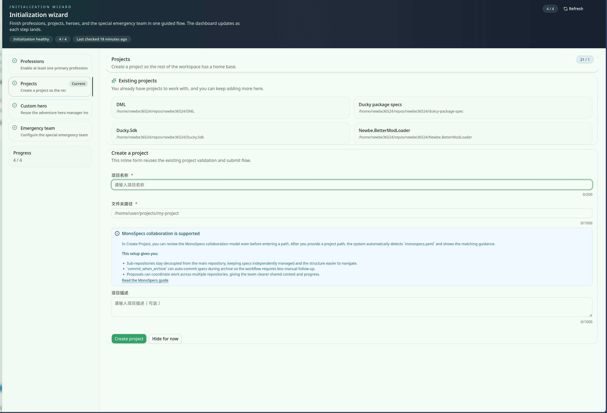

import { CardGrid, LinkCard } from '@astrojs/starlight/components';

初始化向导负责把“首次进入产品时最关键的准备动作”串成一条连续流程。与普通安装说明不同，这一页重点解释已经导入到受管截图中的三个关键步骤，让用户更容易理解每一步为什么存在。

## 向导概览

- 向导的目标是帮助新用户在最短路径内完成执行环境准备、初始英雄配置与项目落地。
- 当前首版文档聚焦三个最有代表性的步骤：职业管理、自定义英雄、创建项目。
- 三张截图都带有清晰的 sidebar steps，因此非常适合用来解释“这一步做什么”和“为什么它会影响后续流程”。
- 阅读完本页后，再进入安装或快速开始文档，会更容易理解这些步骤在完整入门旅程中的位置。

## 步骤 1：职业管理

职业管理步骤的重点，是先把系统中可用的 profession / CLI 能力准备好。截图里可以看到：

- 左侧 sidebar steps 用来告诉用户当前处于哪一个初始化阶段。
- 中间的 profession cards 汇总了版本、配置说明和当前可启用的能力。
- 开关与设置区域用于决定哪些能力会参与后续流程。

这一步决定了“后面有哪些执行者可以被调用”。如果这里没有先配置好，后续自定义英雄或项目创建时，就很难形成稳定的默认体验。

## 步骤 2：自定义英雄

进入自定义英雄步骤后，向导开始从“系统能力可用”过渡到“具体执行者如何组织”：

- roster 区域用于选择或创建本次初始化想要保留的英雄组合。
- 当前成员详情面板帮助用户快速确认角色定位、战备状态和可见属性。
- profession loadout settings 则把职业能力和英雄个体绑定起来，形成后续可复用的默认配置。

这一步和冒险团页面天然相连：向导负责建立第一版 roster，冒险团负责在日常任务里继续调度这些成员。

## 步骤 3：创建项目

项目创建步骤把前面准备好的环境和默认配置落到一个真实项目上。截图显示了三个关键信息块：

- 已有项目卡片：帮助用户判断是继续接管现有项目，还是新建一个项目入口。
- create-project form：填写项目名称、路径或其它必要信息，把初始化结果真正保存下来。
- 底部操作按钮：决定是返回上一步微调，还是确认进入后续使用流程。

如果说前两步是在准备“人”和“能力”，这一步就是把这些准备绑定到真实仓库与工作目录里，让后面的快速开始流程真正有对象可用。

## 继续阅读

<CardGrid>
  <LinkCard
    title="Desktop 安装指南"
    href="/installation/desktop"
    description="查看完整安装链路，了解初始化向导在桌面端首次启动时的上下文。"
  />
  <LinkCard
    title="创建您的第一个项目"
    href="/quick-start/create-first-project"
    description="继续阅读项目创建后的快速开始步骤，把向导结果接到真实仓库。"
  />
  <LinkCard
    title="冒险团介绍"
    href="/adventure-team-introduction"
    description="了解初始化完成后，英雄 roster 如何在冒险团工作台里继续被调度。"
  />
</CardGrid>
