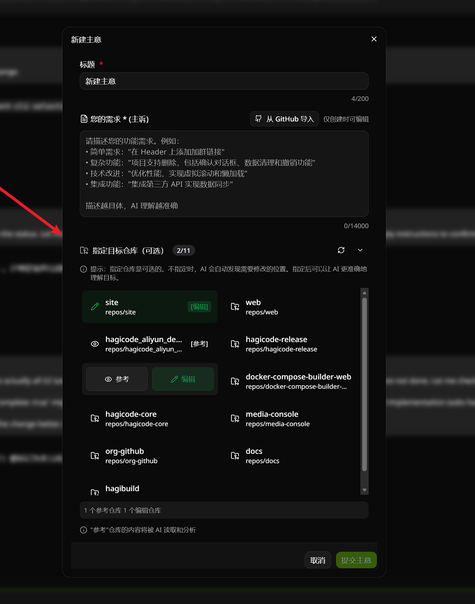
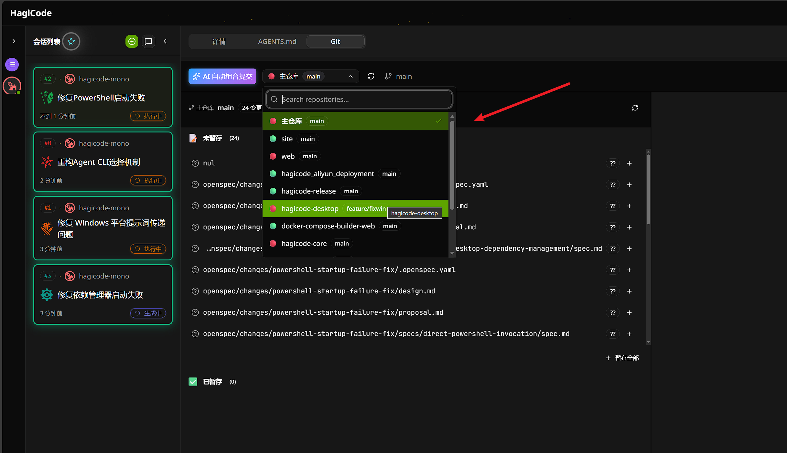

import { FileTree } from '@astrojs/starlight/components';

## 概述

Monospecs 是 HagiCode 提供的一种多仓库管理方案，通过 `monospecs.yaml` 配置文件来追踪和管理多个子仓库。这套方案可以应用于任何需要统一管理多个独立仓库的项目。

### 核心概念

**配置文件**

`monospecs.yaml` 是整个管理方案的核心，该文件定义了：

- 子仓库的列表和位置
- 每个仓库的 Git URL
- 显示名称和图标
- 与 OpenSpec 的集成行为

**与普通仓库的 OpenSpec 使用区别**

无论是 monospecs 管理的项目还是普通单仓库，都可以使用 HagiCode 的 OpenSpec 流程进行变更管理。两者的区别在于：

| 特性 | 普通仓库 | monospecs 管理的项目 |
|------|---------|---------------------|
| **OpenSpec 位置** | 仓库根目录的 `openspec/` | 主仓库根目录的 `openspec/` |
| **变更范围** | 仅限当前仓库 | 可以涉及多个子仓库 |
| **子仓库纯净度** | specs 与代码混在一起 | specs 独立在主仓库，子仓库更干净 |
| **归档自动提交** | 需要手动提交 specs 变更 | `commit_when_archive` 自动提交 specs 到主仓库 |

简而言之，monospecs 方案让 specs 与子仓库代码分离，保持子仓库干净，同时通过自动提交简化了 specs 的管理流程。

### 为什么使用 monospecs

- **统一管理**：在一个配置文件中追踪所有子仓库
- **自动化支持**：为脚本和工具提供仓库元数据
- **AI 友好**：结构化配置便于 AI Agent 理解仓库关系
- **OpenSpec 集成**：与变更管理工作流无缝集成

### 什么时候需要使用 monospecs

monospecs 特别适用于以下场景：

**1. 多仓库协同开发**

当一个项目被拆分为多个独立仓库时，需要统一管理：
- 前端应用、后端服务、桌面端分别独立开发
- 文档、官网、构建工具等辅助项目
- 各仓库之间有依赖关系，需要协调版本和变更

**2. 跨仓库功能开发**

使用 OpenSpec 进行变更管理时：
- 一个功能变更可能涉及多个仓库
- 需要追踪变更在哪些仓库中实施
- 自动将变更提交到正确的目标仓库

**3. AI 辅助开发**

为 AI Agent 提供项目结构信息：
- 通过 `AGENTS.md` 说明各仓库的技术栈和规范
- AI 可以根据配置理解仓库间的关系
- 支持跨仓库的代码生成和重构

**4. 持续集成/部署**

CI/CD 流水线需要：
- 批量处理多个仓库
- 根据配置自动构建和部署
- 追踪各仓库的版本和依赖关系

### monospecs 与普通仓库的区别

| 特性 | 普通多仓库项目 | monospecs 管理的项目 |
|------|---------------|---------------------|
| **仓库发现** | 手动查找和记录 | 从 `monospecs.yaml` 自动读取 |
| **批量操作** | 需要手动编写脚本 | 统一的配置驱动脚本 |
| **AI 支持** | 依赖文档说明 | 结构化配置 + `AGENTS.md` |
| **仓库元数据** | 分散在各处 | 集中管理（图标、名称、URL） |
| **新人入门** | 需要阅读多篇文档 | 运行一个脚本即可 |

### 项目结构说明

使用 monospecs 方案时，需要一个主仓库来管理配置，主仓库本身也是一个 Git 仓库，用于：

- 存储 `monospecs.yaml` 配置文件
- 管理跨仓库的配置和脚本
- 追踪子仓库的元数据关系

以 HagiCode Mono 项目为例，典型的 monospecs 项目结构如下：

<FileTree>
- your-project/         # 主仓库（Git 仓库）
  - .git/              # 主仓库的 Git 历史
  - .gitignore         # 排除 repos/ 目录
  - monospecs.yaml     # 仓库配置文件
  - openspec/          # OpenSpec 变更目录（可选）
  - repos/             # 子仓库目录（不在 Git 中）
    - frontend/        # 子仓库（独立 Git 仓库）
    - backend/         # 子仓库（独立 Git 仓库）
    - ...              # 其他子仓库
</FileTree>

所有子仓库都应该放在 `repos/` 目录下，并且该目录**必须被排除在主仓库的 Git 版本控制之外**。这可以通过在主仓库的 `.gitignore` 文件中添加以下内容实现：

```plaintext
# 排除所有子仓库
repos/
```

这样可以避免主仓库跟踪子仓库的内容，每个子仓库独立管理自己的版本控制。

## 快速开始

本节将引导你完成 monospecs 的初始化配置，让你能够快速开始使用多仓库管理功能。

### 初始化

按照以下步骤完成 monospecs 的初始化配置：

#### 1. 创建空的 git 文件夹

在你的主仓库中创建一个空的 `git` 文件夹（注意：这是 `git` 而不是 `repos`，这是 monospecs 的约定）：

```bash
mkdir git
cd git
git init
cd ..
```

#### 2. 配置 monospecs 文件

在主仓库根目录创建 `monospecs.yaml` 配置文件，添加你需要管理的子仓库：

```yaml
version: "1.0"
commit_when_archive: true

repositories:
  - path: "repos/frontend"
    url: "https://github.com/your-org/frontend.git"
    displayName: "前端应用"
    icon: "🌐"
  - path: "repos/backend"
    url: "https://github.com/your-org/backend.git"
    displayName: "后端服务"
    icon: "⚙️"
```

#### 3. 添加 .gitignore 配置

在主仓库的 `.gitignore` 文件中添加以下内容，排除子仓库目录：

```plaintext
# 排除所有子仓库
repos/
```

#### 4. 拉取所有子仓库（repo）

使用 clone 脚本拉取配置的子仓库。

这将根据 `monospecs.yaml` 中的配置克隆所有子仓库到 `repos/` 目录。

#### 5. 将父仓库加入到 hagicode

如果你使用 HagiCode 桌面应用，打开应用后通过界面将主仓库添加为项目。点击"添加项目"或"+"按钮，选择你的主仓库文件夹即可。

如果一切配置正确，你将看到所有子仓库的列表和状态信息。

## monospecs.yaml 配置

### 配置文件位置

配置文件位于项目根目录：

<FileTree>
  - your-project/
    - monospecs.yaml
</FileTree>

### 配置项说明

```yaml
# 版本号
version: "1.0"

# 归档时自动提交（OpenSpec 使用）
commit_when_archive: true

# 仓库列表
repositories:
  # 仓库路径（相对于项目根目录）
  - path: "repos/frontend"
    # Git 仓库 URL
    url: "https://github.com/your-org/frontend.git"
    # 显示名称
    displayName: "前端应用"
    # 图标（emoji）
    icon: "🌐"
```

| 配置项 | 类型 | 必需 | 说明 |
|--------|------|------|------|
| `version` | string | 是 | 配置文件版本 |
| `commit_when_archive` | boolean | 否 | 归档时是否自动提交 specs 到主仓库（不提交子仓库代码） |
| `repositories` | array | 是 | 仓库配置列表 |
| `repositories[].path` | string | 是 | 仓库相对路径 |
| `repositories[].url` | string | 是 | Git 仓库 URL |
| `repositories[].displayName` | string | 是 | 仓库显示名称 |
| `repositories[].icon` | string | 否 | 仓库图标（emoji） |

## 仓库管理操作

### 添加新仓库

在 `monospecs.yaml` 的 `repositories` 数组中添加新条目：

```yaml
repositories:
  # ... 现有仓库
  - path: "repos/new-service"
    url: "https://github.com/HagiCode-org/new-service.git"
    displayName: "新服务"
    icon: "🆕"
```

### 更新仓库配置

当仓库 URL 或元数据变更时：

1. 编辑 `monospecs.yaml` 更新对应条目
2. 验证 YAML 语法正确性
3. 如需同步变更，手动更新本地仓库配置

## 核心功能

本节介绍 monospecs 与 OpenSpec 集成后的核心可视化功能，帮助你更直观地了解和使用这些功能。

> **注意**：以下截图展示的是启用 monospecs 后的效果。

### 子仓库选择

在创建新提案时，你可以选择参考和编辑的目标子仓库。系统会自动检测并展示可用的子仓库列表。



在创建变更时，OpenSpec 会读取 `monospecs.yaml` 配置，列出所有可用的子仓库供你选择。你可以选择需要修改的子仓库，系统会自动追踪变更涉及的范围。

### 仓库详情预览

将鼠标悬停在项目上时，会显示各个子仓库的详细信息和状态。


通过这种交互式的预览方式，你可以快速了解：
- 各子仓库的最后更新时间和提交者
- 仓库的当前状态（是否有未提交的更改）
- 仓库的技术栈和配置信息

### AI 提交子仓库选择

使用 AI 提交变更时，可以选择指定的子仓库作为目标。



AI 提交功能会：
1. 读取 `monospecs.yaml` 配置
2. 分析你的变更内容
3. 建议你应该提交到哪些子仓库
4. 你可以选择接受建议或手动指定目标仓库

## 与 OpenSpec 集成

无论是 monospecs 管理的项目还是普通仓库，都可以使用 HagiCode 的 OpenSpec 流程。主要区别在于 OpenSpec 文件夹的位置和变更的分发方式。

### OpenSpec 文件夹位置

**普通仓库**：
```
my-repo/
  - openspec/          # OpenSpec 变更目录（与代码混在一起）
  - src/
```

**monospecs 管理的项目**：
```
your-project/          # 主仓库
  - openspec/          # OpenSpec 变更目录（独立管理）
  - monospecs.yaml
  - repos/
    - frontend/        # 子仓库（更干净，无 openspec/）
    - backend/         # 子仓库（更干净，无 openspec/）
```

**优势**：将 specs 独立在主仓库中，子仓库保持纯净，只包含实际代码，不混入规范文档。

### 变更分发机制

**普通仓库**：
- 变更仅作用于当前仓库
- specs 与代码在同一个仓库中
- 归档后需要手动提交 specs 相关变更

**monospecs 管理的项目**：
- OpenSpec 读取 `monospecs.yaml` 识别仓库范围
- 根据变更文件的路径自动匹配目标仓库
- `commit_when_archive: true` 时，归档自动提交 specs 到主仓库，无需手动操作
- 子仓库的实际代码变更需要手动提交

### commit_when_archive 说明

当设置 `commit_when_archive: true` 时：

```yaml
version: "1.0"
commit_when_archive: true  # 归档时自动提交 specs 到主仓库
```

**归档时的行为**：
- OpenSpec 自动将 specs 的变更（proposal、design、tasks 等）提交到主仓库
- 不会提交子仓库的实际代码变更（代码需要手动提交）
- 省去了手动管理 specs 版本控制的麻烦

**示例流程**：
1. 创建变更 `openspec/changes/add-user-auth/`
2. 完成设计和任务，实现代码功能
3. 执行归档操作
4. OpenSpec 自动提交 specs 到主仓库
5. 手动提交子仓库的代码变更

### 示例

在 monospecs 管理的项目中创建一个变更：

```
openspec/changes/add-user-auth/
  - proposal.md
  - design.md
  - tasks.md
```

当这个变更涉及修改 `repos/frontend/src/components/Login.tsx` 时：

1. OpenSpec 读取 `monospecs.yaml`
2. 识别 `repos/frontend` 对应的仓库配置
3. 开发者实现代码变更
4. 归档时，OpenSpec 自动提交 specs 到主仓库
5. 开发者手动提交 frontend 子仓库的代码变更

### AI Agent 配置支持

使用 monospecs 方案的项目支持通过 `AGENTS.md` 为 AI Agent 提供项目特定指导：

<FileTree>
- your-project/
  - AGENTS.md           # 主仓库级别的 Agent 配置
  - repos/
    - frontend/
      - AGENTS.md       # 仓库特定的 Agent 配置（继承主配置）
    - backend/
      - AGENTS.md       # 后端仓库的 Agent 配置
</FileTree>

每个仓库的 `AGENTS.md` 可以包含：

- **技术栈说明**：框架、构建工具、状态管理等
- **代码规范**：命名约定、文件结构、最佳实践
- **项目特定行为**：与主仓库配置的扩展或差异
- **OpenSpec 集成**：如何参与变更管理工作流

这种分层配置让 AI Agent 能够：
1. 理解主仓库的全局规范
2. 识别各仓库的特殊要求
3. 在跨仓库操作时保持一致性

## 最佳实践

### 命名约定

- **仓库路径**：使用 `repos/` 前缀，保持一致性
- **仓库名称**：使用 kebab-case（小写字母和连字符）
- **显示名称**：使用简洁的中文名称
- **图标选择**：使用与仓库功能相关的 emoji

### 配置维护

1. **同步配置与实际状态**：定期确保 `monospecs.yaml` 反映真实的仓库结构
2. **版本控制**：所有配置变更都应提交到版本控制
3. **文档更新**：添加或移除仓库时更新相关文档

### 验证方法

- 确认仓库路径不包含特殊字符
- 验证 YAML 语法正确性
