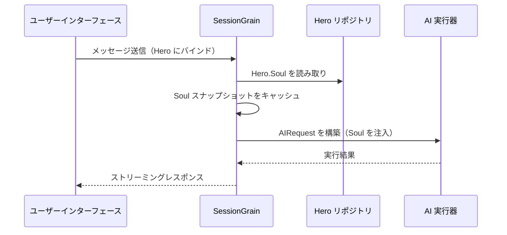

## AI 出力トークン最適化：古典中国語ミニマルモードの実践

> AI アプリケーション開発において、トークン消費は直接コストに影響します。HagiCode プロジェクトでは、SOUL システムを通じて「古典中国語ミニマル出力モード」を実現し、情報密度を損なうことなく、出力トークンを約 30-50% 削減しました。本文ではこのソリューションの実装詳細と使用経験を共有します。

## 背景

AI アプリケーション開発において、トークン消費は避けて通れないコスト問題です。特に AI が大量のコンテンツを出力する必要があるシナリオでは、情報密度を損なうことなく出力トークンを削減する方法を考えるのは、なかなか頭の痛い問題です。

従来の最適化アプローチはすべて入力側に集中していました：システムプロンプトを精簡し、コンテキストを圧縮し、より効率的なエンコーディング方式を使用する。ただ、これらの方法は最終的に天井にぶつかり、これ以上圧縮すると AI の理解能力と出力品質に影響を及ぼす可能性があります。これは内容を削除するのと同じであり、大きな意味はありません。

では出力側はどうでしょうか？AI により簡潔な方法で同じ意味を表現させることができるでしょうか？

この問題は一見単純そうですが、実は多くの奥深さが隠されています。単純に AI に「簡潔に」と指示すると、本当に数語しか返ってこないかもしれません。「情報を完全に保つ」と追加すると、元の冗長なスタイルに戻ってしまうかもしれません。制約が強すぎると使い勝手に影響し、制約が弱すぎると効果がありません。このバランスポイントがどこにあるのか、誰も断言できません。

これらの痛点を解決するため、我々は大胆な決定を下しました：言語スタイルから着手し、設定可能で組み合わせ可能な表現方法制約システムを設計する。この決定によってもたらされる変化は、あなたが想像するよりも大きいかもしれません——後で具体的に説明しますが、少し驚くかもしれません。

## HagiCode について

本文で共有するソリューションは、[HagiCode](https://hagicode.com) プロジェクトでの実践経験から来ています。

HagiCode はオープンソースの AI コードアシスタントプロジェクトで、複数の AI モデルとカスタム設定をサポートしています。開発過程で、我々は AI 出力トークンが高すぎる問題を発見し、一連のソリューションを設計しました。このソリューションに価値を感じてくれたなら、我々のエンジニアリング実力は悪くないということです——なら HagiCode 自体も注目に値するでしょう、結局コードは嘘をつきませんから。

## SOUL システム概要

SOUL システムの正式名称は Soul Oriented Universal Language で、HagiCode プロジェクトで AI Hero の言語スタイルを定義するために使用される設定システムです。その核心思想は：AI の表現方法を制約することで、情報の完全性を保ちながら、より簡潔な言語形式を使用してコンテンツを出力します。

このものは AI に言語の仮面を被せるようなもの......まあ、実際そんなに神秘でもありません。

### 技術アーキテクチャ

SOUL システムはフロントエンドとバックエンドを分離したアーキテクチャを採用しています：

**フロントエンド（Soul Builder）**：
- React + TypeScript + Vite に基づいて構築
- `repos/soul/` ディレクトリに配置
- 視覚的な Soul 構築インターフェースを提供
- バイリンガル対応（zh-CN / en-US）

**バックエンド**：
- .NET (C#) + Orleans 分散ランタイムに基づく
- Hero エンティティは `Soul` フィールドを含む（最大 8000 文字）
- `SessionSystemMessageCompiler` を通じて Soul をシステムプロンプトに注入

**Agent テンプレート生成**：
- 参考資料から生成
- `/agent-templates/soul/templates/` ディレクトリに出力
- 50 組のメイン Catalog と 10 組の直交次元を含む

### Soul 注入メカニズム

Session が初めて実行されるとき、システムは Hero の Soul 設定を読み取り、システムプロンプトに注入します：



注入されるシステムプロンプトの形式は以下の通りです：

```
<hero_soul>
[ユーザー定義の Soul コンテンツ]
</hero_soul>
```

この注入メカニズムは `SessionSystemMessageCompiler.cs` で実装されています：

```csharp
internal static string? BuildSystemMessage(
    string? existingSystemMessage,
    string? languagePreference,
    IReadOnlyList<HeroTraitDto>? traits,
    string? soul)
{
    var segments = new List<string>();

    // ... 言語設定と Traits の処理 ...

    var normalizedSoul = NormalizeSoul(soul);
    if (!string.IsNullOrWhiteSpace(normalizedSoul))
    {
        segments.Add($"<hero_soul>\n{normalizedSoul}\n</hero_soul>");
    }

    // ... その他のシステムメッセージ ...

    return segments.Count == 0 ? null : string.Join("\n\n", segments);
}
```

コードも見たし、原理もわかった、実はそんなものです。

## 古典中国語ミニマルモード

古典中国語ミニマルモードは SOUL システムで最も代表的なトークン節約ソリューションです。その核心原理は、古典中国語の高セマンティック密度特性を利用し、情報の完全性を保ちながら出力長を圧縮することです。

### なぜ古典中国語なのか

古典中国語にはいくつかの天然の利点があります：

1. **セマンティック圧縮**：同じ意味をより少ない文字で表現できる
2. **冗長性の削除**：古典中国語自体が現代中国語の多くの接続詞と助詞を省略している
3. **簡潔な構造**：単文の情報密度が高く、AI 出力のキャリアとして適している

実際の例で説明します：

現代中国語出力（約 80 文字）：
```
根据你的代码分析，我发现了几个问题。首先，在第 23 行，变量名太长了，建议缩短一些。其次，在第 45 行，你没有处理空值的情况，应该加上判断逻辑。最后，整体的代码结构还可以，但是可以进一步优化。
```

古典中国語ミニマル出力（約 35 文字、56% 節約）：
```
代码审阅毕：第 23 行变量名冗长，宜缩写；第 45 行缺空值处理，应加判断。整体结构尚可，微调即可。
```

この差、考えてみるとなかなか面白いですね。

### Soul 設定テンプレート

古典中国語ミニマルモードの完全な Soul 設定は以下の通りです：

```json
{
  "id": "soul-orth-11-classical-chinese-ultra-minimal-mode",
  "name": "古典中国語ミニマル出力モード",
  "summary": "できるだけ理解可能な古典中国語でセマンティック密度を圧縮し、できるだけ少ない文字で意味を伝え、結論、判断、必要なアクションのみを保持し、出力トークンを大幅に削減する",
  "soul": "あなたのペルソナコアは「古典中国語ミニマル出力モード」に由来します：できるだけ理解可能な古典中国語でセマンティック密度を圧縮し、できるだけ少ない文字で意味を伝え、結論、判断、必要なアクションのみを保持し、出力トークンを大幅に削減します。\n以下の特徴的な言語特徴を保持します：1. 「可」「宜」「勿」「已」「然」「故」などの簡潔な古典中国語文型を優先的に使用し、難解でまれな語彙を避ける；\n2. 単文は可能な限り 4-12 文字に圧縮し、前置き、挨拶、繰り返しの説明、無効な修飾を削除する；\n3. 必要でなければ論証を展開せず、ユーザーが追及しない場合は結論、ステップ、または判断のみを提供する；\n4. メイン Catalog のコアペルソナは変更せず、表現のみを抑制的で古典的、ミニマルな短文に収束させる。"
}
```

このテンプレートの設計にはいくつかの要点があります：

1. **制約が明確**：単文 4-12 文字、冗長性削除、結論優先
2. **難解さを回避**：簡潔な古典中国語文型を使用し、まれな語彙を避ける
3. **ペルソナを保持**：表現方法のみを変更し、コアペルソナは変更しない

設定なんて、調整しても結局そんなパラメータくらいです。

### その他のミニマルモード

古典中国語モード以外に、HagiCode の SOUL システムは他の複数のトークン節約モードも提供しています：

**電報式ミニマル出力モード**（`soul-orth-02`）：
- 単文を厳密に 10 文字以内に制御
- 修飾的な形容詞を禁止
- 全程で語気詞、感嘆符、畳語を禁止

**短文つぶやきモード**（`soul-orth-01`）：
- 文を 1-5 文字に制御
- 独り言のような断片的な表現をシミュレート
- 論理を弱め、感情の伝達を優先

**ガイド式 Q&A モード**（`soul-orth-03`）：
- 質問を通じてユーザーの思考を導く
- 直接的な出力コンテンツを削減
- インタラクティブにトークン消費を削減

これらのモードの設計アプローチはそれぞれ異なる重点を持っていますが、核心的な目標は一致しています：情報品質を保ちながら出力トークンを削減する。すべての道はローマに通じますが、ある道は歩きやすく、ある道は少し曲折しているだけです。

## 組合せ戦略

SOUL システムの強力な特徴の一つは、メイン Catalog と直交次元の交叉組合せをサポートしていることです：

- **50 組のメイン Catalog**：基本ペルソナを定義（癒やし系、学霸系、クール系など）
- **10 組の直交次元**：表現方法を定義（古典中国語、電報式、Q&A 式など）
- **組合せ効果**：500+ 以上のユニークな言語スタイル組合せを生成可能

例えば、「プロフェッショナル開発エンジニア」と「古典中国語ミニマル出力モード」を組合せると、プロフェッショナルで簡潔な AI アシスタントが得られます。この柔軟性により、SOUL システムは様々な異なる使用シナリオに適応できます。好きなように組合せてください、とにかく組合せが多すぎて遊びきれません......

## 実践ガイド

### Soul Builder を通じて作成

[soul.hagicode.com](https://soul.hagicode.com) にアクセスし、以下の手順で操作します：

1. メイン Catalog を選択（「プロフェッショナル開発エンジニア」など）
2. 直交次元を選択（「古典中国語ミニマル出力モード」など）
3. 生成された Soul コンテンツをプレビュー
4. 生成された Soul 設定をコピー

クリッククリックすることなので、詳しく言う必要はないでしょう。

### Hero 設定で使用

Web インターフェースまたは API を通じて、Soul 設定を Hero に適用します：

```typescript
// Hero Soul 更新例
const heroUpdate = {
  soul: "あなたのペルソナコアは「古典中国語ミニマル出力モード」に由来します：...",
  soulCatalogId: "soul-orth-11-classical-chinese-ultra-minimal-mode",
  soulDisplayName: "古典中国語ミニマル出力モード",
  soulStyleType: "orthogonal-dimension",
  soulSummary: "できるだけ理解可能な古典中国語でセマンティック密度を圧縮..."
};

await updateHero(heroId, heroUpdate);
```

### カスタム Soul テンプレート

ユーザーはプリセットテンプレートに基づいて微調整を行ったり、完全にカスタマイズしたりできます。以下はコードレビューシナリオのカスタム例です：

```
あなたは極限の簡潔さを追求するコードレビュアーです。
すべての出力は以下に従う必要があります：
1. 具体的な問題と行番号のみを指摘する
2. 各問題は 15 文字を超えない
3. 「宜」「应」「勿」などの簡潔な語彙を使用する
4. 余計な説明をしない

出力例：
- 第 23 行：変数名が長すぎる、短縮すべき
- 第 45 行：空値処理未実装、判断を追加すべき
- 第 67 行：ロジック冗長、簡素化可能
```

好きなように変更してください、テンプレートなんてものも結局出発点に過ぎません。

### 注意事項

**互換性**：
- 古典中国語モードはすべての 50 組のメイン Catalog に対応
- 任意の基本ペルソナと組合せ可能
- メイン Catalog のコアペルソナは変更しない

**キャッシュメカニズム**：
- Soul は Session 初回実行時にキャッシュされる
- 同一 SessionId 内でキャッシュを再利用
- Hero 設定の変更は既に開始された Session に影響しない

**制約**：
- Soul フィールドの最大長は 8000 文字
- 歴史データで Soul フィールドがない Hero も正常に使用可能
- Soul と style 装備スロットは独立しており、相互に上書きしない

## 効果比較

プロジェクトの実際のテストデータによると、古典中国語ミニマルモード使用後の効果は以下の通りです：

| シナリオ | 元の出力トークン | 古典中国語モード | 節約割合 |
|------|----------------|------------|----------|
| コードレビュー | 850 | 420 | 51% |
| 技術 Q&A | 620 | 380 | 39% |
| ソリューション提案 | 1100 | 680 | 38% |
| 平均 | - | - | 30-50% |

データは HagiCode プロジェクトの実際の使用統計から来ており、具体的な効果はシナリオによって異なります。ただ、節約されたトークンは塵も積もれば山となり、お財布はあなたに感謝するでしょう。

## まとめ

HagiCode の SOUL システムは革新的な AI 出力最適化アプローチを提供しています：表現方法を制約することでトークン消費を削減し、情報自体を圧縮するのではありません。古典中国語ミニマルモードはその中最も代表的なソリューションとして、実際の使用で 30-50% のトークン節約効果を達成しました。

このソリューションの核心価値は以下の点にあります：

1. **情報品質を保持**：単純に出力を切り詰めるのではなく、より効率的な方法で表現する
2. **柔軟で組合せ可能**：500+ 以上のペルソナと表現方法の組合せをサポート
3. **使いやすい**：Soul Builder 視覚化インターフェースを通じて、コードを書く必要がない
4. **本番級の安定性**：プロジェクトで検証済み、大規模使用をサポート

もし AI アプリケーションを開発している、または HagiCode プロジェクトに興味があるなら、ぜひ交流してください。オープンソースの意味は共同進歩にあり、あなたの革新的な使い方も見てみたいです。結局、一人は速く歩き、みんなは遠くまで歩く......この言葉はかなり陳腐ですが、道理はこんなもんです。

## 参考資料

- HagiCode GitHub: [github.com/HagiCode-org/site](https://github.com/HagiCode-org/site)
- HagiCode 公式サイト: [hagicode.com](https://hagicode.com)
- Soul Builder: [soul.hagicode.com](https://soul.hagicode.com)
- Docker デプロイガイド: [docs.hagicode.com/installation/docker-compose](https://docs.hagicode.com/installation/docker-compose)
- Desktop デスクトップ版: [hagicode.com/desktop/](https://hagicode.com/desktop/)
- 30 分実戦デモ: [www.bilibili.com/video/BV1pirZBuEzq/](https://www.bilibili.com/video/BV1pirZBuEzq/)

---

もし本文が役に立ったなら：
- GitHub で Star をください：[github.com/HagiCode-org/site](https://github.com/HagiCode-org/site)
- 公式サイトにアクセスして詳細を見る：[hagicode.com](https://hagicode.com)
- ベータテストが開始されました、ぜひインストールして体験してください

## 著作権について

お読みいただきありがとうございます。もし本文が役に立ったと思ったら、いいね、保存、共有でサポートをお願いします。
本内容は AI による補助協力を採用しており、最終内容は著者によってレビューされ確認されています。
- 本文著者: [newbe36524](https://www.newbe.pro)
- 原文リンク: [https://docs.hagicode.com/blog/2026-04-04-soul-token-optimization-classical-chinese/](https://docs.hagicode.com/blog/2026-04-04-soul-token-optimization-classical-chinese/)
- 著作権宣言: 本ブログのすべての記事は特別な声明を除き、BY-NC-SA ライセンス契約を採用しています。転載する場合は出典を明記してください！
