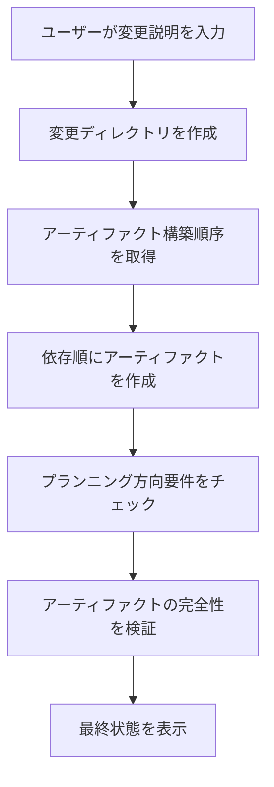
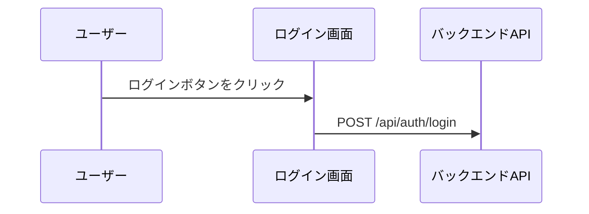

## OpenSpecステップのカスタマイズでAI生成結果を改善する

> OpenSpecで技術提案を管理している際、AIが生成するドキュメントの品質が不安定な問題に遭遇しました。他に方法もなく、自分でプロンプトテンプレートを修正するしかありませんでした。この記事は、あの頃の記録です。

## 背景

OpenSpecは技術提案を管理するシステムで、核心となるアイデアはとてもシンプルです：変更説明を入力すると、様々なドキュメントアーティファクトを自動生成します。proposal、design、specs、tasks、これらすべてが自動生成できます。素晴らしいと思いませんか？

ただ実際に使ってみると、いくつかの問題が見つかりました。まあ、大きな問題ではありませんが、生成されるものがなんだかしっくりきませんでした。

生成される`design.md`には必要な可視化要素が欠けています——Mermaidのフローチャートも、シーケンス図も、アーキテクチャ図もありません。 such design documents, the technical team just shakes their heads - after all, who wants to read a bunch of plain text?

`proposal.md`も不十分で、コード変更表がなく、UIプロトタイプもありません。意思決定者が見ても、結局何が変更されたのか分からないままです。

さらに厄介なのは`tasks.md`で、様々なGit操作タスクが混入しています。責任の境界が曖昧になり、開発者はどのタスクをすべきか、すべきでないか分からなくなります。これも少し無奈です。AIはチームの役割分担がどうなっているか知らないですから。

ドキュメントレベルごとの可視化要件も明確ではありません。proposalとdesignにはどのような図表を含めるべきでしょうか？この問題はずっとチームを悩ませていました。

これらの問題の根源はどこにあるのでしょうか？分析の結果、重要な点が見つかりました：プロンプトテンプレートに明確な制約とガイダンスが不足しているのです。

これは驚くことではありません。テンプレート自体が汎用的であり、すべてのチームのニーズに完全に適合させることは不可能だからです。

## HagiCodeについて

この記事で共有するソリューションは、[HagiCode](https://hagicode.com)プロジェクトでの実践経験から来ています。HagiCodeはAIコードアシスタントプロジェクトで、開発過程でOpenSpecを広く使用して技術提案を管理しています。

まさにこれらの実際の試行錯誤の経験が、この改善ソリューションの誕生を促しました。実は大したことではありません。問題に遭遇し、問題を解決したまでです。

## 分析：プロンプトシステムアーキテクチャ

問題を解決するには、まずシステムを理解する必要があります。OpenSpecのプロンプトシステムがどのように動作するか見てみましょう。

OpenSpecはHandlebarsテンプレートシステムを使用しており、各プロンプトには2つの部分が含まれています：

**JSONメタデータファイル**：パラメータ、シナリオ、バージョン情報を定義
**Handlebarsテンプレートファイル**：実際のプロンプト内容を含む

```
Resources/Prompts/
├── openspec-v1-ff.zh-CN.json    # メタデータ
├── openspec-v1-ff.zh-CN.hbs     # テンプレート内容
├── openspec-v1-ff.en-US.json
└── openspec-v1-ff.en-US.hbs
```

この分離設計の利点は明らかです：メタデータとコンテンツを別々に管理することで、保守とローカライズが容易になります。これはコードを書くのにも似ていて、ロジックと表現を分離する、みんな知っていることです。

FF（Fast Forward）ワークフローはOpenSpecの中核となる生成プロセスです：



このプロセスは完璧に見えますが、問題は「プランニング方向要件」のステップにあります——十分に明確なガイダンスがありません。

これも少し無奈です。システム設計時、すべてのチームの具体的なニーズを考慮することは不可能ですから。

## プランニング方向システム

プランニング方向システムはOpenSpecの中核となるカスタマイズメカニズムで、ユーザーが異なる生成オプションを選択できます。HagiCodeプロジェクトでは以下の方向を定義しています：

| 方向ID | 機能 | デフォルト有効 |
|---------|------|---------|
| `explore` | 探索モード | はい |
| `change-map` | 変更マップ | はい |
| `flowchart` | インタラクションフローチャート | はい |
| `prototype` | UIプロトタイプ | はい |
| `architecture` | アーキテクチャ図 | はい |
| `sequence` | APIシーケンス図 | はい |

各方向は安定した識別子、デフォルト有効状態、表示ラベル、および中英文のプロンプトフラグメントを定義しています。

このシステムは巧妙に設計されていますが、HagiCodeの実践では、定義だけでは不十分であることが分かりました——プロンプトテンプレートでこれらの方向を明示的に使用する必要があります。

これは人生の多くのことにも似ています。選択肢があっても選択をするとは限りません。誰かにどう選ぶべきか教えてもらう必要があります。

## ソリューション：明確な制約と例

私たちの改善アプローチはとても直感的です：プロンプトテンプレートに明確な制約と参考例を追加します。

実は特別なことはありません。ただ、はっきりと言葉にするだけです。

### 1. ドキュメント可視化要件を追加

`openspec-v1-ff.zh-CN.hbs`テンプレートで、明確なコンテンツ範囲制約を追加しました：

```markdown
### tasks.md コンテンツ範囲制約

`tasks.md`アーティファクトを作成する際、以下のコンテンツ範囲制約を遵守する必要があります：

必須：
- ビジネスロジックタスク（コード実装、機能開発）
- 技術実装タスク（コンポーネント統合、API開発）
- テストタスク（単体テスト、統合テスト）
- ドキュメントタスク（ドキュメント更新、コメント追加）

禁止：
- Gitコミット操作（git add、git commit、git push）
- バージョン管理管理ワークフロー
- デプロイとリリース操作
```

規範的な「必須/禁止」言語を使用し、「推奨」や「可能」ではなく、これによりAIが制約をより正確に理解できます。

これは子供を教えるのにも似ています。言ったことがそのままです。曖昧さがあってはいけません。

### 2. 各方向に参考例を提供

「フローチャートを含める」と言うだけでは不十分です。有効な各方向に具体的な出力例を提供しました。

やはり、言うだけでは空念です。具体的な例を与えれば、AIはより良く理解できます。

**変更マップ方向の例**：
```markdown
| ファイルパス | 変更タイプ | 変更理由 | 影響範囲 |
|---------|---------|---------|---------|
| Path/to/file | 新規 | 説明 | モジュール名 |
```

**プロトタイプ方向の例**：
```
┌─────────────────────────────────────────┐
│ ユーザーログイン                            [×] │
├─────────────────────────────────────────┤
│  メールアドレス *                             │
│ ┌─────────────────────────────────────┐ │
│ │ user@example.com                   │ │
│ └─────────────────────────────────────┘ │
└─────────────────────────────────────────┘
```

**フローチャート方向の例**：


これらの例により、AIは期待される出力形式を正確に理解でき、勝手に解釈することがなくなります。

これは試験時に参考答案を与えるのにも似ています。完全に同じである必要はありませんが、形式は合っている必要があります。

### 3. 規範的な言語で要件を明確化

異なるドキュメントタイプの可視化要件に対して、規範的な言語で制約します：

```markdown
proposal.mdの場合：
- コード変更表を含める必要があります（change-map方向が有効な場合）
- UIプロトタイプ図を含める必要があります（UI変更が関わり、prototype方向が有効な場合）
- 詳細なアーキテクチャ図を含めないでください（これらはdesign.mdにあるべきです）

design.mdの場合：
- proposal.mdのすべての内容を含める必要があります（より詳細なバージョン）
- アーキテクチャ図を含める必要があります（architecture方向が有効な場合）
- データフロー図を含める必要があります（flowchart方向が有効な場合）
```

このような明確な制約が生成品質を大幅に改善しました。

実のところ、特別なことはありません。ただ、はっきりと言葉にして、AIに推測させないようにするだけです。

## 実践：コード実装

理論は終わったので、HagiCodeプロジェクトでどのように実装されているか見てみましょう。

### プランニング方向の定義

`ProposalPlanningDirections.cs`でプランニング方向を定義します：

```csharp
public static class ProposalPlanningDirections
{
    private static readonly ProposalPlanningDirectionDefinition[] Catalog =
    [
        new(
            ChangeMapId,
            "Change map",
            DefaultEnabled: true,
            EnglishPromptFragment:
            "- Change map: include structured file-impact views...",
            ChinesePromptFragment:
            "- 变更地图：加入结构化的文件影响视图..."),
        // ... 他の方向
    ];

    public static string RenderInstructionBlock(
        IEnumerable<ProposalPlanningDirectionState> directions,
        string? locale)
    {
        var enabledDirections = directions
            .Where(direction => direction.Enabled)
            .ToArray();

        if (enabledDirections.Length == 0)
        {
            return string.Empty;
        }

        var heading = IsChineseLocale(locale)
            ? "本次生成启用以下规划方向："
            : "Apply the following planning directions:";

        return string.Join(Environment.NewLine,
            [heading, .. enabledDirections.Select(d => d.GetPromptFragment(locale))]);
    }
}
```

このコードには注目すべき設計ポイントがいくつかあります：

1. リストではなく配列を使用します。定義は実行時に変更されないため
2. 遅延レンダリング——有効な方向がある場合のみテキストを生成
3. 多言語対応、localeに基づいて適切なプロンプトフラグメントを選択

実のところ、特別なことはありません。通常のコード設計がいくつかあるだけです。

### テンプレートパラメータ化

Handlebarsテンプレートで条件文を使用します：

```handlebars
{{#if planningDirectionInstructions}}
## 今回生成のプランニング方向

{{{planningDirectionInstructions}}}
{{/if}}

**手順**
1. **入力が提供されていない場合、合理的なデフォルト値を使用**
2. **変更ディレクトリを作成**
3. **アーティファクト構築順序を取得**
4. **apply-readyになるまで順番にアーティファクトを作成**
   a. 各readyアーティファクトについて：
      - 説明を取得
      - 依存ファイルを読む
      - アーティファクトファイルを作成
```

`{{{planningDirectionInstructions}}}`に注目してください——3つの中括弧はHTMLをエスケープしないことを意味し、これによりMermaidコードブロックなどの形式を保持できます。

これは生活上の妥協にも似ています。時には生のものを保持する必要があり、すべてをエスケープすることはできません。

### プロンプト読み込み実装

`FilePromptProvider`を通じてプロンプトのパラメータ化読み込みを実装します：

```csharp
public async Task<string> GetOpenspecV1FfPromptAsync(
    string changeName,
    string changeDescription,
    string locale = "en-US",
    string? planningDirectionInstructions = null,
    CancellationToken cancellationToken = default)
{
    var parameters = new Dictionary<string, object>
    {
        { "planningDirectionInstructions",
          ResolvePlanningDirectionInstructions(locale, planningDirectionInstructions) }
    };

    if (!string.IsNullOrWhiteSpace(changeName))
    {
        parameters["changeName"] = changeName;
    }

    return await GetPromptWithParametersAsync(
        PromptScenario.OpenspecV1Ff,
        locale,
        cancellationToken,
        parameters) ?? string.Empty;
}
```

この設計は非常に柔軟です：`planningDirectionInstructions`はオプションで、提供されない場合、システムはデフォルト設定を使用します。

毎回大量のパラメータを渡したくないですから、デフォルト値があるのは常に良いことです。

## 検証とテスト

実装後、HagiCodeチームは包括的な検証を行いました：

### 特定の方向を有効にした場合

- 生成されたproposal.mdにコード変更表が含まれているか確認
- 生成されたdesign.mdにアーキテクチャ図が含まれているか確認
- tasks.mdにGit操作タスクが含まれていないか確認

### 特定の方向を無効にした場合

- 対応する可視化コンテンツが生成されないことを確認
- 他の方向の出力に影響しないことを確認

### 境界ケース

- すべての方向が無効な場合の挙動
- 無効な方向IDの場合のエラー処理

これらのテストはシステムの安定性と予測可能性を確保しました——これはチームが新しいツールを採用するために重要です。

実のところ、特別なことはありません。テストすべきものはすべてテストするだけです。リリース後に問題が発生するのは誰も望みませんから。

## 注意事項

このソリューションを実装する際、避けるべき落とし穴がいくつかあります：

**テンプレート同期**：テンプレートを変更する際、アップストリームとの同期に注意してください。HagiCodeチームも一度テンプレートの競合に遭遇し、解決に半日かかりました。これも少し無奈です。アップグレードは常に互換性の問題をもたらすからです。

**二言語一貫性**：中英文テンプレートの構造と制約が一貫していることを確認してください。かつて中国語版には制約があるが英語版にはないという状況に遭遇し、生成されるドキュメントの品質が不一致になることがありました。これも少し気まずいです。ユーザーがどの言語を使用するか分からないですから。

**パフォーマンスへの影響**：プランニング方向のレンダリングはマイクロ秒単位で完了する必要があります。レンダリング時間が長すぎると、ユーザー体験に影響します。誰も長時間待って結果を見たいとは思いません。

**後方互換性**：古いバージョンのAPIへのサポートを維持してください。例えば`enableExploreMode`パラメータ。現在はプランニング方向システムを使用していますが、古いコードはまだ使用しています。これも少し無奈です。常にすべての人にアップグレードを要求することはできません。

**明確な表現**：推奨的な言語ではなく、規範的な言語（MUST/SHALL）を使用してください。この点はHagiCodeの実践で十分に検証されました。実のところ、特別なことはありません。ただ、はっきりと言葉にするだけです。

## まとめ

OpenSpecプロンプトステップをカスタマイズすることで、AIが生成するドキュメントの品質を改善することに成功しました。主な改善点は以下の通りです：

1. プロンプトテンプレートに明確な制約条件を追加
2. 各プランニング方向に具体的な出力例を提供
3. 規範的な言語（MUST/MUST NOT）を使用してAIの挙動を制約
4. コードを通じて柔軟なプロンプトパラメータ化読み込みを実装

このソリューションはHagiCodeプロジェクトで検証され、生成されるドキュメントの品質が明らかに向上しました：設計ドキュメントには完全な可視化要素が含まれ、提案ドキュメントには明確なコード変更表があり、タスクリストの責任が明確です。

実のところ、大したことではありません。ただ、問題を解決したまでです。

もしあなたも同様のAI支援ドキュメント生成システムを使用しているなら、この経験が役に立てば幸いです。覚えておいてください：明確な制約と具体的な例は、高品質な出力を得るための鍵です。

結局、いくつかのことははっきり言ったほうがいい......

## 参考資料

- [HagiCodeプロジェクトアドレス](https://github.com/HagiCode-org/site)
- [OpenSpecドキュメント](https://docs.hagicode.com)
- [Handlebarsテンプレート構文](https://handlebarsjs.com/)
- [Mermaidチャート構文](https://mermaid.js.org/)
