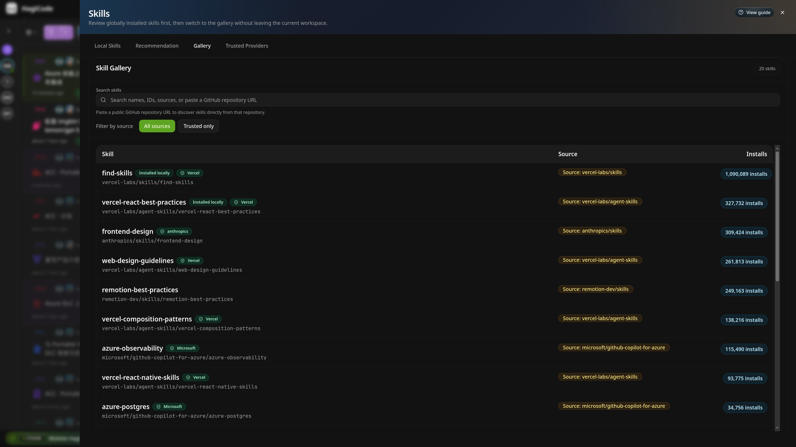

import { CardGrid, LinkCard } from '@astrojs/starlight/components';

このガイドでは次の内容について説明します。 `Skills` ハギコードのパネル。

次の場合にスキルを開きます。

- このマシンにどのスキルがすでにインストールされているかを確認する
- 現在のプロジェクトとリポジトリに基づいて推奨されるスキルを取得する
- 幅広いスキルライブラリを検索する
- インストールする前に、ソース、信頼状態、および実際のインストール コマンドを確認してください。
- どのソースが信頼できるものとしてラベル付けされているかを管理する

## スキルの目的

Skills は、HagiCode に組み込まれたスキルの参照およびインストール パネルです。何かをインストールする前に、ローカルで利用可能なスキルを確認し、推奨事項を見つけ、ギャラリーを検索し、インストールの詳細を検査するための 1 つの場所を提供します。

次の場合に使用します。

- あなたはHagiCodeを初めて使用しますが、すでに利用可能なものを確認したいと考えています
- 自分が行っている仕事の種類を知っており、より適切なヘルパー スキルを必要としている
- 新しいスキルをインストールしたいが、最初にソースを確認する必要がある
- すでにローカルで利用可能なものを再インストールすることを避けたい

:::tip[推奨する読む順序]
最初のパスでは、次から始めます `Local Skills`、次に移動します `Recommendation` そして `Gallery`、その後、インストールする前に詳細パネルを確認してください。
:::

## 1. オープンスキル

HagiCode ワークスペースの上部ナビゲーション バーで、 `Skills` ボタンを押してパネルを開きます。

スクリーンショットの赤い矢印は、エントリ ポイントを強調表示しています。

パネルを開くと、次の 4 つのメイン タブが表示されます。

- `Local Skills`
- `Recommendation`
- `Gallery`
- `Trusted Providers`

:::note[スキルを開放するタイミング]
現在のプロジェクト、セッション、またはオンボーディング フローから離れる必要はありません。スキルは、同じワークスペース内の上部バーから開きます。
:::

## 2. ローカルにインストールされたスキルを確認する

`Local Skills` **すでにインストールされているものは何ですか?** と **今すぐ更新できるスキルはどれですか?** という 2 つのよくある質問に答えます。

![インストールされたスキル インベントリとバッチ アクションを含む [ローカル スキル] タブ](../../img/screenshots/shared/local-skills-view/original.png)

このページの最も重要な領域は次のとおりです。

- **検索ボックス**: ローカル スキルを名前、ID、パス、またはエージェントでフィルタリングします。
- **`Refresh inventory`**: このマシンに現在インストールされているものを再スキャンします
- **`Update all`**: 管理された更新をサポートするスキルのバッチ更新を実行します。
- **`Batch update summary`**: 最新のバッチ結果とステータス ログを確認します。

通常、各行には次の内容が表示されます。

- スキル名
- 互換性のあるエージェント
- ローカルインストールパス
- 利用可能なアクション

バックエンド管理のインストールメタデータが欠落していることを警告する行がある場合、そのスキルはワンクリック更新を使用できないため、手動で確認する必要があります。

:::caution[バッチ更新には人間によるレビューがまだ必要です]
`Update all` 更新フローが一括で実行されることを意味するだけです。これは、リストされているスキルがユースケースに合わせてすでに安全性レビューされていることを意味するものではありません。
:::

## 3.おすすめスキルを入手する

`Recommendation` 現在のプロジェクトとリポジトリから候補リストを作成します。どのような仕事をしているかはわかっているが、どのスキルをインストールするかまだ決まっていない場合に役立ちます。

実際の読書順序は次のとおりです。

1. 上部のヒーロー セレクターを確認して、どのようなコンテキストが推奨事項を推進しているかを理解してください。
2. クリック `Generate recommendations`
3. クエリ チップを確認して、これらの候補が選ばれた理由を確認します。
4. 詳細パネルを開く前に候補カードを比較します

推奨カードの一般的なラベルは次のことを意味します。

- `Recommended`: 現在システムによって提案されています
- `Installed`: すでにインストールされています
- `Installed locally`: ローカル環境ではすでに利用可能であり、通常は再インストールする必要はありません。

:::note[何 `installed locally` 意味]
このラベルは「すでに持っています」という意味です。これは、今すぐインストールするように指示するプロンプトではありません。
:::

## 4. ギャラリーでの検索と比較

探しているものがすでにわかっている場合、またはさまざまなソースから類似したスキルを比較したい場合は、次を使用します。 `Gallery`.

`Gallery` 以下を行うのに最適な場所です。

- キーワードで検索する
- 最初に信頼できるソースにフィルタをかける
- さまざまなソースからの同様のスキルを比較する
- インストール数とローカルのインストール状態を確認する

3 つのフィールドから始めます。

- **`Source`**: スキルの提供者
- **`Installs`**: インストール数。サポートシグナルとして機能します。
- **`Installed locally`**: スキルがマシン上ですでに利用可能かどうか

:::tip[インストール数を確認する前にソースを確認する]
人気は役に立ちますが、情報源のレビューに取って代わるべきではありません。から始める `Source`、次に使用します `Installs` 追加のコンテキストとして。
:::

## 5. インストールする前にスキルの詳細を確認する

スキルを開くと、HagiCode によって詳細パネルが表示されます。これは、インストール前に確認する必要がある最も重要な画面です。

以下の点に特に注意してください。

- **名前、ソース、およびインストール数**: 目的のアイテムを開いていることを確認してください
- **`Trust status`**: このソースが信頼できるとみなされる理由
- **`Managed command`**: 実際のコマンドHagiCodeが実行する準備ができています。
- **`Status`**: 現在のワークスペースがこのスキルをインストールできるかどうか
- **`Overview`**: スキル ID、スラッグ、ソース、インストール数などのサポート識別子

`Managed command` これは装飾的なテキストではなく、実際のインストール コマンドであるため、重要です。

:::注意[`trusted` 「レビューをスキップする」という意味ではありません]
ソースがマークされている場合でも `trusted`、それでも両方読むべきです `Trust status` そして `Managed command` インストールする前に。
:::

## 6. 信頼できるプロバイダーを管理する

`Trusted Providers` どのソースが受信するかを制御します `trusted` ラベル。ソースが信頼される理由を知りたい場合、または信頼ルールを調整する必要がある場合に開きます。

このページでは:

- **`Rule format`** ルールの記述方法を説明します
- **`Add provider`** プロバイダー ルール セットを追加できます
- **`Reset defaults`** デフォルトのプリセットを復元します
- **`Rules`**, **`Status`**、および**`Source examples`** 列は、一致ルール、現在の状態、および一致の例を示します。

一般的なルール スタイルは次のとおりです。

- `prefix:owner/` プレフィックスベースの信頼の場合
- `exact:owner/repo` 単一の正確なソースの場合

:::note[信頼できるプロバイダーは認証情報ページではありません]
このページは、どのソースが信頼できるものとしてラベル付けされるかを決定するだけです。トークン、パスワード、その他の秘密は保存されません。
:::

## インストールする前に次の 4 つのことを確認してください

スキルをインストールする前に、少なくとも次の 4 つのシグナルを確認してください。

| チェックする | どこを見るべきか | それがあなたに伝えること |
| --- | --- | --- |
| ソースが信頼できるかどうか | `Trusted Providers`、プラス `Trust status` 詳細パネルで | このソースが信頼できるものとしてラベル付けされている理由 |
| すでにインストールされているかどうか | のステータスラベル `Recommendation` そして `Gallery` | それが言うなら `installed locally`、通常は再インストールする必要はありません |
| 一括更新結果 | `Batch update summary` で `Local Skills` | 最後の一括更新が成功したかどうか、および手動レビューが必要なものはないかどうか |
| 実際のインストールコマンド | `Managed command` 詳細パネルで | ＨａｇｉＣｏｄｅが実際に実行するもの |

## 共通のユーザーパス

一般的な初回フローは次のとおりです。

1. 開く `Local Skills` すでに利用可能なものを確認します
2. 使用する `Recommendation` 現在の仕事に適した候補者を見つけるため
3. 使用する `Gallery` ソースを検索して比較する
4. 詳細パネルを開いて信頼状態を確認し、コマンドをインストールします
5. 必要に応じて、信頼ルールを確認または調整します。 `Trusted Providers`

## 関連書籍

<CardGrid>
  <LinkCard
  title="Product Overview"
  href="/ja-JP/product-overview"
  description="See where Skills fits in the larger HagiCode workspace and workflow."
/>
  <LinkCard
  title="Wizard Setup"
  href="/ja-JP/quick-start/wizard-setup"
  description="If you are just getting started, review the current onboarding flow before returning to Skills."
/>
  <LinkCard
  title="Desktop Installation Guide"
  href="/ja-JP/installation/desktop"
  description="If you are still finishing installation or first launch, continue with the desktop setup guide."
/>
</CardGrid>
