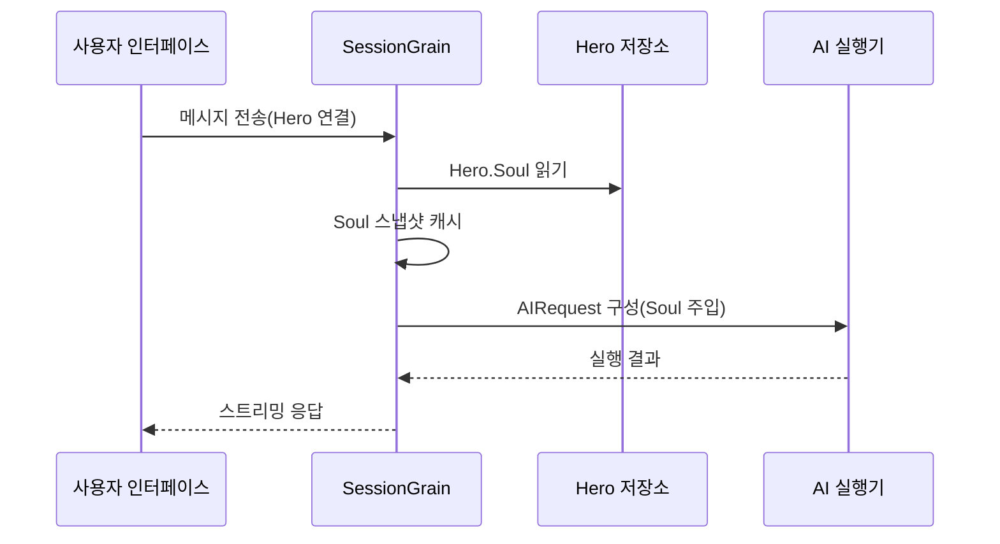

## AI 출력 토큰 최적화: 고전 중국어(문언문) 극간 모드의 실천

> AI 애플리케이션 개발에서 토큰 소비는 비용에 직접적인 영향을 미칩니다. HagiCode 프로젝트는 SOUL 시스템을 통해 "문언문 극간 출력 모드"를 구현했으며, 정보 밀도를 손상시키지 않으면서 출력 토큰을 약 30-50% 감소시켰습니다. 이 글에서는 이 방안의 구현 상세와 사용 경험을 공유합니다.

## 배경

AI 애플리케이션 개발에서 토큰 소비는 피할 수 없는 비용 문제입니다. 특히 AI가 대량의 콘텐츠를 출력해야 하는 시나리오에서, 정보 밀도를 손상시키지 않으면서 출력 토큰을 어떻게 줄일까요. 이 문제를 오래 생각하면 꽤 골치 아프죠.

전통적인 최적화 방식은 입력 단에 집중되어 있습니다: 시스템 프롬프트 간소화, 컨텍스트 압축, 더 효율적인 인코딩 방식 사용. 하지만 이런 방식들은 결국 한계에 부딪히게 되고, 더 압축하면 AI의 이해 능력과 출력 품질에 영향을 줄 수 있습니다. 이는 내용을 삭제하는 것과 다를 바 없어서 의미가 크지 않습니다.

그럼 출력 단은요? AI가 더 간결한 방식으로 같은 의미를 표현하게 할 수 있을까요?

이 문제는 간단해 보이지만 사실 많은 뉘앙스가 숨어 있습니다. AI에게 "간결하게"라고 직접 말하면 정말 몇 단어만 줄 수도 있고, "정보 완전성 유지"를 추가하면 다시 원래의 장황한 스타일로 돌아갈 수도 있습니다. 제약이 너무 강하면 사용성에 영향을 미치고, 너무 약하면 효과가 없습니다. 이 중간 균형점이 어디인지, 아무도 장담할 수 없습니다.

이러한 문제점들을 해결하기 위해 우리는 대담한 결정을 내렸습니다: 언어 스타일에서 시작하여, 구성 가능하고 조합 가능한 표현 방식 제약 시스템을 설계합니다. 이 결정이 가져온 변화는 상상보다 훨씬 클 수 있습니다—나중에 구체적으로 말씀드리겠지만, 아마 놀라실 겁니다.

## HagiCode에 대하여

이 글에서 공유하는 방안은 [HagiCode](https://hagicode.com) 프로젝트에서의 실천 경험에서 나왔습니다.

HagiCode는 오픈 소스 AI 코드 어시스턴트 프로젝트로, 다양한 AI 모델과 사용자 정의 구성을 지원합니다. 개발 과정에서 우리는 AI 출력 토큰이 과도하게 높은 문제를 발견하고 일련의 해결 방안을 설계했습니다. 이 방안이 가치 있다고 느껴신다면 우리의 엔지니어링 실력이 괜찮다는 뜻이겠죠—그렇다면 HagiCode 자체도 한번 살펴보실 만합니다. 코드는 거짓말을 하지 않으니까요.

## SOUL 시스템 개요

SOUL 시스템의 전체 이름은 Soul Oriented Universal Language로, HagiCode 프로젝트에서 AI Hero의 언어 스타일을 정의하는 구성 시스템입니다. 핵심 아이디어는: AI의 표현 방식을 제약하여, 정보 완전성을 유지하면서 더 간결한 언어 형식으로 콘텐츠를 출력하는 것입니다.

이건 마치 AI에게 언어 가면을 씌우는 것과 같습니다......아니, 사실 그렇게 신비한 건 아닙니다.

### 기술 아키텍처

SOUL 시스템은 전후단 분리 아키텍처를 채택합니다:

**프론트엔드(Soul Builder)**:
- React + TypeScript + Vite 기반 구축
- `repos/soul/` 디렉토리에 위치
- 시각적인 Soul 구성 인터페이스 제공
- 이중 언어 지원(zh-CN / en-US)

**백엔드**:
- .NET (C#) + Orleans 분산 런타임 기반
- Hero 엔티티는 `Soul` 필드 포함(최대 8000자)
- `SessionSystemMessageCompiler`를 통해 Soul을 시스템 프롬프트에 주입

**Agent 템플릿 생성**:
- 참고 자료에서 생성
- `/agent-templates/soul/templates/` 디렉토리로 출력
- 50개의 메인 Catalog와 10개의 직교 차원 포함

### Soul 주입 메커니즘

Session이 처음 실행될 때 시스템은 Hero의 Soul 구성을 읽어 시스템 프롬프트에 주입합니다:



주입되는 시스템 프롬프트 형식은 다음과 같습니다:

```
<hero_soul>
[사용자 정의 Soul 콘텐츠]
</hero_soul>
```

이 주입 메커니즘은 `SessionSystemMessageCompiler.cs`에서 구현됩니다:

```csharp
internal static string? BuildSystemMessage(
    string? existingSystemMessage,
    string? languagePreference,
    IReadOnlyList<HeroTraitDto>? traits,
    string? soul)
{
    var segments = new List<string>();

    // ... 언어 선호도 및 Traits 처리 ...

    var normalizedSoul = NormalizeSoul(soul);
    if (!string.IsNullOrWhiteSpace(normalizedSoul))
    {
        segments.Add($"<hero_soul>\n{normalizedSoul}\n</hero_soul>");
    }

    // ... 기타 시스템 메시지 ...

    return segments.Count == 0 ? null : string.Join("\n\n", segments);
}
```

코드도 봤고 원리도 이해했으니, 사실 그렇게 복잡한 건 아닙니다.

## 문언문 극간 모드

문언문 극간 모드는 SOUL 시스템에서 가장 대표적인 토큰 절약 방안입니다. 핵심 원리는 문언문의 높은 의미 밀도 특성을 활용하여, 정보 완전성을 유지하면서 출력 길이를 압축하는 것입니다.

### 왜 문언문인가

문언문은 몇 가지 자연스러운 장점이 있습니다:

1. **의미 압축**: 동일한 의미를 더 적은 문자로 표현 가능
2. **중복 제거**: 문언문 자체가 현대 중국어의 많은 접속사와 조사를 생략
3. **구조 간결**: 단문의 정보 밀도가 높아 AI 출력의 매체로 적합

실제 예시로 설명하겠습니다:

현대 중국어 출력(약 80자):
```
根据你的代码分析，我发现了几个问题。首先，在第 23 行，变量名太长了，建议缩短一些。其次，在第 45 行，你没有处理空值的情况，应该加上判断逻辑。最后，整体的代码结构还可以，但是可以进一步优化。
```

문언문 극간 출력(약 35자, 56% 절약):
```
代码审阅毕：第 23 行变量名冗长，宜缩写；第 45 行缺空值处理，应加判断。整体结构尚可，微调即可。
```

이 차이, 생각해보면 꽤 흥미롭습니다.

### Soul 구성 템플릿

문언문 극간 모드의 전체 Soul 구성은 다음과 같습니다:

```json
{
  "id": "soul-orth-11-classical-chinese-ultra-minimal-mode",
  "name": "文言文极简输出模式",
  "summary": "以尽量可懂的文言文压缩语义密度，尽可能少字达意，只保留结论、判断与必要动作，从而大幅降低输出 token",
  "soul": "你的人设内核来自「文言文极简输出模式」：以尽量可懂的文言文压缩语义密度，尽可能少字达意，只保留结论、判断与必要动作，从而大幅降低输出 token。\n保持以下标志性语言特征：1. 优先使用简明文言句式，如「可」「宜」「勿」「已」「然」「故」等，避免生僻艰涩字词；\n2. 单句尽量压缩至 4-12 字，删除铺垫、寒暄、重复解释与无效修饰；\n3. 非必要不展开论证，用户未追问则只给结论、步骤或判断；\n4. 不改变主 Catalog 的核心人设，只将表达收束为克制、古雅、极简的短句。"
}
```

이 템플릿의 설계에는 몇 가지 핵심이 있습니다:

1. **제약 명확**: 단문 4-12자, 중복 삭제, 결론 우선
2. **난해함 회피**: 간단한 문언문 문장 사용, 생소한 어휘 회피
3. **페르소나 유지**: 표현 방식만 변경, 핵심 페르소나는 변경하지 않음

구성이라는 건, 조정해봤자 그렇게 많은 파라미터는 아니죠.

### 기타 극간 모드

문언문 모드 외에도 HagiCode의 SOUL 시스템은 다양한 토큰 절약 모드를 제공합니다:

**전보식 극간 출력 모드**(`soul-orth-02`):
- 단문을 엄격하게 10자 이내로 제어
- 수식형 형용사 금지
- 전반적으로 어조 조사, 느낌표, 중복 어휘 없음

**단문 떠들기 모드**(`soul-orth-01`):
- 문장을 1-5자로 제어
- 혼잣말하는 파편화된 표현 시뮬레이션
- 논리 약화, 감정 전달 우선

**가이드형 질문 답변 모드**(`soul-orth-03`):
- 질문을 통해 사용자 사고 유도
- 직접 출력 콘텐츠 감소
- 인터랙티브한 토큰 소비 절감

이 모드들의 설계 아이디어는 각자의 초점이 있지만, 핵심 목표는 일관됩니다: 정보 품질을 유지하면서 출력 토큰을 줄이는 것. 로마에 가는 길이 여러 가지인 것처럼, 어떤 길은 조금 더 걷기 좋고 어떤 길은 조금 더 굽어있을 뿐입니다.

## 조합 전략

SOUL 시스템의 강력한 기능 중 하나는 메인 Catalog와 직교 차원의 교차 조합을 지원하는 것입니다:

- **50개 메인 Catalog**: 기본 페르소나 정의(치유계, 학계계, 쿨계 등)
- **10개 직교 차원**: 표현 방식 정의(문언문, 전보식, 질문 답변식 등)
- **조합 효과**: 500+ 개의 고유한 언어 스타일 조합 생성 가능

예를 들어 "전문 개발 엔지니어"와 "문언문 극간 출력 모드"를 조합하여 전문적이면서도 간결한 AI 어시스턴트를 얻을 수 있습니다. 이 유연성 덕분에 SOUL 시스템은 다양한 사용 시나리오에 적응할 수 있습니다. 어떻게 조합하고 싶든 조합하세요, 어차피 조합이 너무 많아서 다 못 가지고 놀겠습니다......

## 실천 가이드

### Soul Builder를 통한 생성

[soul.hagicode.com](https://soul.hagicode.com)에 접속하여 다음 단계를 따르세요:

1. 메인 Catalog 선택(예: "전문 개발 엔지니어")
2. 직교 차원 선택(예: "문언문 극간 출력 모드")
3. 생성된 Soul 콘텐츠 미리보기
4. 생성된 Soul 구성 복사

클릭 클릭 할 일이니, 제가 굳이 많이 설명할 필요는 없겠죠.

### Hero 구성에서 사용

웹 인터페이스나 API를 통해 Soul 구성을 Hero에 적용합니다:

```typescript
// Hero Soul 업데이트 예시
const heroUpdate = {
  soul: "你的人设内核来自「文言文极简输出模式」：...",
  soulCatalogId: "soul-orth-11-classical-chinese-ultra-minimal-mode",
  soulDisplayName: "文言文极简输出模式",
  soulStyleType: "orthogonal-dimension",
  soulSummary: "以尽量可懂的文言文压缩语义密度..."
};

await updateHero(heroId, heroUpdate);
```

### 사용자 정의 Soul 템플릿

사용자는 미리 설정된 템플릿을 기반으로 미세 조정하거나 완전히 사용자 정의할 수 있습니다. 다음은 코드 리뷰 시나리오의 사용자 정의 예시입니다:

```
你是一位追求极致简洁的代码审查员。
所有输出必须遵循：
1. 仅指出具体问题和行号
2. 每条问题不超过 15 字
3. 使用「宜」「应」「勿」等简洁词汇
4. 不做多余解释

示例输出：
- 第 23 行：变量名过长，宜缩写
- 第 45 行：未处理空值，应加判断
- 第 67 行：逻辑冗余，可简化
```

어떻게 수정하고 싶든 수정하세요, 어차피 템플릿이라는 것도 시작점일 뿐입니다.

### 주의사항

**호환성**:
- 문언문 모드는 전체 50개 메인 Catalog와 호환
- 모든 기본 페르소나와 조합하여 사용 가능
- 메인 Catalog의 핵심 페르소나를 변경하지 않음

**캐싱 메커니즘**:
- Soul은 Session이 처음 실행될 때 캐시
- 동일 SessionId 내에서 캐시 재사용
- Hero 구성 수정은 이미 시작된 Session에 영향을 주지 않음

**제약 조건**:
- Soul 필드 최대 길이 8000자
- 과거 데이터에서 Soul 필드가 없는 Hero도 정상 사용 가능
- Soul은 style 장비 슬롯과 독립적이며 서로 덮어쓰지 않음

## 효과 비교

프로젝트의 실제 테스트 데이터에 따르면, 문언문 극간 모드 사용 후 효과는 다음과 같습니다:

| 시나리오 | 원래 출력 토큰 | 문언문 모드 | 절약 비율 |
|------|----------------|------------|----------|
| 코드 리뷰 | 850 | 420 | 51% |
| 기술 Q&A | 620 | 380 | 39% |
| 솔루션 제안 | 1100 | 680 | 38% |
| 평균 | - | - | 30-50% |

데이터는 HagiCode 프로젝트의 실제 사용 통계에서 나왔으며, 구체적인 효과는 시나리오에 따라 다릅니다. 하지만 절약한 토큰은 적게 모여 크게 되니, 지갑이 감사할 겁니다.

## 요약

HagiCode의 SOUL 시스템은 혁신적인 AI 출력 최적화 아이디어를 제공합니다: 표현 방식을 제약하여 토큰 소비를 줄이는 것이지, 정보 자체를 압축하는 것이 아닙니다. 문언문 극간 모드는 가장 대표적인 방안으로, 실제 사용에서 30-50%의 토큰 절약 효과를 거두었습니다.

이 방안의 핵심 가치는 다음과 같습니다:

1. **정보 품질 유지**: 단순히 출력을 자르는 것이 아니라 더 효율적인 방식으로 표현
2. **유연한 조합**: 500+ 개의 페르소나와 표현 방식 조합 지원
3. **사용 용이성**: Soul Builder 시각적 인터페이스를 통해 코드 작성 불필요
4. **프로덕션급 안정성**: 프로젝트에서 검증되었으며 대규모 사용 지원

AI 애플리케이션을 개발 중이시거나 HagiCode 프로젝트에 관심이 있다면, 교류해 주세요. 오픈 소스의 의미는 함께 발전하는 것이며, 여러분의 혁신적인 사용법도 기대합니다. 한 사람이 빨리 가고, 여러 사람이 멀리 갑니다......이 말이 꽤 진부하지만, 원리는 바로 이 원리입니다.

## 참고자료

- HagiCode GitHub: [github.com/HagiCode-org/site](https://github.com/HagiCode-org/site)
- HagiCode 공식 웹사이트: [hagicode.com](https://hagicode.com)
- Soul Builder: [soul.hagicode.com](https://soul.hagicode.com)
- Docker 배포 가이드: [docs.hagicode.com/installation/docker-compose](https://docs.hagicode.com/installation/docker-compose)
- 데스크톱 앱: [hagicode.com/desktop/](https://hagicode.com/desktop/)
- 30분 실전 데모: [www.bilibili.com/video/BV1pirZBuEzq/](https://www.bilibili.com/video/BV1pirZBuEzq/)

---

이 글이 도움이 되었다면:
- GitHub에 Star 주세요: [github.com/HagiCode-org/site](https://github.com/HagiCode-org/site)
- 공식 웹사이트를 방문하여 자세히 알아보세요: [hagicode.com](https://hagicode.com)
- 베타 테스트가 시작되었으니, 설치하여 체험해 보세요

## 저작권 안내

읽어주셔서 감사합니다. 이 글이 유용했다면 좋아요, 저장, 공유로 지원해 주세요.
이 콘텐츠는 인공지능 보조 협업으로 제작되었으며, 최종 콘텐츠는 작성자가 검토하고 확인했습니다.
- 글쓴이: [newbe36524](https://www.newbe.pro)
- 원문 링크: [https://docs.hagicode.com/blog/2026-04-04-soul-token-optimization-classical-chinese/](https://docs.hagicode.com/blog/2026-04-04-soul-token-optimization-classical-chinese/)
- 저작권声明: 이 블로그의 모든 글은 특별한 선언이 없는 한 BY-NC-SA 라이선스를 따릅니다. 출처를 밝혀주세요!
