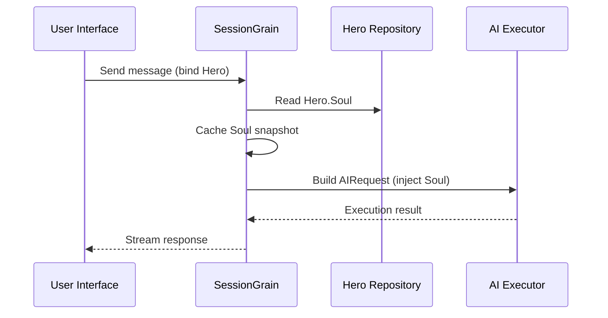

## AI 출력 토큰 최적화: 초간체 문언(文言) 모드 실천

> AI 애플리케이션 개발에서 토큰 소비는 비용에 직접적인 영향을 미칩니다. HagiCode 프로젝트에서는 SOUL 시스템을 통해 "초간체 문언(文言) 출력 모드"를 구현했습니다. 정보 밀도를 희생하지 않고 출력 토큰을 약 30-50% 줄입니다. 이 글에서는 이 방식의 구현 세부 사항과 사용하면서 얻은 교훈을 공유합니다.

## 배경

AI 애플리케이션 개발에서 토큰 소비는 피할 수 없는 비용 문제입니다. AI가 대량의 콘텐츠를 생성해야 하는 시나리오에서는 특히 고통스럽습니다. 정보 밀도를 희생하지 않고 출력 토큰을 줄이려면 어떻게 해야 할까요? 생각할수록 답답해지는 문제입니다.

전통적인 최적화 아이디어는 대부분 입력 측에 집중합니다: 시스템 프롬프트 자르기, 컨텍스트 압축, 또는 더 효율적인 인코딩 사용. 하지만 이 방법들은 결국 한계에 부딪힙니다. 압축을 너무 밀어붙이면 AI의 이해력과 출력 품질이 저하되기 시작합니다. 그것은 기본적으로 콘텐츠를 삭제하는 것이며, 별로 의미가 없습니다.

그렇다면 출력 측은 어떨까요? AI가 동일한 의미를 더 간결하게 표현하도록 할 수 있을까요?

질문은 간단해 보이지만, 그 아래에는 상당히 많은 것이 숨어 있습니다. AI에게 "간결하게 해 줘"라고 직접 요청하면 정말 몇 마디만 줄 수도 있습니다. "정보를 완전하게 유지해"라고 추가하면 원래의 장황한 스타일로 돌아갈 수 있습니다. 너무 강한 제약은 사용성을 해치고, 너무 약한 제약은 아무 소용이 없습니다. 정확히 균형점은 어디에 있을까요? 아무도 확실히 말할 수 없습니다.

이러한 고통점을 해결하기 위해 우리는 대담한 결정을 내렸습니다: 언어 스타일 자체에서 출발하여 표현을 위한 구성 가능하고 구성 가능한 제약 시스템을 설계합니다. 이 결정의 영향은 예상보다 클 수 있습니다. 곧 자세히 설명하겠으며, 결과는 약간 놀랄 수 있습니다.

## HagiCode에 대하여

이 글에서 공유하는 접근 방식은 [HagiCode](https://hagicode.com) 프로젝트의 실무 경험에서 비롯되었습니다.

HagiCode는 다중 AI 모델과 사용자 정의 구성을 지원하는 오픈소스 AI 코딩 어시스턴트입니다. 개발 중에 AI 출력 토큰 사용량이 너무 높은 것을 발견하여 이를 위한 해결책을 설계했습니다. 이 접근 방식이 가치 있다고 생각하신다면, 아마도 우리의 엔지니어링 작업에 긍정적인 평가를 내리신 것일 것입니다. 그렇다면 HagiCode 자체도 주목할 가치가 있을 것입니다. 코드는 거짓말을 하지 않습니다.

## SOUL 시스템 개요

SOUL 시스템의 정식 명칭은 Soul Oriented Universal Language입니다. HagiCode 프로젝트에서 AI Hero의 언어 스타일을 정의하는 데 사용하는 구성 시스템입니다. 핵심 아이디어는 간단합니다: AI의 표현 방식을 제약하여 정보 완전성을 보존하면서 더 간결한 언어 형식으로 콘텐츠를 출력합니다.

AI에게 언어적 가면을 씌우는 것과 비슷합니다... 솔직히 그렇게 신비롭지는 않지만요.

### 기술 아키텍처

SOUL 시스템은 프론트엔드-백엔드 분리 아키텍처를 사용합니다:

**프론트엔드 (Soul Builder)**:
- React + TypeScript + Vite로 구축
- `repos/soul/` 디렉토리에 위치
- 시각적 Soul 빌딩 인터페이스 제공
- 이중 언어 사용 지원 (zh-CN / en-US)

**백엔드**:
- .NET (C#) + Orleans 분산 런타임 기반
- Hero 엔티티에 `Soul` 필드 포함 (최대 8000자)
- `SessionSystemMessageCompiler`를 통해 시스템 프롬프트에 Soul 주입

**Agent 템플릿 생성**:
- 참고 자료에서 생성
- `/agent-templates/soul/templates/` 디렉토리로 출력
- 50개의 메인 카탈로그 그룹과 10개의 직교 차원 포함

### Soul 주입 메커니즘

Session이 처음 실행될 때 시스템은 Hero의 Soul 구성을 읽고 시스템 프롬프트에 주입합니다:



주입된 시스템 프롬프트 형식은 다음과 같습니다:

```
<hero_soul>
[User-defined Soul content]
</hero_soul>
```

이 주입 메커니즘은 `SessionSystemMessageCompiler.cs`에 구현되어 있습니다:

```csharp
internal static string? BuildSystemMessage(
    string? existingSystemMessage,
    string? languagePreference,
    IReadOnlyList<HeroTraitDto>? traits,
    string? soul)
{
    var segments = new List<string>();

    // ... 언어 선호도 및 Traits 처리 ...

    var normalizedSoul = NormalizeSoul(soul);
    if (!string.IsNullOrWhiteSpace(normalizedSoul))
    {
        segments.Add($"<hero_soul>\n{normalizedSoul}\n</hero_soul>");
    }

    // ... 기타 시스템 메시지 ...

    return segments.Count == 0 ? null : string.Join("\n\n", segments);
}
```

코드를 보고 원리를 이해하면, 사실 그것이 전부입니다.

## 초간체 문언(文言) 모드

초간체 문언 모드는 SOUL 시스템에서 가장 대표적인 토큰 절약 전략입니다. 핵심 원칙은 문언의 높은 의미론적 밀도를 활용하여 출력 길이를 압축하면서 완전한 정보를 보존하는 것입니다.

### 왜 문언인가

문언에는 몇 가지 자연스러운 장점이 있습니다:

1. **의미 압축**: 동일한 의미를 더 적은 문자로 표현할 수 있습니다.
2. **중복 제거**: 문언은 현대어에서 흔한 많은 접속사와 조사를 자연스럽게 생략합니다.
3. **간결한 구조**: 각 문장이 높은 정보 밀도를 담고 있어 AI 출력의 매체로 적합합니다.

구체적인 예를 들어보겠습니다:

현대어 출력 (약 80자):
```
Based on your code analysis, I found several issues. First, on line 23, the variable name is too long and should be shortened. Second, on line 45, you did not handle null values and should add conditional logic. Finally, the overall code structure is acceptable, but it can be further optimized.
```

초간체 문언 출력 (약 35자, 56% 절약):
```
Code reviewed: line 23 variable name verbose, abbreviate; line 45 lacks null handling, add checks. Overall structure acceptable; minor tuning suffices.
```

그 차이는 충분히 크서 한 번 생각하게 만듭니다.

### Soul 구성 템플릿

초간체 문언 모드의 완전한 Soul 구성은 다음과 같습니다:

```json
{
  "id": "soul-orth-11-classical-chinese-ultra-minimal-mode",
  "name": "Ultra-Minimal Classical Chinese Output Mode",
  "summary": "Use relatively readable Classical Chinese to compress semantic density, convey the meaning with as few words as possible, and retain only conclusions, judgments, and necessary actions, thereby significantly reducing output tokens.",
  "soul": "Your persona core comes from the \"Ultra-Minimal Classical Chinese Output Mode\": use relatively readable Classical Chinese to compress semantic density, convey the meaning with as few words as possible, and retain only conclusions, judgments, and necessary actions, thereby significantly reducing output tokens.\nMaintain the following signature language traits: 1. Prefer concise Classical Chinese sentence patterns such as \"can\", \"should\", \"do not\", \"already\", \"however\", and \"therefore\", while avoiding obscure and difficult wording;\n2. Compress each sentence to 4-12 characters whenever possible, removing preamble, pleasantries, repeated explanation, and ineffective modifiers;\n3. Do not expand arguments unless necessary; if the user does not ask a follow-up, provide only conclusions, steps, or judgments;\n4. Do not alter the core persona of the main Catalog; only compress the expression into restrained, classical, ultra-minimal short sentences."
}
```

이 템플릿 설계에는 몇 가지 핵심 포인트가 있습니다:

1. **명확한 제약**: 문장당 4-12자, 중복 제거, 결론 우선.
2. **난해함 피하기**: 간결한 문언 문형을 사용하고 희귀하고 어려운 표현을 피합니다.
3. **페르소나 보존**: 표현 방식만 변경하고 핵심 페르소나는 변경하지 않습니다.

구성을 계속 조정하다 보면 결국 몇 가지 매개변수로 귀결됩니다.

### 기타 초간체 모드

문언 모드 외에도 HagiCode SOUL 시스템은 여러 다른 토큰 절약 모드를 제공합니다:

**전보체(電報體) 초간체 출력 모드** (`soul-orth-02`):
- 모든 문장을 엄격하게 10자 이내로 유지
- 장식적 형용사 금지
- 어조사, 감탄사, 중복 전체 금지

**짧은 단편 독백 모드** (`soul-orth-01`):
- 문장을 1-5자 이내로 유지
- 단편적인 혼잣말 시뮬레이션
- 명시적 논리 약화, 감정 전달 우선

**유도 Q&A 모드** (`soul-orth-03`):
- 질문으로 사용자의 사고를 유도
- 직접 출력 콘텐츠 감소
- 상호작용을 통해 토큰 사용량 낮춤

이 모드들은 각각 다른 설계 방향을 강조하지만, 핵심 목표는 동일합니다: 정보 품질을 보존하면서 출력 토큰을 줄이는 것. 로마로 가는 길은 많고, 어떤 길은 다른 길보다 걷기 쉬울 뿐입니다.

## 조합 전략

SOUL 시스템의 강력한 기능 중 하나는 메인 카탈로그와 직교 차원의 교차 조합 지원입니다:

- **50개 메인 카탈로그 그룹**: 기본 페르소나 정의 (예: 힐링 스타일, 모범생 스타일, 고독 스타일 등)
- **10개 직교 차원**: 표현 방식 정의 (예: 문언, 전보체, Q&A 스타일 등)
- **조합 효과**: 500개 이상의 고유한 언어 스타일 조합 생성 가능

예를 들어 "전문 개발 엔지니어"를 "초간체 문언 출력 모드"와 결합하여 전문적이면서도 간결한 AI 어시스턴트를 만들 수 있습니다. 이 유연성 덕분에 SOUL 시스템은 다양한 시나리오에 적응할 수 있습니다. 원하는 대로 조합할 수 있으며, 고갈할 조합보다 더 많은 조합이 있습니다.

## 실용 가이드

### Soul Builder를 통해 생성

[soul.hagicode.com](https://soul.hagicode.com)을 방문하여 다음 단계를 따르십시오:

1. 메인 카탈로그 선택 (예: "전문 개발 엔지니어")
2. 직교 차원 선택 (예: "초간체 문언 출력 모드")
3. 생성된 Soul 콘텐츠 미리보기
4. 생성된 Soul 구성 복사

대부분 클릭만으로 되므로 더 이상 설명할 것이 많지 않습니다.

### Hero 구성에서 사용

웹 인터페이스 또는 API를 통해 Soul 구성을 Hero에 적용합니다:

```typescript
// Hero Soul 업데이트 예시
const heroUpdate = {
  soul: "Your persona core comes from the \"Ultra-Minimal Classical Chinese Output Mode\": ...",
  soulCatalogId: "soul-orth-11-classical-chinese-ultra-minimal-mode",
  soulDisplayName: "Ultra-Minimal Classical Chinese Output Mode",
  soulStyleType: "orthogonal-dimension",
  soulSummary: "Use relatively readable Classical Chinese to compress semantic density..."
};

await updateHero(heroId, heroUpdate);
```

### 사용자 정의 Soul 템플릿

사용자는 프리셋 템플릿을 미세 조정하거나 처음부터 직접 작성할 수 있습니다. 코드 리뷰 시나리오를 위한 사용자 정의 예시입니다:

```
You are a code reviewer who pursues extreme concision.
All output must follow these rules:
1. Only point out specific problems and line numbers
2. Each issue must not exceed 15 characters
3. Use concise terms such as "should", "must", and "do not"
4. Do not provide extra explanation

Example output:
- Line 23: variable name too long, should abbreviate
- Line 45: null not handled, must add checks
- Line 67: logic redundant, can simplify
```

템플릿은 원하는 대로 수정할 수 있습니다. 어차피 템플릿은 출발점일 뿐입니다.

### 참고 사항

**호환성**:
- 문언 모드는 50개 메인 카탈로그 그룹 모두에서 작동합니다
- 모든 기본 페르소나와 결합 가능합니다
- 메인 카탈로그의 핵심 페르소나를 변경하지 않습니다

**캐싱 메커니즘**:
- Soul은 Session이 처음 실행될 때 캐시됩니다
- 동일한 SessionId 내에서 캐시가 재사용됩니다
- Hero 구성 수정은 이미 시작된 Session에 영향을 주지 않습니다

**제약 및 한계**:
- Soul 필드의 최대 길이는 8000자입니다
- 기록 데이터에서 Soul 필드가 없는 Hero는 정상적으로 사용할 수 있습니다
- Soul과 스타일 장비 슬롯은 독립적이며 서로 덮어쓰지 않습니다

## 효과 비교

프로젝트의 실제 테스트 데이터에 따르면, 초간체 문언 모드 활성화 후 결과는 다음과 같습니다:

| 시나리오 | 기존 출력 토큰 | 문언 모드 | 절약률 |
|------|------------------------|------------------------|---------|
| 코드 리뷰 | 850 | 420 | 51% |
| 기술 Q&A | 620 | 380 | 39% |
| 해결책 제안 | 1100 | 680 | 38% |
| 평균 | - | - | 30-50% |

데이터는 HagiCode 프로젝트의 실제 사용 통계에서 비롯되며, 정확한 결과는 시나리오에 따라 다릅니다. 그래도 절약된 토큰은 모이고, 지갑은 고마워할 것입니다.

## 결론

HagiCode SOUL 시스템은 AI 출력을 최적화하는 혁신적인 방법을 제공합니다: 정보 자체를 압축하는 대신 표현을 제약하여 토큰 소비를 줄입니다. 가장 대표적인 접근 방식인 초간체 문언 모드는 실제 사용에서 30-50%의 토큰 절약을 달성했습니다.

이 접근 방식의 핵심 가치는 다음과 같습니다:

1. **정보 품질 보존**: 출력을 단순히 자르는 대신 동일한 콘텐츠를 더 효율적으로 표현합니다.
2. **유연하고 구성 가능**: 500개 이상의 페르소나와 표현 스타일 조합을 지원합니다.
3. **사용하기 쉬움**: Soul Builder가 시각적 인터페이스를 제공하므로 코딩이 필요 없습니다.
4. **프로덕션급 안정성**: 프로젝트에서 검증되었으며 대규모 사용이 가능합니다.

AI 애플리케이션을 구축 중이시거나 HagiCode 프로젝트에 관심이 있으시다면 연락해 주십시오. 오픈소스의 의미는 함께 진보하는 데 있으며, 여러분의 혁신적인 사용도 기대합니다. 오래된 말이지만 여전히 참됩니다: 한 사람은 빨리 갈 수 있지만, 여럿이 함께 가면 더 멀리 갑니다.

## 참고 자료

- HagiCode GitHub: [github.com/HagiCode-org/site](https://github.com/HagiCode-org/site)
- HagiCode 공식 사이트: [hagicode.com](https://hagicode.com)
- Soul Builder: [soul.hagicode.com](https://soul.hagicode.com)
- Docker 배포 가이드: [docs.hagicode.com/installation/docker-compose](https://docs.hagicode.com/installation/docker-compose)
- 데스크톱 앱: [hagicode.com/desktop/](https://hagicode.com/desktop/)
- 30분 실전 데모: [www.bilibili.com/video/BV1pirZBuEzq/](https://www.bilibili.com/video/BV1pirZBuEzq/)

---

이 글이 도움이 되셨다면:
- GitHub에서 Star를 눌러주세요: [github.com/HagiCode-org/site](https://github.com/HagiCode-org/site)
- 공식 사이트를 방문하여 자세히 알아보세요: [hagicode.com](https://hagicode.com)
- 퍼블릭 베타가 시작되었으며, 설치하여 사용해 보시기를 환영합니다

## 저작권 안내

읽어주셔서 감사합니다. 이 글이 유용하셨다면 좋아요, 북마크, 공유를 부탁드립니다.
이 콘텐츠는 AI 협업으로 생성되었으며, 최종 콘텐츠는 작성자가 검토 및 확인하였습니다.
- 작성자: [newbe36524](https://www.newbe.pro)
- 원본 글 링크: [https://docs.hagicode.com/blog/2026-04-04-soul-token-optimization-classical-chinese/](https://docs.hagicode.com/blog/2026-04-04-soul-token-optimization-classical-chinese/)
- 저작권 안내: 별도 명시가 없는 한 이 블로그의 모든 글은 BY-NC-SA 라이선스에 따릅니다. 전재 시 출처를 밝혀주세요.
