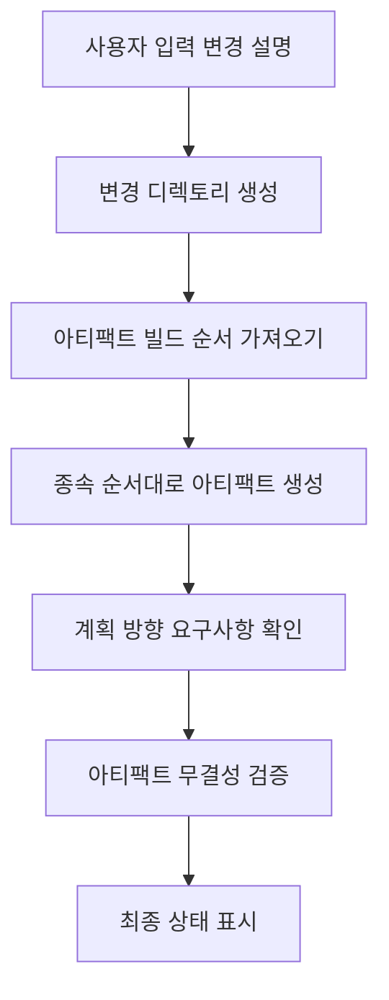
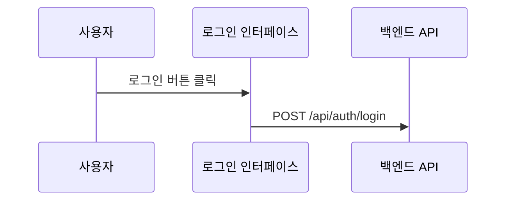

## OpenSpec 단계 사용자 정의로 AI 생성 결과 개선

> OpenSpec으로 기술 제안을 관리하면서 AI가 생성한 문서의 품질이 불안정한 문제에 직면했습니다. 사실 다른 방법은 없고 프롬프트 템플릿을 직접 수정해야 했습니다. 이 글은 그 당시의 기록입니다.

## 배경

OpenSpec은 기술 제안을 관리하는 시스템으로, 핵심 아이디어는 매우 간단합니다. 변경 설명을 입력하면 다양한 문서 아티팩트를 자동으로 생성합니다. 제안서, 디자인, 스펙, 작업 등 모든 것을 자동으로 생성할 수 있습니다. 꽤 멋지죠?

하지만 실제 사용过程中 몇 가지 문제를 발견했습니다. 뭐 큰 문제는 아니지만, 생성된 결과물이 좀 어색했습니다.

생성된 `design.md`에는 필요한 시각화 요소가 없었습니다. Mermaid 플로우차트도, 시퀀스 다이어그램도, 아키텍처 다이어그램도 없었습니다. 이런 디자인 문서를 보고 기술 팀은 고개를 저을 수밖에 없었습니다. 누가 텍스트만 잔뜩 있는 문서를 보고 싶어 하겠습니까?

`proposal.md`도 만족스럽지 않았습니다. 코드 변경 테이블이 없고 UI 프로토타입도 없었습니다. 의사결정권자가 한참을 봐도 이 변경이 도대체 무엇을 수정하는지 알 수 없었습니다.

더 골치 아픈 것은 `tasks.md`였습니다. 여기에 다양한 Git 작업任务가 섞여 있었습니다. 책임 경계가 모호해져서 개발자들이これら 작업을 보고 무엇을 해야 하고 무엇을 하지 않아야 하는지 알 수 없었습니다. 이것도 좀 답답한 일이었습니다. AI는 팀의 역할 분담이 어떻게 되어 있는지 알 수 없으니까요.

다른 문서 수준의 시각화 요구사항도 명확하지 않았습니다. 제안서와 디자인에到底 어떤 다이어그램이 포함되어야 합니까? 이 문제는 팀을 계속困扰했습니다.

これら 문제의 근원은 어디에 있을까요? 우리가 분석한 결과 핵심을 발견했습니다. 프롬프트 템플릿에 명확한 제약과 지침이 부족했습니다.

이것도 별로 이상한 일은 아닙니다. 템플릿 자체가 범용적인 것이니까 모든 팀의 요구사항에 완벽하게 적용될 수는 없습니다.

## HagiCode에 대하여

이 글에서 공유하는 솔루션은 [HagiCode](https://hagicode.com) 프로젝트에서의 실천 경험에서 나왔습니다. HagiCode는 AI 코드 어시스턴트 프로젝트로, 우리는 개발 과정에서 OpenSpec을 폭넓게 사용하여 기술 제안을 관리합니다.

바로 이러한 실제 시행착오 경험이这套 개선 솔루션의 탄생을 촉진했습니다. 사실 별거 아닙니다. 문제를 만나면 해결하면 되는 것입니다.

## 분석: 프롬프트 시스템 아키텍처

문제를 해결하려면 먼저 시스템을 이해해야 합니다. OpenSpec의 프롬프트 시스템이 어떻게 작동하는지 살펴보겠습니다.

OpenSpec은 Handlebars 템플릿 시스템을 사용하며, 각 프롬프트는 두 부분으로 구성됩니다:

**JSON 메타데이터 파일**: 매개변수, 시나리오, 버전 정보 정의
**Handlebars 템플릿 파일**: 실제 프롬프트 내용 포함

```
Resources/Prompts/
├── openspec-v1-ff.zh-CN.json    # 메타데이터
├── openspec-v1-ff.zh-CN.hbs     # 템플릿 내용
├── openspec-v1-ff.en-US.json
└── openspec-v1-ff.en-US.hbs
```

이러한 분리 설계의 장점은 명확합니다. 메타데이터와 내용을 별도로 관리하여 유지보수와 현지화가 용이합니다. 이것은 코드를 작성하는 것과 비슷합니다. 로직과 표현을 분리하는 것은 다들 아는 원칙입니다.

FF(Fast Forward) 워크플로우는 OpenSpec의 핵심 생성 프로세스입니다:



이 프로세스는 완벽해 보이지만 문제는 "계획 방향 요구사항" 단계에 있습니다. 충분히 명확한 지침이 없습니다.

이것도 좀 답답한 일입니다. 시스템을 설계할 때 모든 팀의 구체적 요구사항을 고려할 수는 없으니까요.

## 계획 방향 시스템

계획 방향 시스템은 OpenSpec의 핵심 사용자 정의 메커니즘으로, 사용자가 다양한 생성 옵션을 선택할 수 있습니다. HagiCode 프로젝트에서는 다음 방향을 정의했습니다:

| 방향 ID | 기능 | 기본 활성화 |
|---------|------|---------|
| `explore` | 탐색 모드 | 예 |
| `change-map` | 변경 맵 | 예 |
| `flowchart` | 상호작용 플로우차트 | 예 |
| `prototype` | UI 프로토타입 | 예 |
| `architecture` | 아키텍처 다이어그램 | 예 |
| `sequence` | API 시퀀스 다이어그램 | 예 |

각 방향은 안정적인 식별자, 기본 활성화 상태, 표시 라벨, 그리고 중영어 프롬프트 조각을 정의합니다.

이 시스템은 정교하게 설계되었지만, HagiCode의 실천에서 우리는 정의만으로는 부족하다는 것을 발견했습니다. 프롬프트 템플릿에서 이러한 방향을 명확하게 사용해야 합니다.

이것은 인생의 많은 일과 비슷합니다. 옵션이 있다고 해서 선택을 하는 것은 아닙니다. 누군가 어떻게 선택해야 하는지 알려줘야 합니다.

## 솔루션: 명확한 제약과 예제

우리의 개선 아이디어는 매우 직접적입니다. 프롬프트 템플릿에 명확한 제약과 참고 예제를 추가합니다.

사실 별것 아닙니다. 말을 명확하게 하는 것뿐입니다.

### 1. 문서 시각화 요구사항 추가

`openspec-v1-ff.zh-CN.hbs` 템플릿에서 우리는 명확한 콘텐츠 범위 제약을 추가했습니다:

```markdown
### tasks.md 콘텐츠 범위 제약

`tasks.md` 아티팩트를 생성할 때 다음 콘텐츠 범위 제약을 준수해야 합니다:

반드시 포함:
- 비즈니스 로직 작업(코드 구현, 기능 개발)
- 기술 구현 작업(컴포넌트 통합, API 개발)
- 테스트 작업(단위 테스트, 통합 테스트)
- 문서 작업(문서 업데이트, 주석 추가)

포함 금지:
- Git 커밋 작업(git add, git commit, git push)
- 버전 제어 관리 워크플로우
- 배포 및 릴리스 작업
```

"권장" 또는 "가능" 대신 규범적인 "반드시/금지" 언어를 사용하여 AI가 제약을 더 정확하게 이해할 수 있도록 합니다.

이것은 아이를 가르치는 것과 비슷합니다. 말한 그대로여야 하며 모호해서는 안 됩니다.

### 2. 각 방향에 참고 예제 제공

"플로우차트 포함"이라고만 말하는 것으로는 부족합니다. 우리는 각 활성화된 방향에 구체적인 출력 예제를 제공했습니다.

毕竟 말만 하고 실천하지 않으면 가짜입니다. 구체적인 예를 주면 AI가 더 잘 이해할 수 있습니다.

**변경 맵 방향 예제**:
```markdown
| 파일 경로 | 변경 유형 | 변경 원인 | 영향 범위 |
|---------|---------|---------|---------|
| Path/to/file | 추가 | 설명 | 모듈명 |
```

**프로토타입 방향 예제**:
```
┌─────────────────────────────────────────┐
│ 사용자 로그인                            [×] │
├─────────────────────────────────────────┤
│  이메일 주소 *                             │
│ ┌─────────────────────────────────────┐ │
│ │ user@example.com                   │ │
│ └─────────────────────────────────────┘ │
└─────────────────────────────────────────┘
```

**플로우차트 방향 예제**:


이러한 예제는 AI가 기대하는 출력 형식을 정확하게 이해할 수 있게 하며, 임의로 해석하는 것을 방지합니다.

이것은 시험 때 참고 답안을 주는 것과 비슷합니다. 완전히 같을 필요는 없지만 형식은 맞아야 합니다.

### 3. 규범적 언어로 명확한 요구사항

다른 문서 유형의 시각화 요구사항에 대해 우리는 규범적 언어로 제약했습니다:

```markdown
proposal.md의 경우:
- 코드 변경 테이블을 반드시 포함(change-map 방향 활성화 시)
- UI 프로토타입을 반드시 포함(UI 변경 관련且 prototype 방향 활성화 시)
- 상세한 아키텍처 다이어그램을 포함 금지(이것은 design.md에 있어야 함)

design.md의 경우:
- proposal.md의 모든 내용을 반드시 포함(더 상세한 버전)
- 아키텍처 다이어그램을 반드시 포함(architecture 방향 활성화 시)
- 데이터 플로우 다이어그램을 반드시 포함(flowchart 방향 활성화 시)
```

이러한 명확한 제약은 생성 품질을 크게 개선했습니다.

사실 별것 아닙니다. 말을 명확하게 하고 AI가 추측하게 하지 않는 것입니다.

## 실천: 코드 구현

이론은 충분합니다. HagiCode 프로젝트에서 어떻게 구현했는지 살펴보겠습니다.

### 계획 방향 정의

`ProposalPlanningDirections.cs`에서 계획 방향을 정의합니다:

```csharp
public static class ProposalPlanningDirections
{
    private static readonly ProposalPlanningDirectionDefinition[] Catalog =
    [
        new(
            ChangeMapId,
            "Change map",
            DefaultEnabled: true,
            EnglishPromptFragment:
            "- Change map: include structured file-impact views...",
            ChinesePromptFragment:
            "- 变更地图：加入结构化的文件影响视图..."),
        // ... 다른 방향
    ];

    public static string RenderInstructionBlock(
        IEnumerable<ProposalPlanningDirectionState> directions,
        string? locale)
    {
        var enabledDirections = directions
            .Where(direction => direction.Enabled)
            .ToArray();

        if (enabledDirections.Length == 0)
        {
            return string.Empty;
        }

        var heading = IsChineseLocale(locale)
            ? "本次生成启用以下规划方向："
            : "Apply the following planning directions:";

        return string.Join(Environment.NewLine,
            [heading, .. enabledDirections.Select(d => d.GetPromptFragment(locale))]);
    }
}
```

이 코드에는 몇 가지 주목할 만한 설계 포인트가 있습니다:

1. 런타임에 변경되지 않으므로 목록 대신 배열 사용
2. 지연 렌더링—활성화된 방향이 있을 때만 텍스트 생성
3. 다국어 지원, locale에 따라 적절한 프롬프트 조각 선택

사실 별것 아닙니다. 일부 일반적인 코드 설계일 뿐입니다.

### 템플릿 매개변수화

Handlebars 템플릿에서 조건문을 사용합니다:

```handlebars
{{#if planningDirectionInstructions}}
## 이번 생성의 계획 방향

{{{planningDirectionInstructions}}}
{{/if}}

**단계**
1. **입력이 제공되지 않으면 합리적인 기본값 사용**
2. **변경 디렉토리 생성**
3. **아티팩트 빌드 순서 가져오기**
4. **순서대로 아티팩트을 생성直到 apply-ready**
   a. 각 ready 아티팩트에 대해:
      - 지침 가져오기
      - 종속 파일 읽기
      - 아티팩트 파일 생성
```

`{{{planningDirectionInstructions}}}`를 주의하세요. 세 개의 중괄호는 HTML 이스케이프를 하지 않음을 의미하며, 이렇게 하면 Mermaid 코드 블록 등의 형식을 보존할 수 있습니다.

이것은 삶에서의 타협과 비슷합니다. 때로는 원본을 보존해야 하며 모든 것을 이스케이프할 수는 없습니다.

### 프롬프트 로드 구현

`FilePromptProvider`를 통해 프롬프트의 매개변수화된 로드를 구현합니다:

```csharp
public async Task<string> GetOpenspecV1FfPromptAsync(
    string changeName,
    string changeDescription,
    string locale = "en-US",
    string? planningDirectionInstructions = null,
    CancellationToken cancellationToken = default)
{
    var parameters = new Dictionary<string, object>
    {
        { "planningDirectionInstructions",
          ResolvePlanningDirectionInstructions(locale, planningDirectionInstructions) }
    };

    if (!string.IsNullOrWhiteSpace(changeName))
    {
        parameters["changeName"] = changeName;
    }

    return await GetPromptWithParametersAsync(
        PromptScenario.OpenspecV1Ff,
        locale,
        cancellationToken,
        parameters) ?? string.Empty;
}
```

이 설계는 매우 유연합니다. `planningDirectionInstructions`는 선택적이며, 제공되지 않으면 시스템은 기본 구성을 사용합니다.

毕竟 매번一堆 매개변수를 전달하고 싶은 사람은 없습니다. 기본값이 있는 것이 항상 좋습니다.

## 검증 및 테스트

구현 후 HagiCode 팀은 포괄적인 검증을 수행했습니다:

### 특정 방향 활성화 시

- 생성된 proposal.md에 코드 변경 테이블이 포함되어 있는지 확인
- 생성된 design.md에 아키텍처 다이어그램이 포함되어 있는지 확인
- tasks.md에 Git 작업이 포함되어 있지 않은지 확인

### 특정 방향 비활성화 시

- 해당 시각화 콘텐츠가 생성되지 않는지 확인
- 다른 방향의 출력에 영향을 주지 않는지 확인

### 경계 경우

- 모든 방향이 비활성화된 경우의 동작
- 잘못된 방향 ID일 때의 오류 처리

이러한 테스트는 시스템의 안정성과 예측 가능성을 보장합니다—이것은 팀이 새 도구를 채택하는 데 중요합니다.

사실 별것 아닙니다. 테스트해야 할 것은 모두 테스트해야 합니다.毕竟 누구도 출시 후 문제가 발생하기를 원하지 않습니다.

## 주의사항

이 솔루션을 구현할 때 피해야 할 몇 가지 함정이 있습니다:

**템플릿 동기화**: 템플릿을 수정할 때 상위 버전과 동기화에 주의하세요. HagiCode 팀은 한 번 템플릿 충돌을 겪었으며 해결하는 데 반나절이 걸렸습니다. 이것도 좀 답답한 일입니다.毕竟 업그레이드는 항상 일부 호환성 문제를 가져옵니다.

**이중 언어 일관성**: 중영어 템플릿의 구조와 제약이 일치하는지 확인하세요. 우리는 한 번 중국어 버전에는 제약이 있고 영어 버전에는 없는 경우를 겪었으며, 이로 인해 생성된 문서의 품질이 일치하지 않았습니다. 이것도 좀 곤란합니다.毕竟 사용자가 어떤 언어를 사용할지 누가 알겠습니까?

**성능 영향**: 계획 방향의 렌더링은 마이크로초 내에 완료되어야 합니다. 렌더링 시간이 너무 길면 사용자 경험에 영향을 줍니다.毕竟 누구도 오랫동안 기다려서 결과를 보고 싶어 하지 않습니다.

**후방 호환성**: 구버전 API에 대한 지원을 유지하세요. 예를 들어 `enableExploreMode` 매개변수는 지금은 계획 방향 시스템을 사용하지만 구 코드는 여전히 사용합니다. 이것도 좀 답답한 일입니다.毕竟 항상 모든 사람이 업그레이드하도록 요구할 수는 없습니다.

**명확한 표현**: 권장 언어 대신 규범적 언어(MUST/SHALL)를 사용하세요. 이 점은 HagiCode의 실천에서 충분히 검증되었습니다. 사실 별것 아닙니다. 말을 명확하게 하는 것입니다.

## 요약

OpenSpec 프롬프트 단계를 사용자 정의하여 우리는 AI가 생성한 문서의 품질을 성공적으로 개선했습니다. 핵심 개선 사항은 다음과 같습니다:

1. 프롬프트 템플릿에 명확한 제약 조건 추가
2. 각 계획 방향에 구체적인 출력 예제 제공
3. 규범적 언어(MUST/MUST NOT)를 사용하여 AI 동작 제약
4. 코드 구현을 통한 유연한 프롬프트 매개변수화 로드

이 솔루션은 HagiCode 프로젝트에서 검증되었으며 생성된 문서의 품질이 현저히 향상되었습니다. 디자인 문서에는 완전한 시각화 요소가 포함되고, 제안 문서에는 명확한 코드 변경 테이블이 있으며, 작업 목록의 책임이 명확합니다.

사실 별것 아닙니다. 문제를 해결한 것입니다.

만약 당신도 비슷한 AI 보조 문서 생성 시스템을 사용한다면 이러한 경험이 도움이 되기를 바랍니다. 기억하세요. 명확한 제약과 구체적인 예제는 고품질 출력을 얻는 핵심입니다.

毕竟 어떤 일들은 말로 명확하게 하는 것이 좋습니다......

## 참고자료

- [HagiCode 프로젝트 주소](https://github.com/HagiCode-org/site)
- [OpenSpec 문서](https://docs.hagicode.com)
- [Handlebars 템플릿 구문](https://handlebarsjs.com/)
- [Mermaid 다이어그램 구문](https://mermaid.js.org/)
