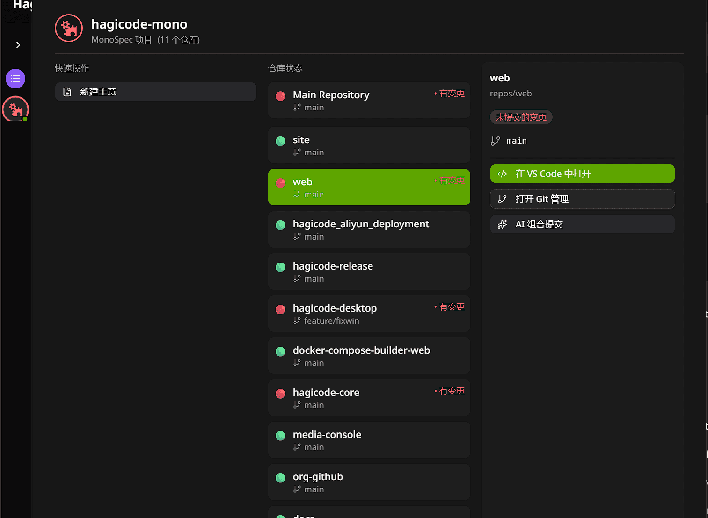

import { LinkCard, CardGrid } from '@astrojs/starlight/components';
import { Image } from 'astro:assets';
import LiveBroadcastCard from '@/components/LiveBroadcastCard.astro';
import ProductVideoShowcase from '@/components/ProductVideoShowcase.astro';
import proposalDrivenIllustration from './img/product-overview/value-proposition-proposal-driven/illustration.png';
import dualModeIllustration from './img/product-overview/value-proposition-dual-mode/illustration.png';

**Hagicode** 是面向真实研发流程的 AI 编程工作台：先理解代码库，再整理变更计划，最后安全落地实现，并把全过程沉淀为团队可复用的知识。

若你关心的不是“AI 会不会写代码”，而是“它能否在真实项目里少走弯路、少改错、方便协作”，这一页就是给你的。

## 为什么团队会选择 Hagicode？

你得到的不是一个只会补几行代码的聊天框，而是一套更贴近工程现场的工作方式：

- **先理解，后修改**：先看清项目结构、关键模块与风险点，再决定是否动代码。
- **先对齐，后执行**：把模糊需求整理成提案、任务拆分与验收标准，减少返工。
- **一次推进整条链路**：从理解、提案、实施到提交，不必在多个工具之间频繁切换。
- **把经验留在团队里**：让设计原因、实施记录与历史方案都能追溯、复用。

## 更稳：让 AI 在复杂项目里少走弯路

Hagicode 的价值，不是“改得快”，而是“先想清楚再改”。

<Image
  src={proposalDrivenIllustration}
  alt="提案驱动开发示意图"
  width={512}
  height={512}
  class="product-overview-illustration"
/>

> 先对齐目标、范围与验证方式，再进入实施，复杂需求更容易做对。

### 1. 提案驱动，先把复杂需求讲清楚

面对复杂功能、跨模块改动或多人协作时，Hagicode 会先把想法整理成提案。你可以先看到：

- 这次改动要解决什么问题
- 影响范围在哪里
- 任务如何拆分与推进
- 完成后该如何验证

这样，AI 不会一上来就乱改代码，而是先和你对齐思路。对重构、平台能力建设、跨仓库变更尤其重要。

### 2. 只读 / 编辑双模式，先安全探索，再决定是否动手

很多时候，你想先理解代码，而不是立刻执行改动。Hagicode 将这两类动作明确拆开：

- **只读模式**：适合理解陌生项目、排查问题、梳理架构
- **编辑模式**：适合真正落地功能、修复缺陷、执行重构

这种边界会直接提升信任感：先看懂，再修改；先确认，再执行。

### 3. 不只看单个文件，而是理解项目上下文

Hagicode 更强调“项目级理解”，而非“片段级补全”：

- 结合仓库结构、团队约定与已有实现来分析问题
- 支持多轮对话、任务跟踪与工具调用
- 让 AI 更像持续协作的工程搭档，而不是一次性的代码生成器

### 4. 变更理由可追溯，团队知识不会只留在聊天记录里

提案、归档与文档化流程能把“为什么这样做”留下来。新人接手、多人交接、回顾历史决策时，都会更省力。

## 更快：把理解、实施、提交串成一条顺手流程

Hagicode 的“快”，不是多加几个按钮，而是让常见动作自然连起来。

<Image
  src={dualModeIllustration}
  alt="只读 / 编辑双模式示意图"
  width={512}
  height={512}
  class="product-overview-illustration"
/>

> 先安全理解，再决定是否进入编辑实施，工作流更连贯。

> 会话推进、项目状态与仓库概况已能放在同一块工作台里，减少来回切换。

### 1. 从理解到改动，可以在同一条链路里完成

一个更贴近真实研发的流程通常是：

1. 导入项目或创建新项目
2. 用只读会话理解代码与需求
3. 用提案会话拆解任务与边界
4. 切到编辑模式执行改动
5. 用 AI 整理更清晰的提交信息

比起在多个工具之间来回切换，这条链路更适合连续推进真实开发任务。

### 2. Monospec 帮你把多仓库工作收拢到一个视角

如果你的工作不止一个仓库，Monospec 可以把多仓协作放在同一视角下：

> 在一个视图里统一看到多个仓库的分支、变更状态与快速操作，更适合持续推进多仓工作。

- 统一查看和推进多个仓库的任务
- 保持跨仓库的规范一致性
- 让 AI 在更完整的上下文里分析问题

这对多模块项目、微服务架构和长期维护型仓库尤其有帮助。

### 3. AI Compose Commit 帮你把“改完”变成“讲清楚”

很多团队的问题，不是没有改动，而是改完之后没人能快速看懂。Hagicode 可以基于实际变更生成更清晰的提交信息：

> 直接在 Git 视图里触发 AI Compose Commit，让提交整理成为工作流的一部分，而不是额外负担。

- 更贴近 Conventional Commits 规范
- 更容易让团队成员理解“改了什么、为什么改”
- 更便于后续审查、回滚与版本整理

### 4. 安装与接入路径尽量清晰，降低首次上手成本

无论你更偏向桌面应用、Docker Compose，还是已有特定 AI CLI 习惯，文档都会尽量把接入路径拆清楚，帮助你更快开始，而不是卡在配置细节里。

## 谁会更适合使用 Hagicode？

| 角色 | 你能获得什么 |
| --- | --- |
| 新人工程师 | 更快理解陌生代码库，降低上手焦虑 |
| 开发者 | 在分析、编码、提交之间减少切换成本 |
| 技术负责人 | 用提案和归档管理复杂变更，提升可追溯性 |
| 多仓库团队 | 在统一视角下推进多个仓库协作 |

## 从这里开始

### 建议先走这一条路径

<CardGrid>
  <LinkCard
    title="初始化向导设置"
    href="/quick-start/wizard-setup"
    description="推荐起点：完成首次项目创建、基础设置与真实仓库接入，先把环境跑通。"
  />
  <LinkCard
    title="创建普通会话"
    href="/quick-start/conversation-session"
    description="先用默认只读模式理解项目，再视情况切到编辑模式继续推进。"
  />
  <LinkCard
    title="创建提案会话"
    href="/quick-start/proposal-session"
    description="把模糊需求整理成可执行计划，适合复杂需求、重构与多人协作。"
  />
</CardGrid>

### 安装方式

<CardGrid>
  <LinkCard
    title="Desktop 版本"
    href="/installation/desktop"
    description="图形化安装与管理流程，适合希望快速开始的用户。"
  />
  <LinkCard
    title="Docker Compose"
    href="/installation/docker-compose"
    description="适合需要环境隔离、统一部署或团队使用的场景。"
  />
</CardGrid>

### 继续了解重点能力

<CardGrid>
  <LinkCard
    title="Monospec"
    href="/guides/monospecs"
    description="查看多仓库统一管理能力，了解跨仓库协作如何落地。"
  />
  <LinkCard
    title="AI Compose Commit"
    href="/guides/ai-compose-commit"
    description="了解 AI 如何帮助你生成更清晰、更规范的提交信息。"
  />
  <LinkCard
    title="技能系统"
    href="/guides/skills"
    description="查看推荐技能、本地技能与技能库，了解如何持续扩展工作台能力。"
  />
</CardGrid>

<ProductVideoShowcase locale="zh-CN" />

---

若你是第一次接触 Hagicode，建议按“初始化向导 → 普通会话 → 提案会话 → 对应功能指南”的顺序阅读，更容易看懂整套工作流。

<LiveBroadcastCard locale="zh-CN" />
