import { LinkCard, CardGrid } from '@astrojs/starlight/components';
import LiveBroadcastCard from '@/components/LiveBroadcastCard.astro';
import ProductVideoShowcase from '@/components/ProductVideoShowcase.astro';

全民制作人们大家好，我是 **HagiCode** 的制作人俞坤。

这一页我想用更直接一点的方式，介绍我到底想把 HagiCode 做成什么。

当你第一次听到 **HagiCode**，很容易先冒出几个问题。

**HagiCode 是一个 AI 编程工具吗？**

**HagiCode 是一个游戏吗？**

**HagiCode 是一个 IDE 吗？**

也许，这些答案都是“是”。

HagiCode 的目标，从来不是再做一个只能聊天的代码框。它想做的，是把 AI 真正带进完整的软件开发过程里。你可以用它理解仓库、写提案、拆任务、修改代码、整理提交、管理多仓库、沉淀知识库，也可以在同一个工作台里看到成就、日报、效率倍率、Token 吞吐和主题化界面。

所以如果你非要给 HagiCode 下一个简单定义，它更接近这样一句话：

> **HagiCode 是一个把 AI 编程工具、游戏化反馈系统和综合型开发工作台合并在一起的产品。**

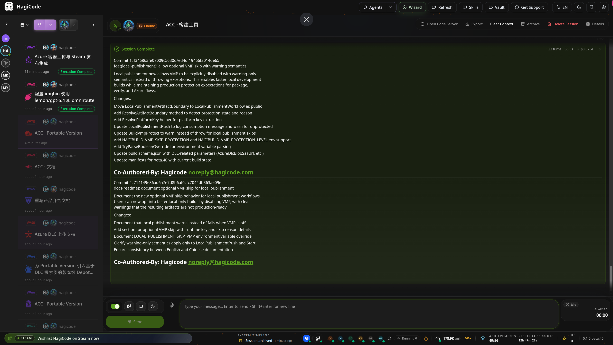

上面这张图已经很能说明问题了。HagiCode 不是把“对话”孤零零地放在页面中央，而是把会话、状态、流程、统计和操作入口收进同一块工作台。你打开它，不只是为了问一句“帮我写代码”，而是为了把一整段开发过程推进下去。

## 为什么 HagiCode 不像传统 AI 编程工具

传统的 AI 编程工具，重点常常在“生成”。HagiCode 更在意的是“少跑偏、能落地、能复盘”。

这意味着它在设计上会更偏向真实研发流程，而不是一次性的问答体验：

- 先理解仓库，再修改代码
- 先讲清目标，再开始执行
- 先把边界写清楚，再让 AI 动手
- 不只留下结果，也留下过程和理由

这也是 HagiCode 后面三重身份的基础。它既是 AI 编程工具，也是游戏化工作台，更是一个把多个开发能力整合起来的平台。

## 一、HagiCode 作为 AI 编程工具

如果只看“AI 编程”这一层，HagiCode 的重点不是让 AI 写得更花，而是让 AI 写得更稳。

### 1. 它不是先生成代码，而是先组织思路

HagiCode 内置了 **OpenSpec** 工作流。对于稍微复杂一点的需求，AI 不是一上来就开始改文件，而是先把需求整理成提案、任务、影响范围和验证方式。

这件事很关键。很多 AI 编程工具之所以让人不放心，不是因为它们不会生成代码，而是因为它们太容易在上下文不足时直接动手。HagiCode 则试图把这个问题反过来处理：

- 先把要解决的问题说清楚
- 先确认这次会影响哪些模块
- 先拆出任务和验收方式
- 再进入真正的实施阶段

这样做的直接结果，就是 AI 在复杂项目里更不容易“凭感觉乱改”。换句话说，HagiCode 不是在追求最短路径，而是在追求更可靠的路径。

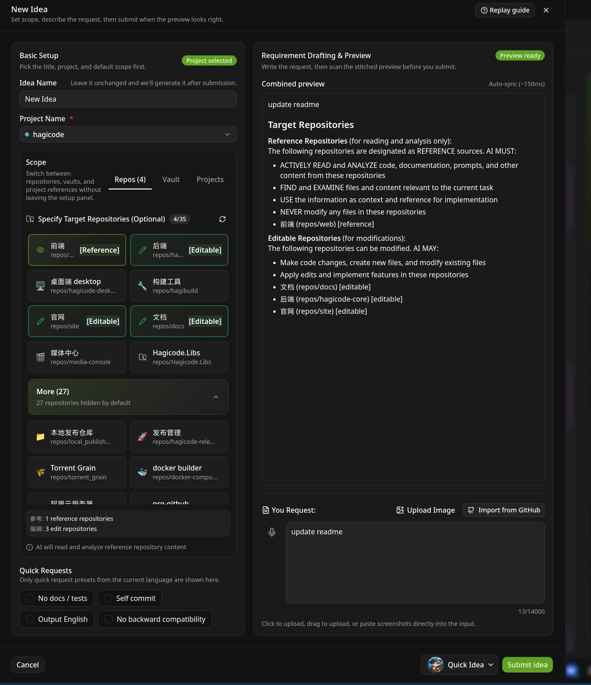

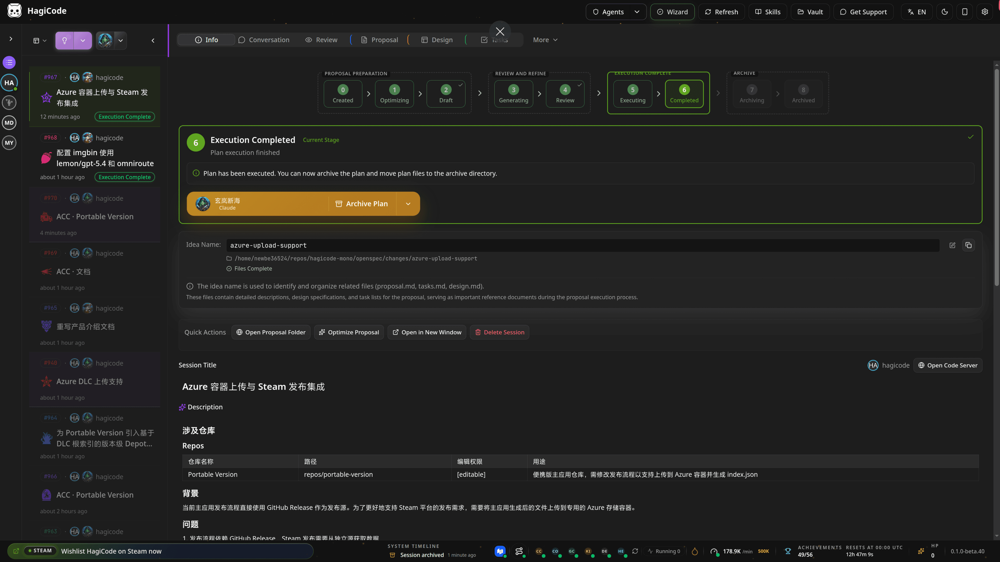

### 2. 它强调的是项目级理解，而不是只把当前任务做完

现在很多 IDE 都已经能做多文件编辑，甚至也能在一次会话里改动多个目录。所以 HagiCode 的优势，已经不能只用“不是单文件补全”来概括了。

我更想强调的是，HagiCode 追求的是一种 **项目全局思维**。

它关心的，不只是“这次任务要改哪几个文件”，而是更上层的问题：

- 这个项目整体在解决什么问题
- 当前仓库和其他仓库之间是什么关系
- 这次改动会不会影响前端、后端、文档、部署或脚本
- 过去已经做过哪些类似决策，为什么当时会那么做
- 这次产出的提案、提交和知识，之后怎样继续复用

也就是说，HagiCode 不只是替你完成一个任务，而是试图把 AI 拉到“长期参与一个项目”的视角里。

在这个视角下，单次任务只是表层。更重要的是下面这些能力会被自然串起来：

- 多项目之间的切换与协同
- 多仓库之间的统一理解和推进
- 历史提案、历史提交和历史知识的持续沉淀
- 把一次次对话，慢慢积累成项目长期可用的上下文

这也是为什么我会把 HagiCode 设计成工作台，而不是一个简单聊天窗口。它希望 AI 看到的，不是一段孤立需求，而是整个项目正在往哪里走。

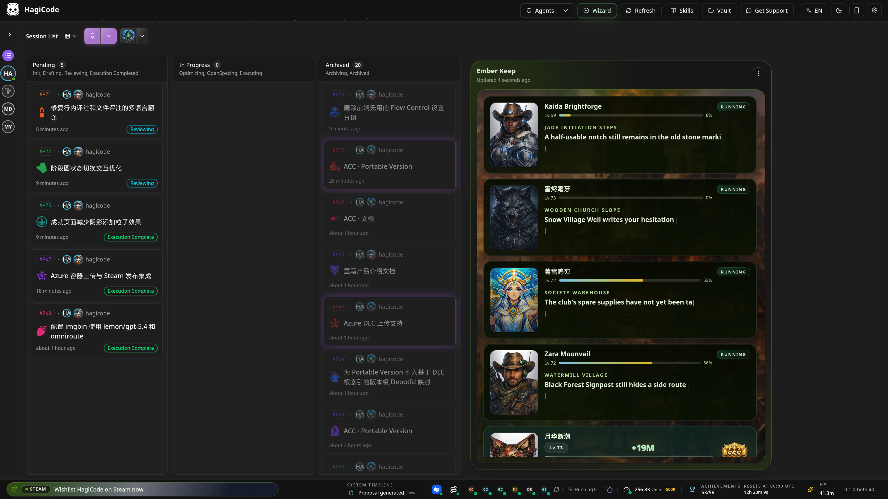

从这个角度看，HagiCode 更像“站在项目全局里思考的 AI”，而不是“帮你临时完成一次修改的 AI”。

### 3. 它支持多种主流 Agent CLI，而且把 CLI 和模型彻底拆开

HagiCode 当前的活跃支持范围覆盖多种主流 Agent CLI，包括：

- Codex
- Claude Code
- GitHub Copilot
- OpenCode
- Hermes
- QoderCLI
- Kiro
- Kimi
- Gemini
- DeepAgents
- Codebuddy

这里有一个很重要的点，我想说清楚：**CLI 和模型并不是绑死在一起的。**

很多产品在接入 AI 能力时，默认把“你在用哪个 CLI”和“你在用哪个模型订阅”写死成同一件事。但 HagiCode 不想这样做。

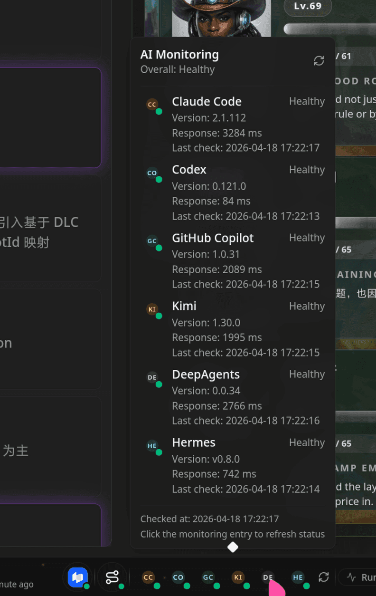

### 4. OmniRoute 让模型和 CLI 分离，路由方式更自由

HagiCode 集成了 **OmniRoute**，目的就是把模型接入做成一层独立基础设施。这样一来，CLI 负责你习惯的交互方式，模型和订阅则可以通过统一路由去选择。

这带来的意义非常直接：

- 你可以继续使用自己熟悉的 CLI
- 你不必被某个 CLI 默认绑定的模型订阅限制住
- 你可以把模型选择、模型目录和端点接入放到统一层里管理
- 你可以让不同 CLI 复用同一套模型接入策略

换句话说，哪怕你想用的是 **Claude Code** 作为 CLI，也完全可以通过 OmniRoute 去接入别的模型来源和订阅。比如你想走 **GitHub Copilot** 的订阅能力，而不是把 CLI 和默认订阅硬绑定在一起，这在 HagiCode 里就是可以成立的。

我希望做到的是：你选择 CLI，是因为你喜欢它的交互方式；你选择模型和订阅，是因为你认可它的成本、能力和可用性。这两件事不应该被强行绑成一个选择题。

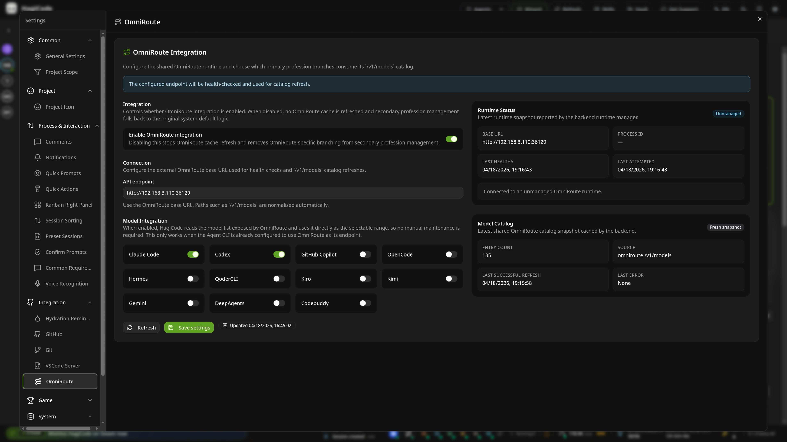

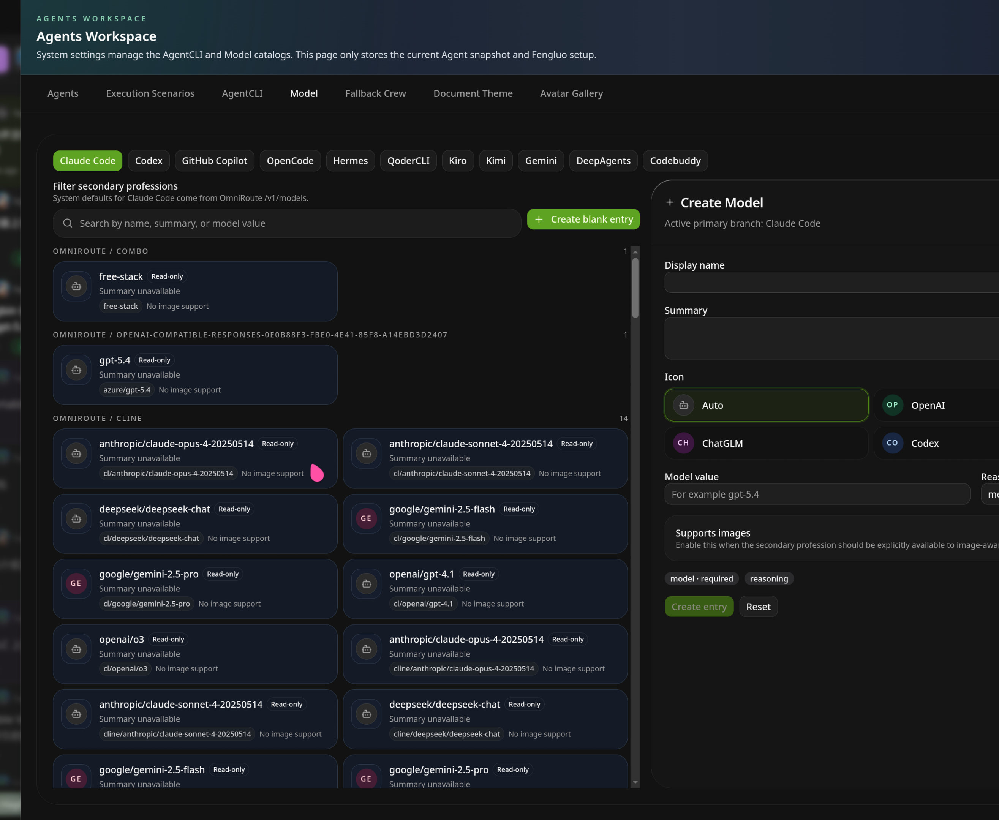

## 二、HagiCode 作为综合型 AI 开发平台

如果第一部分回答了“它会不会编程”，那第二部分要回答的就是：**它到底为什么像一套 IDE，甚至比传统 IDE 更像一个完整平台？**

答案在于，HagiCode 不只做对话，也不只做提案。它把很多本来散落在不同工具里的能力，收进了一个连续的系统里。

### 1. MonoSpecs 让跨仓库开发不再东拼西凑

对于真实团队来说，一个需求往往不会只落在一个仓库里。前端、后端、文档、脚本、部署配置，很可能要一起改。

HagiCode 引入了 **MonoSpecs**，目的就是把这种跨仓库协作拉回统一视角。你可以在同一个项目里维护仓库清单、提案范围和归档策略，也可以让 AI 在更完整的上下文里理解这次改动到底跨了哪些边界。

对于单仓库用户来说，这也许不是最先会用到的能力。但只要你开始处理前后端联动、文档与产品同步、或者多子项目维护，就会明白这一层有多重要。

### 2. Skills 系统让平台能力可以持续长出来

很多 AI 产品扩展能力的方式很粗糙，要么只能等官方加功能，要么让用户自己在命令行里折腾。HagiCode 的做法是把 **Skills** 做成一个正式模块。

你可以在 HagiCode 里：

- 查看本地已经安装的技能
- 搜索技能库
- 根据当前项目获取技能推荐
- 查看技能详情、安装命令和授信状态
- 批量更新本地技能

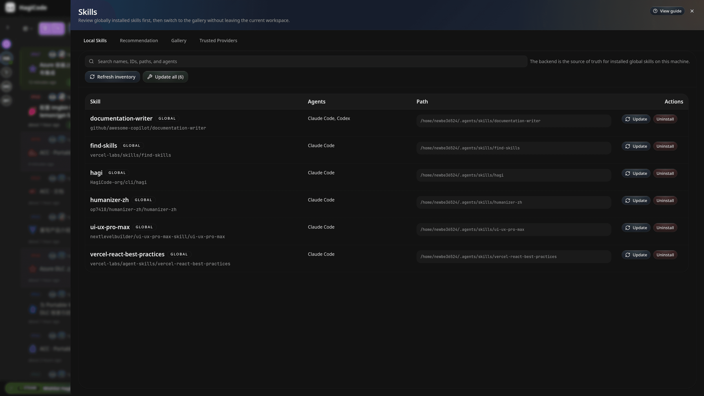

这意味着 HagiCode 不是一套封闭产品。它更像一个能不断接技能、接能力、接工作流的壳层。

### 3. Vault 系统让知识库不再散在各个角落

你可以把 **Vault** 理解成 HagiCode 的知识存储层。

它支持把不同类型的资料统一纳入平台，包括：

- 代码参考仓库
- 普通文件夹
- Obsidian 笔记库
- 系统维护的受管目录

这样一来，你在一个项目里积累下来的分析笔记、参考代码、设计记录，不会只停留在一次会话里。它们可以被继续引用、继续组织，也可以在后续项目中作为上下文复用。

对很多团队来说，这一点非常重要。AI 真正有价值，不是因为它“回答过一次”，而是因为它逐渐能站在一套被整理过的知识背景上继续工作。

### 4. AI Compose Commit 把“写完代码”延伸到“写清提交”

很多团队的痛点并不在编码本身，而在最后一步：代码改完了，但提交信息没人愿意认真写。

HagiCode 提供了 **AI Compose Commit**，让提交说明的生成也进入工作流。

- 你不需要逐行回忆自己改了什么
- 你不需要临时组织一段仓促的提交描述
- 你可以让 AI 根据实际变更整理更清楚的提交信息

它的价值，不只是节省几十秒，而是让“提交”这件事终于不再脱离上下文。

### 5. Code Server 集成让本地和远程编辑都更顺手

HagiCode 还集成了基于 **code-server** 的浏览器编辑能力。无论项目在本地、服务器、容器还是远程运行环境里，你都可以更方便地打开项目或 Vault，直接进入编辑状态。

这让 HagiCode 更像一个真正的开发平台，而不只是一个会分析代码的前台页面。很多时候，AI 已经帮你分析到了具体文件，如果还得自己回到另一套工具里重新定位，就会打断节奏。Code Server 集成解决的，就是这个断点。

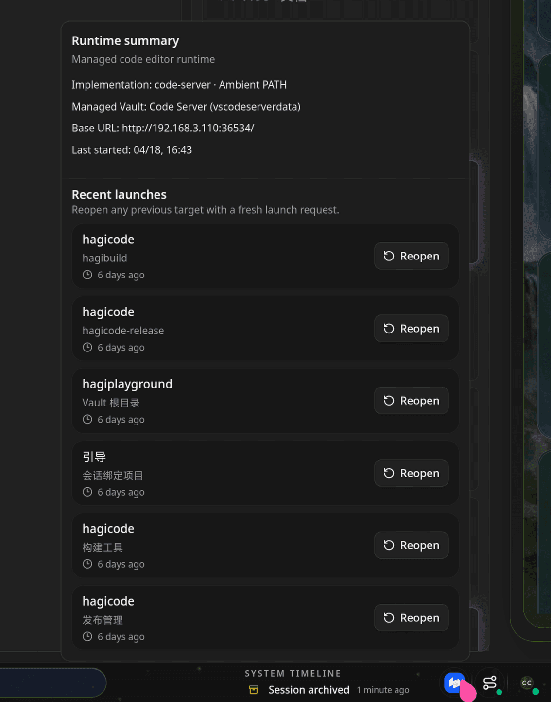

### 6. 它把便捷功能也当成正式能力，而不是边角料

除了核心的提案、执行、技能和知识管理，HagiCode 还内置了不少真正会影响日常体验的功能：

- GitHub 集成
- 语音识别
- 喝水提醒
- 主题与界面个性化
- 报表与统计入口

这些看起来像“小功能”，但它们会决定一个平台是不是愿意让人长期打开。HagiCode 并不把这些能力藏在边缘，而是尽量把它们做成完整、可见、可配置的一部分。

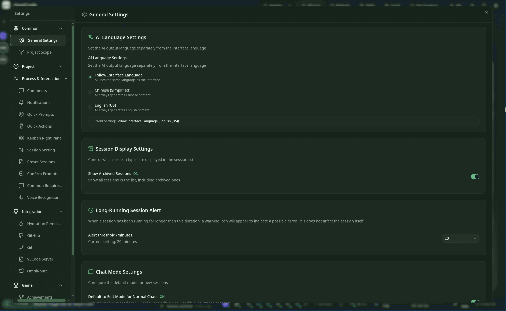

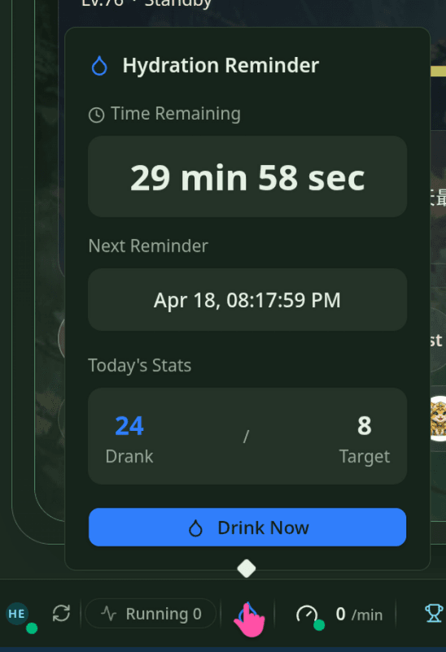

## 三、HagiCode 作为游戏

HagiCode 里的游戏化设计，不是为了装饰，而是为了让长期使用 AI 开发平台这件事变得更有反馈、更有节奏，也更容易坚持。

### 1. 你能看到自己的进度，而不是只看到聊天记录

在 HagiCode 里，很多行为都会被转化成明确的进度反馈。创建会话、发送消息、执行规划、切换项目、提交评注，这些都不再只是一次性动作，而会累计成 **每日成就**、阶段进度和完成记录。

这类设计的意义，不在于“好玩”两个字，而在于它让你能更容易感知自己一天到底推进了什么。对很多长期开发者来说，最消耗人的不是工作量，而是没有反馈。HagiCode 试图把这部分补回来。

### 2. 它不只给成就，还给日报

成就之外，HagiCode 还会用日报的方式告诉你：昨天到底做了多少事，这些分数是怎么来的，连续使用情况如何。

这让平台不只是“记录你做了什么”，还会把这些行为整理成一个有节奏感的回顾界面。你会更容易知道，自己是卡在了会话推进、工具调用、代码执行，还是卡在了活跃时长和任务连续性上。

### 3. 它把效率也做成了可视化反馈

很多产品会告诉你“用了 AI 更高效”，但说不清到底高效了多少。HagiCode 则更愿意把这件事用可见的数据说出来。

在这类效率报告里，你能看到运行时长、AI 耗时、效率提升倍数和并发分布。它不是在神化 AI，而是在尽量把“效率”从一句口号变成一组具体反馈。

### 4. 它甚至把 Token 消耗都做成了即时感知

如果你是重度用户，会很容易明白这个设计的价值。很多时候，AI 的成本和性能问题，不是在月底结算时暴露，而是在会话进行中就已经出现了。

HagiCode 会把输入、输出、总 Token 数和吞吐档位直接展示出来。这样一来，你对“这次会话到底有多重”“当前模型是不是在高负载”“这轮对话是不是过于臃肿”会有更直观的判断。

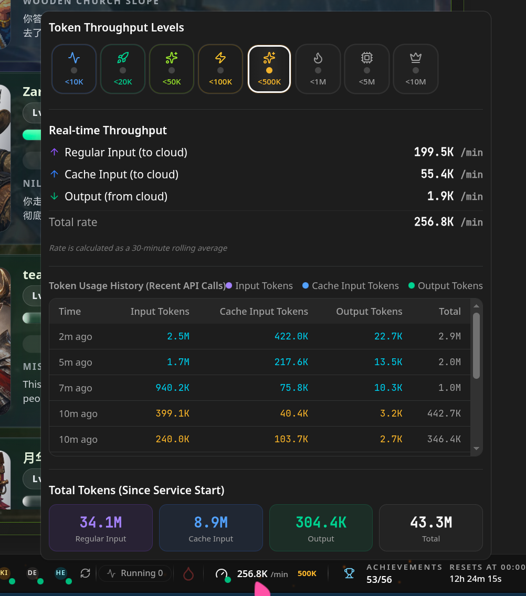

### 5. 英雄、职业和等级不是噱头，而是工作流映射

HagiCode 里有一整套围绕英雄、职业、负载、等级进度展开的表现方式。这不是简单换个名字，而是在把不同 Agent、不同职责和不同工作状态映射成更容易理解和管理的界面语义。

这种做法会让多 Agent 协作、多角色切换、多模型管理不再显得抽象。你看到的不只是“一个配置项”，而是“这个英雄当前在做什么、主副职业是什么、状态推进到了哪里”。

## HagiCode 到底适合谁

如果你属于下面这些角色，通常都会很容易理解 HagiCode 的价值：

| 角色 | 更适合看重什么 |
| --- | --- |
| 新人工程师 | 更快理解仓库、流程和上下文，而不是只拿到零碎答案 |
| 日常开发者 | 把提案、编码、提交、统计收进一套连续工作流 |
| 技术负责人 | 用 OpenSpec、MonoSpecs、Vault 让决策和知识更可追溯 |
| 多仓库团队 | 在同一套系统里推进跨前端、后端、文档和脚本的联动修改 |
| 重度 AI 用户 | 更清楚地管理模型、吞吐、效率、成就与长期使用节奏 |

## 最后再回答一次开头的问题

**HagiCode 是 AI 编程工具吗？**

是，而且它更强调少幻觉、少跑偏、能落地。

**HagiCode 是游戏吗？**

也是，因为它把成就、日报、倍率、英雄、职业和反馈机制认真做进了工作台。

**HagiCode 是 IDE 吗？**

某种意义上更像。因为它不只负责编辑器那一小块，而是把提案、会话、技能、知识库、跨仓库协作、提交整理和浏览器编辑一起接到了完整流程里。

所以，HagiCode 最终想推广的，不是某一个功能点，而是一种新的工作方式：

> **让 AI 开发从“问一句、回一句”升级成“理解、规划、执行、沉淀、反馈”一整条链路。**

## 版本与定价

如果你已经理解了 HagiCode 的产品定位，接下来最重要的问题通常就是：我应该从哪个版本开始，DLC 又会带来什么变化。

下表中，`✅` 表示支持，`❌` 表示不支持。

| 项目 | Desktop | Container | Steam | Hagicode Plus |
| --- | --- | --- | --- | --- |
| 获取入口 | [Desktop 安装](/installation/desktop) | [Container 部署](/installation/docker-compose) | [点击查看](https://store.steampowered.com/app/4625540/Hagicode/) | [点击查看](https://store.steampowered.com/app/4625540/Hagicode/) |
| 定价 | 免费 | 免费 | 点击查看 | 点击查看 |
| 全部免费特性 | ✅ | ✅ | ✅ | ✅ |
| Vault | ✅ | ✅ | ✅ | ✅ |
| Skills | ✅ | ✅ | ✅ | ✅ |
| 提案流程 | ✅ | ✅ | ✅ | ✅ |
| 本地成就 | ✅ | ✅ | ✅ | ✅ |
| 全部 Agent CLI 对接支持 | ✅ | ✅ | ✅ | ✅ |
| 语音识别支持 | ✅ | ✅ | ✅ | ✅ |
| OmniRoute 集成 | ✅ | ✅ | ✅ | ✅ |
| GitHub 集成 | ✅ | ✅ | ✅ | ✅ |
| Git 管理 | ✅ | ✅ | ✅ | ✅ |
| 最大提案并行数 | 3 | 3 | 3 | 32 |
| 文案切换支持 | ❌ | ❌ | ❌ | ✅ |
| Steam 云成就 | ❌ | ❌ | ✅ | ✅ |
| 免费 DLC 支持 | ❌ | ❌ | ✅ | ✅ |
| 创意工坊支持 | ❌ | ❌ | ✅ | ✅ |
| 云存档支持 | ❌ | ❌ | ✅ | ✅ |

**提案并行计数规则。** 免费版和 Steam 主体默认都包含 3 个提案并行上限。正在生成、正在执行、正在归档这三种状态会合并计入同一个上限。订阅 Turbo Engine DLC 后，上限会扩展到 32。

**Hagicode Plus 说明。** Hagicode Plus 就是 Steam 主体版本加上 Turbo Engine DLC。换句话说，如果你看到 Hagicode Plus，可以把它理解成“Steam 版 + 更高并发与增强能力”的组合购买路径。

### DLC 扩展包列表

<CardGrid>
  <LinkCard
    title="免费 DLC · Hagicode - All Beauties Pack"
    href="https://store.steampowered.com/app/4625540/Hagicode/"
    description="免费。面向 Steam 用户的额外美少女内容包，包含 1000 个额外的美少女风格头像，也为后续同主题内容扩展预留空间。"
  />
  <LinkCard
    title="性能 DLC · Hagicode: Turbo Engine DLC"
    href="https://store.steampowered.com/app/4625540/Hagicode/"
    description="点击查看。可单独购买，用来把最大提案并发数从 3 扩展到 32，同时解锁文案切换支持；官网常把“Steam 主体 + Turbo Engine DLC”作为 Hagicode Plus 对外说明。"
  />
  <LinkCard
    title="赞助者 DLC · Hagicode - Sponsor Pack"
    href="https://store.steampowered.com/app/4625540/Hagicode/"
    description="点击查看。适合希望直接支持项目长期运行的用户，包含一套专属暗色主题、一套专属亮色主题和一个专属 Steam 成就。"
  />
</CardGrid>

## 从哪里开始了解 HagiCode

如果你准备真正上手，建议按下面这条路径开始：

<CardGrid>
  <LinkCard
    title="初始化向导设置"
    href="/quick-start/wizard-setup"
    description="先完成语言、主题、依赖检测与默认 Agent CLI 配置，进入可用状态。"
  />
  <LinkCard
    title="创建提案会话"
    href="/quick-start/proposal-session"
    description="理解 HagiCode 最核心的 OpenSpec 驱动工作流，看看 AI 如何先提案再执行。"
  />
  <LinkCard
    title="Desktop 安装指南"
    href="/installation/desktop"
    description="通过桌面端快速开始，体验完整工作台与服务管理能力。"
  />
</CardGrid>

### 如果你想按专题继续深入

<CardGrid>
  <LinkCard
    title="MonoSpecs 指南"
    href="/guides/monospecs"
    description="进一步了解多仓库管理、统一提案范围与跨仓库协作方式。"
  />
  <LinkCard
    title="Skills 使用指南"
    href="/guides/skills"
    description="了解如何搜索、推荐、安装和更新技能，让平台能力持续扩展。"
  />
  <LinkCard
    title="AI Compose Commit"
    href="/guides/ai-compose-commit"
    description="查看 AI 如何把 Git 提交流程也纳入日常开发工作流。"
  />
</CardGrid>

<ProductVideoShowcase locale="zh-CN" />

---

如果你第一次接触 HagiCode，建议先把它看成一个完整平台，而不是一个单点工具。这样再回头看 OpenSpec、MonoSpecs、Skills、Vault、Code Server 和游戏化反馈这些能力，会更容易明白它们为什么会同时出现在同一款产品里。

直播通知入口为可选能力。默认构建不会显示；若需在此页恢复展示，可在部署时设置 `VITE_FEATURE_LIVE_BROADCAST_ENABLED=true`。

<LiveBroadcastCard locale="zh-CN" />
