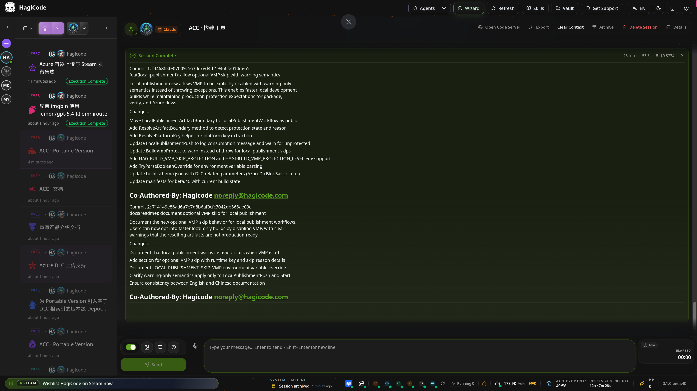

import { LinkCard, CardGrid } from '@astrojs/starlight/components';
import ProductVideoShowcase from '@/components/ProductVideoShowcase.astro';

HagiCode 是面向项目开发的 AI 工作台。你可以先用会话理解仓库，再明确需求与影响范围、让 AI 执行修改，并在同一处查看进度、整理提交和复用项目知识。它连接你使用的 Agent CLI 与模型，而不是要求你换一种特定的代码编辑器。

**第一次使用？**先[选择安装方式](/installation/)，完成[初始化向导](/quick-start/wizard-setup)，创建项目后从[普通会话](/quick-start/conversation-session)开始；如果任务需要先规划、再实施，则使用[提案会话](/quick-start/proposal-session)。

## 一次开发任务怎么走

以“修改一个涉及多个仓库的功能”为例：

1. **先理解**：在[普通会话](/quick-start/conversation-session)中分析现有代码。普通会话默认只读，需要修改文件时再切换到编辑模式。
2. **再定范围**：对于复杂变更，在[提案会话](/quick-start/proposal-session)中选择项目和仓库，先整理目标、任务与验证方式，再推进执行。
3. **跟踪结果**：在工作台回看会话和执行状态；需要整理提交时，可以使用 [AI Compose Commit](/guides/ai-compose-commit)。
4. **留下上下文**：提案与提交记录可供回顾；需要跨仓库协作时，使用 [MonoSpecs](/guides/monospecs) 管理仓库关系与变更范围。

你不必每次都走提案流程：只想了解代码或处理简单问题，可以从普通会话开始。HagiCode 的重点是让任务需要更多上下文时，仍有一条可追踪的推进路径。

## 按需求了解能力

| 如果你想…… | 可以从这里开始 |
| --- | --- |
| 先弄清楚代码，再决定是否修改 | [创建普通会话](/quick-start/conversation-session) |
| 在复杂需求中先规划、再执行 | [创建提案会话](/quick-start/proposal-session) |
| 让 AI 理解多个仓库的关系 | [MonoSpecs 指南](/guides/monospecs) |
| 搜索、安装和管理扩展能力 | [Skills 使用指南](/guides/skills) |
| 使用熟悉的 Agent CLI | [AI Agent CLI 安装与支持范围](/related-software-installation/ai-agent-cli/) |
| 分开管理 CLI 和模型接入 | [OmniRoute 安装与启动验证](/related-software-installation/omniroute/) |

Vault 可汇集参考仓库、文件夹和笔记，供后续工作复用；Code Server 提供浏览器中的编辑入口。这些能力并非开始使用 HagiCode 的前提。想进一步了解设计背景，可以阅读 [Vault 知识库实践](/blog/2026-04-10-vault-system-ai-knowledge-base/) 和 [浏览器编辑集成](/blog/2026-04-13-vscode-web-integration-browser-editing/)。

HagiCode 也提供英雄、成就、日报和 Token 等反馈，让长期使用中的状态与进度更可见。它们是工作台体验的一部分，不影响你按普通开发工具的方式使用；设计思路可见[游戏化设计文章](/blog/2026-03-16-gamifying-ai-coding/)。

## 版本与定价

**Desktop、Container 和 Microsoft Store 是不同的获取或部署方式，不是三档付费版本。**基础功能可以免费使用；Microsoft Store 渠道中的 Turbo Engine 是单独购买的一次性许可证，用于解锁更高的提案并发上限及文档主题、自定义署名、品牌和头像等增强能力。具体解锁项目以 [Turbo Engine 增强包](/dlc/turbo-engine-dlc/)为准。

| 你的环境 | 建议入口 |
| --- | --- |
| Windows，且可以使用 Microsoft Store | [Microsoft Store 安装](/installation/windows-store) |
| Windows 手动安装，或 macOS、Linux 本地使用 | [Desktop 安装](/installation/desktop) |
| 服务器、NAS 或团队部署 | [Docker Compose 安装](/installation/docker-compose) |

Steam 主应用已退役，不是当前的安装渠道；详情见 [Steam 分发状态](/faq/steam-distribution-status/)。

## 从哪里开始

<CardGrid>
  <LinkCard
    title="选择安装方式"
    href="/installation/"
    description="按操作系统和部署环境找到合适的入口。"
  />
  <LinkCard
    title="完成初始化向导"
    href="/quick-start/wizard-setup"
    description="首次启动后配置基础设置，并创建至少一个项目。"
  />
  <LinkCard
    title="创建普通会话"
    href="/quick-start/conversation-session"
    description="先只读理解项目，再决定是否进入编辑或提案流程。"
  />
</CardGrid>

## 为什么还要做成工作台

我是 HagiCode 的制作人俞坤。单次问答能解决眼前问题，但真实开发还需要理解项目、划定边界、推进变更、回看结果。我希望把这些原本分散的环节连在一起；游戏化反馈则让长期工作中的进度更容易被看见。你可以只使用其中一部分能力，不需要为了开始编码先学会所有模块。

如果更想通过实际界面了解产品，可以观看下面的演示视频。

<ProductVideoShowcase locale="zh-CN" />
