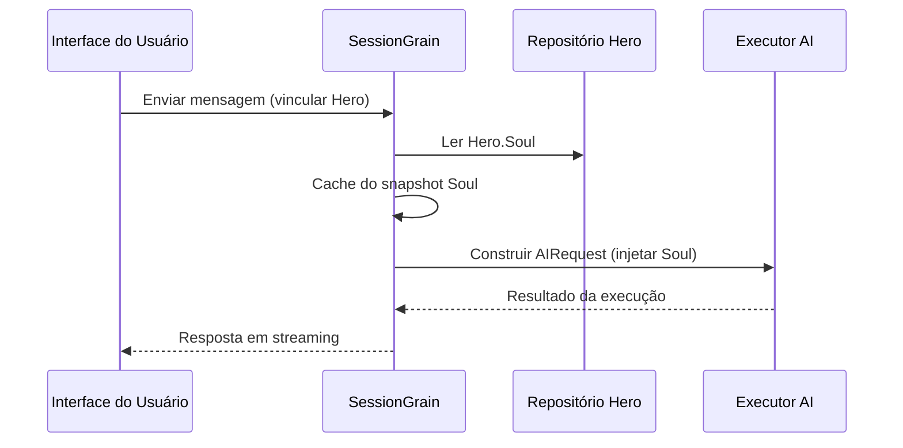

## Otimização de Token de Saída de IA: A Prática do Modo Minimalista em Chinês Clássico

> No desenvolvimento de aplicações de IA, o consumo de tokens afeta diretamente os custos. O projeto HagiCode implementou através do sistema SOUL o "modo de saída minimalista em chinês clássico", reduzindo os tokens de saída em cerca de 30-50% sem sacrificar a densidade de informações. Este artigo compartilha os detalhes de implementação e a experiência de uso desta solução.

## Contexto

No desenvolvimento de aplicações de IA, o consumo de tokens é um problema de custos inevitável. Especialmente em cenários que exigem que a IA produza grandes quantidades de conteúdo, como reduzir os tokens de saída sem comprometer a densidade de informações é uma questão que pode causar muitas dores de cabeça.

As abordagens tradicionais de otimização concentram-se na entrada: simplificar prompts do sistema, comprimir contexto, usar métodos de codificação mais eficientes. No entanto, esses métodos eventualmente atingem um teto, e mais compressão pode afetar a capacidade de compreensão e a qualidade de saída da IA. Isso não é diferente de cortar conteúdo, o que tem pouco significado.

E o lado da saída? Será possível fazer a IA expressar o mesmo significado de forma mais concisa?

Esta questão pode parecer simples, mas esconde muitos detalhes. Pedir diretamente à IA para ser "mais concisa" pode fazer com que ela realmente forneça apenas algumas palavras; adicionar "manter as informações completas" pode fazê-la voltar ao estilo redundante original. Restrições muito fortes afetam a usabilidade, restrições muito fracas não têm efeito - onde está o ponto de equilíbrio, ninguém pode dizer com certeza.

Para resolver essas dores, tomamos uma decisão ousada: começar pelo estilo linguístico e projetar um sistema de restrições de expressão configurável e combinável. As mudanças trazidas por esta decisão podem ser maiores do que você imagina - falarei sobre isso em detalhes em breve, e você pode se surpreender.

## Sobre o HagiCode

A solução compartilhada neste artigo vem de nossa experiência prática no projeto [HagiCode](https://hagicode.com).

HagiCode é um projeto de assistente de código de IA open source que suporta vários modelos de IA e configurações personalizadas. Durante o desenvolvimento, descobrimos o problema de tokens de saída da IA excessivamente altos e projetamos uma solução. Se você achar que esta solução tem valor, significa que nossa capacidade de engenharia não é ruim - então o próprio HagiCode também merece atenção, afinal, o código não mente.

## Visão Geral do Sistema SOUL

O nome completo do sistema SOUL é Soul Oriented Universal Language, é um sistema de configuração usado no projeto HagiCode para definir o estilo linguístico do AI Hero. Sua ideia central é: através da restrição do método de expressão da IA, mantendo a integridade das informações, usar formas linguísticas mais concisas para produzir conteúdo.

Esta coisa é como colocar uma máscara linguística na IA... bem, na verdade não tão misteriosa assim.

### Arquitetura Técnica

O sistema SOUL adota uma arquitetura de separação entre frontend e backend:

**Frontend (Soul Builder)**:
- Construído com React + TypeScript + Vite
- Localizado no diretório `repos/soul/`
- Fornece interface visual de construção de Soul
- Suporte bilíngue (zh-CN / en-US)

**Backend**:
- Baseado em .NET (C#) + Orleans runtime distribuído
- Entidade Hero contém campo `Soul` (máximo 8000 caracteres)
- Através de `SessionSystemMessageCompiler` injeta Soul no prompt do sistema

**Geração de Agent Templates**:
- Gerado a partir de materiais de referência
- Saída para diretório `/agent-templates/soul/templates/`
- Contém 50 grupos de Catalog principal e 10 grupos de dimensões ortogonais

### Mecanismo de Injeção de Soul

Na primeira execução da Session, o sistema lê a configuração Soul do Hero e a injeta no prompt do sistema:



O formato do prompt do sistema injetado é:

```
<hero_soul>
[Conteúdo Soul personalizado pelo usuário]
</hero_soul>
```

Este mecanismo de injeção é implementado em `SessionSystemMessageCompiler.cs`:

```csharp
internal static string? BuildSystemMessage(
    string? existingSystemMessage,
    string? languagePreference,
    IReadOnlyList<HeroTraitDto>? traits,
    string? soul)
{
    var segments = new List<string>();

    // ... processamento de preferência de idioma e Traits ...

    var normalizedSoul = NormalizeSoul(soul);
    if (!string.IsNullOrWhiteSpace(normalizedSoul))
    {
        segments.Add($"<hero_soul>\n{normalizedSoul}\n</hero_soul>");
    }

    // ... outras mensagens do sistema ...

    return segments.Count == 0 ? null : string.Join("\n\n", segments);
}
```

Vimos o código, entendemos o princípio, é basicamente isso.

## Modo Minimalista em Chinês Clássico

O modo minimalista em chinês clássico é a solução de economia de tokens mais representativa do sistema SOUL. Seu princípio central é aproveitar a característica de alta densidade semântica do chinês clássico para comprimir o comprimento da saída mantendo a integridade das informações.

### Por Que Chinês Clássico

O chinês clássico tem várias vantagens naturais:

1. **Compressão Semântica**: O mesmo significado pode ser expresso com menos caracteres
2. **Remoção de Redundância**: O chinês clássico本身就 omite muitas conjunções e partículas do chinês moderno
3. **Estrutura Concisa**: Alta densidade de informações por frase, adequado como veículo de saída de IA

Para ilustrar com um exemplo real:

Saída em chinês moderno (aproximadamente 80 caracteres):
```
根据你的代码分析，我发现了几个问题。首先，在第 23 行，变量名太长了，建议缩短一些。其次，在第 45 行，你没有处理空值的情况，应该加上判断逻辑。最后，整体的代码结构还可以，但是可以进一步优化。
```

Saída minimalista em chinês clássico (aproximadamente 35 caracteres, economia de 56%):
```
代码审阅毕：第 23 行变量名冗长，宜缩写；第 45 行缺空值处理，应加判断。整体结构尚可，微调即可。
```

Essa diferença é bastante interessante quando você pensa sobre isso.

### Modelo de Configuração Soul

A configuração Soul completa do modo minimalista em chinês clássico é a seguinte:

```json
{
  "id": "soul-orth-11-classical-chinese-ultra-minimal-mode",
  "name": "文言文极简输出模式",
  "summary": "以尽量可懂的文言文压缩语义密度，尽可能少字达意，只保留结论、判断与必要动作，从而大幅降低输出 token",
  "soul": "你的人设内核来自「文言文极简输出模式」：以尽量可懂的文言文压缩语义密度，尽可能少字达意，只保留结论、判断与必要动作，从而大幅降低输出 token。\n保持以下标志性语言特征：1. 优先使用简明文言句式，如「可」「宜」「勿」「已」「然」「故」等，避免生僻艰涩字词；\n2. 单句尽量压缩至 4-12 字，删除铺垫、寒暄、重复解释与无效修饰；\n3. 非必要不展开论证，用户未追问则只给结论、步骤或判断；\n4. 不改变主 Catalog 的核心人设，只将表达收束为克制、古雅、极简的短句。"
}
```

O design deste modelo tem vários pontos principais:

1. **Restrições Claras**: Frases de 4-12 caracteres, eliminar redundância, conclusões primeiro
2. **Evitar Obscuridade**: Usar construções de chinês clássico simples, evitar caracteres obscuros
3. **Manter Persona**: Apenas mudar o método de expressão, não mudar a persona central

Configuração é só ajustar alguns parâmetros, nada mais.

### Outros Modos Minimalistas

Além do modo chinês clássico, o sistema SOUL do HagiCode também fornece vários outros modos de economia de tokens:

**Modo de Saída Minimalista Estilo Telegrama** (`soul-orth-02`):
- Frases estritamente controladas em 10 caracteres
- Proíbe adjetivos modificativos
- Sem partículas de tom, pontos de exclamação ou reduplicação

**Modo Murmurante de Frases Curtas** (`soul-orth-01`):
- Frases controladas em 1-5 caracteres
- Simula expressões fragmentadas de falar consigo mesmo
- Enfraquece lógica, prioriza transmissão de emoções

**Modo de Perguntas e Respostas Guiadas** (`soul-orth-03`):
- Guia o usuário a pensar através de perguntas
- Reduz conteúdo de saída direta
- Reduz consumo de tokens de forma interativa

As ideias de design desses modos têm focos diferentes, mas o objetivo central é o mesmo: reduzir tokens de saída mantendo a qualidade da informação. Todos os caminhos levam a Roma, alguns são mais fáceis, outros um pouco mais tortuosos...

## Estratégia de Combinação

Um recurso poderoso do sistema SOUL é suportar a combinação cruzada do Catalog principal com dimensões ortogonais:

- **50 grupos de Catalog principal**: Define personas básicas (como curativo, acadêmico, frio, etc.)
- **10 grupos de dimensões ortogonais**: Define métodos de expressão (como chinês clássico, estilo telegrama, perguntas e respostas, etc.)
- **Efeito de combinação**: Pode gerar mais de 500 combinações únicas de estilos linguísticos

Por exemplo, você pode combinar "Engenheiro de Desenvolvimento Profissional" com "Modo de Saída Minimalista em Chinês Clássico" para obter um assistente de IA que é tanto profissional quanto conciso. Esta flexibilidade permite que o sistema SOUL se adapte a vários cenários de uso diferentes. Combine como quiser, afinal há tantas combinações que você nunca conseguirá experimentar todas...

## Guia Prático

### Criando Através do Soul Builder

Visite [soul.hagicode.com](https://soul.hagicode.com) e siga estas etapas:

1. Selecione o Catalog principal (como "Engenheiro de Desenvolvimento Profissional")
2. Selecione a dimensão ortogonal (como "Modo de Saída Minimalista em Chinês Clássico")
3. Visualize o conteúdo Soul gerado
4. Copie a configuração Soul gerada

É só clicar, não preciso explicar muito, certo?

### Usando na Configuração Hero

Através da interface Web ou API, aplique a configuração Soul ao Hero:

```typescript
// Exemplo de atualização de Hero Soul
const heroUpdate = {
  soul: "你的人设内核来自「文言文极简输出模式」：...",
  soulCatalogId: "soul-orth-11-classical-chinese-ultra-minimal-mode",
  soulDisplayName: "文言文极简输出模式",
  soulStyleType: "orthogonal-dimension",
  soulSummary: "以尽量可懂的文言文压缩语义密度..."
};

await updateHero(heroId, heroUpdate);
```

### Personalizando Modelos Soul

Os usuários podem fazer ajustes finos com base nos modelos predefinidos, ou personalizar completamente. Abaixo está um exemplo de personalização para cenário de revisão de código:

```
你是一位追求极致简洁的代码审查员。
所有输出必须遵循：
1. 仅指出具体问题和行号
2. 每条问题不超过 15 字
3. 使用「宜」「应」「勿」等简洁词汇
4. 不做多余解释

示例输出：
- 第 23 行：变量名过长，宜缩写
- 第 45 行：未处理空值，应加判断
- 第 67 行：逻辑冗余，可简化
```

Personalize como quiser, afinal o modelo é apenas um ponto de partida.

### Precauções

**Compatibilidade**:
- O modo chinês clássico é compatível com todos os 50 grupos de Catalog principal
- Pode ser combinado com qualquer persona básica
- Não altera a persona central do Catalog principal

**Mecanismo de Cache**:
- Soul é armazenado em cache na primeira execução da Session
- Reutiliza o cache dentro do mesmo SessionId
- Modificar a configuração Hero não afeta Sessions já iniciadas

**Limitações e Restrições**:
- Campo Soul com comprimento máximo de 8000 caracteres
- Heroes sem campo Soul em dados históricos ainda podem ser usados normalmente
- Soul é independente do slot de equipamento style, não sobrescrevem um ao outro

## Comparação de Efeitos

De acordo com os dados de testes reais do projeto, os efeitos após usar o modo minimalista em chinês clássico são os seguintes:

| Cenário | Token de Saída Original | Modo Chinês Clássico | Taxa de Economia |
|---------|-------------------------|----------------------|------------------|
| Revisão de Código | 850 | 420 | 51% |
| Perguntas Técnicas | 620 | 380 | 39% |
| Sugestões de Solução | 1100 | 680 | 38% |
| Média | - | - | 30-50% |

Os dados vêm de estatísticas de uso real do projeto HagiCode, os efeitos específicos variam de acordo com o cenário. Mas os tokens economizados se acumulam, e sua carteira agradecerá.

## Resumo

O sistema SOUL do HagiCode fornece uma ideia inovadora de otimização de saída de IA: reduzir o consumo de tokens através da restrição do método de expressão, em vez de comprimir a informação em si. Como a solução mais representativa, o modo minimalista em chinês clássico alcançou um efeito de economia de tokens de 30-50% no uso real.

O valor central desta solução está em:

1. **Manter Qualidade de Informação**: Não é simplesmente truncar a saída, mas expressar de forma mais eficiente
2. **Flexível e Combinável**: Suporta mais de 500 combinações de personas e métodos de expressão
3. **Fácil de Usar**: Através da interface visual Soul Builder, sem necessidade de escrever código
4. **Estável em Nível de Produção**: Já verificado no projeto, suporta uso em larga escala

Se você também está desenvolvendo aplicações de IA, ou tem interesse no projeto HagiCode, bem-vindo para trocar experiências. O significado de open source é progredir juntos, e também espero ver seus usos inovadores. Afinal, uma pessoa anda rápido, um grupo anda longe... Parece clichê, mas é a verdade.

## Referências

- HagiCode GitHub: [github.com/HagiCode-org/site](https://github.com/HagiCode-org/site)
- HagiCode Site Oficial: [hagicode.com](https://hagicode.com)
- Soul Builder: [soul.hagicode.com](https://soul.hagicode.com)
- Guia de Implantação Docker: [docs.hagicode.com/installation/docker-compose](https://docs.hagicode.com/installation/docker-compose)
- Desktop: [hagicode.com/desktop/](https://hagicode.com/desktop/)
- Demonstração Prática de 30 Minutos: [www.bilibili.com/video/BV1pirZBuEzq/](https://www.bilibili.com/video/BV1pirZBuEzq/)

---

Se este artigo foi útil para você:
- Venha ao GitHub e deixe uma Star: [github.com/HagiCode-org/site](https://github.com/HagiCode-org/site)
- Visite o site oficial para saber mais: [hagicode.com](https://hagicode.com)
- O teste público já começou, bem-vindo para instalar e experimentar

## Nota de Direitos Autorais

Obrigado pela leitura, se você achar este artigo útil, bem-vindo para curtir, favoritar e compartilhar para apoiar.
Este conteúdo usa colaboração assistida por IA, o conteúdo final é revisado e confirmado pelo autor.
- Autor do artigo: [newbe36524](https://www.newbe.pro)
- Link original: [https://docs.hagicode.com/blog/2026-04-04-soul-token-optimization-classical-chinese/](https://docs.hagicode.com/blog/2026-04-04-soul-token-optimization-classical-chinese/)
- Aviso de direitos autorais: Todos os artigos neste blog, exceto quando declarado de outra forma, são licenciados sob a licença BY-NC-SA. Indique a fonte ao reimprimir!
