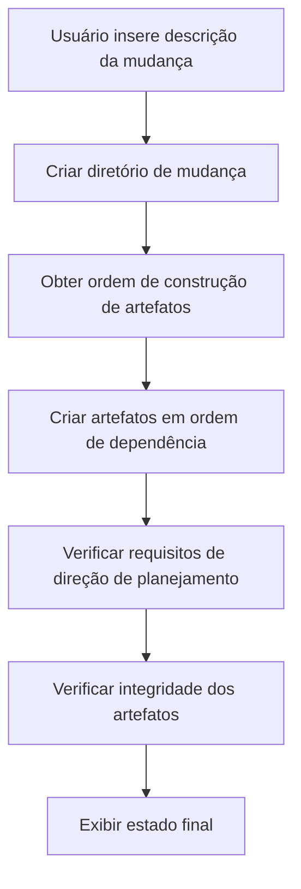
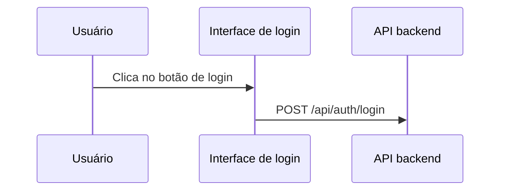

## Personalizando etapas do OpenSpec para melhorar os resultados da geração de IA

> Ao usar o OpenSpec para gerenciar propostas técnicas, encontramos problemas de qualidade instável na geração de documentos por IA. Na verdade, não há outra saída, só podemos nós mesmos modificar os modelos de prompts. Este artigo é um registro desses dias.

## Contexto

O OpenSpec é um sistema para gerenciar propostas técnicas, a ideia principal é simples: insira uma descrição da mudança, gere automaticamente vários artefatos de documentação. proposal, design, specs, tasks, tudo pode ser gerado automaticamente. Parece bom, não é?

Mas no uso prático, encontramos alguns problemas. Como dizer, não são grandes problemas, é apenas que o conteúdo gerado não tem o sabor certo.

O `design.md` gerado falta elementos visuais necessários — sem diagramas de fluxo Mermaid, sem diagramas de sequência, muito menos diagramas de arquitetura. A equipe técnica vê esses documentos de design e balança a cabeça, afinal, quem quer ver um monte de texto puro?

O `proposal.md` também não é satisfatório, falta tabelas de mudanças de código, sem protótipos de interface. Os tomadores de decisão olham por muito tempo e ainda não sabem exatamente o que a mudança alterou.

O que é mais frustrante é o `tasks.md`, que mistura várias tarefas de operações Git. Os limites de responsabilidade ficam vagos, os desenvolvedores olham para essas tarefas e não sabem o que devem ou não fazer. Isso também é um pouco inevitável, afinal a IA também não sabe como é a divisão de trabalho da sua equipe.

Os requisitos de visualização para diferentes níveis de documentos também não são claros. Quais diagramas o proposal e o design devem conter? Esta questão tem atormentado a equipe.

Qual é a raiz desses problemas? Após análise, descobrimos o ponto-chave: os modelos de prompts carecem de restrições e orientações claras.

Isso não é surpreendente, afinal os modelos são genéricos e não podem se adaptar completamente às necessidades de cada equipe.

## Sobre o HagiCode

A solução compartilhada neste artigo vem da nossa experiência prática no projeto [HagiCode](https://hagicode.com). O HagiCode é um projeto de assistente de código IA, usamos amplamente o OpenSpec para gerenciar propostas técnicas durante o desenvolvimento.

Foi justamente essa experiência prática de enfrentar problemas que levou ao nascimento desta solução de melhoria. Na verdade, não é nada de outro mundo, é apenas encontrar problemas e resolvê-los.

## Análise: arquitetura do sistema de prompts

Para resolver problemas, primeiro precisamos entender o sistema. Vamos ver como funciona o sistema de prompts do OpenSpec.

O OpenSpec usa o sistema de modelos Handlebars, cada prompt contém duas partes:

**Arquivo de metadados JSON**: define parâmetros, cenários, informações de versão
**Arquivo de modelo Handlebars**: contém o conteúdo real do prompt

```
Resources/Prompts/
├── openspec-v1-ff.zh-CN.json    # Metadados
├── openspec-v1-ff.zh-CN.hbs     # Conteúdo do modelo
├── openspec-v1-ff.en-US.json
└── openspec-v1-ff.en-US.hbs
```

As vantagens desse design de separação são óbvias: metadados e conteúdo são gerenciados separadamente, facilitando a manutenção e localização. Isso também é um pouco como escrever código, lógica e apresentação separadas, todos entendem esse princípio.

O fluxo de trabalho FF (Fast Forward) é o processo principal de geração do OpenSpec:



Este fluxo parece perfeito, mas o problema está no passo "requisitos de direção de planejamento" — ele não tem orientação suficientemente clara.

Isso também é um pouco inevitável, afinal ao projetar o sistema, não é possível considerar as necessidades específicas de todas as equipes.

## Sistema de direções de planejamento

O sistema de direções de planejamento é o mecanismo principal de personalização do OpenSpec, permitindo que os usuários escolham diferentes opções de geração. No projeto HagiCode, definimos as seguintes direções:

| ID da Direção | Função | Habilitado por Padrão |
|---------|------|---------|
| `explore` | Modo de exploração | Sim |
| `change-map` | Mapa de mudanças | Sim |
| `flowchart` | Diagrama de fluxo de interação | Sim |
| `prototype` | Protótipo UI | Sim |
| `architecture` | Diagrama de arquitetura | Sim |
| `sequence` | Diagrama de sequência de API | Sim |

Cada direção define identificadores estáveis, estado de habilitação padrão, rótulos de exibição e fragmentos de prompts em chinês e inglês.

Este sistema é projetado de forma engenhosa, mas na prática do HagiCode, descobrimos que apenas ter definições não é suficiente — é necessário usar essas direções explicitamente nos modelos de prompts.

Isso também é um pouco como muitas coisas na vida, ter opções não significa fazer escolhas, ainda precisa de alguém para dizer como escolher.

## Solução: restrições claras e exemplos

Nossa ideia de melhoria é muito direta: adicionar restrições claras e exemplos de referência nos modelos de prompts.

Na verdade, não há nada de especial, é apenas deixar as coisas claras.

### 1. Adicionar requisitos de visualização de documentos

No modelo `openspec-v1-ff.zh-CN.hbs`, adicionamos restrições claras de escopo de conteúdo:

```markdown
### Restrições de escopo de conteúdo para tasks.md

Ao criar o artefato `tasks.md`, deve-se observar as seguintes restrições de escopo de conteúdo:

Deve incluir:
- Tarefas de lógica de negócios (implementação de código, desenvolvimento de recursos)
- Tarefas de implementação técnica (integração de componentes, desenvolvimento de API)
- Tarefas de teste (testes unitários, testes de integração)
- Tarefas de documentação (atualizar documentação, adicionar comentários)

Não deve incluir:
- Operações de commit Git (git add, git commit, git push)
- Fluxos de trabalho de gerenciamento de controle de versão
- Operações de implantação e lançamento
```

Usando linguagem normativa "deve/não deve" em vez de "sugere" ou "pode", isso permite que a IA entenda com mais precisão as restrições.

Isso também é um pouco como ensinar crianças, dizer o que é, não pode haver ambiguidade.

### 2. Fornecer exemplos de referência para cada direção

Apenas dizer "incluir diagrama de fluxo" não é suficiente, fornecemos exemplos específicos de saída para cada direção habilitada.

Afinal, falar sem praticar é fingimento, dar um exemplo específico permite que a IA entenda melhor.

**Exemplo de direção de mapa de mudanças**:
```markdown
| Caminho do arquivo | Tipo de mudança | Razão da mudança | Escopo de impacto |
|---------|---------|---------|---------|
| Path/to/file | Adição | Descrição | Nome do módulo |
```

**Exemplo de direção de protótipo**:
```
┌─────────────────────────────────────────┐
│ Login do usuário                            [×] │
├─────────────────────────────────────────┤
│  Endereço de e-mail *                             │
│ ┌─────────────────────────────────────┐ │
│ │ user@example.com                   │ │
│ └─────────────────────────────────────┘ │
└─────────────────────────────────────────┘
```

**Exemplo de direção de fluxograma**：


Esses exemplos permitem que a IA entenda com precisão o formato de saída esperado, em vez de improvisar.

Isso também é um pouco como dar respostas de referência em um exame, embora não possam ser exatamente iguais, o formato deve estar correto.

### 3. Usar linguagem normativa para requisitos claros

Para requisitos de visualização de diferentes tipos de documentos, usamos linguagem normativa para restringir:

```markdown
Para proposal.md:
- Deve incluir tabela de mudanças de código (quando a direção change-map estiver habilitada)
- Deve incluir protótipo UI (quando envolver mudanças UI e a direção prototype estiver habilitada)
- Não deve incluir diagramas de arquitetura detalhados (esses devem estar em design.md)

Para design.md:
- Deve incluir todo o conteúdo de proposal.md (versão mais detalhada)
- Deve incluir diagrama de arquitetura (quando a direção architecture estiver habilitada)
- Deve incluir diagrama de fluxo de dados (quando a direção flowchart estiver habilitada)
```

Essas restrições claras melhoraram significativamente a qualidade de geração.

Na verdade, não há nada mais, é apenas deixar as coisas claras, não deixar a IA adivinhar.

## Prática: implementação de código

Teoria à parte, vamos ver como foi implementado no projeto HagiCode.

### Definir direções de planejamento

Definir direções de planejamento em `ProposalPlanningDirections.cs`:

```csharp
public static class ProposalPlanningDirections
{
    private static readonly ProposalPlanningDirectionDefinition[] Catalog =
    [
        new(
            ChangeMapId,
            "Change map",
            DefaultEnabled: true,
            EnglishPromptFragment:
            "- Change map: include structured file-impact views...",
            ChinesePromptFragment:
            "- 变更地图：加入结构化的文件影响视图..."),
        // ... outras direções
    ];

    public static string RenderInstructionBlock(
        IEnumerable<ProposalPlanningDirectionState> directions,
        string? locale)
    {
        var enabledDirections = directions
            .Where(direction => direction.Enabled)
            .ToArray();

        if (enabledDirections.Length == 0)
        {
            return string.Empty;
        }

        var heading = IsChineseLocale(locale)
            ? "本次生成启用以下规划方向："
            : "Apply the following planning directions:";

        return string.Join(Environment.NewLine,
            [heading, .. enabledDirections.Select(d => d.GetPromptFragment(locale))]);
    }
}
```

Este código tem vários pontos de design notáveis:

1. Usar array em vez de lista, porque as definições não mudam em tempo de execução
2. Renderização preguiçosa — só gera texto quando há direções habilitadas
3. Suporte multilíngue, seleciona o fragmento de prompt apropriado com base no locale

Na verdade, não há nada de especial, é apenas algum design de código convencional.

### Parametrização de modelos

Usar instruções condicionais em modelos Handlebars:

```handlebars
{{#if planningDirectionInstructions}}
## Direções de planejamento para esta geração

{{{planningDirectionInstructions}}}
{{/if}}

**Etapas**
1. **Se nenhuma entrada for fornecida, use valores padrão razoáveis**
2. **Criar diretório de mudança**
3. **Obter ordem de construção de artefatos**
4. **Criar artefatos em sequência até apply-ready**
   a. Para cada artefato ready:
      - Obter instruções
      - Ler arquivos de dependência
      - Criar arquivo de artefato
```

Note aquele `{{{planningDirectionInstructions}}}` — três chaves significam não escapar HTML, isso pode preservar formatos como blocos de código Mermaid.

Isso também é um pouco como compromissos na vida, às vezes precisa preservar algumas coisas originais, não pode escapar tudo.

### Implementação de carregamento de prompts

Implementar carregamento parametrizado de prompts através de `FilePromptProvider`:

```csharp
public async Task<string> GetOpenspecV1FfPromptAsync(
    string changeName,
    string changeDescription,
    string locale = "en-US",
    string? planningDirectionInstructions = null,
    CancellationToken cancellationToken = default)
{
    var parameters = new Dictionary<string, object>
    {
        { "planningDirectionInstructions",
          ResolvePlanningDirectionInstructions(locale, planningDirectionInstructions) }
    };

    if (!string.IsNullOrWhiteSpace(changeName))
    {
        parameters["changeName"] = changeName;
    }

    return await GetPromptWithParametersAsync(
        PromptScenario.OpenspecV1Ff,
        locale,
        cancellationToken,
        parameters) ?? string.Empty;
}
```

Este design é flexível: `planningDirectionInstructions` é opcional, se não fornecido, o sistema usará a configuração padrão.

Afinal, ninguém quer passar um monte de parâmetros toda vez, ter um valor padrão é sempre bom.

## Validação e testes

Após a implementação, a equipe HagiCode realizou validação abrangente:

### Ao habilitar direções específicas

- Verificar se o proposal.md gerado contém tabela de mudanças de código
- Verificar se o design.md gerado contém diagrama de arquitetura
- Validar que tasks.md não contém tarefas de operações Git

### Ao desabilitar direções específicas

- Validar que o conteúdo visual correspondente não é gerado
- Garantir que não afeta a saída de outras direções

### Casos de borda

- Comportamento quando todas as direções estão desabilitadas
- Tratamento de erro quando IDs de direção inválidos

Esses testes garantem a estabilidade e previsibilidade do sistema — isso é crucial para a equipe adotar novas ferramentas.

Na verdade, não há nada de especial, é apenas testar tudo que precisa ser testado, afinal ninguém quer problemas após o lançamento.

## Considerações importantes

Ao implementar esta solução, há algumas armadilhas para evitar:

**Sincronização de modelos**: Ao modificar modelos, preste atenção em manter a sincronização com o upstream. A equipe HagiCode encontrou um conflito de modelos que levou meio dia para resolver. Isso também é um pouco inevitável, afinal atualizações sempre trazem alguns problemas de compatibilidade.

**Consistência bilíngue**: Garantir que a estrutura e restrições dos modelos chinês e inglês sejam consistentes. Encontramos uma situação onde a versão chinesa tinha restrições mas a versão inglesa não, levando a qualidade inconsistente dos documentos gerados. Isso também é um pouco embaraçoso, afinal ninguém sabe que língua os usuários usarão.

**Impacto de performance**: A renderização de direções de planejamento deve ser completada em microssegundos. Se o tempo de renderização for muito longo, afetará a experiência do usuário. Afinal, quem quer esperar muito tempo para ver os resultados?

**Compatibilidade reversa**: Manter suporte para APIs antigas. Como o parâmetro `enableExploreMode`, embora agora usemos o sistema de direções de planejamento, o código antigo ainda está em uso. Isso também é um pouco inevitável, afinal não podemos sempre exigir que todos atualizem.

**Expressão clara**: Usar linguagem normativa (MUST/SHALL) em vez de linguagem sugestiva. Este ponto foi plenamente validado na prática do HagiCode. Na verdade, não há nada mais, é apenas deixar as coisas claras.

## Conclusão

Ao personalizar as etapas de prompts do OpenSpec, melhoramos com sucesso a qualidade dos documentos gerados por IA. Os pontos-chave de melhoria incluem:

1. Adicionar condições de restrição claras nos modelos de prompts
2. Fornecer exemplos específicos de saída para cada direção de planejamento
3. Usar linguagem normativa (MUST/MUST NOT) para restringir o comportamento da IA
4. Implementar carregamento parametrizado flexível de prompts através de código

Esta solução foi validada no projeto HagiCode, a qualidade dos documentos gerados melhorou significativamente: documentos de design contêm elementos visuais completos, documentos de proposta têm tabelas claras de mudanças de código, listas de tarefas com responsabilidades claras.

Na verdade, não é nada de outro mundo, é apenas resolver o problema.

Se você também está usando sistemas similares de geração de documentos assistidos por IA, espero que essas experiências sejam úteis. Lembre-se: restrições claras e exemplos específicos são a chave para obter saída de alta qualidade.

Afinal algumas coisas, é melhor deixar claro......

## Referências

- [Endereço do projeto HagiCode](https://github.com/HagiCode-org/site)
- [Documentação do OpenSpec](https://docs.hagicode.com)
- [Sintaxe de modelos Handlebars](https://handlebarsjs.com/)
- [Sintaxe de diagramas Mermaid](https://mermaid.js.org/)
