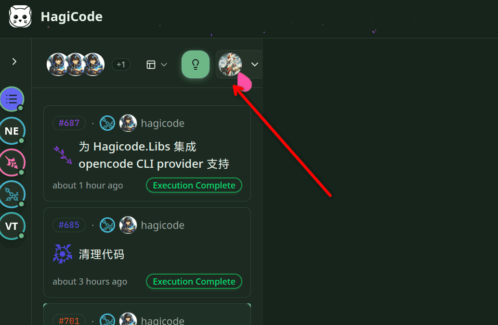
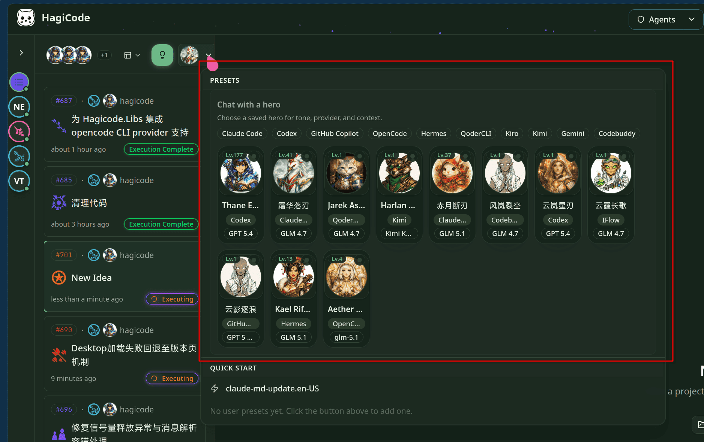
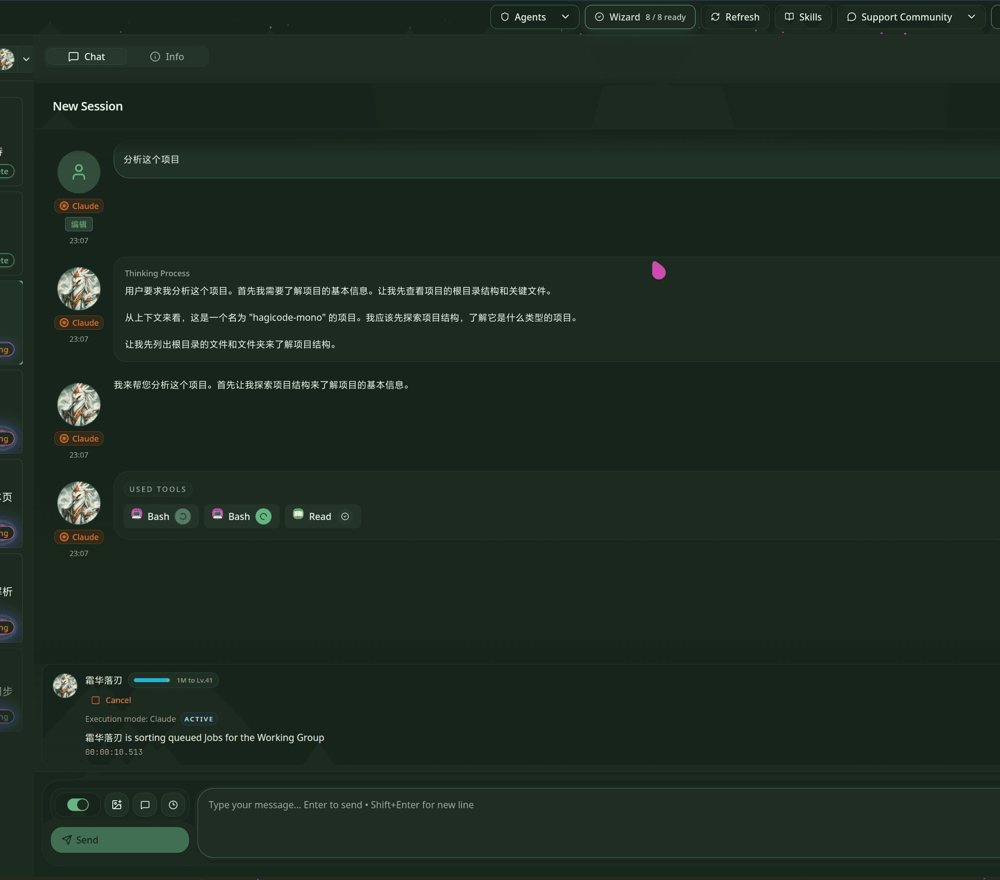
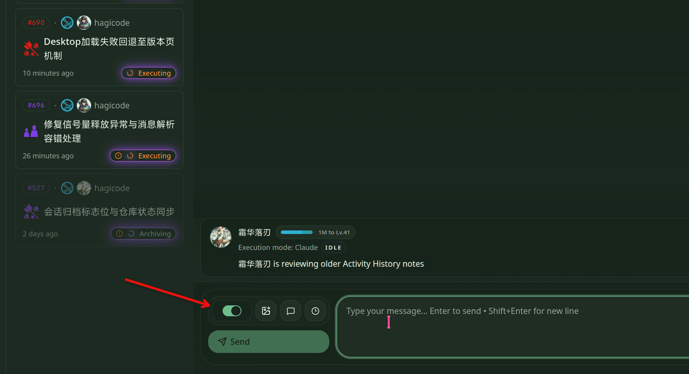
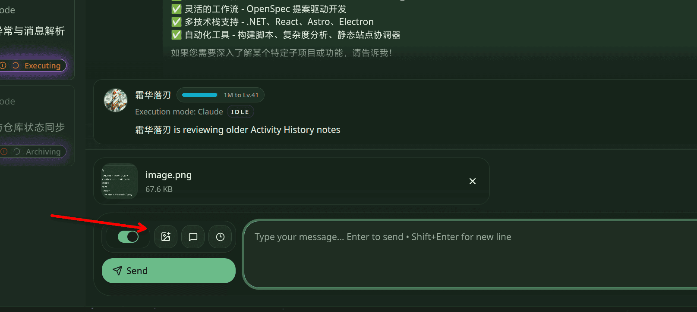

import { CardGrid, LinkCard } from '@astrojs/starlight/components';

普通会话是 Hagicode 最轻量的入口。先对话，先理解仓库，再确认是否要改动。当前界面默认以只读模式打开，因此你可以先让 AI 阅读仓库、总结结构、解释模块，确认方向后再切到编辑模式。

## 先决条件

在开始普通会话之前，请先完成以下准备：

- 已完成 [Desktop 安装](/installation/desktop)
- 已完成 [初始化向导设置](/quick-start/wizard-setup)，并创建了至少一个项目
- 已经进入项目对应的 Hagicode 工作区

## 普通会话适合做什么？

普通会话适合处理“先理解，再决定是否改动”的任务，例如：

- 快速分析一个陌生项目
- 结合英雄预设切换不同语气、工具提供者或上下文
- 在只读模式下安全提问，再按需升级到编辑模式
- 在发送消息前补充图片、快捷提示或历史上下文

如果你的目标已经从“理解问题”升级为“拆分计划、评审方案、归档变更”，下一步应改用[提案会话](/quick-start/proposal-session)。本文只介绍普通会话。

## 流程概览

当前普通会话的主路径可概括为：

| 阶段 | 用户动作 | 系统结果 |
| --- | --- | --- |
| 进入会话 | 在会话列表顶部工具区创建普通会话 | 打开默认英雄入口 |
| 可选选英雄 | 展开 Presets 面板并选择英雄 | 会话带入对应角色、模型或上下文 |
| 只读提问 | 输入 `分析这个项目` 等问题 | AI 读取仓库并返回分析结果 |
| 决定是否编辑 | 保持只读，或打开编辑模式 | 安全分析或进入可执行修改状态 |
| 补充上下文 | 使用插图、快捷提示、历史 | 下一条消息携带更完整上下文 |

只读分析通常按下列顺序进行。重点只有一句：AI 可以读取和总结，但默认不会直接写文件。

1. **输入问题**：用户在普通会话中输入 `分析这个项目`
2. **只读发送**：界面以默认只读模式发送请求
3. **读取仓库**：AI 读取目录、配置和关键文件
4. **返回结果**：AI 总结结构、模块与风险点
5. **继续判断**：用户决定继续只读对话，或切换到编辑模式

## 步骤 1：从会话列表进入普通会话

普通会话的当前入口位于会话列表顶部工具区。你可以直接使用默认英雄创建，也可以先展开右侧头像下拉，查看当前可选的英雄预设。

> 图：会话列表顶部即是普通会话入口；默认英雄可直接开始，对右侧头像下拉可进入预设选择。

这里先看两点：

- **会话入口在顶部工具区**：不再依赖旧版 `Add Chat` 按钮描述。
- **英雄选择是可选项**：如果你只是想马上开始分析项目，可以直接进入下一步。

## 步骤 2：可选选择英雄预设

如果你希望先切换不同的风格、模型提供者或上下文，可以展开 Presets 面板，从现有英雄中选择一个再进入普通会话。

> 图：Presets 面板会列出当前可用的英雄预设；选择英雄是可选动作，不影响普通会话的基本流程。

适合先选英雄的场景包括：

- 你已经知道要用哪一组模型或执行风格
- 你希望不同会话保留不同角色设定
- 你想对比多个英雄在同一项目上的分析视角

## 步骤 3：用默认只读模式分析项目

进入普通会话后，默认就是只读模式。截图中的示例提示词为 `分析这个项目`，AI 会先读取仓库结构，再返回项目级总结。

> 图：普通会话默认以只读模式启动，适合先让 AI 分析项目结构、关键模块与当前上下文。

在只读模式下，AI 通常可以：

- 读取文件与目录结构
- 总结项目用途、主要模块和依赖关系
- 解释某个功能或文件的职责

在只读模式下，AI 不会直接做的事：

- 直接修改仓库文件
- 在未切换模式前执行编辑型变更

如果你目前只是要理解代码、确认问题边界或准备后续计划，只读模式通常已经足够。

## 步骤 4：切换编辑模式并认识工具条

当你确认需要让 AI 直接落地改动时，再打开编辑模式。当前界面会在发送按钮上方的工具行放置模式开关与辅助工具。

> 图：模式开关位于发送区工具行；其后依次可见插图、快捷提示与历史入口。

这一行工具的作用分别是：

- **模式开关**：从默认只读模式切换到编辑模式，允许 AI 执行实际修改。
- **插图按钮**：在发送下一条消息前附加图片上下文。
- **快捷提示按钮**：快速插入常用提示词模板。
- **历史按钮**：回看会话上下文或相关历史内容。

先在只读模式确认方向，再切到编辑模式执行。这样更稳，也更容易复盘。

## 步骤 5：插入图片后继续发送消息

普通会话支持在当前输入区先附加图片，再发送下一条消息。图片会作为额外上下文保留在同一个 composer 中，不会把你带离当前会话。

> 图：图片会先出现在输入区上方，随后你仍可继续使用模式开关与其他辅助工具。

这种方式适合：

- 让 AI 结合界面截图解释问题
- 上传报错截图或设计稿，再补充文字要求
- 在编辑模式前先用图片补足上下文

## 适用场景与推进方式

结合上面的五张截图，你可以把普通会话理解成这样一条链路：

1. **先进入会话**：从顶部工具区快速新建普通会话。
2. **按需选英雄**：如果需要不同角色或模型，再展开 Presets 面板。
3. **先做只读分析**：先问 `分析这个项目`、`这个模块是干什么的` 之类的问题。
4. **再决定是否编辑**：确认方向后，打开编辑模式并使用工具条辅助。
5. **补充更多上下文**：通过图片、快捷提示或历史入口，让下一条消息更完整。

如果任务已经明确需要计划、审查和归档，请继续阅读下一篇提案会话教程。

## 下一步

<CardGrid>
  <LinkCard
    title="创建提案会话"
    href="/quick-start/proposal-session"
    description="当你已经完成项目理解，准备把需求拆成结构化计划时，继续阅读提案会话教程。"
  />
</CardGrid>
