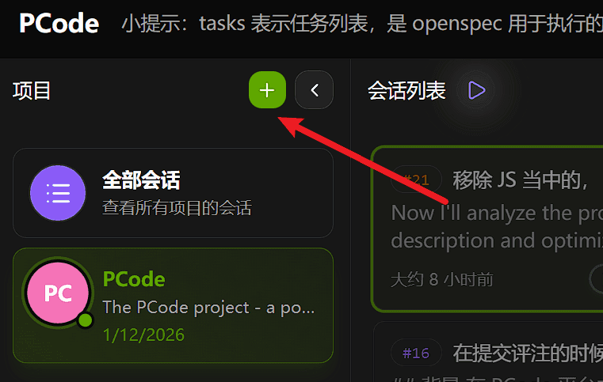
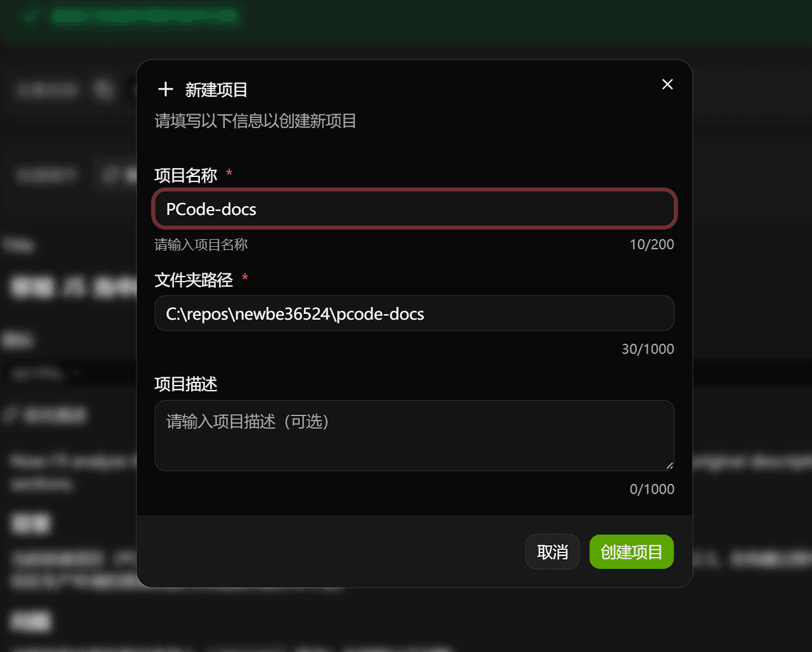
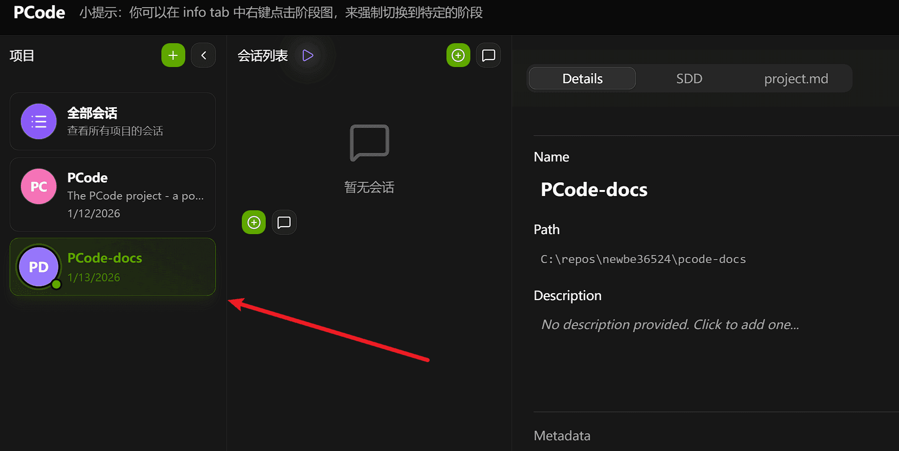

欢迎来到 Hagicode！安装完成后,让我们创建你的第一个项目。本指南会带你一步步完成设置,从准备代码仓库到在 Hagicode 中创建项目,让你可以顺畅进入后续工作流。

## 先决条件

在创建第一个项目之前，请确保你具备：

- 一个想要使用 Hagicode 管理的代码仓库
- 已安装并配置 Git
- 对命令行操作的基本了解

别担心，这些都很简单！

## 步骤 1：准备您的代码仓库

在将项目添加到 Hagicode 之前，您需要准备一个想要用 Hagicode 管理的代码仓库。

### 克隆您的代码仓库

如果您想要管理的代码已经在远程仓库（GitHub、GitLab 等）中，请将其克隆到本地：

```bash
# 克隆您的代码仓库到本地
git clone https://github.com/your-username/your-repo.git
cd your-repo
```

克隆后，记下仓库的本地路径（例如：`C:\Users\YourName\Projects\your-repo` 或 `/home/yourname/projects/your-repo`），在下一步中您将需要这个路径。

:::tip
Hagicode 适合管理任何您想要通过 AI 辅助开发和优化的代码项目，包括：
- 正在开发的功能项目
- 需要重构或优化的现有代码
- 团队协作的项目
- 个人开源项目
:::

### 如果您的代码只在本地

如果您想要管理的代码还在本地，尚未推送到远程仓库：

```bash
cd /path/to/your/project
git init
git add .
git commit -m "Initial commit"
```

建议在 GitHub/GitLab 上创建远程仓库并推送：

```bash
git remote add origin https://github.com/your-username/your-repo.git
git push -u origin main
```

## 步骤 2：在 Hagicode 界面中添加项目

现在让我们将项目添加到 Hagicode 界面。

### 访问项目页面

1. 在浏览器中导航到 `http://127.0.0.1:34567`
2. 点击导航侧边栏中的 **Projects**（项目）
3. 点击 **Add Project**（添加项目）按钮



### 配置项目设置

填写项目信息：



:::note
仓库路径必须指向本地计算机上有效的 Git 仓库。
:::

:::note[Docker Compose 部署注意事项]
如果您使用的是 **Docker Compose 部署方式**，在填写仓库路径时需要注意：

- **使用容器内路径**：填写的是容器内的路径，而不是主机的路径
- **路径映射关系**：根据 `docker-compose.yml` 中的路径映射配置
  - 主机路径：`/path/to/your/repos`（您在 docker-compose.yml 中配置的）
  - 容器路径：`/app/workdir`（固定路径）

**示例**：
如果您的 `docker-compose.yml` 配置为：
```yaml
volumes:
  - /home/user/myproject:/app/workdir
```

那么在填写仓库路径时应该使用容器内路径：
```
/app/workdir
```

**重要提示**：
- 确保您的代码仓库已经映射到容器的 `/app/workdir` 路径
- 如果使用软件包部署方式，则直接填写主机上的实际路径即可
:::

### 创建项目

填写完必填信息后：

1. 点击 **创建项目**按钮添加项目
2. Hagicode 将验证仓库路径
3. 您的项目将出现在项目列表中



### 创建完成后

当项目出现在列表中时，说明项目已经成功接入 Hagicode。接下来，您可以直接进入会话相关工作流，继续探索 AI 协作开发体验。

## 后续步骤

恭喜！您已经在 Hagicode 中创建了第一个项目。接下来推荐从以下路径继续：

- **[对话会话](/quick-start/conversation-session)** - 了解如何使用 AI 驱动的编码会话
- **[提案会话](/quick-start/proposal-session)** - 了解如何把想法整理成结构化提案（本文内容已过期，仅供历史参考）
