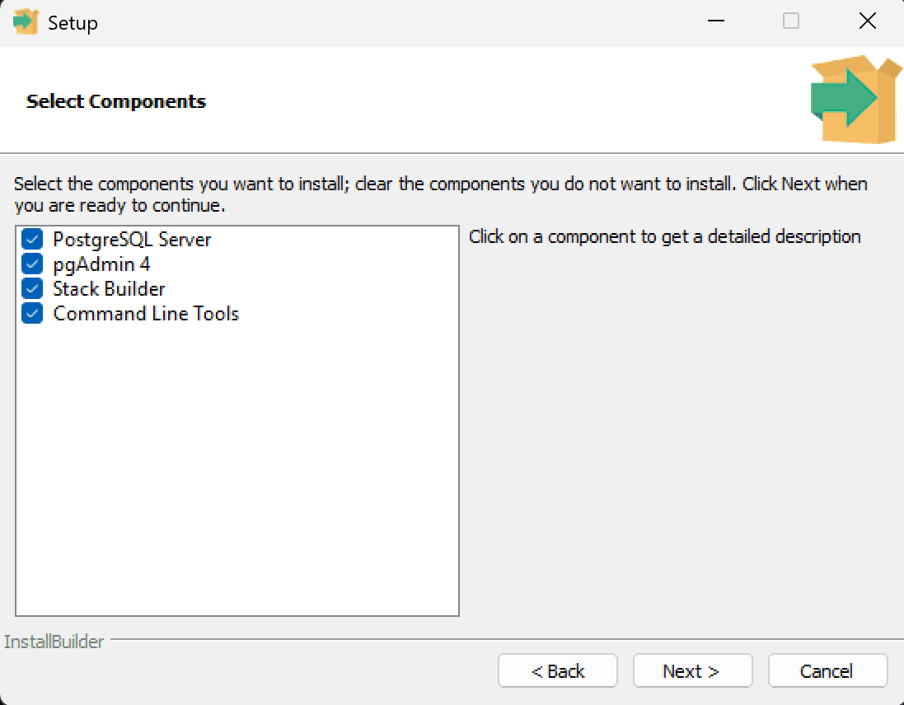
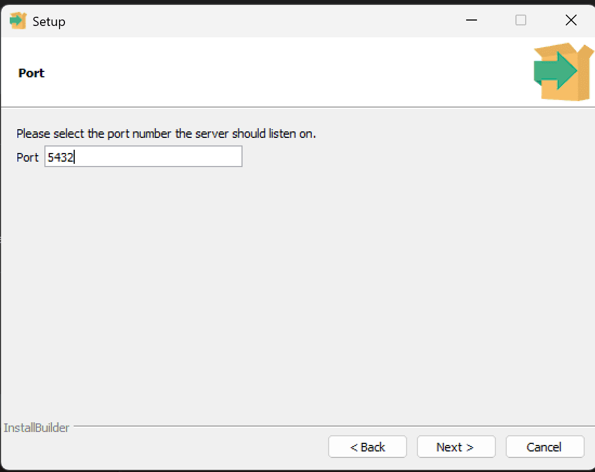
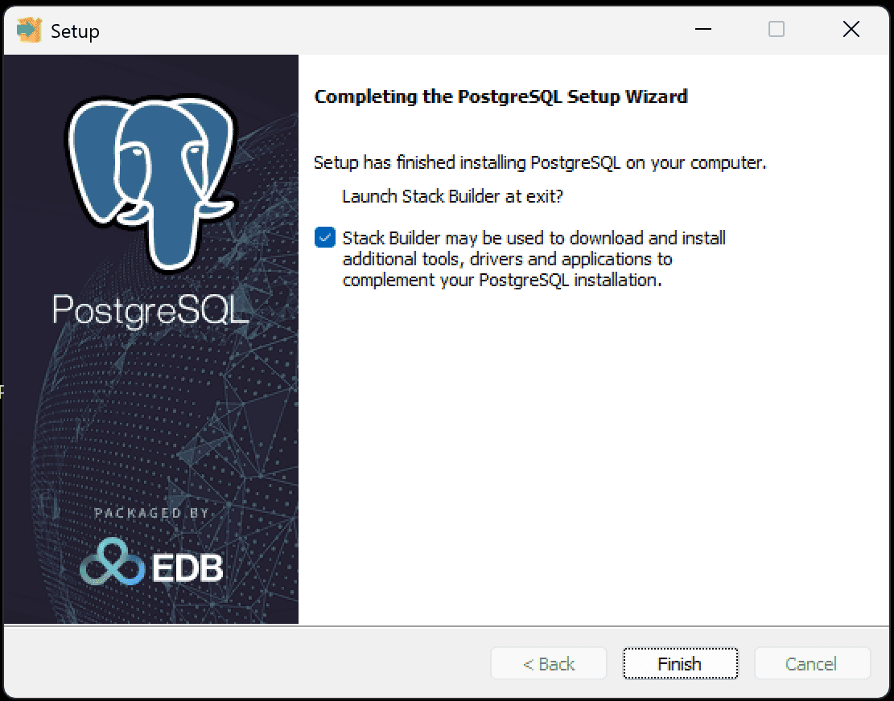

本页说明如何在 Windows 上安装 PostgreSQL。只有在你需要外部 PostgreSQL 实例、独立数据库运维，或手动排障时，才需要继续看。

:::tip[这是可选路径]
对最新版本 HagiCode 的默认本地安装流程来说，通常不需要先手动安装 PostgreSQL。只有在你明确要把 HagiCode 接到独立 PostgreSQL 实例时，才需要继续。
:::

## 适用前提

在开始安装之前，请确认您属于以下场景之一：

- 您要将 HagiCode 连接到外部 PostgreSQL 数据库
- 您正在执行容器之外的高级部署或运维操作
- 您需要为现有 PostgreSQL 实例做手动安装与维护

此外，请确保：

- 您使用的是 Windows 10 或更高版本
- 您具有管理员权限以安装软件
- 您的硬盘至少有 500MB 的可用空间

## 下载 PostgreSQL 安装程序

1. 访问 [EnterpriseDB PostgreSQL 下载页面](https://www.enterprisedb.com/downloads/postgres-postgresql-downloads)
2. 选择您需要的 PostgreSQL 版本（推荐使用最新稳定版本）
3. 选择操作系统为 "Windows"
4. 下载适合您系统的安装程序：
   - **x86-64** (推荐)：适用于 64 位 Windows 系统
   - **x86-32**：适用于 32 位 Windows 系统
5. 运行下载的 `.exe` 安装程序

:::tip
通常可直接选择 PostgreSQL 16 或更高版本。
:::

## 安装步骤

### 步骤 1: 打开安装界面

双击运行安装程序后，您将看到 PostgreSQL 的安装向导界面。

点击"下一步"继续安装过程。

### 步骤 2: 设置安装的文件夹

选择 PostgreSQL 的安装目录。默认安装路径为 `C:\Program Files\PostgreSQL\16`。

:::tip
建议使用默认路径，除非您有特殊需求需要安装到其他位置。
:::

点击"下一步"继续。

### 步骤 3: 设置安装的内容

选择要安装的组件。默认情况下，以下组件会被选中：

- PostgreSQL Server - 数据库服务器
- pgAdmin 4 - 图形化管理工具
- Stack Builder - 包管理器
- Command Line Tools - 命令行工具

建议保持默认选择，点击"下一步"继续。

### 步骤 4: 设置数据库存放数据的文件夹

指定数据库数据存储目录。默认路径为 `C:\Program Files\PostgreSQL\16\data`。

:::note
数据目录将包含所有数据库文件，请确保有足够的磁盘空间。
:::

点击"下一步"继续。

### 步骤 5: 设置数据库初始用户的密码

设置 PostgreSQL 超级用户（postgres）的密码。这是数据库管理员的密码，请妥善保管。

:::warning 安全建议
- 使用强密码（至少 8 位，包含大小写字母、数字和特殊字符）
- 不要忘记此密码，后续连接数据库时需要使用
- 生产环境中请勿使用简单密码
:::

点击"下一步"继续。

### 步骤 6: 设置数据库的端口

设置 PostgreSQL 服务监听的端口。默认端口为 `5432`。

:::tip
- 保持默认端口 5432，除非该端口已被其他应用程序占用
- 如果更改端口，请记住新端口号，连接时需要使用
:::

点击"下一步"继续。

### 步骤 7: 设置数据库的字符集和文化

设置数据库的区域设置（Locale）和字符集。

:::tip
- **保持默认选择 [default]** 即可，无需修改
- 默认选项会根据您的系统自动选择合适的区域设置
- 这将确保最佳兼容性和性能
:::

点击"下一步"继续。

### 步骤 8: 查看安装的计划

安装程序将显示所有配置信息的摘要。请仔细检查以下信息：

- 安装路径
- 数据目录
- 端口号
- 区域设置

确认信息无误后，点击"下一步"开始安装。

### 步骤 9: 准备开始安装

安装程序已准备好开始复制文件和配置系统。

点击"下一步"开始安装过程。

### 步骤 10: 实时展示安装进度

安装程序将显示安装进度条，这个过程可能需要几分钟时间。

请耐心等待安装完成。

### 步骤 11: 安装已完成

安装完成后，您将看到成功提示界面。

取消勾选"Launch Stack Builder at exit?"（除非您需要额外的扩展），然后点击"完成"按钮退出安装向导。

## 下一步

如果您正在配置外部数据库版 HagiCode，可在 PostgreSQL 安装完成后返回主安装流程继续接入数据库连接：

- [返回 Desktop 安装指南](/installation/desktop)
- [查看 Docker Compose 部署说明](/installation/docker-compose)

如果您只是想快速完成最新版本 HagiCode 的默认本地安装，则通常无需继续执行 PostgreSQL 安装流程。
