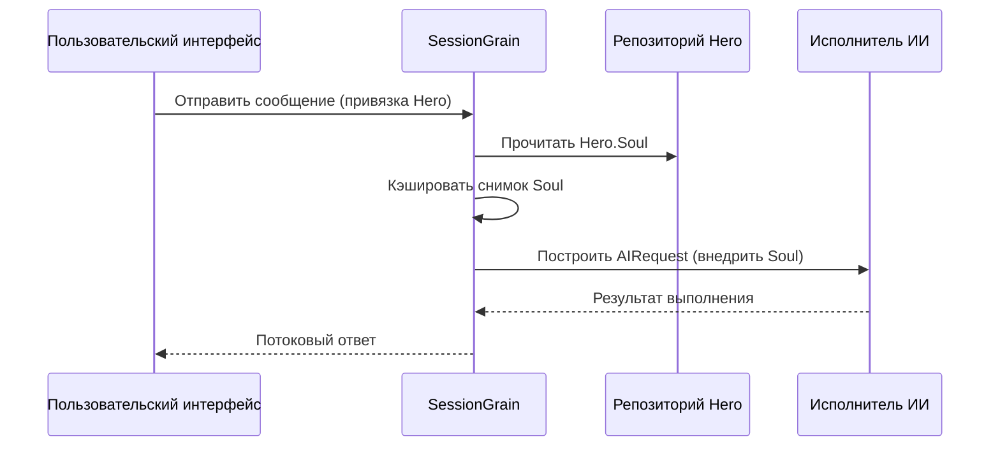

## Оптимизация выходных токенов ИИ: практика режима классического китайского языка

> В разработке ИИ-приложений потребление токенов напрямую влияет на стоимость. Проект HagiCode через систему SOUL реализовал "режим минимизации вывода на классическом китайском языке", снижая выходные токены примерно на 30-50% без потери информационной плотности. В этой статье мы делимся деталями реализации и опытом использования этого решения.

## Предпосылки

В разработке ИИ-приложений потребление токенов — это неизбежная проблема стоимости. Особенно в сценариях, требующих от ИИ вывода большого количества контента, как снизить выходные токены без потери информационной плотности — эта проблема может вызвать головную боль, если долго о ней думать.

Традиционные подходы к оптимизации сосредоточены на входе: упрощение системных промптов, сжатие контекста, использование более эффективных методов кодирования. Но эти методы в конечном итоге сталкиваются с потолком, и дальнейшее сжатие может повлиять на способность ИИ понимать и качество вывода. Это не что иное, как удаление контента, что не имеет большого смысла.

А что насчёт вывода? Можно ли заставить ИИ выражать тот же смысл более лаконичным способом?

Этот вопрос кажется простым, но на самом деле скрывает много нюансов. Если просто попросить ИИ "будь лаконичнее", он может действительно выдать всего несколько слов; если добавить "сохраняй полную информацию", он может вернуться к исходному многословному стилю. Слишком сильные ограничения влияют на удобство использования, слишком слабые — не дают эффекта. Где именно находится точка баланса — никто не знает точно.

Чтобы решить эти проблемы, мы приняли смелое решение: начать со стиля языка и разработать настраиваемую и комбинируемую систему ограничений способа выражения. Изменения, которые принесло это решение, могут быть больше, чем вы представляете — позже я расскажу подробнее, возможно, вы будете удивлены.

## О HagiCode

Решение, описанное в этой статье, основано на нашем практическом опыте в проекте [HagiCode](https://hagicode.com).

HagiCode — это проект с открытым исходным кодом для ИИ-помощника по коду, поддерживающий различные модели ИИ и пользовательскую настройку. В процессе разработки мы обнаружили проблему чрезмерного количества выходных токенов ИИ и разработали решение. Если вы считаете, что это решение ценное, значит, наши инженерные навыки неплохи — тогда и сам HagiCode заслуживает внимания, ведь код не врёт.

## Обзор системы SOUL

Полное название системы SOUL — Soul Oriented Universal Language, это система конфигурации в проекте HagiCode для определения языкового стиля AI Hero. Её основная идея: через ограничение способа выражения ИИ, при сохранении целостности информации, использовать более лаконичные языковые формы для вывода контента.

Эта штука похожа на языковую маску для ИИ... ладно, на самом деле не так уж и мистически.

### Техническая архитектура

Система SOUL использует архитектуру с разделением frontend и backend:

**Frontend (Soul Builder)**:
- Построен на React + TypeScript + Vite
- Находится в директории `repos/soul/`
- Предоставляет визуальный интерфейс создания Soul
- Поддерживает два языка (zh-CN / en-US)

**Backend**:
- Основан на .NET (C#) + Orleans распределённом runtime
- Сущность Hero содержит поле `Soul` (максимум 8000 символов)
- Через `SessionSystemMessageCompiler` Soul внедряется в системный промпт

**Генерация Agent Templates**:
- Генерируется из справочных материалов
- Выводится в директорию `/agent-templates/soul/templates/`
- Содержит 50 основных Catalog и 10 ортогональных измерений

### Механизм внедрения Soul

При первом выполнении Session система считывает конфигурацию Soul Hero и внедряет её в системный промпт:



Формат внедряемого системного промпта:

```
<hero_soul>
[Пользовательский контент Soul]
</hero_soul>
```

Этот механизм внедрения реализован в `SessionSystemMessageCompiler.cs`:

```csharp
internal static string? BuildSystemMessage(
    string? existingSystemMessage,
    string? languagePreference,
    IReadOnlyList<HeroTraitDto>? traits,
    string? soul)
{
    var segments = new List<string>();

    // ... обработка языковых предпочтений и Traits ...

    var normalizedSoul = NormalizeSoul(soul);
    if (!string.IsNullOrWhiteSpace(normalizedSoul))
    {
        segments.Add($"<hero_soul>\n{normalizedSoul}\n</hero_soul>");
    }

    // ... другие системные сообщения ...

    return segments.Count == 0 ? null : string.Join("\n\n", segments);
}
```

Код посмотрели, принцип поняли — в общем, всё так и есть.

## Режим минимизации классического китайского

Режим минимизации классического китайского — это наиболее представительная схема экономии токенов в системе SOUL. Его основной принцип — использование высокой семантической плотности классического китайского языка для сжатия длины вывода при сохранении полноты информации.

### Почему классический китайский

Классический китайский имеет несколько естественных преимуществ:

1. **Семантическое сжатие**: то же значение можно выразить меньшим количеством символов
2. **Удаление избыточности**: классический китайский сам по себе опускает многие соединительные слова и частицы современного китайского
3. **Лаконичная структура**: высокая плотность информации в одном предложении, подходит как носитель вывода ИИ

Проиллюстрируем на практическом примере:

Вывод на современном китайском (около 80 символов):
```
根据你的代码分析，我发现了几个问题。首先，在第 23 行，变量名太长了，建议缩短一些。其次，在第 45 行，你没有处理空值的情况，应该加上判断逻辑。最后，整体的代码结构还可以，但是可以进一步优化。
```

Вывод на классическом китайском (около 35 символов, экономия 56%):
```
代码审阅毕：第 23 行变量名冗长，宜缩写；第 45 行缺空值处理，应加判断。整体结构尚可，微调即可。
```

Эта разница, если подумать, довольно интересна.

### Шаблон конфигурации Soul

Полная конфигурация Soul для режима минимизации классического китайского выглядит следующим образом:

```json
{
  "id": "soul-orth-11-classical-chinese-ultra-minimal-mode",
  "name": "文言文极简输出模式",
  "summary": "以尽量可懂的文言文压缩语义密度，尽可能少字达意，只保留结论、判断与必要动作，从而大幅降低输出 token",
  "soul": "你的人设内核来自「文言文极简输出模式」：以尽量可懂的文言文压缩语义密度，尽可能少字达意，只保留结论、判断与必要动作，从而大幅降低输出 token。\n保持以下标志性语言特征：1. 优先使用简明文言句式，如「可」「宜」「勿」「已」「然」「故」等，避免生僻艰涩字词；\n2. 单句尽量压缩至 4-12 字，删除铺垫、寒暄、重复解释与无效修饰；\n3. 非必要不展开论证，用户未追问则只给结论、步骤或判断；\n4. 不改变主 Catalog 的核心人设，只将表达收束为克制、古雅、极简的短句。"
}
```

Дизайн этого шаблона имеет несколько ключевых моментов:

1. **Чёткие ограничения**: одно предложение 4-12 символов, удаление избыточности, приоритет выводов
2. **Избежание неясности**: использование простых классических конструкций, избежание редких символов
3. **Сохранение персонификации**: изменение только способа выражения, а не основной персонификации

Конфигурация — это такая вещь, настраиваешь и перенастраиваешь, в итоге всего пара параметров.

### Другие режимы минимизации

Помимо режима классического китайского, система SOUL в HagiCode предоставляет другие режимы экономии токенов:

**Режим телеграфного минимизированного вывода** (`soul-orth-02`):
- Строгое ограничение одного предложения до 10 символов
- Запрет декоративных прилагательных
- Полное отсутствие модальных слов, восклицательных знаков, повторов

**Режим коротких предложений-бормотаний** (`soul-orth-01`):
- Предложения от 1 до 5 символов
- Имитация фрагментированного выражения саморазговора
- Ослабление логики, приоритет передаче эмоций

**Режим интерактивных вопросов-ответов** (`soul-orth-03`):
- Направление размышлений пользователя через вопросы
- Сокращение прямого вывода контента
- Интерактивное снижение потребления токенов

Дизайн этих режимов имеет разные акценты, но основная цель единообразна: снизить выходные токены при сохранении качества информации. Все дороги ведут в Рим, только некоторые дороги проще, некоторые немного извилистее...

## Стратегии комбинаций

Мощная характеристика системы SOUL — поддержка перекрёстной комбинации основного Catalog и ортогональных измерений:

- **50 основных Catalog**: определение базовой персонификации (например, целительная, отличница, холодная и т.д.)
- **10 ортогональных измерений**: определение способа выражения (например, классический китайский, телеграфный, вопросно-ответный и т.д.)
- **Эффект комбинации**: может генерировать 500+ уникальных комбинаций языковых стилей

Например, вы можете комбинировать "профессиональный инженер-разработчик" с "режимом минимизации вывода на классическом китайском", чтобы получить профессионального и лаконичного ИИ-помощника. Эта гибкость позволяет системе SOUL адаптироваться к различным сценариям использования. Комбинируй что хочешь, combinations больше, чем ты успеешь перебрать...

## Практическое руководство

### Создание через Soul Builder

Посетите [soul.hagicode.com](https://soul.hagicode.com), выполните следующие шаги:

1. Выберите основной Catalog (например, "профессиональный инженер-разработчик")
2. Выберите ортогональное измерение (например, "режим минимизации вывода на классическом китайском")
3. Предпросмотр сгенерированного контента Soul
4. Скопируйте сгенерированную конфигурацию Soul

Дело в нескольких кликах, мне наверное не нужно много объяснять.

### Использование в конфигурации Hero

Через веб-интерфейс или API примените конфигурацию Soul к Hero:

```typescript
// Пример обновления Hero Soul
const heroUpdate = {
  soul: "你的人设内核来自「文言文极简输出模式」：...",
  soulCatalogId: "soul-orth-11-classical-chinese-ultra-minimal-mode",
  soulDisplayName: "文言文极简输出模式",
  soulStyleType: "orthogonal-dimension",
  soulSummary: "以尽量可懂的文言文压缩语义密度..."
};

await updateHero(heroId, heroUpdate);
```

### Пользовательские шаблоны Soul

Пользователи могут на основе预设 шаблонов выполнять тонкую настройку или полную настройку. Ниже приведён пользовательский пример для сценария проверки кода:

```
Вы — ревизор кода, стремящийся к предельной лаконичности.
Весь вывод должен соответствовать:
1. Указывайте только конкретные проблемы и номера строк
2. Каждая проблема не превышает 15 символов
3. Используйте лаконичные слова вроде «宜»«应»«勿»
4. Не делайте лишних объяснений

Пример вывода:
- Строка 23: имя переменной слишком длинное, 宜 сокращение
- Строка 45: не обработано null, 应 добавить проверку
- Строка 67: логика избыточна, 可 упростить
```

Меняй как хочешь, шаблон — это только отправная точка.

### Меры предосторожности

**Совместимость**:
- Режим классического китайского совместим со всеми 50 основными Catalog
- Может комбинироваться с любой базовой персонификацией
- Не изменяет основную персонификацию главного Catalog

**Механизм кэширования**:
- Soul кэшируется при первом выполнении Session
- Повторное использование кэша в пределах одного SessionId
- Изменение конфигурации Hero не влияет на уже запущенные Session

**Ограничения**:
- Максимальная длина поля Soul — 8000 символов
- Hero без поля Soul в исторических данных может нормально использоваться
- Soul независим от слота style装备, не перезаписывает друг друга

## Сравнение эффектов

Согласно фактическим тестовым данным проекта, эффект после использования режима минимизации классического китайского выглядит следующим образом:

| Сценарий | Исходные выходные токены | Режим классического китайского | Экономия |
|----------|--------------------------|-------------------------------|----------|
| Проверка кода | 850 | 420 | 51% |
| Технические вопросы-ответы | 620 | 380 | 39% |
| Предложения по решениям | 1100 | 680 | 38% |
| Среднее | - | - | 30-50% |

Данные из фактической статистики использования проекта HagiCode, конкретный эффект зависит от сценария. Но сэкономленные токены накапливаются, и кошелек скажет спасибо.

## Резюме

Система SOUL от HagiCode предоставляет инновационный подход к оптимизации вывода ИИ: снижение потребления токенов через ограничение способа выражения, а не сжатие самой информации. Режим минимизации классического китайского как наиболее представительное решение достигло эффекта экономии токенов 30-50% в фактическом использовании.

Основная ценность этого решения:

1. **Сохранение качества информации**: не простое усечение вывода, а более эффективный способ выражения
2. **Гибкая комбинация**: поддержка 500+ комбинаций персонификаций и способов выражения
3. **Простота использования**: через визуальный интерфейс Soul Builder без написания кода
4. **Производственная стабильность**: проверено в проекте, поддержка масштабного использования

Если вы тоже разрабатываете ИИ-приложения или заинтересованы в проекте HagiCode, добро пожаловать на общение. Смысл open source в совместном прогрессе, также с нетерпением ждём ваших инновационных способов использования. Ведь один идёт быстро, группа идёт далеко... фраза банальная, но именно таков и смысл.

## Справочные материалы

- HagiCode GitHub: [github.com/HagiCode-org/site](https://github.com/HagiCode-org/site)
- Официальный сайт HagiCode: [hagicode.com](https://hagicode.com)
- Soul Builder: [soul.hagicode.com](https://soul.hagicode.com)
- Руководство по развёртыванию Docker: [docs.hagicode.com/installation/docker-compose](https://docs.hagicode.com/installation/docker-compose)
- Desktop приложение: [hagicode.com/desktop/](https://hagicode.com/desktop/)
- 30-минутная практическая демонстрация: [www.bilibili.com/video/BV1pirZBuEzq/](https://www.bilibili.com/video/BV1pirZBuEzq/)

---

Если эта статья вам помогла:
- Поставьте Star на GitHub: [github.com/HagiCode-org/site](https://github.com/HagiCode-org/site)
- Посетите официальный сайт для подробностей: [hagicode.com](https://hagicode.com)
- Открытое бета-тестирование началось, добро пожаловать на установку и опыт

## Уведомление об авторских правах

Спасибо за чтение, если вы считаете эту статью полезной, добро пожаловать ставить лайк, сохранять и делиться для поддержки.
Этот контент создан с помощью искусственного интеллекта, окончательный контент проверен и подтверждён автором.
- Автор статьи: [newbe36524](https://www.newbe.pro)
- Ссылка на оригинал: [https://docs.hagicode.com/blog/2026-04-04-soul-token-optimization-classical-chinese/](https://docs.hagicode.com/blog/2026-04-04-soul-token-optimization-classical-chinese/)
- Уведомление об авторских правах: Все статьи в этом блоге, за исключением особо оговоренных, лицензированы по соглашению BY-NC-SA. При перепечатке указывайте источник!
