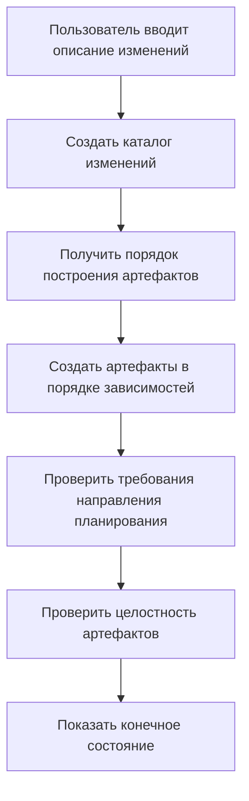
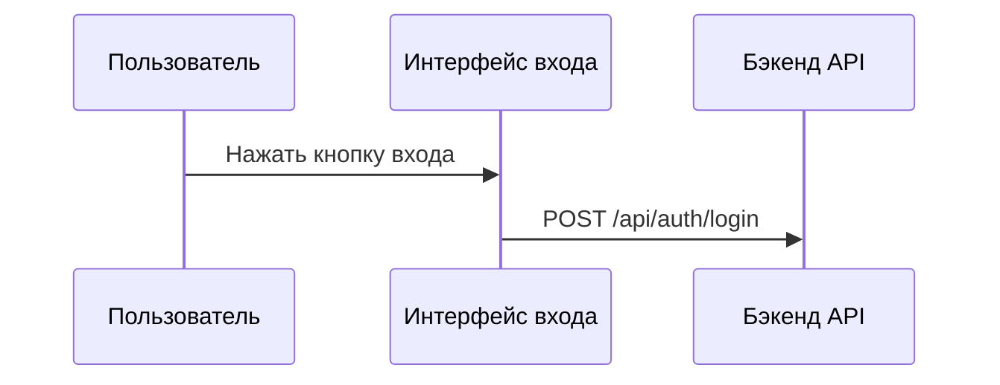

## Настройка этапов OpenSpec для улучшения результатов генерации ИИ

> При использовании OpenSpec для управления техническими предложениями мы столкнулись с проблемой нестабильного качества генерации документации ИИ. Собственно, другого выхода не было — пришлось самостоятельно модифицировать шаблоны промптов. Эта статья — запись того периода.

## Контекст

OpenSpec — это система управления техническими предложениями, основная идея которой проста: вводите описание изменений, автоматически генерируются различные артефакты документации. proposal, design, specs, tasks — всё это можно генерировать автоматически. Звучит прекрасно, не правда ли?

Однако на практике мы обнаружили некоторые проблемы. Как бы это сказать, ничего критического, просто сгенерированный результат не совсем соответствовал ожиданиям.

В сгенерированном `design.md` отсутствовали необходимые элементы визуализации — нет блок-схем Mermaid, нет диаграмм последовательности, нет диаграмм архитектуры. Техническая команда смотрела на такой документ проектирования и качала головой —毕竟 кто хочет читать сплошной текст?

`proposal.md` также не оправдал ожиданий, отсутствовала таблица изменений кода, не было прототипов интерфейса. Лица, принимающие решения, смотрели долго и всё равно не понимали, что именно изменяется.

Больше всего хлопот доставлял `tasks.md`, в который попали различные задачи по операциям Git. Границы ответственности стали размыты, разработчики смотрели на эти задачи и не понимали, какие нужно выполнять, а какие нет. Это тоже немного беспокоит —毕竟 ИИ не знает, как распределены обязанности в вашей команде.

Требования к визуализации для разных уровней документации также были нечёткими. Какие диаграммы должны содержать proposal и design? Этот вопрос беспокоил команду.

В чём корень этих проблем? Мы проанализировали и обнаружили ключевую точку: шаблоны промптов lacked чётких ограничений и указаний.

Ничего удивительного —毕竟 шаблоны сами по себе универсальны и не могут полностью соответствовать потребностям каждой команды.

## О HagiCode

Решение, описанное в этой статье, основано на нашем практическом опыте в проекте [HagiCode](https://hagicode.com). HagiCode — это проект ИИ-помощника по коду, в процессе разработки мы активно используем OpenSpec для управления техническими предложениями.

Именно этот практический опыт преодоления проблем способствовал созданию этого улучшенного решения. Собственно, ничего особенного — просто встречаем проблему и решаем её.

## Анализ: архитектура системы промптов

Чтобы решить проблему, нужно сначала понять систему. Давайте посмотрим, как работает система промптов в OpenSpec.

OpenSpec использует систему шаблонов Handlebars, каждый промпт содержит две части:

**Файл метаданных JSON**: определяет параметры, сценарии, информацию о версии
**Файл шаблона Handlebars**: содержит фактическое содержание промпта

```
Resources/Prompts/
├── openspec-v1-ff.zh-CN.json    # метаданные
├── openspec-v1-ff.zh-CN.hbs     # содержание шаблона
├── openspec-v1-ff.en-US.json
└── openspec-v1-ff.en-US.hbs
```

Преимущества такой конструкции разделения очевидны: метаданные и содержимое управляются отдельно, что облегчает сопровождение и локализацию. Это немного похоже на написание кода — логика и представление разделены, все понимают этот принцип.

Рабочий процесс FF (Fast Forward) — это основной процесс генерации в OpenSpec:



Этот процесс выглядит идеальным, но проблема заключается в этапе "проверка требований направления планирования" — в нём недостаточно чётких указаний.

Это тоже немного беспокоит —毕竟 при проектировании системы невозможно учесть конкретные потребности всех команд.

## Система направлений планирования

Система направлений планирования — это основной механизм настройки в OpenSpec, позволяющий пользователям выбирать различные параметры генерации. В проекте HagiCode определены следующие направления:

| ID направления | Функция | Включено по умолчанию |
|----------------|---------|----------------------|
| `explore` | Режим исследования | Да |
| `change-map` | Карта изменений | Да |
| `flowchart` | Блок-схема взаимодействия | Да |
| `prototype` | Прототип UI | Да |
| `architecture` | Диаграмма архитектуры | Да |
| `sequence` | Диаграмма последовательности API | Да |

Каждое направление определяет стабильный идентификатор, состояние включения по умолчанию, отображаемую метку, а также фрагменты промптов на китайском и английском языках.

Эта система разработана очень изящно, но на практике в HagiCode мы обнаружили, что одного определения недостаточно — нужно явно использовать эти направления в шаблонах промптов.

Это немного похоже на многие вещи в жизни — наличие вариантов не означает, что выбор будет сделан, всё равно нужно кому-то сказать, как выбирать.

## Решение: чёткие ограничения и примеры

Наша идея улучшения очень проста: добавить в шаблоны промптов чёткие ограничения и эталонные примеры.

Собственно, ничего особенного — просто чётко выразить требования.

### 1. Добавление требований к визуализации документации

В шаблоне `openspec-v1-ff.zh-CN.hbs` мы добавили чёткие ограничения на область содержимого:

```markdown
### Ограничения области содержимого tasks.md

При создании артефакта `tasks.md` должны соблюдаться следующие ограничения области содержимого:

Должно включать:
- Задачи бизнес-логики (реализация кода, разработка функционала)
- Задачи технической реализации (интеграция компонентов, разработка API)
- Задачи тестирования (модульные тесты, интеграционные тесты)
- Задачи документирования (обновление документации, добавление комментариев)

Запрещено включать:
- Операции фиксации Git (git add, git commit, git push)
- Рабочие процессы управления версиями
- Операции развёртывания и публикации
```

Использование стандартизированного языка "должно/запрещено" вместо "рекомендуется" или "может" позволяет ИИ более точно понимать ограничения.

Это немного похоже на обучение детей — что сказано, то и есть, не должно быть двусмысленности.

### 2. Предоставление эталонных примеров для каждого направления

Одного saying "включить блок-схему" недостаточно, мы предоставили конкретные примеры вывода для каждого включённого направления.

毕竟 голое слово — ложь, дай конкретный пример — ИИ сможет лучше понять.

**Пример направления карты изменений**:
```markdown
| Путь к файлу | Тип изменения | Причина изменения | Область влияния |
|-------------|--------------|-------------------|----------------|
| Path/to/file | Новое | Описание | Имя модуля |
```

**Пример направления прототипа**:
```
┌─────────────────────────────────────────┐
│ Вход пользователя                            [×] │
├─────────────────────────────────────────┤
│  Адрес электронной почты *                             │
│ ┌─────────────────────────────────────┐ │
│ │ user@example.com                   │ │
│ └─────────────────────────────────────┘ │
└─────────────────────────────────────────┘
```

**Пример направления блок-схемы**:


Эти примеры позволяют ИИ точно понимать ожидаемый формат вывода, вместо того чтобы импровизировать.

Это немного похоже на предоставление эталонных ответов на экзамене — хотя не обязательно полностью одинаковыми, но формат должен соответствовать.

### 3. Использование стандартизированного языка для чётких требований

Для требований к визуализации разных типов документации мы используем стандартизированный язык для ограничений:

```markdown
Для proposal.md:
- Должно включать таблицу изменений кода (когда включено направление change-map)
- Должно включать прототип UI (когда затрагиваются изменения UI и включено направление prototype)
- Запрещено включать подробные диаграммы архитектуры (они должны быть в design.md)

Для design.md:
- Должно включать всё содержимое proposal.md (более подробная версия)
- Должно включать диаграмму архитектуры (когда включено направление architecture)
- Должно включать диаграмму потока данных (когда включено направление flowchart)
```

Такие чёткие ограничения значительно улучшили качество генерации.

Собственно, ничего особенного — просто чётко выразить требования, не заставлять ИИ гадать.

## Практика: реализация кода

Теорию обсудили, теперь посмотрим, как это реализовано в проекте HagiCode.

### Определение направлений планирования

Направления планирования определяются в `ProposalPlanningDirections.cs`:

```csharp
public static class ProposalPlanningDirections
{
    private static readonly ProposalPlanningDirectionDefinition[] Catalog =
    [
        new(
            ChangeMapId,
            "Change map",
            DefaultEnabled: true,
            EnglishPromptFragment:
            "- Change map: include structured file-impact views...",
            ChinesePromptFragment:
            "- 变更地图：加入结构化的文件影响视图..."),
        // ... другие направления
    ];

    public static string RenderInstructionBlock(
        IEnumerable<ProposalPlanningDirectionState> directions,
        string? locale)
    {
        var enabledDirections = directions
            .Where(direction => direction.Enabled)
            .ToArray();

        if (enabledDirections.Length == 0)
        {
            return string.Empty;
        }

        var heading = IsChineseLocale(locale)
            ? "本次生成启用以下规划方向："
            : "Apply the following planning directions:";

        return string.Join(Environment.NewLine,
            [heading, .. enabledDirections.Select(d => d.GetPromptFragment(locale))]);
    }
}
```

В этом коде есть несколько заслуживающих внимания моментов проектирования:

1. Использование массива вместо списка, поскольку определения не изменяются во время выполнения
2. Отложенный рендеринг — текст генерируется только при наличии включённых направлений
3. Поддержка многоязычности, выбор соответствующего фрагмента промпта на основе locale

Собственно, ничего особенного — просто обычное проектирование кода.

### Параметризация шаблона

Использование условных операторов в шаблонах Handlebars:

```handlebars
{{#if planningDirectionInstructions}}
## Направления планирования данной генерации

{{{planningDirectionInstructions}}}
{{/if}}

**Шаги**
1. **Если входные данные не предоставлены, использовать разумные значения по умолчанию**
2. **Создать каталог изменений**
3. **Получить порядок построения артефактов**
4. **Создавать артефакты по порядку до apply-ready**
   a. Для каждого готового артефакта:
      - Получить инструкции
      - Прочитать зависимые файлы
      - Создать файл артефакта
```

Обратите внимание на `{{{planningDirectionInstructions}}}` — три фигурные скобки означают отсутствие экранирования HTML, что позволяет сохранять формат таких блоков, как Mermaid.

Это немного похоже на компромисс в жизни — иногда нужно сохранить что-то в исходном виде, не всё нужно экранировать.

### Реализация загрузки промптов

Параметризованная загрузка промптов через `FilePromptProvider`:

```csharp
public async Task<string> GetOpenspecV1FfPromptAsync(
    string changeName,
    string changeDescription,
    string locale = "en-US",
    string? planningDirectionInstructions = null,
    CancellationToken cancellationToken = default)
{
    var parameters = new Dictionary<string, object>
    {
        { "planningDirectionInstructions",
          ResolvePlanningDirectionInstructions(locale, planningDirectionInstructions) }
    };

    if (!string.IsNullOrWhiteSpace(changeName))
    {
        parameters["changeName"] = changeName;
    }

    return await GetPromptWithParametersAsync(
        PromptScenario.OpenspecV1Ff,
        locale,
        cancellationToken,
        parameters) ?? string.Empty;
}
```

Это проектирование очень гибкое: `planningDirectionInstructions` является необязательным, если не предоставлено, система использует конфигурацию по умолчанию.

毕竟 никто не хочет каждый раз передавать кучу параметров, наличие значения по умолчанию всегда хорошо.

## Проверка и тестирование

После реализации команда HagiCode провела всестороннюю проверку:

### При включении определённых направлений

- Проверить, содержит ли сгенерированный proposal.md таблицу изменений кода
- Проверить, содержит ли сгенерированный design.md диаграмму архитектуры
- Проверить, что tasks.md не содержит задач по операциям Git

### При отключении определённых направлений

- Проверить, что соответствующее содержимое визуализации не генерируется
- Убедиться, что это не влияет на вывод других направлений

### Граничные случаи

- Поведение при отключении всех направлений
- Обработка ошибок при недействительных ID направлений

Эти тесты обеспечивают стабильность и предсказуемость системы — это критически важно для команды при внедрении новых инструментов.

Собственно, ничего особенного — просто нужно протестировать всё, что следует протестировать,毕竟 никто не хочет столкнуться с проблемами после запуска.

## Меры предосторожности

При внедрении этого решения есть несколько подводных камней, которых следует избегать:

**Синхронизация шаблонов**: при изменении шаблонов следите за синхронизацией с восходящим репозиторием. Команда HagiCode однажды столкнулась с конфликтом шаблонов, потребовалось полдня для решения. Это тоже немного беспокоит —毕竟 обновления всегда приносят некоторые проблемы совместимости.

**Двуязычная согласованность**: обеспечьте согласованность структуры и ограничений в китайской и английской версиях шаблонов. Мы сталкивались с ситуацией, когда в китайской версии были ограничения, а в английской — нет, что приводило к несогласованному качеству генерируемой документации. Это тоже немного неловко —毕竟 никто не знает, какой язык будет использовать пользователь.

**Влияние на производительность**: рендеринг направлений планирования должен завершаться за микросекунды. Если время рендеринга слишком велико, это повлияет на пользовательский опыт. Ведь никто не хочет долго ждать, чтобы увидеть результат.

**Обратная совместимость**: сохранение поддержки для старых версий API. Например, параметр `enableExploreMode`, хотя теперь мы используем систему направлений планирования, старый код всё ещё используется. Это тоже немного беспокоит —毕竟 нельзя всегда требовать от всех обновления.

**Чёткое выражение**: использование стандартизированного языка (MUST/SHALL) вместо рекомендательного языка. Этот пункт был полностью проверен на практике в HagiCode. Собственно, ничего особенного — просто чётко выразить требования.

## Заключение

Настраивая этапы промптов OpenSpec, мы успешно улучшили качество генерации документации ИИ. Ключевые моменты улучшения включают:

1. Добавление чётких ограничений в шаблоны промптов
2. Предоставление конкретных примеров вывода для каждого направления планирования
3. Использование стандартизированного языка (MUST/MUST NOT) для ограничения поведения ИИ
4. Гибкая параметризованная загрузка промптов через код

Это решение было проверено в проекте HagiCode, качество генерируемой документации значительно улучшилось: документы проектирования содержат полные элементы визуализации, документы предложений имеют чёткие таблицы изменений кода, списки задач с чёткими обязанностями.

Собственно, ничего особенного — просто решили проблему.

Если вы также используете аналогичную систему генерации документации с помощью ИИ, надеюсь, этот опыт будет вам полезен. Помните: чёткие ограничения и конкретные примеры — это ключ к получению высококачественного вывода.

毕竟 в некоторых случаях лучше чётко выразить...

## Справочные материалы

- [Адрес проекта HagiCode](https://github.com/HagiCode-org/site)
- [Документация OpenSpec](https://docs.hagicode.com)
- [Синтаксис шаблонов Handlebars](https://handlebarsjs.com/)
- [Синтаксис диаграмм Mermaid](https://mermaid.js.org/)
