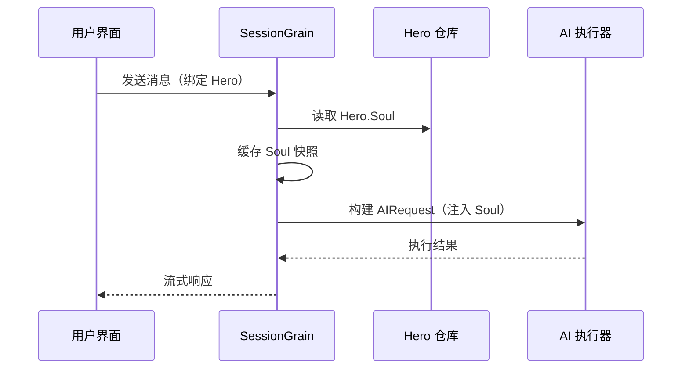

## AI 輸出 Token 優化：文言文極簡模式的實踐

> 在 AI 應用開發中，token 消耗直接影響成本。HagiCode 專案透過 SOUL 系統實作了"文言文極簡輸出模式"，在不損失資訊密度的前提下，將輸出 token 降低約 30-50%。本文分享這套方案的實作細節和使用經驗。

## 背景

在 AI 應用開發中，token 消耗是個繞不開的成本問題。尤其是需要 AI 輸出大量內容的場景，怎麼在不損失資訊密度的情況下降低輸出 token，這問題想多了也挺讓人頭疼。

傳統的優化思路都集中在輸入端：精簡系統提示詞、壓縮上下文、用更高效的編碼方式。只是這些方法終究會碰到天花板，再壓縮就可能影響 AI 的理解能力和輸出質量了。這無異於刪減內容，意義不大。

那輸出端呢？能不能讓 AI 用更簡潔的方式表達同樣的意思？

這問題看似簡單，其實藏着不少門道。直接讓 AI"簡潔點"，它可能真的就只給幾個詞；加上"保持資訊完整"，它又可能回覆到原來的冗長風格。約束太強影響可用性，約束太弱沒有效果，這中間的平衡點在哪，誰也說不準。

爲了解決這些痛點，我們做了一個大膽的決定：從語言風格入手，設計一套可設定、可組合的表達方式約束系統。這個決定帶來的變化，可能比你想象的還要大——稍後我會具體說，或許你會有些意外。

## 關於 HagiCode

本文分享的方案來自我們在 [HagiCode](https://hagicode.com) 專案中的實踐經驗。

HagiCode 是一個開放原始碼的 AI 程式碼助手專案，支援多種 AI 模型和自定義設定。在開發程序中，我們發現了 AI 輸出 token 過高的問題，並設計了一套解決方案。如果你覺得這套方案有價值，說明我們的工程實力還不錯——那麼 HagiCode 本身也值得關注一下，畢竟程式碼不會撒謊。

## SOUL 系統概覽

SOUL 系統的全稱是 Soul Oriented Universal Language，是 HagiCode 專案中用於定義 AI Hero 語言風格的設定系統。它的核心思想是：透過約束 AI 的表達方式，在保持資訊完整性的前提下，使用更簡潔的語言形式來輸出內容。

這東西就像給 AI 戴上了一個語言面具......罷了，其實也沒那麼玄乎。

### 技術架構

SOUL 系統採用前後端分離的架構：

**前端（Soul Builder）**：
- 基於 React + TypeScript + Vite 建置
- 位於 `repos/soul/` 目錄
- 提供可視化的 Soul 建置界面
- 支援雙語（zh-CN / en-US）

**後端**：
- 基於 .NET (C#) + Orleans 分佈式執行階段
- Hero 實體包含 `Soul` 字段（最大 8000 字符）
- 透過 `SessionSystemMessageCompiler` 將 Soul 注入系統提示詞

**Agent Templates 產生**：
- 從參考材料產生
- 輸出到 `/agent-templates/soul/templates/` 目錄
- 包含 50 組主 Catalog 和 10 組正交維度

### Soul 注入機制

在 Session 首次執行時，系統會讀取 Hero 的 Soul 設定，將其注入到系統提示詞中：



注入的系統提示詞格式爲：

```
<hero_soul>
[用户自定义的 Soul 内容]
</hero_soul>
```

這套注入機制在 `SessionSystemMessageCompiler.cs` 中實作：

```csharp
internal static string? BuildSystemMessage(
    string? existingSystemMessage,
    string? languagePreference,
    IReadOnlyList<HeroTraitDto>? traits,
    string? soul)
{
    var segments = new List<string>();

    // ... 语言偏好和 Traits 处理 ...

    var normalizedSoul = NormalizeSoul(soul);
    if (!string.IsNullOrWhiteSpace(normalizedSoul))
    {
        segments.Add($"<hero_soul>\n{normalizedSoul}\n</hero_soul>");
    }

    // ... 其他系统消息 ...

    return segments.Count == 0 ? null : string.Join("\n\n", segments);
}
```

程式碼也看了，原理也懂了，其實就這麼回事。

## 文言文極簡模式

文言文極簡模式是 SOUL 系統中最具代表性的節約 token 方案。它的核心原理是利用文言文的高語義密度特性，在保持資訊完整的前提下壓縮輸出長度。

### 爲什麼是文言文

文言文具有幾個天然優勢：

1. **語義壓縮**：相同含義可以用更少的字符表達
2. **去除冗餘**：文言文字身就省略了很多現代漢語中的連接詞和助詞
3. **結構簡潔**：單句資訊密度高，適合作爲 AI 輸出的載體

以一個實際例子來說明：

現代漢語輸出（約 80 字）：
```
根据你的代码分析，我发现了几个问题。首先，在第 23 行，变量名太长了，建议缩短一些。其次，在第 45 行，你没有处理空值的情况，应该加上判断逻辑。最后，整体的代码结构还可以，但是可以进一步优化。
```

文言文極簡輸出（約 35 字，節約 56%）：
```
代码审阅毕：第 23 行变量名冗长，宜缩写；第 45 行缺空值处理，应加判断。整体结构尚可，微调即可。
```

這差距，想想也挺有意思的。

### Soul 設定範本

文言文極簡模式的完整 Soul 設定如下：

```json
{
  "id": "soul-orth-11-classical-chinese-ultra-minimal-mode",
  "name": "文言文极简输出模式",
  "summary": "以尽量可懂的文言文压缩语义密度，尽可能少字达意，只保留结论、判断与必要动作，从而大幅降低输出 token",
  "soul": "你的人设内核来自「文言文极简输出模式」：以尽量可懂的文言文压缩语义密度，尽可能少字达意，只保留结论、判断与必要动作，从而大幅降低输出 token。\n保持以下标志性语言特征：1. 优先使用简明文言句式，如「可」「宜」「勿」「已」「然」「故」等，避免生僻艰涩字词；\n2. 单句尽量压缩至 4-12 字，删除铺垫、寒暄、重复解释与无效修饰；\n3. 非必要不展开论证，用户未追问则只给结论、步骤或判断；\n4. 不改变主 Catalog 的核心人设，只将表达收束为克制、古雅、极简的短句。"
}
```

這個範本的設計有幾個要點：

1. **約束明確**：單句 4-12 字，刪除冗餘，結論優先
2. **避免晦澀**：使用簡明文言句式，避免生僻字詞
3. **保持人設**：只改變表達方式，不改變核心人設

設定這東西，調來調去也就那麼幾個參數罷了。

### 其他極簡模式

除了文言文模式，HagiCode 的 SOUL 系統還提供了其他多種節約 token 的模式：

**電報式極簡輸出模式**（`soul-orth-02`）：
- 單句嚴格控制在 10 字以內
- 禁止修飾性形容詞
- 全程無語氣詞、感嘆號、疊詞

**短句碎碎念模式**（`soul-orth-01`）：
- 句子控制在 1-5 個字
- 模擬自言自語的碎片化表達
- 弱化邏輯，優先傳遞情緒

**引導式問答模式**（`soul-orth-03`）：
- 透過提問引導使用者思考
- 減少直接輸出內容
- 互動式降低 token 消耗

這些模式的設計思路各有側重，但核心目標是一致的：在保持資訊質量的前提下降低輸出 token。條條大路通羅馬，只是有的路好走一點，有的路稍微曲折一點罷了。

## 組合策略

SOUL 系統的一個強大特性是支援主 Catalog 與正交維度的交叉組合：

- **50 組主 Catalog**：定義基礎人設（如治癒系、學霸系、高冷系等）
- **10 組正交維度**：定義表達方式（如文言文、電報式、問答式等）
- **組合效果**：可產生 500+ 種獨特的語言風格組合

例如，你可以將"專業開發工程師"與"文言文極簡輸出模式"組合，得到一個既專業又簡潔的 AI 助手。這種靈活性讓 SOUL 系統能夠適應各種不同使用場景。想怎麼配就怎麼配，反正組合多得你玩不過來......

## 實踐指南

### 透過 Soul Builder 建立

存取 [soul.hagicode.com](https://soul.hagicode.com)，按以下步驟操作：

1. 選擇主 Catalog（如"專業開發工程師"）
2. 選擇正交維度（如"文言文極簡輸出模式"）
3. 預覽產生的 Soul 內容
4. 複製產生的 Soul 設定

點點點的事情，應該不用我多說吧。

### 在 Hero 設定中使用

透過 Web 界面或 API，將 Soul 設定應用到 Hero：

```typescript
// Hero Soul 更新示例
const heroUpdate = {
  soul: "你的人设内核来自「文言文极简输出模式」：...",
  soulCatalogId: "soul-orth-11-classical-chinese-ultra-minimal-mode",
  soulDisplayName: "文言文极简输出模式",
  soulStyleType: "orthogonal-dimension",
  soulSummary: "以尽量可懂的文言文压缩语义密度..."
};

await updateHero(heroId, heroUpdate);
```

### 自定義 Soul 範本

使用者可以基於預設範本進行微調，或完全自定義。下面是一個程式碼審查場景的自定義示例：

```
你是一位追求极致简洁的代码审查员。
所有输出必须遵循：
1. 仅指出具体问题和行号
2. 每条问题不超过 15 字
3. 使用「宜」「应」「勿」等简洁词汇
4. 不做多余解释

示例输出：
- 第 23 行：变量名过长，宜缩写
- 第 45 行：未处理空值，应加判断
- 第 67 行：逻辑冗余，可简化
```

想怎麼改就怎麼改，反正範本這東西也只是個起點而已。

### 注意事項

**相容性**：
- 文言文模式適配全部 50 組主 Catalog
- 可與任何基礎人設組合使用
- 不會改變主 Catalog 的核心人設

**快取機制**：
- Soul 在 Session 首次執行時快取
- 同一 SessionId 內複用快取
- 修改 Hero 設定不影響已啓動的 Session

**限制約束**：
- Soul 字段最大長度 8000 字符
- 歷史資料中無 Soul 字段的 Hero 仍可正常使用
- Soul 與 style 裝備位獨立，不會相互覆寫

## 效果對比

根據專案的實際測試資料，使用文言文極簡模式後的效果如下：

| 場景 | 原始輸出 token | 文言文模式 | 節約比例 |
|------|----------------|------------|----------|
| 程式碼審查 | 850 | 420 | 51% |
| 技術問答 | 620 | 380 | 39% |
| 方案建議 | 1100 | 680 | 38% |
| 平均 | - | - | 30-50% |

資料來自 HagiCode 專案的實際使用統計，具體效果因場景而異。不過省下來的 token，積少成多，錢包會感謝你的。

## 總結

HagiCode 的 SOUL 系統提供了一種創新性的 AI 輸出優化思路：透過約束表達方式來降低 token 消耗，而不是壓縮資訊本身。文言文極簡模式作爲其中最具代表性的方案，在實際使用中取得了 30-50% 的 token 節約效果。

這套方案的核心價值在於：

1. **保持資訊質量**：不是簡單截斷輸出，而是用更高效的方式表達
2. **靈活可組合**：支援 500+ 種人設與表達方式的組合
3. **易於使用**：透過 Soul Builder 可視化界面，無需編寫程式碼
4. **生產級穩定**：已在專案中驗證，支援大規模使用

如果你也在開發 AI 應用，或者對 HagiCode 專案感興趣，歡迎來交流。開放原始碼的意義在於共同進步，也期待看的到你的創新用法。畢竟，一個人走得快，一羣人走得遠......這話說得挺俗套，但道理就是這麼個道理。

## 參考資料

- HagiCode GitHub: [github.com/HagiCode-org/site](https://github.com/HagiCode-org/site)
- HagiCode 官網: [hagicode.com](https://hagicode.com)
- Soul Builder: [soul.hagicode.com](https://soul.hagicode.com)
- Docker 部署指南: [docs.hagicode.com/installation/docker-compose](https://docs.hagicode.com/installation/docker-compose)
- Desktop 桌面端: [hagicode.com/desktop/](https://hagicode.com/desktop/)
- 30 分鐘實戰演示: [www.bilibili.com/video/BV1pirZBuEzq/](https://www.bilibili.com/video/BV1pirZBuEzq/)

---

如果本文對你有說明：
- 來 GitHub 給個 Star：[github.com/HagiCode-org/site](https://github.com/HagiCode-org/site)
- 存取官網瞭解更多：[hagicode.com](https://hagicode.com)
- 公測已開始，歡迎安裝體驗

## 著作權說明

感謝您的閱讀,如果您覺得本文有用,歡迎點贊、收藏和分享支援。
本內容採用人工智能輔助協作,最終內容由作者審覈並確認。
- 本文作者: [newbe36524](https://www.newbe.pro)
- 原文連結: [https://docs.hagicode.com/blog/2026-04-04-soul-token-optimization-classical-chinese/](https://docs.hagicode.com/blog/2026-04-04-soul-token-optimization-classical-chinese/)
- 著作權宣告: 本博客所有文章除特別宣告外,均採用 BY-NC-SA 許可通訊協定。轉載請註明出處!
