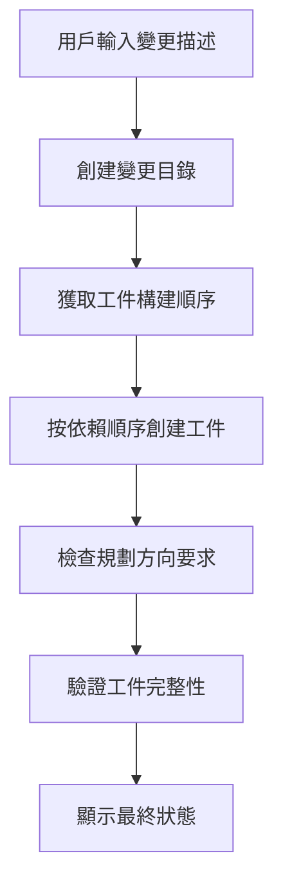
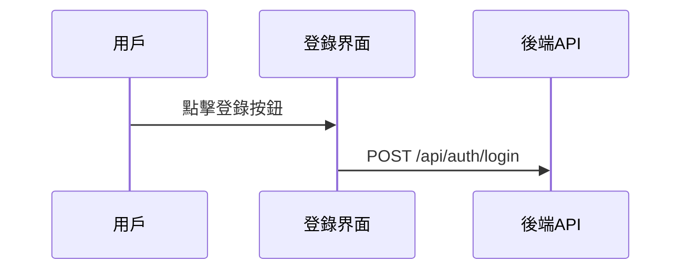

## 自訂 OpenSpec 步驟改進 AI 生成結果

> 在使用 OpenSpec 管理技術提案時，我們遇到了 AI 生成文檔質量不穩定的問題。其實也沒別的辦法，只能自己動手改提示詞模板了。這篇文章就是那段日子的記錄。

## 背景

OpenSpec 是一個管理技術提案的系統，核心想法很簡單：輸入變更描述，自動生成各種文檔工件。proposal、design、specs、tasks，這些都能自動生成。聽起來挺美好的，不是嗎？

只是在實際使用中，我們發現了一些問題。怎麼說呢，也不是什麼大問題，就是生成的東西不太對味兒。

生成的 `design.md` 缺少必要的可視化元素——沒有 Mermaid 流程圖，沒有時序圖，更沒有架構圖。這樣的設計文檔，技術團隊看了直搖頭，畢竟誰願意看一堆純文字呢？

`proposal.md` 也不盡如人意，缺少代碼變更表格，沒有界面原型。決策者看了半天，還是不知道這變更到底改了些什麼。

更讓人頭疼的是 `tasks.md`，裡面混入了各種 Git 操作任務。職責邊界變得模糊不清，開發人員看著這些任務，不知道哪些該做、哪些不該做。這也有點無奈，畢竟 AI 也不知道你的團隊分工是怎麼樣的。

不同文檔級別的可視化要求也不明確。proposal 和 design 到底應該包含哪些圖表？這個問題一直困擾著團隊。

這些問題的根源在哪呢？我們分析後發現了關鍵點：提示詞模板缺少明確的約束和指導。

這也沒什麼好奇怪的，畢竟模板本身就是通用的，不可能完全適配每個團隊的需求。

## 關於 HagiCode

本文分享的方案來自我們在 [HagiCode](https://hagicode.com) 項目中的實踐經驗。HagiCode 是一個 AI 代碼助手項目，我們在開發過程中大量使用 OpenSpec 來管理技術提案。

正是這些實際踩坑經歷，促成了這套改進方案的誕生。其實也沒什麼大不了的，就是遇到問題解決問題罷了。

## 分析：提示詞系統架構

要解決問題，先要理解系統。讓我們看看 OpenSpec 的提示詞系統是怎麼工作的。

OpenSpec 使用 Handlebars 模板系統，每個提示詞包含兩個部分：

**JSON 元數據文件**：定義參數、場景、版本信息
**Handlebars 模板文件**：包含實際的提示詞內容

```
Resources/Prompts/
├── openspec-v1-ff.zh-CN.json    # 元數據
├── openspec-v1-ff.zh-CN.hbs     # 模板內容
├── openspec-v1-ff.en-US.json
└── openspec-v1-ff.en-US.hbs
```

這種分離設計的優點很明顯：元數據和內容分開管理，便於維護和本地化。這也有點像寫代碼，邏輯和表現分離，大家都懂這個道理。

FF（Fast Forward）工作流是 OpenSpec 的核心生成流程：



這個流程看起來很完美，但問題出在"規劃方向要求"這一步——它沒有足夠明確的指導。

這也有點無奈，畢竟系統設計的時候，也不可能考慮到所有團隊的具體需求。

## 規劃方向系統

規劃方向系統是 OpenSpec 的核心自定義機制，允許用戶選擇不同的生成選項。HagiCode 項目中定義了以下方向：

| 方向 ID | 功能 | 默認啟用 |
|---------|------|---------|
| `explore` | 探索模式 | 是 |
| `change-map` | 變更地圖 | 是 |
| `flowchart` | 交互流程圖 | 是 |
| `prototype` | UI 原型 | 是 |
| `architecture` | 架構圖 | 是 |
| `sequence` | API 時序圖 | 是 |

每個方向都定義了穩定的標識符、默認啟用狀態、顯示標籤，以及中英文提示詞片段。

這個系統設計得很精巧，但在 HagiCode 的實踐中，我們發現光有定義還不夠——需要在提示詞模板中明確使用這些方向。

這也有點像人生中很多事情，有了選項不等於會做出選擇，還是需要有人告訴你該怎麼選。

## 解決方案：明確約束和示例

我們的改進思路很直接：在提示詞模板中添加明確的約束和參考示例。

其實也沒什麼特別的，就是把話說清楚罷了。

### 1. 添加文檔可視化要求

在 `openspec-v1-ff.zh-CN.hbs` 模板中，我們添加了明確的內容範圍約束：

```markdown
### tasks.md 內容範圍約束

當創建 `tasks.md` 工件時，必須遵守以下內容範圍約束：

必須包含：
- 業務邏輯任務（代碼實現、功能開發）
- 技術實現任務（組件集成、API 開發）
- 測試任務（單元測試、集成測試）
- 文檔任務（更新文檔、添加註釋）

禁止包含：
- Git 提交操作（git add、git commit、git push）
- 版本控制管理工作流
- 部署和發布操作
```

使用規範的"必須/禁止"語言，而不是"建議"或"可以"，這讓 AI 能夠更準確地理解約束。

這也有點像教導孩子，說什麼就是什麼，不能有歧義。

### 2. 為每個方向提供參考示例

光說"包含流程圖"還不夠，我們為每個啟用的方向提供了具體的輸出示例。

畢竟光說不練假把式，給個具體的例子，AI 就能更好地理解。

**變更地圖方向示例**：
```markdown
| 文件路徑 | 變更類型 | 變更原因 | 影響範圍 |
|---------|---------|---------|---------|
| Path/to/file | 新增 | 說明 | 模塊名 |
```

**原型方向示例**：
```
┌─────────────────────────────────────────┐
│ 用戶登錄                            [×] │
├─────────────────────────────────────────┤
│  郵箱地址 *                             │
│ ┌─────────────────────────────────────┐ │
│ │ user@example.com                   │ │
│ └─────────────────────────────────────┘ │
└─────────────────────────────────────────┘
```

**流程圖方向示例**：


這些示例讓 AI 能夠準確理解期望的輸出格式，而不是自己發揮。

這也有點像考試時給參考答案，雖然不能完全一樣，但格式總要對吧。

### 3. 使用規範語言明確要求

對於不同文檔類型的可視化要求，我們用規範語言來約束：

```markdown
對於 proposal.md：
- 必須包含代碼變更表（當啟用 change-map 方向）
- 必須包含 UI 原型圖（當涉及 UI 變更且啟用 prototype 方向）
- 禁止包含詳細的架構圖（這些應在 design.md 中）

對於 design.md：
- 必須包含所有 proposal.md 的內容（更詳細版本）
- 必須包含架構圖（當啟用 architecture 方向）
- 必須包含數據流圖（當啟用 flowchart 方向）
```

這種明確的約束大大改善了生成質量。

其實也沒別的，就是把話說清楚，不要讓 AI 去猜。

## 實踐：代碼實現

理論說完了，來看看 HagiCode 項目中是怎麼實現的。

### 定義規劃方向

在 `ProposalPlanningDirections.cs` 中定義規劃方向：

```csharp
public static class ProposalPlanningDirections
{
    private static readonly ProposalPlanningDirectionDefinition[] Catalog =
    [
        new(
            ChangeMapId,
            "Change map",
            DefaultEnabled: true,
            EnglishPromptFragment:
            "- Change map: include structured file-impact views...",
            ChinesePromptFragment:
            "- 變更地圖：加入結構化的文件影響視圖..."),
        // ... 其他方向
    ];

    public static string RenderInstructionBlock(
        IEnumerable<ProposalPlanningDirectionState> directions,
        string? locale)
    {
        var enabledDirections = directions
            .Where(direction => direction.Enabled)
            .ToArray();

        if (enabledDirections.Length == 0)
        {
            return string.Empty;
        }

        var heading = IsChineseLocale(locale)
            ? "本次生成啟用以下規劃方向："
            : "Apply the following planning directions:";

        return string.Join(Environment.NewLine,
            [heading, .. enabledDirections.Select(d => d.GetPromptFragment(locale))]);
    }
}
```

這段代碼有幾個值得注意的設計點：

1. 使用數組而不是列表，因為定義在運行時不會改變
2. 延遲渲染——只在有啟用方向時才生成文本
3. 支持多語言，根據 locale 選擇合適的提示詞片段

其實也沒什麼特別的，就是一些常規的代碼設計罷了。

### 模板參數化

在 Handlebars 模板中使用條件語句：

```handlebars
{{#if planningDirectionInstructions}}
## 本次生成的規劃方向

{{{planningDirectionInstructions}}}
{{/if}}

**步驟**
1. **如果未提供輸入，使用合理的默認值**
2. **創建變更目錄**
3. **獲取工件構建順序**
4. **按順序創建工件直到 apply-ready**
   a. 對於每個 ready 的工件：
      - 獲取說明
      - 閱讀依賴文件
      - 創建工件文件
```

注意那個 `{{{planningDirectionInstructions}}}`——三個花括號表示不轉義 HTML，這樣可以保留 Mermaid 代碼塊等格式。

這也有點像生活中的妥協，有時候需要保留一些原始的東西，不能什麼都轉義。

### 提示詞加載實現

通過 `FilePromptProvider` 實現提示詞的參數化加載：

```csharp
public async Task<string> GetOpenspecV1FfPromptAsync(
    string changeName,
    string changeDescription,
    string locale = "en-US",
    string? planningDirectionInstructions = null,
    CancellationToken cancellationToken = default)
{
    var parameters = new Dictionary<string, object>
    {
        { "planningDirectionInstructions",
          ResolvePlanningDirectionInstructions(locale, planningDirectionInstructions) }
    };

    if (!string.IsNullOrWhiteSpace(changeName))
    {
        parameters["changeName"] = changeName;
    }

    return await GetPromptWithParametersAsync(
        PromptScenario.OpenspecV1Ff,
        locale,
        cancellationToken,
        parameters) ?? string.Empty;
}
```

這個設計很靈活：`planningDirectionInstructions` 是可選的，如果不提供，系統會使用默認配置。

畢竟誰也不希望每次都傳入一堆參數，有個默認值總是好的。

## 驗證和測試

實現後，HagiCode 團隊進行了全面的驗證：

### 啟用特定方向時

- 檢查生成的 proposal.md 是否包含代碼變更表
- 檢查生成的 design.md 是否包含架構圖
- 驗證 tasks.md 不包含 Git 操作任務

### 禁用特定方向時

- 驗證不會生成對應的可視化內容
- 確保不影響其他方向的輸出

### 邊界情況

- 所有方向都禁用時的行為
- 無效的方向 ID 時的錯誤處理

這些測試確保了系統的穩定性和可預測性——這對團隊採用新工具至關重要。

其實也沒什麼特別的，就是該測的都要測到，畢竟誰也不希望上線之後出問題。

## 注意事項

在實施這套方案時，有幾個坑要避開：

**模板同步**：修改模板時注意與上游保持同步。HagiCode 團隊就遇到過一次模板衝突，花了半天時間才解決。這也有點無奈，畢竟升級總是會帶來一些兼容性問題。

**雙語一致性**：確保中英文模板的結構和約束一致。我們曾經遇到過中文版本有約束、英文版本沒有的情況，導致生成的文檔質量不一致。這也有點尷尬，畢竟誰知道用戶會用哪種語言呢。

**性能影響**：規劃方向的渲染應在微秒級完成。如果渲染時間過長，會影響用戶體驗。畢竟誰願意等半天才能看到結果呢。

**向後兼容**：保留對舊版本 API 的支持。比如 `enableExploreMode` 參數，雖然我們現在我用規劃方向系統，但舊代碼還在用。這也有點無奈，畢竟不能總是要求所有人都升級。

**清晰的表達**：使用規範語言（MUST/SHALL）而非建議性語言。這一點在 HagiCode 的實踐中得到了充分驗證。其實也沒什麼別的，就是把話說清楚罷了。

## 總結

通過自訂 OpenSpec 提示詞步驟，我們成功改進了 AI 生成文檔的質量。關鍵改進點包括：

1. 在提示詞模板中添加明確的約束條件
2. 為每個規劃方向提供具體的輸出示例
3. 使用規範語言（MUST/MUST NOT）來約束 AI 行為
4. 通過代碼實現靈活的提示詞參數化加載

這套方案在 HagiCode 項目中得到了驗證，生成的文檔質量明顯提升：設計文檔包含了完整的可視化元素，提案文檔有清晰的代碼變更表，任務清單職責明確。

其實也沒什麼大不了的，就是把問題解決了罷了。

如果你也在使用類似的 AI 輔助文檔生成系統，希望這些經驗對你有幫助。記住：清晰的約束和具體的示例，是獲得高質量輸出的關鍵。

畢竟有些事情，還是說清楚比較好......

## 參考資料

- [HagiCode 項目地址](https://github.com/HagiCode-org/site)
- [OpenSpec 文檔](https://docs.hagicode.com)
- [Handlebars 模板語法](https://handlebarsjs.com/)
- [Mermaid 圖表語法](https://mermaid.js.org/)
