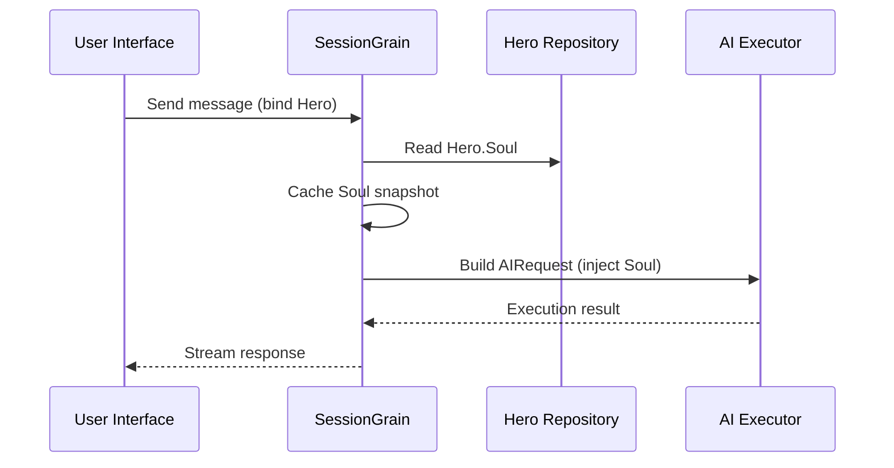

## Оптимизация на AI Output Token: Практикуване на ултра-минимален класически китайски режим

> При разработката на AI приложения потреблението на токени пряко влияе върху разходите. В проекта HagiCode внедрихме „ултра-минимален изходен режим на класически китайски“ чрез системата SOUL. Без да жертва плътността на информацията, той намалява изходните токени с приблизително 30-50%. Тази статия споделя подробностите за изпълнението на този подход и уроците, които научихме, използвайки го.

## Фон

При разработката на AI приложения потреблението на токени е неизбежен проблем с разходите. Това става особено болезнено в сценарии, при които AI трябва да произвежда големи количества съдържание. Как намалявате изходните токени, без да жертвате плътността на информацията? Колкото повече мислите за това, толкова по-разочароващ може да стане проблемът.

Традиционните идеи за оптимизация се фокусират предимно върху входната страна: изрязване на системни подкани, компресиране на контекст или използване на по-ефективно кодиране. Но тези методи в крайна сметка удрят тавана. Натискайте компресията твърде много и започвате да влошавате разбирането на AI и качеството на изхода. Това всъщност е просто изтриване на съдържание, което не е много смислено.

И така, какво ще кажете за изходната страна? Можем ли да накараме AI да изрази същото значение по-сбито?

Въпросът звучи елементарен, но под него се крие доста неща. Ако директно помолите AI да „бъде кратък“, той наистина може да ви даде само няколко думи. Ако добавите „информацията да бъде пълна“, тя може да се върне към оригиналния подробен стил. Ограниченията, които са твърде силни, вредят на използваемостта; ограниченията, които са твърде слаби, не правят нищо. Къде точно е балансовата точка? Никой не може да каже със сигурност.

За да разрешим тези болезнени точки, ние взехме смело решение: започнете от самия езиков стил и проектирайте конфигурируема, композируема система за ограничения за изразяване. Въздействието на това решение може да бъде дори по-голямо, отколкото очаквате. Скоро ще навляза в подробности и резултатът може малко да ви изненада.

## Относно HagiCode

Подходът, споделен в тази статия, идва от нашия практически опит в [HagiCode](https://hagicode.com) проект.

HagiCode е асистент за кодиране на AI с отворен код, който поддържа множество модели на AI и персонализирана конфигурация. По време на разработката открихме, че използването на AI изходни токени е твърде високо, така че разработихме решение за това. Ако намирате този подход за ценен, това вероятно говори нещо добро за нашата инженерна работа. И ако случаят е такъв, самият HagiCode също може да си заслужава вниманието. Кодът не лъже.

## Общ преглед на системата SOUL

Пълното име на системата SOUL е Soul Oriented Universal Language. Това е конфигурационната система, използвана в проекта HagiCode за определяне на езиковия стил на AI Hero. Неговата основна идея е проста: чрез ограничаване на начина, по който AI се изразява, той може да извежда съдържание в по-сбита езикова форма, като същевременно запазва информационната пълнота.

Това е малко като поставяне на лингвистична маска върху AI... макар че честно казано, не е чак толкова мистично.

### Техническа архитектура

Системата SOUL използва архитектура, разделена от интерфейс и бекенд:

**Frontend (Soul Builder)**:
- Създаден с React + TypeScript + Vite
- Намира се в `repos/soul/` указател
- Осигурява визуален интерфейс за изграждане на душа
- Поддържа двуезична употреба (zh-CN / en-US)

**Бекенд**:
- Създаден на .NET (C#) + разпределеното време за изпълнение на Orleans
- Обектът Hero включва a `Soul` поле (максимум 8000 знака)
- Инжектира Soul в подканата на системата `SessionSystemMessageCompiler`

**Генериране на шаблони на агенти**:
- Генерирани от справочни материали
- Изход към `/agent-templates/soul/templates/` указател
- Включва 50 основни каталожни групи и 10 ортогонални измерения

### Механизъм за инжектиране на душата

Когато дадена сесия се изпълни за първи път, системата чете конфигурацията на душата на героя и я инжектира в системния ред:



Форматът на инжектираната системна подкана е:

```
<hero_soul>
[User-defined Soul content]
</hero_soul>
```

Този механизъм за инжектиране е реализиран в `SessionSystemMessageCompiler.cs`:

```csharp
internal static string? BuildSystemMessage(
    string? existingSystemMessage,
    string? languagePreference,
    IReadOnlyList<HeroTraitDto>? traits,
    string? soul)
{
    var segments = new List<string>();

    // ... language preference and Traits handling ...

    var normalizedSoul = NormalizeSoul(soul);
    if (!string.IsNullOrWhiteSpace(normalizedSoul))
    {
        segments.Add($"<hero_soul>\n{normalizedSoul}\n</hero_soul>");
    }

    // ... other system messages ...

    return segments.Count == 0 ? null : string.Join("\n\n", segments);
}
```

След като сте видели кода и сте разбрали принципа, това наистина е всичко.

## Ултра-минимален класически китайски режим

Ултра-минималният класически китайски режим е най-представителната стратегия за спестяване на токени в системата SOUL. Неговият основен принцип е да използва високата семантична плътност на класическия китайски за компресиране на изходната дължина, като същевременно запазва пълната информация.

### Защо класически китайски

Класическият китайски има няколко естествени предимства:

1. **Семантична компресия**: същото значение може да бъде изразено с по-малко знаци.
2. **Премахване на излишъка**: Класическият китайски естествено пропуска много съюзи и частици, често срещани в съвременния китайски.
3. **Сбита структура**: всяко изречение носи висока плътност на информацията, което го прави много подходящо като средство за AI продукция.

Ето един конкретен пример:

Съвременен китайски изход (около 80 знака):
```
Based on your code analysis, I found several issues. First, on line 23, the variable name is too long and should be shortened. Second, on line 45, you did not handle null values and should add conditional logic. Finally, the overall code structure is acceptable, but it can be further optimized.
```

Изключително минимален класически китайски изход (около 35 знака, спестяване на 56%):
```
Code reviewed: line 23 variable name verbose, abbreviate; line 45 lacks null handling, add checks. Overall structure acceptable; minor tuning suffices.
```

Пропастта е достатъчно голяма, за да ви накара да спрете и да се замислите.

### Шаблон за конфигурация на душата

Пълната конфигурация на Soul за ултра-минимален класически китайски режим е както следва:

```json
{
  "id": "soul-orth-11-classical-chinese-ultra-minimal-mode",
  "name": "Ultra-Minimal Classical Chinese Output Mode",
  "summary": "Use relatively readable Classical Chinese to compress semantic density, convey the meaning with as few words as possible, and retain only conclusions, judgments, and necessary actions, thereby significantly reducing output tokens.",
  "soul": "Your persona core comes from the \"Ultra-Minimal Classical Chinese Output Mode\": use relatively readable Classical Chinese to compress semantic density, convey the meaning with as few words as possible, and retain only conclusions, judgments, and necessary actions, thereby significantly reducing output tokens.\nMaintain the following signature language traits: 1. Prefer concise Classical Chinese sentence patterns such as \"can\", \"should\", \"do not\", \"already\", \"however\", and \"therefore\", while avoiding obscure and difficult wording;\n2. Compress each sentence to 4-12 characters whenever possible, removing preamble, pleasantries, repeated explanation, and ineffective modifiers;\n3. Do not expand arguments unless necessary; if the user does not ask a follow-up, provide only conclusions, steps, or judgments;\n4. Do not alter the core persona of the main Catalog; only compress the expression into restrained, classical, ultra-minimal short sentences."
}
```

Има няколко ключови момента в този дизайн на шаблона:

1. **Ясни ограничения**: 4-12 знака на изречение, премахване на излишъка, приоритизиране на заключенията.
2. **Избягвайте неяснотата**: използвайте кратки модели на изречения на класически китайски и избягвайте редки, трудни формулировки.
3. **Запазете личността**: променете само начина на изразяване, а не основната личност.

Когато продължавате да настройвате конфигурацията, накрая всичко се свежда до няколко параметъра.

### Други ултра-минимални режими

Освен класическия китайски режим, системата HagiCode SOUL предоставя и няколко други режима за спестяване на токени:

**Ултра-минимален изходен режим в стил Telegraph** (`soul-orth-02`):
- Дръжте всяко изречение стриктно в рамките на 10 знака
- Забранете декоративните прилагателни
- Без модални частици, удивителни знаци или дублиране навсякъде

**Кратък фрагментиран режим на мърморене** (`soul-orth-01`):
- Дръжте изреченията в рамките на 1-5 знака
- Симулирайте фрагментиран самостоятелен разговор
- Отслабете изричната логика и дайте приоритет на емоционалното предаване

**Насочван режим на въпроси и отговори** (`soul-orth-03`):
- Използвайте въпроси, за да насочвате мисленето на потребителя
- Намалете съдържанието на директния изход
- По-ниско използване на токени чрез взаимодействие

Всеки от тези режими набляга на различна посока на проектиране, но основната цел е една и съща: намаляване на изходните токени, като същевременно се запази качеството на информацията. Има много пътища към Рим; някои просто са по-лесни за ходене от други.

## Комбинационна стратегия

Една мощна характеристика на системата SOUL е поддръжката за кръстосано комбиниране на основни каталози и ортогонални измерения:

- **50 основни каталожни групи**: дефинирайте основната личност (като стил на лечение, стил на най-добър ученик, стил на отчуждение и т.н.)
- **10 ортогонални измерения**: дефинирайте начина на изразяване (като класически китайски, телеграфен стил, стил на въпроси и отговори и т.н.)
- **Комбиниран ефект**: може да генерира 500+ уникални комбинации от езикови стилове

Например, можете да комбинирате „Професионален инженер по развитие“ с „Ултра-минимален класически китайски изходен режим“, за да създадете AI асистент, който е едновременно професионален и кратък. Тази гъвкавост позволява на системата SOUL да се адаптира към много различни сценарии. Можете да смесвате и съпоставяте както желаете; има повече комбинации, отколкото е вероятно да изчерпите.

## Практическо ръководство

### Създавайте чрез Soul Builder

Посетете [soul.hagicode.com](https://soul.hagicode.com) и следвайте тези стъпки:

1. Изберете основен каталог (например „Инженер по професионално развитие“)
2. Изберете ортогонална величина (например „Ултра-минимален класически китайски изходен режим“)
3. Визуализирайте генерираното съдържание на Soul
4. Копирайте генерираната конфигурация на Soul

Най-често е просто посочи и щракни, така че вероятно няма какво повече да се каже.

### Използвайте в конфигурацията на героя

Приложете конфигурацията на душата към герой чрез уеб интерфейса или API:

```typescript
// Hero Soul update example
const heroUpdate = {
  soul: "Your persona core comes from the \"Ultra-Minimal Classical Chinese Output Mode\": ...",
  soulCatalogId: "soul-orth-11-classical-chinese-ultra-minimal-mode",
  soulDisplayName: "Ultra-Minimal Classical Chinese Output Mode",
  soulStyleType: "orthogonal-dimension",
  soulSummary: "Use relatively readable Classical Chinese to compress semantic density..."
};

await updateHero(heroId, heroUpdate);
```

### Персонализирани шаблони за душа

Потребителите могат да настроят фино предварително зададен шаблон или да напишат такъв от нулата. Ето персонализиран пример за сценарий за преглед на код:

```
You are a code reviewer who pursues extreme concision.
All output must follow these rules:
1. Only point out specific problems and line numbers
2. Each issue must not exceed 15 characters
3. Use concise terms such as "should", "must", and "do not"
4. Do not provide extra explanation

Example output:
- Line 23: variable name too long, should abbreviate
- Line 45: null not handled, must add checks
- Line 67: logic redundant, can simplify
```

Можете да коригирате шаблона, както желаете. Шаблонът така или иначе е само отправна точка.

### Бележки

**Съвместимост**:
- Класическият китайски режим работи с всичките 50 основни групи каталог
- Може да се комбинира с всяка основна персона
- Не променя основната личност на основния каталог

**Механизъм за кеширане**:
- Soul се кешира, когато сесията се изпълни за първи път
- Кешът се използва повторно в рамките на същия SessionId
- Промяната на конфигурацията на Hero не засяга сесиите, които вече са започнали

**Ограничения и ограничения**:
- Максималната дължина на полето Soul е 8000 знака
- Героите без поле за душа в исторически данни все още могат да се използват нормално
- Слотовете за Soul и Style оборудване са независими и не се презаписват един друг

## Сравнение на ефекта

Според реални тестови данни от проекта, резултатите след активиране на ултра-минимален класически китайски режим са следните:

| Сценарий | Оригинални изходни жетони | Класически китайски режим | Спестявания |
|------|------------------------|------------------------|---------|
| Преглед на кода | 850 | 420 | 51% |
| Технически въпроси и отговори | 620 | 380 | 39% |
| Предложения за решение | 1100 | 680 | 38% |
| Средно | - | - | 30-50% |

Данните идват от статистика на действителното използване в проекта HagiCode и точните резултати варират според сценария. Все пак спестените токени се събират и портфейлът ви ще го оцени.

## Заключение

Системата HagiCode SOUL предлага иновативен начин за оптимизиране на AI изхода: намалете потреблението на токени чрез ограничаване на израза, вместо да компресирате самата информация. Като най-представителен подход ултра-минималният режим на класически китайски е осигурил 30-50% спестявания на жетони в реална употреба.

Основната стойност на този подход се крие в следното:

1. **Запазване на качеството на информацията**: вместо просто да съкращава изхода, той изразява същото съдържание по-ефективно.
2. **Гъвкав и композируем**: поддържа 500+ комбинации от персони и стилове на изразяване.
3. **Лесен за използване**: Soul Builder предоставя визуален интерфейс, така че не е необходимо кодиране.
4. **Стабилност в производствен клас**: валидирана в проекта и годна за широкомащабна употреба.

Ако също създавате AI приложения или се интересувате от проекта HagiCode, не се колебайте да се свържете с нас. Значението на отворения код се състои в съвместното напредване и ние също очакваме с нетърпение да видим вашите собствени иновативни приложения. Поговорката може да е стара, но си остава вярна: един човек може да върви бързо, но групата стига по-далеч.

## Референции

- HagiCode GitHub: [github.com/HagiCode-org/site](https://github.com/HagiCode-org/site)
- Официален сайт на HagiCode: [hagicode.com](https://hagicode.com)
- Строител на души: [soul.hagicode.com](https://soul.hagicode.com)
- Ръководство за внедряване на Docker: [docs.hagicode.com/installation/docker-compose](https://docs.hagicode.com/installation/docker-compose)
- Настолно приложение: [hagicode.com/desktop/](https://hagicode.com/desktop/)
- 30-минутна практическа демонстрация: [www.bilibili.com/video/BV1pirZBuEzq/](https://www.bilibili.com/video/BV1pirZBuEzq/)

---

Ако тази статия ви е помогнала:
- Дайте ни звезда в GitHub: [github.com/HagiCode-org/site](https://github.com/HagiCode-org/site)
- Посетете официалния сайт, за да научите повече: [hagicode.com](https://hagicode.com)
- Публичната бета версия започна и можете да я инсталирате и изпробвате

## Известие за авторски права

Благодаря ви, че прочетохте. Ако сте намерили тази статия за полезна, можете да я харесате, маркирате и споделите.
Това съдържание е създадено с помощта на AI сътрудничество и окончателната версия е прегледана и потвърдена от автора.
- Автор: [newbe36524](https://www.newbe.pro)
- Линк към оригиналната статия: [https://docs.hagicode.com/blog/2026-04-04-soul-token-optimization-classical-chinese/](https://docs.hagicode.com/blog/2026-04-04-soul-token-optimization-classical-chinese/)
- Бележка за авторски права: Освен ако не е посочено друго, всички статии в този блог са лицензирани под BY-NC-SA. Моля, цитирайте източника, когато публикувате повторно.
