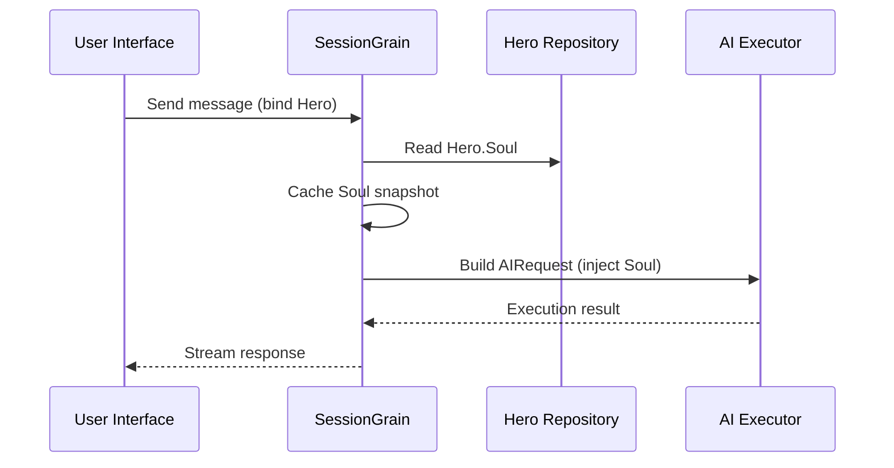

## Optimalizace výstupního tokenu AI: Cvičení ultra-minimálního režimu klasické čínštiny

> Při vývoji aplikací AI spotřeba tokenů přímo ovlivňuje náklady. V projektu HagiCode jsme implementovali „ultraminimální výstupní režim klasické čínštiny“ prostřednictvím systému SOUL. Bez obětování hustoty informací snižuje výstupní tokeny zhruba o 30–50 %. Tento článek sdílí podrobnosti o implementaci tohoto přístupu a lekce, které jsme se při jeho používání naučili.

## Pozadí

Při vývoji aplikací AI je spotřeba tokenů nevyhnutelným problémem nákladů. To se stává obzvláště bolestivé ve scénářích, kde AI potřebuje produkovat velké množství obsahu. Jak snížíte výstupní tokeny, aniž byste obětovali hustotu informací? Čím více o tom přemýšlíte, tím více může být problém frustrující.

Tradiční nápady na optimalizaci se většinou zaměřují na vstupní stranu: ořezávání systémových výzev, komprimaci kontextu nebo použití efektivnějšího kódování. Ale tyto metody nakonec narazily na strop. Zatlačte kompresi příliš daleko a začnete poškozovat porozumění AI a kvalitu výstupu. To je v podstatě jen mazání obsahu, což není příliš smysluplné.

Jak je to tedy s výstupní stranou? Mohli bychom přimět AI, aby vyjádřila stejný význam stručněji?

Otázka zní jednoduše, ale skrývá se pod ní docela dost. Pokud přímo požádáte AI, aby „byla stručná“, může vám skutečně poskytnout jen pár slov. Pokud přidáte „uchovávejte informace úplné“, může se vrátit zpět k původnímu podrobnému stylu. Příliš silná omezení poškozují použitelnost; příliš slabá omezení nedělají nic. Kde přesně je bod rovnováhy? Nikdo nemůže s jistotou říci.

Abychom vyřešili tyto bolestivé body, učinili jsme odvážné rozhodnutí: začít od samotného jazykového stylu a navrhnout konfigurovatelný, skládací systém omezení pro výraz. Dopad tohoto rozhodnutí může být ještě větší, než očekáváte. Brzy se dostanu do podrobností a výsledek vás možná trochu překvapí.

## O HagiCode

Přístup sdílený v tomto článku vychází z našich praktických zkušeností v [HagiCode](https://hagicode.com) projekt.

HagiCode je open-source asistent kódování AI, který podporuje více modelů AI a vlastní konfiguraci. Během vývoje jsme zjistili, že využití výstupního tokenu AI bylo příliš vysoké, a tak jsme pro to navrhli řešení. Pokud považujete tento přístup za hodnotný, pravděpodobně to vypovídá něco dobrého o naší inženýrské práci. A pokud tomu tak je, může za vaši pozornost stát i samotný HagiCode. Kód nelže.

## Přehled systému SOUL

Celý název systému SOUL je Soul Oriented Universal Language. Je to konfigurační systém používaný v projektu HagiCode k definování jazykového stylu AI hrdiny. Jeho základní myšlenka je jednoduchá: omezením toho, jak se umělá inteligence vyjadřuje, může vydávat obsah ve stručnější lingvistické formě při zachování informační úplnosti.

Je to trochu jako nasazování jazykové masky na AI... i když upřímně, není to tak úplně mystické.

### Technická architektura

Systém SOUL používá architekturu oddělenou frontend-backend:

**Frontend (Tvůrce duší)**:
- Vytvořeno pomocí React + TypeScript + Vite
- Nachází se v `repos/soul/` adresář
- Poskytuje vizuální rozhraní pro budování duše
- Podporuje dvojjazyčné použití (zh-CN / en-US)

**Backend**:
- Postaveno na .NET (C#) + distribuovaném runtime Orleans
- Entita Hrdina zahrnuje a `Soul` pole (maximálně 8000 znaků)
- Vstříkne duši do systémové výzvy `SessionSystemMessageCompiler`

**Vytváření šablon agentů**:
- Vygenerováno z referenčních materiálů
- Výstup do `/agent-templates/soul/templates/` adresář
- Obsahuje 50 hlavních katalogových skupin a 10 ortogonálních rozměrů

### Mechanismus vstřikování duše

Když se relace spustí poprvé, systém načte konfiguraci duše hrdiny a vloží ji do systémové výzvy:



Formát vložené systémové výzvy je:

```
<hero_soul>
[User-defined Soul content]
</hero_soul>
```

Tento injekční mechanismus je implementován v `SessionSystemMessageCompiler.cs`:

```csharp
internal static string? BuildSystemMessage(
    string? existingSystemMessage,
    string? languagePreference,
    IReadOnlyList<HeroTraitDto>? traits,
    string? soul)
{
    var segments = new List<string>();

    // ... language preference and Traits handling ...

    var normalizedSoul = NormalizeSoul(soul);
    if (!string.IsNullOrWhiteSpace(normalizedSoul))
    {
        segments.Add($"<hero_soul>\n{normalizedSoul}\n</hero_soul>");
    }

    // ... other system messages ...

    return segments.Count == 0 ? null : string.Join("\n\n", segments);
}
```

Jakmile uvidíte kód a pochopíte princip, je to opravdu vše.

## Ultra-minimální režim klasické čínštiny

Ultra-minimální režim klasické čínštiny je nejreprezentativnější strategií pro ukládání tokenů v systému SOUL. Jeho základním principem je použití vysoké sémantické hustoty klasické čínštiny ke kompresi výstupní délky při zachování kompletní informace.

### Proč klasická čínština

Klasická čínština má několik přirozených výhod:

1. **Sémantická komprese**: stejný význam lze vyjádřit méně znaky.
2. **Odstranění redundance**: Klasická čínština přirozeně vynechává mnoho konjunkcí a částic běžných v moderní čínštině.
3. **Výstižná struktura**: každá věta nese vysokou hustotu informací, takže se dobře hodí jako prostředek pro výstup AI.

Zde je konkrétní příklad:

Moderní čínský výstup (asi 80 znaků):
```
Based on your code analysis, I found several issues. First, on line 23, the variable name is too long and should be shortened. Second, on line 45, you did not handle null values and should add conditional logic. Finally, the overall code structure is acceptable, but it can be further optimized.
```

Ultra-minimální výstup klasické čínštiny (asi 35 znaků, úspora 56 %):
```
Code reviewed: line 23 variable name verbose, abbreviate; line 45 lacks null handling, add checks. Overall structure acceptable; minor tuning suffices.
```

Mezera je dostatečně velká na to, abyste se zastavili a zamysleli.

### Šablona konfigurace duše

Kompletní konfigurace duše pro ultra-minimální režim klasické čínštiny je následující:

```json
{
  "id": "soul-orth-11-classical-chinese-ultra-minimal-mode",
  "name": "Ultra-Minimal Classical Chinese Output Mode",
  "summary": "Use relatively readable Classical Chinese to compress semantic density, convey the meaning with as few words as possible, and retain only conclusions, judgments, and necessary actions, thereby significantly reducing output tokens.",
  "soul": "Your persona core comes from the \"Ultra-Minimal Classical Chinese Output Mode\": use relatively readable Classical Chinese to compress semantic density, convey the meaning with as few words as possible, and retain only conclusions, judgments, and necessary actions, thereby significantly reducing output tokens.\nMaintain the following signature language traits: 1. Prefer concise Classical Chinese sentence patterns such as \"can\", \"should\", \"do not\", \"already\", \"however\", and \"therefore\", while avoiding obscure and difficult wording;\n2. Compress each sentence to 4-12 characters whenever possible, removing preamble, pleasantries, repeated explanation, and ineffective modifiers;\n3. Do not expand arguments unless necessary; if the user does not ask a follow-up, provide only conclusions, steps, or judgments;\n4. Do not alter the core persona of the main Catalog; only compress the expression into restrained, classical, ultra-minimal short sentences."
}
```

V návrhu této šablony je několik klíčových bodů:

1. **Jasná omezení**: 4–12 znaků na větu, odstraňte nadbytečnost, upřednostněte závěry.
2. **Vyhněte se nejasnostem**: používejte stručné vzorce klasických čínských vět a vyhněte se vzácným a obtížným formulacím.
3. **Zachovat osobu**: Změňte pouze způsob vyjadřování, nikoli základní osobnost.

Když pokračujete v nastavování konfigurace, vše se nakonec stáhne na několik parametrů.

### Další ultra-minimální režimy

Kromě klasického čínského režimu nabízí systém HagiCode SOUL také několik dalších režimů pro ukládání tokenů:

**Režim ultraminimálního výstupu ve stylu telegrafu** (`soul-orth-02`):
- Udržujte každou větu striktně do 10 znaků
- Zakázat dekorativní přídavná jména
- Žádné modální částice, vykřičníky nebo reduplikace

**Režim krátkého fragmentovaného mumlání** (`soul-orth-01`):
- Udržujte věty v rozmezí 1–5 znaků
- Simulujte roztříštěnou samomluvu
- Oslabte explicitní logiku a upřednostněte emocionální přenos

**Režim řízených otázek a odpovědí** (`soul-orth-03`):
- Pomocí otázek usměrněte myšlení uživatele
- Snižte obsah přímého výstupu
- Nižší využití tokenu díky interakci

Každý z těchto režimů zdůrazňuje jiný směr návrhu, ale hlavní cíl je stejný: snížit výstupní tokeny při zachování kvality informací. Do Říma vede mnoho cest; některé jsou jednoduše snáze chodit než jiné.

## Kombinační strategie

Jednou z výkonných funkcí systému SOUL je podpora pro křížové kombinování hlavních katalogů a ortogonálních rozměrů:

- **50 hlavních skupin katalogu**: definujte základní osobnost (jako je léčebný styl, styl špičkového studenta, rezervovaný styl atd.)
- **10 ortogonálních rozměrů**: definujte způsob vyjadřování (například klasická čínština, telegrafní styl, styl otázek a odpovědí atd.)
- **Efekt kombinace**: může generovat více než 500 jedinečných kombinací jazykového stylu

Můžete například zkombinovat „Profesionálního vývojového inženýra“ s „Ultra-minimálním klasickým čínským výstupním režimem“ a vytvořit tak AI asistenta, který bude profesionální i stručný. Tato flexibilita umožňuje systému SOUL přizpůsobit se mnoha různým scénářům. Můžete kombinovat, jak chcete; existuje více kombinací, než pravděpodobně vyčerpáte.

## Praktický průvodce

### Tvořte prostřednictvím Soul Builder

Návštěva [soul.hagicode.com](https://soul.hagicode.com) a postupujte takto:

1. Vyberte hlavní katalog (například "Profesionální vývojový inženýr")
2. Vyberte ortogonální rozměr (například „Ultraminimální výstupní režim klasické čínštiny“)
3. Prohlédněte si vygenerovaný obsah Soul
4. Zkopírujte vygenerovanou konfiguraci duše

Většinou jde jen o point-and-click, takže asi není moc co říct.

### Použijte v Hero Configuration

Použijte konfiguraci duše na hrdinu prostřednictvím webového rozhraní nebo API:

```typescript
// Hero Soul update example
const heroUpdate = {
  soul: "Your persona core comes from the \"Ultra-Minimal Classical Chinese Output Mode\": ...",
  soulCatalogId: "soul-orth-11-classical-chinese-ultra-minimal-mode",
  soulDisplayName: "Ultra-Minimal Classical Chinese Output Mode",
  soulStyleType: "orthogonal-dimension",
  soulSummary: "Use relatively readable Classical Chinese to compress semantic density..."
};

await updateHero(heroId, heroUpdate);
```

### Vlastní šablony duše

Uživatelé mohou doladit přednastavenou šablonu nebo ji napsat úplně od začátku. Zde je vlastní příklad scénáře kontroly kódu:

```
You are a code reviewer who pursues extreme concision.
All output must follow these rules:
1. Only point out specific problems and line numbers
2. Each issue must not exceed 15 characters
3. Use concise terms such as "should", "must", and "do not"
4. Do not provide extra explanation

Example output:
- Line 23: variable name too long, should abbreviate
- Line 45: null not handled, must add checks
- Line 67: logic redundant, can simplify
```

Šablonu můžete upravit, jak chcete. Šablona je každopádně pouze výchozím bodem.

### Poznámky

**Kompatibilita**:
- Režim klasické čínštiny funguje se všemi 50 hlavními skupinami katalogu
- Lze kombinovat s jakoukoli základní osobou
- Nemění základní osobnost hlavního katalogu

**Mechanismus mezipaměti**:
- Duše se uloží do mezipaměti, když se Session spustí poprvé
- Mezipaměť je znovu použita v rámci stejného SessionId
- Úprava konfigurace hrdiny nemá vliv na již zahájené relace

**Omezení a limity**:
- Maximální délka pole Duše je 8000 znaků
- Hrdiny bez pole duše v historických datech lze stále normálně používat
- Sloty pro vybavení duše a stylu jsou nezávislé a navzájem se nepřepisují

## Porovnání efektů

Podle skutečných testovacích dat z projektu jsou výsledky po povolení ultraminimálního režimu klasické čínštiny následující:

| Scénář | Původní výstupní tokeny | Režim klasické čínštiny | Úspory |
|------|------------------------|------------------------|---------|
| Kontrola kódu | 850 | 420 | 51% |
| Technické otázky a odpovědi | 620 | 380 | 39% |
| Návrhy řešení | 1100 | 680 | 38% |
| Průměrný | - | - | 30-50% |

Data pocházejí ze statistik skutečného využití v projektu HagiCode a přesné výsledky se liší podle scénáře. Přesto se uložené tokeny sčítají a vaše peněženka to ocení.

## Závěr

Systém HagiCode SOUL nabízí inovativní způsob optimalizace výstupu umělé inteligence: snížení spotřeby tokenů omezením výrazu namísto komprimace samotných informací. Nejreprezentativnějším přístupem je ultraminimální režim klasické čínštiny, který při použití v reálném světě ušetří 30–50 %.

Hlavní hodnota tohoto přístupu spočívá v následujícím:

1. **Zachování kvality informací**: namísto pouhého ořezávání výstupu efektivněji vyjadřuje stejný obsah.
2. **Flexibilní a skládací**: podporuje více než 500 kombinací osobností a stylů vyjádření.
3. **Snadné použití**: Soul Builder poskytuje vizuální rozhraní, takže není potřeba žádné kódování.
4. **Stabilita produkčního stupně**: ověřená v projektu a schopná použití ve velkém měřítku.

Pokud také vytváříte AI aplikace, nebo vás projekt HagiCode zaujal, neváhejte se ozvat. Smysl open source spočívá ve společném postupu a také se těšíme na vaše vlastní inovativní využití. Pořekadlo je možná staré, ale zůstává pravdivé: jeden člověk může jít rychle, ale skupina jde dál.

## Reference

- HagiCode GitHub: [github.com/HagiCode-org/site](https://github.com/HagiCode-org/site)
- Oficiální stránky HagiCode: [hagicode.com](https://hagicode.com)
- Tvůrce duší: [soul.hagicode.com](https://soul.hagicode.com)
- Průvodce nasazením dockeru: [docs.hagicode.com/installation/docker-compose](https://docs.hagicode.com/installation/docker-compose)
- Desktopová aplikace: [hagicode.com/desktop/](https://hagicode.com/desktop/)
- 30minutová praktická ukázka: [www.bilibili.com/video/BV1pirZBuEzq/](https://www.bilibili.com/video/BV1pirZBuEzq/)

---

Pokud vám tento článek pomohl:
- Dejte nám hvězdu na GitHubu: [github.com/HagiCode-org/site](https://github.com/HagiCode-org/site)
- Navštivte oficiální stránky a dozvíte se více: [hagicode.com](https://hagicode.com)
- Veřejná beta byla spuštěna a můžete si ji nainstalovat a vyzkoušet

## Upozornění na autorská práva

Děkuji za přečtení. Pokud se vám tento článek zdál užitečný, můžete jej lajkovat, přidat do záložek a sdílet.
Tento obsah byl vytvořen ve spolupráci s umělou inteligencí a konečná verze byla zkontrolována a potvrzena autorem.
- autor: [newbe36524](https://www.newbe.pro)
- Odkaz na původní článek: [https://docs.hagicode.com/blog/2026-04-04-soul-token-optimization-classical-chinese/](https://docs.hagicode.com/blog/2026-04-04-soul-token-optimization-classical-chinese/)
- Upozornění na autorská práva: Pokud není uvedeno jinak, všechny články na tomto blogu jsou licencovány podle BY-NC-SA. Při opětovném odeslání prosím uveďte zdroj.
