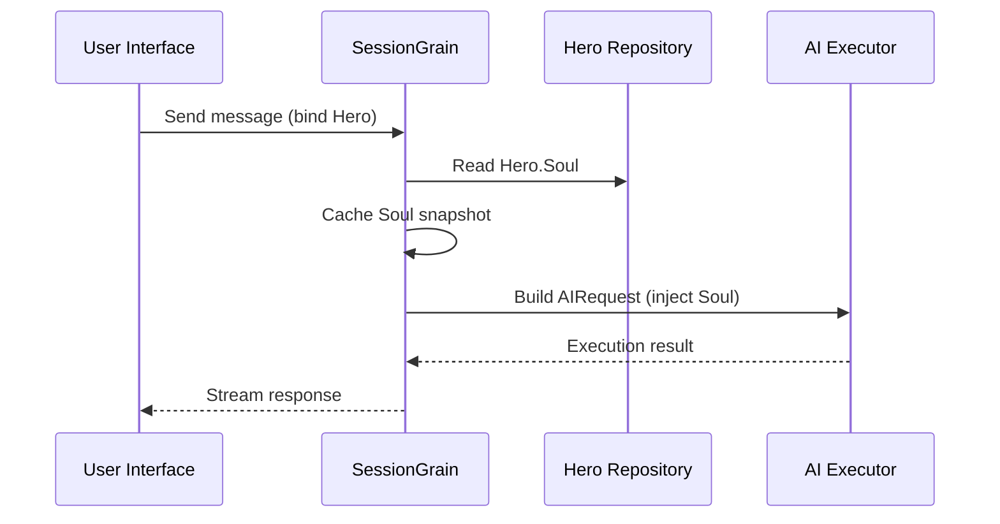

## AI Output Token Optimering: Øvelse i en ultra-minimal klassisk kinesisk tilstand

> I AI-applikationsudvikling påvirker tokenforbrug direkte omkostningerne. I HagiCode-projektet implementerede vi en "ultra-minimal klassisk kinesisk output-tilstand" gennem SOUL-systemet. Uden at ofre informationstætheden reducerer det output-tokens med ca. 30-50 %. Denne artikel deler implementeringsdetaljerne for denne tilgang og de erfaringer, vi har lært ved at bruge den.

## Baggrund

I AI-applikationsudvikling er tokenforbrug et uundgåeligt omkostningsproblem. Dette bliver især smertefuldt i scenarier, hvor AI skal producere store mængder indhold. Hvordan reducerer du output-tokens uden at ofre informationstætheden? Jo mere du tænker over det, jo mere frustrerende kan problemet blive.

Traditionelle optimeringsideer fokuserer for det meste på inputsiden: trimning af systemprompter, komprimering af kontekst eller brug af mere effektiv kodning. Men disse metoder ramte til sidst et loft. Skub komprimeringen for langt, og du begynder at skade AI'ens forståelse og outputkvalitet. Det er dybest set bare at slette indhold, hvilket ikke er særlig meningsfuldt.

Så hvad med udgangssiden? Kunne vi få AI til at udtrykke den samme betydning mere kortfattet?

Spørgsmålet lyder simpelt, men der gemmer sig en del under det. Hvis du direkte beder AI'en om at "være kortfattet", kan det i virkeligheden kun give dig nogle få ord. Hvis du tilføjer "hold oplysningerne fuldstændige", kan det glide tilbage til den oprindelige verbose stil. Begrænsninger, der er for stærke, skader anvendeligheden; begrænsninger, der er for svage, gør ingenting. Hvor er balancepunktet præcist? Ingen kan sige med sikkerhed.

For at løse disse smertepunkter tog vi en dristig beslutning: start fra selve sprogstilen og design et konfigurerbart, komponerbart begrænsningssystem til udtryk. Virkningen af ​​denne beslutning kan være endnu større, end du forventer. Jeg vil snart komme ind i detaljerne, og resultatet kan måske overraske dig lidt.

## Om HagiCode

Den tilgang, der er delt i denne artikel, kommer fra vores praktiske erfaring i [HagiCode](https://hagicode.com) projekt.

HagiCode er en open source AI-kodningsassistent, der understøtter flere AI-modeller og tilpasset konfiguration. Under udviklingen opdagede vi, at brugen af ​​AI-outputtoken var for høj, så vi designede en løsning til det. Hvis du finder denne tilgang værdifuld, siger det sandsynligvis noget godt om vores ingeniørarbejde. Og hvis det er tilfældet, kan HagiCode i sig selv også være din opmærksomhed værd. Koden lyver ikke.

## SOUL System Oversigt

Det fulde navn på SOUL-systemet er Soul Oriented Universal Language. Det er det konfigurationssystem, der bruges i HagiCode-projektet til at definere sprogstilen for en AI Hero. Dens kerneidé er enkel: ved at begrænse, hvordan AI udtrykker sig, kan den udsende indhold i en mere kortfattet sproglig form, samtidig med at den informationsmæssige fuldstændighed bevares.

Det er lidt som at sætte en sproglig maske på AI'en... selvom det ærligt talt ikke er helt så mystisk.

### Teknisk arkitektur

SOUL-systemet bruger en frontend-backend-separeret arkitektur:

**Frontend (Soul Builder)**:
- Bygget med React + TypeScript + Vite
- Beliggende i `repos/soul/` bibliotek
- Giver en visuel sjælebygningsgrænseflade
- Understøtter tosproget brug (zh-CN / en-US)

**Backend**:
- Bygget på .NET (C#) + den distribuerede kørselstid fra Orleans
- Hero-enheden inkluderer en `Soul` felt (maks. 8000 tegn)
- Injicerer sjæl i systemprompten igennem `SessionSystemMessageCompiler`

**Generering af agentskabeloner**:
- Genereret ud fra referencematerialer
- Output til `/agent-templates/soul/templates/` bibliotek
- Indeholder 50 hovedkataloggrupper og 10 ortogonale dimensioner

### Soul Injection Mechanism

Når en session udføres for første gang, læser systemet Heltens sjæl-konfiguration og injicerer den i systemprompten:



Det injicerede systempromptformat er:

```
<hero_soul>
[User-defined Soul content]
</hero_soul>
```

Denne injektionsmekanisme er implementeret i `SessionSystemMessageCompiler.cs`:

```csharp
internal static string? BuildSystemMessage(
    string? existingSystemMessage,
    string? languagePreference,
    IReadOnlyList<HeroTraitDto>? traits,
    string? soul)
{
    var segments = new List<string>();

    // ... language preference and Traits handling ...

    var normalizedSoul = NormalizeSoul(soul);
    if (!string.IsNullOrWhiteSpace(normalizedSoul))
    {
        segments.Add($"<hero_soul>\n{normalizedSoul}\n</hero_soul>");
    }

    // ... other system messages ...

    return segments.Count == 0 ? null : string.Join("\n\n", segments);
}
```

Når du har set koden og forstået princippet, er det virkelig alt, hvad der skal til.

## Ultra-minimal klassisk kinesisk tilstand

Ultra-minimal klassisk kinesisk tilstand er den mest repræsentative token-besparende strategi i SOUL-systemet. Dens kerneprincip er at bruge den høje semantiske tæthed af klassisk kinesisk til at komprimere outputlængden og samtidig bevare fuldstændig information.

### Hvorfor klassisk kinesisk

Klassisk kinesisk har flere naturlige fordele:

1. **Semantisk komprimering**: den samme betydning kan udtrykkes med færre tegn.
2. **Fjernelse af redundans**: Klassisk kinesisk udelader naturligvis mange konjunktioner og partikler, der er almindelige i moderne kinesisk.
3. **Koncis struktur**: hver sætning har høj informationstæthed, hvilket gør den velegnet som et redskab til AI-output.

Her er et konkret eksempel:

Moderne kinesisk output (ca. 80 tegn):
```
Based on your code analysis, I found several issues. First, on line 23, the variable name is too long and should be shortened. Second, on line 45, you did not handle null values and should add conditional logic. Finally, the overall code structure is acceptable, but it can be further optimized.
```

Ultra-minimal klassisk kinesisk output (ca. 35 tegn, sparer 56%):
```
Code reviewed: line 23 variable name verbose, abbreviate; line 45 lacks null handling, add checks. Overall structure acceptable; minor tuning suffices.
```

Kløften er stor nok til at få dig til at stoppe op og tænke.

### Skabelon til sjælskonfiguration

Den komplette Soul-konfiguration for ultra-minimal klassisk kinesisk tilstand er som følger:

```json
{
  "id": "soul-orth-11-classical-chinese-ultra-minimal-mode",
  "name": "Ultra-Minimal Classical Chinese Output Mode",
  "summary": "Use relatively readable Classical Chinese to compress semantic density, convey the meaning with as few words as possible, and retain only conclusions, judgments, and necessary actions, thereby significantly reducing output tokens.",
  "soul": "Your persona core comes from the \"Ultra-Minimal Classical Chinese Output Mode\": use relatively readable Classical Chinese to compress semantic density, convey the meaning with as few words as possible, and retain only conclusions, judgments, and necessary actions, thereby significantly reducing output tokens.\nMaintain the following signature language traits: 1. Prefer concise Classical Chinese sentence patterns such as \"can\", \"should\", \"do not\", \"already\", \"however\", and \"therefore\", while avoiding obscure and difficult wording;\n2. Compress each sentence to 4-12 characters whenever possible, removing preamble, pleasantries, repeated explanation, and ineffective modifiers;\n3. Do not expand arguments unless necessary; if the user does not ask a follow-up, provide only conclusions, steps, or judgments;\n4. Do not alter the core persona of the main Catalog; only compress the expression into restrained, classical, ultra-minimal short sentences."
}
```

Der er flere nøglepunkter i dette skabelondesign:

1. **Tydelige begrænsninger**: 4-12 tegn pr. sætning, fjern redundans, prioriter konklusioner.
2. **Undgå uklarhed**: Brug kortfattede klassiske kinesiske sætningsmønstre og undgå sjældne, vanskelige formuleringer.
3. **Bevar persona**: skift kun udtryksmåden, ikke kernepersonen.

Når du bliver ved med at justere konfigurationen, kommer det hele ned til et par parametre i sidste ende.

### Andre ultra-minimale tilstande

Udover den klassiske kinesiske tilstand giver HagiCode SOUL-systemet også flere andre token-besparende tilstande:

**Telegrafagtig ultra-minimal outputtilstand** (`soul-orth-02`):
- Hold hver sætning inden for 10 tegn
- Forbyd dekorative adjektiver
- Ingen modale partikler, udråbstegn eller reduplicering hele vejen igennem

**Kort fragmenteret mumletilstand** (`soul-orth-01`):
- Hold sætninger inden for 1-5 tegn
- Simuler fragmenteret selvtale
- Svække eksplicit logik og prioriter følelsesmæssig transmission

**Guidet Q&A-tilstand** (`soul-orth-03`):
- Brug spørgsmål til at guide brugerens tænkning
- Reducer direkte outputindhold
- Lavere tokenbrug gennem interaktion

Hver af disse tilstande lægger vægt på en anden designretning, men kernemålet er det samme: reducere output-tokens og samtidig bevare informationskvaliteten. Der er mange veje til Rom; nogle er simpelthen nemmere at gå end andre.

## Kombinationsstrategi

En kraftfuld funktion ved SOUL-systemet er understøttelse af krydskombination af hovedkataloger og ortogonale dimensioner:

- **50 hovedkataloggrupper**: Definer basispersonaen (såsom healingstil, topstudenterstil, afstandtagen stil og så videre)
- **10 ortogonale dimensioner**: Definer udtryksmåden (såsom klassisk kinesisk, telegraf-stil, Q&A-stil, og så videre)
- **Kombinationseffekt**: kan generere 500+ unikke sproglignende kombinationer

For eksempel kan du kombinere "Professional Development Engineer" med "Ultra-Minimal Classical Chinese Output Mode" for at skabe en AI-assistent, der er både professionel og kortfattet. Denne fleksibilitet gør det muligt for SOUL-systemet at tilpasse sig mange forskellige scenarier. Du kan mikse og matche, som du vil; der er flere kombinationer, end du sandsynligvis vil udtømme.

## Praktisk vejledning

### Skab gennem Soul Builder

Besøg [soul.hagicode.com](https://soul.hagicode.com) og følg disse trin:

1. Vælg et hovedkatalog (f.eks. "Professionel udviklingsingeniør")
2. Vælg en ortogonal dimension (f.eks. "Ultra-minimal klassisk kinesisk outputtilstand")
3. Se forhåndsvisning af det genererede sjæleindhold
4. Kopier den genererede Soul-konfiguration

Det er for det meste bare peg-og-klik, så der er nok ikke så meget mere at sige.

### Brug i Hero Configuration

Anvend sjælekonfigurationen på en helt gennem webgrænsefladen eller API:

```typescript
// Hero Soul update example
const heroUpdate = {
  soul: "Your persona core comes from the \"Ultra-Minimal Classical Chinese Output Mode\": ...",
  soulCatalogId: "soul-orth-11-classical-chinese-ultra-minimal-mode",
  soulDisplayName: "Ultra-Minimal Classical Chinese Output Mode",
  soulStyleType: "orthogonal-dimension",
  soulSummary: "Use relatively readable Classical Chinese to compress semantic density..."
};

await updateHero(heroId, heroUpdate);
```

### Brugerdefinerede sjælskabeloner

Brugere kan finjustere en forudindstillet skabelon eller skrive en fra bunden. Her er et brugerdefineret eksempel på et kodegennemgangsscenario:

```
You are a code reviewer who pursues extreme concision.
All output must follow these rules:
1. Only point out specific problems and line numbers
2. Each issue must not exceed 15 characters
3. Use concise terms such as "should", "must", and "do not"
4. Do not provide extra explanation

Example output:
- Line 23: variable name too long, should abbreviate
- Line 45: null not handled, must add checks
- Line 67: logic redundant, can simplify
```

Du kan revidere skabelonen, som du vil. En skabelon er alligevel kun et udgangspunkt.

### Noter

**Kompatibilitet**:
- Klassisk kinesisk tilstand fungerer med alle 50 hovedkataloggrupper
- Kan kombineres med enhver basepersona
- Ændrer ikke kernepersonen i hovedkataloget

**Caching-mekanisme**:
- Sjælen er cache, når sessionen udføres for første gang
- Cachen genbruges inden for samme SessionId
- Ændring af Hero-konfigurationen påvirker ikke sessioner, der allerede er startet

**Begrænsninger og grænser**:
- Den maksimale længde af Soul-feltet er 8000 tegn
- Helte uden et sjælefelt i historiske data kan stadig bruges normalt
- Soul- og stiludstyrspladser er uafhængige og overskriver ikke hinanden

## Effekt sammenligning

Ifølge reelle testdata fra projektet er resultaterne efter aktivering af ultra-minimal klassisk kinesisk tilstand som følger:

| Scenarie | Originale output-tokens | Klassisk kinesisk tilstand | Besparelser |
|------|------------------------|------------------------|---------|
| Kodegennemgang | 850 | 420 | 51% |
| Teknisk Q&A | 620 | 380 | 39% |
| Løsningsforslag | 1100 | 680 | 38% |
| Gennemsnit | - | - | 30-50% |

Dataene kommer fra faktiske brugsstatistikker i HagiCode-projektet, og de nøjagtige resultater varierer fra scenarie. Alligevel stiger de gemte tokens, og din tegnebog vil sætte pris på det.

## Konklusion

HagiCode SOUL-systemet tilbyder en innovativ måde at optimere AI-output på: reducere token-forbrug ved at begrænse udtryk i stedet for at komprimere selve informationen. Som sin mest repræsentative tilgang har den ultra-minimale klassiske kinesiske tilstand leveret 30-50 % tokenbesparelser ved brug i den virkelige verden.

Kerneværdien af denne tilgang ligger i følgende:

1. **Bevar informationskvaliteten**: I stedet for blot at afkorte output, udtrykker det det samme indhold mere effektivt.
2. **Fleksibel og komponerbar**: understøtter 500+ kombinationer af personas og udtryksstile.
3. **Nem at bruge**: Soul Builder giver en visuel grænseflade, så ingen kodning er påkrævet.
4. **Produktionskvalitetsstabilitet**: valideret i projektet og i stand til anvendelse i stor skala.

Hvis du også bygger AI-applikationer, eller hvis du er interesseret i HagiCode-projektet, er du velkommen til at kontakte os. Betydningen af ​​open source ligger i at gøre fremskridt sammen, og vi ser også frem til at se dine egne innovative anvendelser. Ordsproget kan være gammelt, men det forbliver sandt: én person kan gå hurtigt, men en gruppe går længere.

## Referencer

- HagiCode GitHub: [github.com/HagiCode-org/site](https://github.com/HagiCode-org/site)
- HagiCode officielle hjemmeside: [hagicode.com](https://hagicode.com)
- Sjælebygger: [soul.hagicode.com](https://soul.hagicode.com)
- Docker-implementeringsvejledning: [docs.hagicode.com/installation/docker-compose](https://docs.hagicode.com/installation/docker-compose)
- Desktop app: [hagicode.com/desktop/](https://hagicode.com/desktop/)
- 30-minutters hands-on demo: [www.bilibili.com/video/BV1pirZBuEzq/](https://www.bilibili.com/video/BV1pirZBuEzq/)

---

Hvis denne artikel hjalp dig:
- Giv os en stjerne på GitHub: [github.com/HagiCode-org/site](https://github.com/HagiCode-org/site)
- Besøg det officielle websted for at lære mere: [hagicode.com](https://hagicode.com)
- Den offentlige beta er startet, og du er velkommen til at installere og prøve den

## Ophavsretsmeddelelse

Tak fordi du læste med. Hvis du fandt denne artikel nyttig, er du velkommen til at like, bogmærke og dele den.
Dette indhold blev skabt med AI-assisteret samarbejde, og den endelige version blev gennemgået og bekræftet af forfatteren.
- Forfatter: [newbe36524](https://www.newbe.pro)
- Original artikellink: [https://docs.hagicode.com/blog/2026-04-04-soul-token-optimization-classical-chinese/](https://docs.hagicode.com/blog/2026-04-04-soul-token-optimization-classical-chinese/)
- Ophavsretsmeddelelse: Medmindre andet er angivet, er alle artikler på denne blog licenseret under BY-NC-SA. Angiv venligst kilden, når du genposter.
