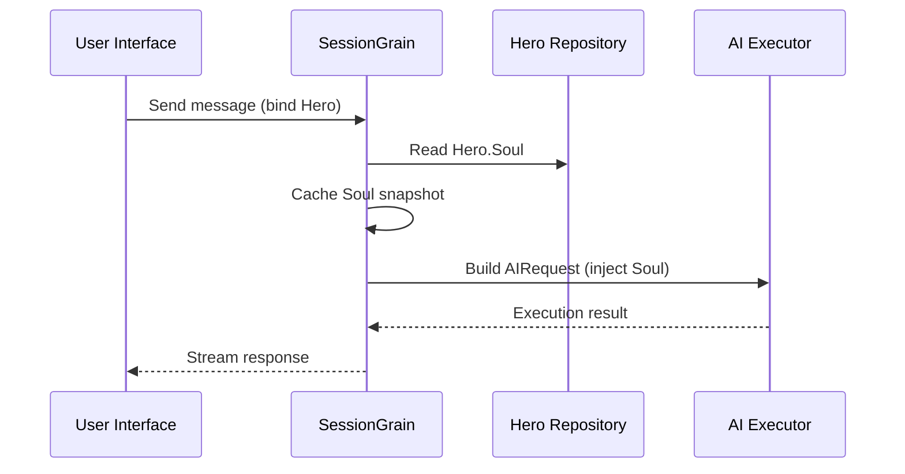

## Βελτιστοποίηση διακριτικού εξόδου AI: Εξάσκηση μιας εξαιρετικά ελάχιστης κλασικής κινεζικής λειτουργίας

> Στην ανάπτυξη εφαρμογών τεχνητής νοημοσύνης, η κατανάλωση διακριτικών επηρεάζει άμεσα το κόστος. Στο έργο HagiCode, εφαρμόσαμε μια "εξαιρετικά ελάχιστη λειτουργία εξόδου κλασικής κινεζικής" μέσω του συστήματος SOUL. Χωρίς να θυσιάζεται η πυκνότητα πληροφοριών, μειώνει τα διακριτικά εξόδου κατά περίπου 30-50%. Αυτό το άρθρο μοιράζεται τις λεπτομέρειες εφαρμογής αυτής της προσέγγισης και τα μαθήματα που μάθαμε χρησιμοποιώντας αυτήν.

## φόντο

Στην ανάπτυξη εφαρμογών τεχνητής νοημοσύνης, η κατανάλωση διακριτικών είναι ένα αναπόφευκτο ζήτημα κόστους. Αυτό γίνεται ιδιαίτερα επώδυνο σε σενάρια όπου το AI χρειάζεται να παράγει μεγάλες ποσότητες περιεχομένου. Πώς μειώνετε τα διακριτικά εξόδου χωρίς να θυσιάζετε την πυκνότητα πληροφοριών; Όσο περισσότερο το σκέφτεστε, τόσο πιο απογοητευτικό μπορεί να γίνει το πρόβλημα.

Οι παραδοσιακές ιδέες βελτιστοποίησης επικεντρώνονται κυρίως στην πλευρά εισόδου: περικοπή των μηνυμάτων συστήματος, συμπίεση περιβάλλοντος ή χρήση πιο αποτελεσματικής κωδικοποίησης. Αλλά αυτές οι μέθοδοι τελικά έφτασαν στο ταβάνι. Σπρώξτε τη συμπίεση πολύ μακριά και θα αρχίσετε να βλάπτετε την κατανόηση και την ποιότητα εξόδου του AI. Αυτό ουσιαστικά είναι απλώς η διαγραφή περιεχομένου, κάτι που δεν έχει πολύ νόημα.

Τι γίνεται λοιπόν με την πλευρά εξόδου; Θα μπορούσαμε να κάνουμε το AI να εκφράσει το ίδιο νόημα πιο συνοπτικά;

Η ερώτηση ακούγεται απλή, αλλά κρύβεται αρκετά από κάτω της. Εάν ζητήσετε απευθείας από την τεχνητή νοημοσύνη να είναι "συνοπτική", μπορεί πραγματικά να σας δώσει μόνο λίγες λέξεις. Εάν προσθέσετε "Διατήρηση των πληροφοριών πλήρεις", ενδέχεται να επιστρέψει στο αρχικό περίπλοκο στυλ. Οι πολύ ισχυροί περιορισμοί βλάπτουν τη χρηστικότητα. Οι περιορισμοί που είναι πολύ αδύναμοι δεν κάνουν τίποτα. Πού ακριβώς είναι το σημείο ισορροπίας; Κανείς δεν μπορεί να πει με σιγουριά.

Για να λύσουμε αυτά τα σημεία πόνου, λάβαμε μια τολμηρή απόφαση: ξεκινήστε από το ίδιο το γλωσσικό στυλ και σχεδιάστε ένα διαμορφώσιμο, συνθετικό σύστημα περιορισμών για έκφραση. Ο αντίκτυπος αυτής της απόφασης μπορεί να είναι ακόμη μεγαλύτερος από ό,τι περιμένετε. Θα μπω σε λεπτομέρειες σύντομα και το αποτέλεσμα μπορεί να σας εκπλήξει λίγο.

## Σχετικά με το HagiCode

Η προσέγγιση που κοινοποιείται σε αυτό το άρθρο προέρχεται από την πρακτική εμπειρία μας στο [HagiCode](https://hagicode.com) έργο.

Το HagiCode είναι ένας βοηθός κωδικοποίησης AI ανοιχτού κώδικα που υποστηρίζει πολλαπλά μοντέλα τεχνητής νοημοσύνης και προσαρμοσμένη διαμόρφωση. Κατά τη διάρκεια της ανάπτυξης, ανακαλύψαμε ότι η χρήση διακριτικού εξόδου AI ήταν πολύ υψηλή, επομένως σχεδιάσαμε μια λύση για αυτό. Εάν βρίσκετε αυτή την προσέγγιση πολύτιμη, αυτό μάλλον λέει κάτι καλό για το μηχανολογικό μας έργο. Και αν συμβαίνει αυτό, το ίδιο το HagiCode μπορεί επίσης να αξίζει την προσοχή σας. Ο κώδικας δεν λέει ψέματα.

## Επισκόπηση συστήματος SOUL

Το πλήρες όνομα του συστήματος SOUL είναι Soul Oriented Universal Language. Είναι το σύστημα διαμόρφωσης που χρησιμοποιείται στο έργο HagiCode για τον καθορισμό του στυλ γλώσσας ενός Ήρωα AI. Η βασική του ιδέα είναι απλή: περιορίζοντας τον τρόπο με τον οποίο εκφράζεται η τεχνητή νοημοσύνη, μπορεί να παράγει περιεχόμενο σε μια πιο συνοπτική γλωσσική μορφή, διατηρώντας παράλληλα την πληρότητα των πληροφοριών.

Είναι λίγο σαν να βάζεις μια γλωσσική μάσκα στο AI... αν και ειλικρινά, δεν είναι και τόσο μυστικιστικό.

### Τεχνική Αρχιτεκτονική

Το σύστημα SOUL χρησιμοποιεί μια αρχιτεκτονική διαχωρισμένη από το frontend-backend:

**Frontend (Soul Builder)**:
- Δημιουργήθηκε με React + TypeScript + Vite
- Βρίσκεται στο `repos/soul/` καταλόγου
- Παρέχει μια οπτική διεπαφή κτιρίου Soul
- Υποστηρίζει δίγλωσση χρήση (zh-CN / en-US)

**Υποστήριξη**:
- Ενσωματωμένο σε .NET (C#) + τον κατανεμημένο χρόνο εκτέλεσης της Ορλεάνης
- Η οντότητα Ήρωας περιλαμβάνει α `Soul` πεδίο (μέγιστο 8000 χαρακτήρες)
- Εισάγει την ψυχή στο σύστημα μέσω της προτροπής `SessionSystemMessageCompiler`

**Γενιά προτύπων πράκτορα**:
- Παράγεται από υλικά αναφοράς
- Έξοδος στο `/agent-templates/soul/templates/` καταλόγου
- Περιλαμβάνει 50 κύριες ομάδες καταλόγου και 10 ορθογώνιες διαστάσεις

### Μηχανισμός Έγχυσης Ψυχής

Όταν μια περίοδος λειτουργίας εκτελείται για πρώτη φορά, το σύστημα διαβάζει τη διαμόρφωση του Hero's Soul και την εισάγει στη γραμμή εντολών συστήματος:



Η μορφή εντολών του συστήματος έγχυσης είναι:

```
<hero_soul>
[User-defined Soul content]
</hero_soul>
```

Αυτός ο μηχανισμός έγχυσης εφαρμόζεται σε `SessionSystemMessageCompiler.cs`:

```csharp
internal static string? BuildSystemMessage(
    string? existingSystemMessage,
    string? languagePreference,
    IReadOnlyList<HeroTraitDto>? traits,
    string? soul)
{
    var segments = new List<string>();

    // ... language preference and Traits handling ...

    var normalizedSoul = NormalizeSoul(soul);
    if (!string.IsNullOrWhiteSpace(normalizedSoul))
    {
        segments.Add($"<hero_soul>\n{normalizedSoul}\n</hero_soul>");
    }

    // ... other system messages ...

    return segments.Count == 0 ? null : string.Join("\n\n", segments);
}
```

Μόλις δείτε τον κώδικα και κατανοήσετε την αρχή, αυτό είναι πραγματικά το μόνο που υπάρχει.

## Εξαιρετικά ελάχιστη κλασική κινεζική λειτουργία

Η εξαιρετικά ελάχιστη λειτουργία Κλασικών Κινέζων είναι η πιο αντιπροσωπευτική στρατηγική εξοικονόμησης διακριτικών στο σύστημα SOUL. Η βασική του αρχή είναι να χρησιμοποιεί την υψηλή σημασιολογική πυκνότητα των κλασικών κινεζικών για τη συμπίεση του μήκους εξόδου διατηρώντας παράλληλα πλήρεις πληροφορίες.

### Γιατί κλασικά κινέζικα

Τα κλασικά κινέζικα έχουν πολλά φυσικά πλεονεκτήματα:

1. **Σημασιολογική συμπίεση**: το ίδιο νόημα μπορεί να εκφραστεί με λιγότερους χαρακτήρες.
2. **Αφαίρεση πλεονασμού**: Η κλασική κινεζική φυσικά παραλείπει πολλούς συνδέσμους και σωματίδια που είναι κοινά στα σύγχρονα κινέζικα.
3. **Συνοπτική δομή**: κάθε πρόταση περιέχει υψηλή πυκνότητα πληροφοριών, καθιστώντας την κατάλληλη ως όχημα για έξοδο AI.

Εδώ είναι ένα συγκεκριμένο παράδειγμα:

Σύγχρονη κινεζική έξοδος (περίπου 80 χαρακτήρες):
```
Based on your code analysis, I found several issues. First, on line 23, the variable name is too long and should be shortened. Second, on line 45, you did not handle null values and should add conditional logic. Finally, the overall code structure is acceptable, but it can be further optimized.
```

Εξαιρετικά ελάχιστη κλασική κινεζική έξοδος (περίπου 35 χαρακτήρες, εξοικονόμηση 56%):
```
Code reviewed: line 23 variable name verbose, abbreviate; line 45 lacks null handling, add checks. Overall structure acceptable; minor tuning suffices.
```

Το κενό είναι αρκετά μεγάλο για να σε κάνει να σταματήσεις και να σκεφτείς.

### Πρότυπο διαμόρφωσης ψυχής

Η πλήρης διαμόρφωση Soul για εξαιρετικά ελάχιστη λειτουργία Κλασικών Κινέζων είναι η εξής:

```json
{
  "id": "soul-orth-11-classical-chinese-ultra-minimal-mode",
  "name": "Ultra-Minimal Classical Chinese Output Mode",
  "summary": "Use relatively readable Classical Chinese to compress semantic density, convey the meaning with as few words as possible, and retain only conclusions, judgments, and necessary actions, thereby significantly reducing output tokens.",
  "soul": "Your persona core comes from the \"Ultra-Minimal Classical Chinese Output Mode\": use relatively readable Classical Chinese to compress semantic density, convey the meaning with as few words as possible, and retain only conclusions, judgments, and necessary actions, thereby significantly reducing output tokens.\nMaintain the following signature language traits: 1. Prefer concise Classical Chinese sentence patterns such as \"can\", \"should\", \"do not\", \"already\", \"however\", and \"therefore\", while avoiding obscure and difficult wording;\n2. Compress each sentence to 4-12 characters whenever possible, removing preamble, pleasantries, repeated explanation, and ineffective modifiers;\n3. Do not expand arguments unless necessary; if the user does not ask a follow-up, provide only conclusions, steps, or judgments;\n4. Do not alter the core persona of the main Catalog; only compress the expression into restrained, classical, ultra-minimal short sentences."
}
```

Υπάρχουν πολλά βασικά σημεία σε αυτό το σχέδιο προτύπου:

1. **Διαγραφή περιορισμών**: 4-12 χαρακτήρες ανά πρόταση, αφαίρεση πλεονασμού, ιεράρχηση συμπερασμάτων.
2. **Αποφύγετε την αφάνεια**: χρησιμοποιήστε συνοπτικά κλασικά κινεζικά μοτίβα προτάσεων και αποφύγετε τη σπάνια, δύσκολη διατύπωση.
3. **Διατήρηση της περσόνας**: αλλάξτε μόνο τον τρόπο έκφρασης, όχι τη βασική περσόνα.

Όταν συνεχίζετε να προσαρμόζετε τη διαμόρφωση, όλα καταλήγουν σε μερικές παραμέτρους στο τέλος.

### Άλλες εξαιρετικά ελάχιστες λειτουργίες

Εκτός από την κλασική κινεζική λειτουργία, το σύστημα HagiCode SOUL παρέχει επίσης πολλές άλλες λειτουργίες εξοικονόμησης διακριτικών:

**Λειτουργία εξαιρετικά ελάχιστης εξόδου σε στυλ τηλέγραφου** (`soul-orth-02`):
- Κρατήστε κάθε πρόταση αυστηρά εντός 10 χαρακτήρων
- Απαγόρευσε τα διακοσμητικά επίθετα
- Χωρίς τροπικά σωματίδια, θαυμαστικά ή αναδιπλασιασμό παντού

**Σύντομη κατακερματισμένη λειτουργία μουρμουρίσματος** (`soul-orth-01`):
- Κρατήστε τις προτάσεις εντός 1-5 χαρακτήρων
- Προσομοίωση κατακερματισμένης αυτοομιλίας
- Αποδυναμώστε τη ρητή λογική και δώστε προτεραιότητα στη συναισθηματική μετάδοση

**Καθοδηγούμενη λειτουργία Q&A** (`soul-orth-03`):
- Χρησιμοποιήστε ερωτήσεις για να καθοδηγήσετε τη σκέψη του χρήστη
- Μειώστε το περιεχόμενο άμεσης εξόδου
- Μειώστε τη χρήση διακριτικών μέσω της αλληλεπίδρασης

Κάθε μία από αυτές τις λειτουργίες δίνει έμφαση σε μια διαφορετική κατεύθυνση σχεδίασης, αλλά ο βασικός στόχος είναι ο ίδιος: μείωση των διακριτικών εξόδου διατηρώντας παράλληλα την ποιότητα των πληροφοριών. Υπάρχουν πολλοί δρόμοι προς τη Ρώμη. μερικά είναι απλά πιο εύκολα στο περπάτημα από άλλα.

## Συνδυαστική Στρατηγική

Ένα ισχυρό χαρακτηριστικό του συστήματος SOUL είναι η υποστήριξη για διασταυρούμενο συνδυασμό κύριων καταλόγων και ορθογώνιων διαστάσεων:

- **50 κύριες ομάδες καταλόγου**: ορίστε τη βασική προσωπικότητα (όπως στυλ θεραπείας, στυλ κορυφαίων μαθητών, στυλ απόμακρου κ.λπ.)
- **10 ορθογώνιες διαστάσεις**: ορίστε τον τρόπο έκφρασης (όπως κλασικά κινέζικα, τηλεγραφικό στυλ, στυλ Q&A κ.λπ.)
- **Εφέ συνδυασμού**: μπορεί να δημιουργήσει 500+ μοναδικούς συνδυασμούς σε στυλ γλώσσας

Για παράδειγμα, μπορείτε να συνδυάσετε το "Professional Development Engineer" με το "Ultra-Minimal Classical Chinese Output Mode" για να δημιουργήσετε έναν βοηθό τεχνητής νοημοσύνης που είναι τόσο επαγγελματικός όσο και συνοπτικός. Αυτή η ευελιξία επιτρέπει στο σύστημα SOUL να προσαρμόζεται σε πολλά διαφορετικά σενάρια. Μπορείτε να αναμίξετε και να ταιριάξετε όπως θέλετε. υπάρχουν περισσότεροι συνδυασμοί από αυτούς που είναι πιθανό να εξαντλήσετε.

## Πρακτικός Οδηγός

### Create Through Soul Builder

Επίσκεψη [soul.hagicode.com](https://soul.hagicode.com) και ακολουθήστε αυτά τα βήματα:

1. Επιλέξτε έναν κύριο Κατάλογο (για παράδειγμα, "Μηχανικός Επαγγελματικής Ανάπτυξης")
2. Επιλέξτε μια ορθογώνια διάσταση (για παράδειγμα, "Υπερελάχιστη λειτουργία κλασικής κινεζικής εξόδου")
3. Προεπισκόπηση του δημιουργημένου περιεχομένου Soul
4. Αντιγράψτε τη διαμόρφωση Soul που δημιουργήθηκε

Είναι κυρίως απλώς point-and-click, οπότε μάλλον δεν υπάρχουν πολλά περισσότερα να πούμε.

### Χρήση στη διαμόρφωση Hero

Εφαρμόστε τη διαμόρφωση Soul σε έναν Ήρωα μέσω της διεπαφής ιστού ή του API:

```typescript
// Hero Soul update example
const heroUpdate = {
  soul: "Your persona core comes from the \"Ultra-Minimal Classical Chinese Output Mode\": ...",
  soulCatalogId: "soul-orth-11-classical-chinese-ultra-minimal-mode",
  soulDisplayName: "Ultra-Minimal Classical Chinese Output Mode",
  soulStyleType: "orthogonal-dimension",
  soulSummary: "Use relatively readable Classical Chinese to compress semantic density..."
};

await updateHero(heroId, heroUpdate);
```

### Προσαρμοσμένα πρότυπα ψυχής

Οι χρήστες μπορούν να ρυθμίσουν με ακρίβεια ένα προκαθορισμένο πρότυπο ή να γράψουν ένα από την αρχή. Ακολουθεί ένα προσαρμοσμένο παράδειγμα για ένα σενάριο ελέγχου κώδικα:

```
You are a code reviewer who pursues extreme concision.
All output must follow these rules:
1. Only point out specific problems and line numbers
2. Each issue must not exceed 15 characters
3. Use concise terms such as "should", "must", and "do not"
4. Do not provide extra explanation

Example output:
- Line 23: variable name too long, should abbreviate
- Line 45: null not handled, must add checks
- Line 67: logic redundant, can simplify
```

Μπορείτε να αναθεωρήσετε το πρότυπο όπως θέλετε. Ένα πρότυπο είναι ούτως ή άλλως μόνο ένα σημείο εκκίνησης.

### Σημειώσεις

**Συμβατότητα**:
- Η κλασική κινεζική λειτουργία λειτουργεί και με τις 50 κύριες ομάδες καταλόγου
- Μπορεί να συνδυαστεί με οποιαδήποτε βασική προσωπικότητα
- Δεν αλλάζει το βασικό πρόσωπο του κύριου Καταλόγου

**Μηχανισμός προσωρινής αποθήκευσης**:
- Η ψυχή αποθηκεύεται στην κρυφή μνήμη όταν η περίοδος λειτουργίας εκτελείται για πρώτη φορά
- Η κρυφή μνήμη χρησιμοποιείται ξανά στο ίδιο SessionId
- Η τροποποίηση της διαμόρφωσης Hero δεν επηρεάζει τις περιόδους σύνδεσης που έχουν ήδη ξεκινήσει

**Περιορισμοί και όρια**:
- Το μέγιστο μήκος του πεδίου Ψυχή είναι 8000 χαρακτήρες
- Οι ήρωες χωρίς πεδίο ψυχής στα ιστορικά δεδομένα μπορούν ακόμα να χρησιμοποιηθούν κανονικά
- Οι υποδοχές εξοπλισμού ψυχής και στυλ είναι ανεξάρτητες και δεν αντικαθιστούν η μία την άλλη

## Σύγκριση εφέ

Σύμφωνα με πραγματικά δεδομένα δοκιμών από το έργο, τα αποτελέσματα μετά την ενεργοποίηση της εξαιρετικά ελάχιστης κλασικής κινεζικής λειτουργίας είναι τα εξής:

| Σενάριο | Αρχικά κουπόνια εξόδου | Κλασική κινεζική λειτουργία | Αποταμιεύσεις |
|------|------------------------|------------------------|---------|
| Αναθεώρηση κώδικα | 850 | 420 | 51% |
| Τεχνικές Ερωτήσεις & Απαντήσεις | 620 | 380 | 39% |
| Προτάσεις λύσεων | 1100 | 680 | 38% |
| Μέσος όρος | - | - | 30-50% |

Τα δεδομένα προέρχονται από πραγματικές στατιστικές χρήσης στο έργο HagiCode και τα ακριβή αποτελέσματα διαφέρουν ανάλογα με το σενάριο. Ωστόσο, τα αποθηκευμένα token προστίθενται και το πορτοφόλι σας θα το εκτιμήσει.

## Συμπέρασμα

Το σύστημα HagiCode SOUL προσφέρει έναν καινοτόμο τρόπο βελτιστοποίησης της παραγωγής AI: μειώστε την κατανάλωση διακριτικών περιορίζοντας την έκφραση αντί να συμπιέζετε τις ίδιες τις πληροφορίες. Ως η πιο αντιπροσωπευτική προσέγγισή της, η εξαιρετικά ελάχιστη λειτουργία Κλασικών Κινέζων έχει προσφέρει 30-50% εξοικονόμηση συμβολικών στην πραγματική χρήση.

Η βασική αξία αυτής της προσέγγισης έγκειται στα εξής:

1. **Διατήρηση της ποιότητας πληροφοριών**: αντί να περικόπτει απλώς την έξοδο, εκφράζει το ίδιο περιεχόμενο πιο αποτελεσματικά.
2. **Εύκαμπτο και συνθέσιμο**: υποστηρίζει 500+ συνδυασμούς περσόνων και στυλ έκφρασης.
3. **Εύκολο στη χρήση**: Το Soul Builder παρέχει μια οπτική διεπαφή, επομένως δεν απαιτείται κωδικοποίηση.
4. **Σταθερότητα ποιότητας παραγωγής**: επικυρωμένη στο έργο και δυνατότητα χρήσης μεγάλης κλίμακας.

Εάν κατασκευάζετε επίσης εφαρμογές τεχνητής νοημοσύνης ή εάν ενδιαφέρεστε για το έργο HagiCode, μη διστάσετε να απευθυνθείτε. Το νόημα του ανοιχτού κώδικα έγκειται στο να προχωρήσουμε μαζί, και επίσης ανυπομονούμε να δούμε τις δικές σας καινοτόμες χρήσεις. Το ρητό μπορεί να είναι παλιό, αλλά παραμένει αληθινό: ένα άτομο μπορεί να πάει γρήγορα, αλλά μια ομάδα πάει πιο μακριά.

## Αναφορές

- HagiCode GitHub: [github.com/HagiCode-org/site](https://github.com/HagiCode-org/site)
- Επίσημος ιστότοπος HagiCode: [hagicode.com](https://hagicode.com)
- Soul Builder: [soul.hagicode.com](https://soul.hagicode.com)
- Οδηγός ανάπτυξης Docker: [docs.hagicode.com/installation/docker-compose](https://docs.hagicode.com/installation/docker-compose)
- Εφαρμογή επιφάνειας εργασίας: [hagicode.com/desktop/](https://hagicode.com/desktop/)
- Πρόχειρη επίδειξη διάρκειας 30 λεπτών: [www.bilibili.com/video/BV1pirZBuEzq/](https://www.bilibili.com/video/BV1pirZBuEzq/)

---

Εάν αυτό το άρθρο σας βοήθησε:
- Δώστε μας ένα αστέρι στο GitHub: [github.com/HagiCode-org/site](https://github.com/HagiCode-org/site)
- Επισκεφτείτε τον επίσημο ιστότοπο για να μάθετε περισσότερα: [hagicode.com](https://hagicode.com)
- Η δημόσια beta ξεκίνησε και μπορείτε να την εγκαταστήσετε και να τη δοκιμάσετε

## Σημείωση πνευματικών δικαιωμάτων

Σας ευχαριστώ που διαβάσατε. Εάν βρήκατε αυτό το άρθρο χρήσιμο, μπορείτε να κάνετε like, σελιδοδείκτη και κοινή χρήση.
Αυτό το περιεχόμενο δημιουργήθηκε με συνεργασία με τη βοήθεια AI και η τελική έκδοση εξετάστηκε και επιβεβαιώθηκε από τον συγγραφέα.
- Συγγραφέας: [newbe36524](https://www.newbe.pro)
- Σύνδεσμος αρχικού άρθρου: [https://docs.hagicode.com/blog/2026-04-04-soul-token-optimization-classical-chinese/](https://docs.hagicode.com/blog/2026-04-04-soul-token-optimization-classical-chinese/)
- Σημείωση περί πνευματικών δικαιωμάτων: Εκτός εάν αναφέρεται διαφορετικά, όλα τα άρθρα σε αυτό το ιστολόγιο έχουν άδεια χρήσης σύμφωνα με την BY-NC-SA. Παρακαλούμε αναφέρετε την πηγή κατά την αναδημοσίευση.
