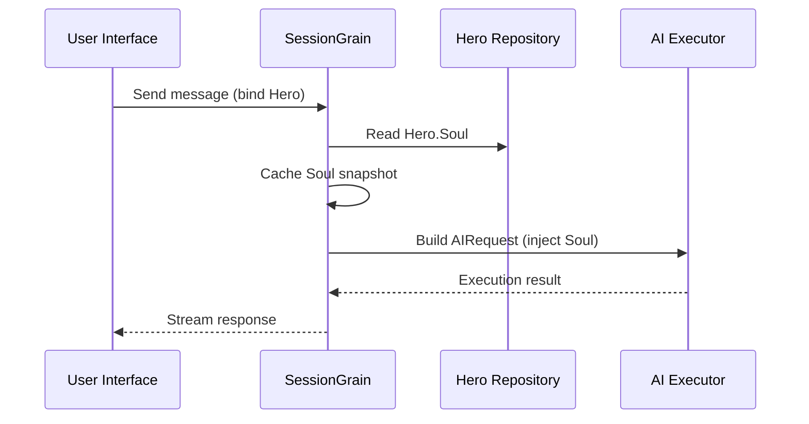

## Optimización de tokens de salida de IA: práctica de un modo chino clásico ultra mínimo

> En el desarrollo de aplicaciones de IA, el consumo de tokens afecta directamente al costo. En el proyecto HagiCode, implementamos un "modo de salida de chino clásico ultra mínimo" a través del sistema SOUL. Sin sacrificar la densidad de la información, reduce los tokens de salida entre un 30% y un 50% aproximadamente. Este artículo comparte los detalles de implementación de ese enfoque y las lecciones que aprendimos al usarlo.

## Antecedentes

En el desarrollo de aplicaciones de IA, el consumo de tokens es una cuestión de costos inevitable. Esto resulta especialmente doloroso en escenarios en los que la IA necesita producir grandes cantidades de contenido. ¿Cómo se reducen los tokens de salida sin sacrificar la densidad de la información? Cuanto más lo piensas, más frustrante puede resultar el problema.

Las ideas de optimización tradicionales se centran principalmente en el lado de la entrada: recortar las indicaciones del sistema, comprimir el contexto o utilizar una codificación más eficiente. Pero estos métodos eventualmente alcanzaron un techo. Si lleva la compresión demasiado lejos, comenzará a dañar la comprensión y la calidad de salida de la IA. Básicamente se trata de eliminar contenido, lo cual no tiene mucho sentido.

Entonces, ¿qué pasa con el lado de salida? ¿Podríamos conseguir que la IA exprese el mismo significado de forma más concisa?

La pregunta parece simple, pero hay muchas cosas escondidas debajo de ella. Si le pides directamente a la IA que "sea concisa", es posible que en realidad solo te dé unas pocas palabras. Si agrega "mantener la información completa", es posible que vuelva al estilo detallado original. Las restricciones demasiado fuertes perjudican la usabilidad; las restricciones que son demasiado débiles no hacen nada. ¿Dónde está exactamente el punto de equilibrio? Nadie puede decirlo con seguridad.

Para resolver estos puntos débiles, tomamos una decisión audaz: comenzar desde el estilo del lenguaje en sí y diseñar un sistema de restricciones configurable y componible para la expresión. El impacto de esa decisión puede ser incluso mayor de lo esperado. Entraré en detalles en breve y el resultado puede sorprenderte un poco.

## Acerca de HagiCode

El enfoque compartido en este artículo proviene de nuestra experiencia práctica en el [HagiCode](https://hagicode.com) proyecto.

HagiCode es un asistente de codificación de IA de código abierto que admite múltiples modelos de IA y configuraciones personalizadas. Durante el desarrollo, descubrimos que el uso de tokens de salida de IA era demasiado alto, por lo que diseñamos una solución para ello. Si este enfoque le resulta valioso, probablemente diga algo bueno sobre nuestro trabajo de ingeniería. Y si ese es el caso, el propio HagiCode también puede merecer su atención. El código no miente.

## Descripción general del sistema ALMA

El nombre completo del sistema ALMA es Lenguaje Universal Orientado al Alma. Es el sistema de configuración utilizado en el proyecto HagiCode para definir el estilo de lenguaje de un AI Hero. Su idea central es simple: al restringir la forma en que la IA se expresa, puede generar contenido en una forma lingüística más concisa y al mismo tiempo preservar la integridad de la información.

Es un poco como ponerle una máscara lingüística a la IA... aunque, sinceramente, no es tan místico.

### Arquitectura Técnica

El sistema SOUL utiliza una arquitectura separada frontend-backend:

**Frontend (Constructor de almas)**:
- Construido con React + TypeScript + Vite
- Ubicado en el `repos/soul/` directorio
- Proporciona una interfaz visual de construcción del alma.
- Admite uso bilingüe (zh-CN / en-US)

**Servicio de fondo**:
- Construido sobre .NET (C#) + el tiempo de ejecución distribuido Orleans
- La entidad Hero incluye un `Soul` campo (máximo 8000 caracteres)
- Inyecta Soul en el indicador del sistema a través de `SessionSystemMessageCompiler`

**Generación de plantillas de agentes**:
- Generado a partir de materiales de referencia.
- Salida al `/agent-templates/soul/templates/` directorio
- Incluye 50 grupos de catálogo principales y 10 dimensiones ortogonales.

### Mecanismo de inyección de alma

Cuando una sesión se ejecuta por primera vez, el sistema lee la configuración de Hero's Soul y la inyecta en el indicador del sistema:



El formato del mensaje del sistema inyectado es:

```
<hero_soul>
[User-defined Soul content]
</hero_soul>
```

Este mecanismo de inyección se implementa en `SessionSystemMessageCompiler.cs`:

```csharp
internal static string? BuildSystemMessage(
    string? existingSystemMessage,
    string? languagePreference,
    IReadOnlyList<HeroTraitDto>? traits,
    string? soul)
{
    var segments = new List<string>();

    // ... language preference and Traits handling ...

    var normalizedSoul = NormalizeSoul(soul);
    if (!string.IsNullOrWhiteSpace(normalizedSoul))
    {
        segments.Add($"<hero_soul>\n{normalizedSoul}\n</hero_soul>");
    }

    // ... other system messages ...

    return segments.Count == 0 ? null : string.Join("\n\n", segments);
}
```

Una vez que haya visto el código y comprendido el principio, eso es todo lo que hay que hacer.

## Modo chino clásico ultra minimalista

El modo chino clásico ultramínimo es la estrategia de ahorro de tokens más representativa del sistema SOUL. Su principio básico es utilizar la alta densidad semántica del chino clásico para comprimir la longitud de la salida preservando al mismo tiempo la información completa.

### Por qué el chino clásico

El chino clásico tiene varias ventajas naturales:

1. **Compresión semántica**: el mismo significado se puede expresar con menos caracteres.
2. **Eliminación de redundancia**: el chino clásico omite naturalmente muchas conjunciones y partículas comunes en el chino moderno.
3. **Estructura concisa**: cada oración conlleva una alta densidad de información, lo que la hace muy adecuada como vehículo para la producción de IA.

He aquí un ejemplo concreto:

Salida china moderna (alrededor de 80 caracteres):
```
Based on your code analysis, I found several issues. First, on line 23, the variable name is too long and should be shortened. Second, on line 45, you did not handle null values and should add conditional logic. Finally, the overall code structure is acceptable, but it can be further optimized.
```

Producción de chino clásico ultra mínima (alrededor de 35 caracteres, ahorro del 56%):
```
Code reviewed: line 23 variable name verbose, abbreviate; line 45 lacks null handling, add checks. Overall structure acceptable; minor tuning suffices.
```

La brecha es lo suficientemente grande como para hacerte detenerte y pensar.

### Plantilla de configuración del alma

La configuración completa de Soul para el modo chino clásico ultra minimalista es la siguiente:

```json
{
  "id": "soul-orth-11-classical-chinese-ultra-minimal-mode",
  "name": "Ultra-Minimal Classical Chinese Output Mode",
  "summary": "Use relatively readable Classical Chinese to compress semantic density, convey the meaning with as few words as possible, and retain only conclusions, judgments, and necessary actions, thereby significantly reducing output tokens.",
  "soul": "Your persona core comes from the \"Ultra-Minimal Classical Chinese Output Mode\": use relatively readable Classical Chinese to compress semantic density, convey the meaning with as few words as possible, and retain only conclusions, judgments, and necessary actions, thereby significantly reducing output tokens.\nMaintain the following signature language traits: 1. Prefer concise Classical Chinese sentence patterns such as \"can\", \"should\", \"do not\", \"already\", \"however\", and \"therefore\", while avoiding obscure and difficult wording;\n2. Compress each sentence to 4-12 characters whenever possible, removing preamble, pleasantries, repeated explanation, and ineffective modifiers;\n3. Do not expand arguments unless necessary; if the user does not ask a follow-up, provide only conclusions, steps, or judgments;\n4. Do not alter the core persona of the main Catalog; only compress the expression into restrained, classical, ultra-minimal short sentences."
}
```

Hay varios puntos clave en el diseño de esta plantilla:

1. **Restricciones claras**: 4-12 caracteres por oración, eliminar redundancia, priorizar conclusiones.
2. **Evite la oscuridad**: utilice patrones de oraciones chinos clásicos concisos y evite palabras raras y difíciles.
3. **Preservar la personalidad**: solo cambia el modo de expresión, no la personalidad principal.

Cuando sigues ajustando la configuración, al final todo se reduce a unos pocos parámetros.

### Otros modos ultramínimos

Además del modo chino clásico, el sistema HagiCode SOUL también ofrece otros modos de ahorro de tokens:

**Modo de salida ultramínimo estilo telégrafo** (`soul-orth-02`):
- Mantenga cada oración estrictamente dentro de los 10 caracteres
- Prohibir adjetivos decorativos.
- Sin partículas modales, signos de exclamación ni reduplicaciones en todas partes.

**Modo de murmullo breve y fragmentado** (`soul-orth-01`):
- Mantenga las oraciones entre 1 y 5 caracteres
- Simular un diálogo interno fragmentado
- Debilitar la lógica explícita y priorizar la transmisión emocional

**Modo de preguntas y respuestas guiadas** (`soul-orth-03`):
- Utilice preguntas para guiar el pensamiento del usuario.
- Reducir el contenido de salida directa
- Menor uso de tokens a través de la interacción

Cada uno de estos modos enfatiza una dirección de diseño diferente, pero el objetivo principal es el mismo: reducir los tokens de salida preservando la calidad de la información. Hay muchos caminos hacia Roma; algunos son simplemente más fáciles de caminar que otros.

## Estrategia combinada

Una característica poderosa del sistema SOUL es la compatibilidad con la combinación cruzada de catálogos principales y dimensiones ortogonales:

- **50 grupos principales del catálogo**: define la personalidad base (como estilo curativo, estilo de estudiante destacado, estilo distante, etc.)
- **10 dimensiones ortogonales**: define el modo de expresión (como chino clásico, estilo telégrafo, estilo de preguntas y respuestas, etc.)
- **Efecto de combinación**: puede generar más de 500 combinaciones únicas de estilos de lenguaje

Por ejemplo, puede combinar "Ingeniero de desarrollo profesional" con "Modo de salida chino clásico ultra mínimo" para crear un asistente de IA que sea profesional y conciso. Esta flexibilidad permite que el sistema SOUL se adapte a muchos escenarios diferentes. Puedes mezclar y combinar como quieras; Hay más combinaciones de las que es probable que agotes.

## Guía práctica

### Crear a través de Soul Builder

Visita [alma.hagicode.com](https://soul.hagicode.com) y sigue estos pasos:

1. Seleccione un catálogo principal (por ejemplo, "Ingeniero de desarrollo profesional")
2. Seleccione una dimensión ortogonal (por ejemplo, "Modo de salida chino clásico ultra mínimo")
3. Vista previa del contenido de Soul generado
4. Copia la configuración del Soul generada.

Básicamente es sólo apuntar y hacer clic, por lo que probablemente no haya mucho más que decir.

### Uso en configuración de héroe

Aplique la configuración del Alma a un Héroe a través de la interfaz web o API:

```typescript
// Hero Soul update example
const heroUpdate = {
  soul: "Your persona core comes from the \"Ultra-Minimal Classical Chinese Output Mode\": ...",
  soulCatalogId: "soul-orth-11-classical-chinese-ultra-minimal-mode",
  soulDisplayName: "Ultra-Minimal Classical Chinese Output Mode",
  soulStyleType: "orthogonal-dimension",
  soulSummary: "Use relatively readable Classical Chinese to compress semantic density..."
};

await updateHero(heroId, heroUpdate);
```

### Plantillas de alma personalizadas

Los usuarios pueden ajustar una plantilla preestablecida o escribir una desde cero. A continuación se muestra un ejemplo personalizado para un escenario de revisión de código:

```
You are a code reviewer who pursues extreme concision.
All output must follow these rules:
1. Only point out specific problems and line numbers
2. Each issue must not exceed 15 characters
3. Use concise terms such as "should", "must", and "do not"
4. Do not provide extra explanation

Example output:
- Line 23: variable name too long, should abbreviate
- Line 45: null not handled, must add checks
- Line 67: logic redundant, can simplify
```

Puedes revisar la plantilla como quieras. De todos modos, una plantilla es sólo un punto de partida.

### Notas

**Compatibilidad**:
- El modo chino clásico funciona con los 50 grupos principales del catálogo.
- Se puede combinar con cualquier personaje base.
- No cambia la personalidad principal del catálogo principal.

**Mecanismo de almacenamiento en caché**:
- El alma se almacena en caché cuando la sesión se ejecuta por primera vez.
- El caché se reutiliza dentro del mismo SessionId
- Modificar la configuración de Hero no afecta las sesiones que ya comenzaron

**Restricciones y límites**:
- La longitud máxima del campo Alma es de 8000 caracteres.
- Los héroes sin un campo de alma en los datos históricos aún se pueden usar normalmente
- Las ranuras para equipos de alma y estilo son independientes y no se sobrescriben entre sí.

## Comparación de efectos

Según datos de pruebas reales del proyecto, los resultados después de habilitar el modo chino clásico ultra mínimo son los siguientes:

| Escenario | Fichas de salida originales | Modo chino clásico | Ahorros |
|------|------------------------|------------------------|---------|
| Revisión de código | 850 | 420 | 51% |
| Preguntas y respuestas técnicas | 620 | 380 | 39% |
| Sugerencias de solución | 1100 | 680 | 38% |
| Promedio | - | - | 30-50% |

Los datos provienen de estadísticas de uso reales en el proyecto HagiCode y los resultados exactos varían según el escenario. Aún así, los tokens guardados se suman y su billetera lo agradecerá.

## Conclusión

El sistema HagiCode SOUL ofrece una forma innovadora de optimizar la producción de IA: reducir el consumo de tokens restringiendo la expresión en lugar de comprimir la información en sí. Como enfoque más representativo, el modo chino clásico ultra mínimo ha generado un ahorro de tokens del 30 al 50 % en el uso en el mundo real.

El valor central de este enfoque radica en lo siguiente:

1. **Preservar la calidad de la información**: en lugar de simplemente truncar la salida, expresa el mismo contenido de manera más eficiente.
2. **Flexible y componible**: admite más de 500 combinaciones de personas y estilos de expresión.
3. **Fácil de usar**: Soul Builder proporciona una interfaz visual, por lo que no se requiere codificación.
4. **Estabilidad a nivel de producción**: validado en el proyecto y apto para uso a gran escala.

Si también está creando aplicaciones de IA o si está interesado en el proyecto HagiCode, no dude en comunicarse con nosotros. El significado del código abierto radica en progresar juntos y también esperamos ver sus propios usos innovadores. El dicho puede ser viejo, pero sigue siendo cierto: una persona puede llegar rápido, pero un grupo llega más lejos.

## Referencias

- HagiCode GitHub: [github.com/HagiCode-org/site](https://github.com/HagiCode-org/site)
- Sitio oficial de HagiCode: [hagicode.com](https://hagicode.com)
- Constructor de almas: [alma.hagicode.com](https://soul.hagicode.com)
- Guía de implementación de Docker: [docs.hagicode.com/installation/docker-compose](https://docs.hagicode.com/installation/docker-compose)
- Aplicación de escritorio: [hagicode.com/desktop/](https://hagicode.com/desktop/)
- Demostración práctica de 30 minutos: [www.bilibili.com/video/BV1pirZBuEzq/](https://www.bilibili.com/video/BV1pirZBuEzq/)

---

Si este artículo te ayudó:
- Danos una estrella en GitHub: [github.com/HagiCode-org/site](https://github.com/HagiCode-org/site)
- Visite el sitio oficial para obtener más información: [hagicode.com](https://hagicode.com)
- La versión beta pública ha comenzado y puedes instalarla y probarla.

## Aviso de derechos de autor

Gracias por leer. Si este artículo le resultó útil, puede darle me gusta, marcarlo como favorito y compartirlo.
Este contenido se creó con la colaboración asistida por IA y el autor revisó y confirmó la versión final.
- Autor: [nuevobe36524](https://www.newbe.pro)
- Enlace del artículo original: [https://docs.hagicode.com/blog/2026-04-04-soul-token-optimization-classical-chinese/](https://docs.hagicode.com/blog/2026-04-04-soul-token-optimization-classical-chinese/)
- Aviso de derechos de autor: a menos que se indique lo contrario, todos los artículos de este blog tienen licencia BY-NC-SA. Por favor cite la fuente al volver a publicar.
