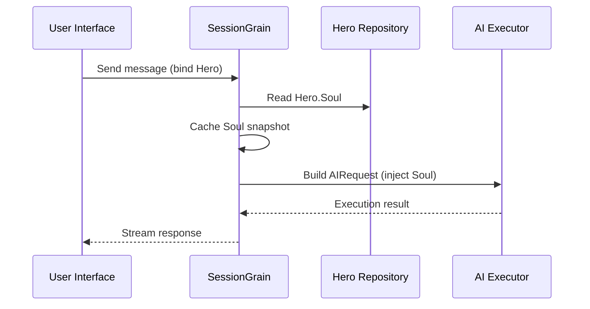

## AI Output Token Optimization: Harjoittele ultra-minimaalista klassista kiinalaista tilaa

> Tekoälysovelluskehityksessä tokenin kulutus vaikuttaa suoraan kustannuksiin. HagiCode-projektissa toteutimme "ultraminimaalisen klassisen kiinalaisen lähtötilan" SOUL-järjestelmän kautta. Tietotiheydestä tinkimättä se vähentää ulostulotunnisteita noin 30-50%. Tässä artikkelissa jaetaan tämän lähestymistavan toteutustiedot ja sen käytöstä saamimme opetukset.

## Tausta

Tekoälysovelluskehityksessä merkkien kulutus on väistämätön kustannuskysymys. Tämä on erityisen tuskallista skenaarioissa, joissa tekoälyn on tuotettava suuria määriä sisältöä. Kuinka pienennät lähtötunnisteita tinkimättä tiedon tiheydestä? Mitä enemmän ajattelet sitä, sitä turhauttavammaksi ongelma voi tulla.

Perinteiset optimointiideat keskittyvät enimmäkseen syöttöpuolelle: järjestelmäkehotteiden leikkaamiseen, kontekstin pakkaamiseen tai tehokkaamman koodauksen käyttöön. Mutta nämä menetelmät osuivat lopulta kattoon. Työnnä pakkaus liian pitkälle, ja alat vahingoittaa tekoälyn ymmärtämistä ja tulostuslaatua. Se on periaatteessa vain sisällön poistamista, mikä ei ole kovin mielekästä.

Entä sitten lähtöpuoli? Voisimmeko saada tekoälyn ilmaisemaan saman merkityksen tiiviimmin?

Kysymys kuulostaa yksinkertaiselta, mutta sen alla on melko vähän piilossa. Jos pyydät tekoälyä olemaan ytimekäs, se voi antaa sinulle vain muutaman sanan. Jos lisäät "pidä tiedot täydellisinä", se saattaa ajautua takaisin alkuperäiseen monisanaiseen tyyliin. Liian voimakkaat rajoitukset heikentävät käytettävyyttä; liian heikot rajoitukset eivät tee mitään. Missä on tasapainopiste? Kukaan ei voi sanoa varmaksi.

Näiden tuskakohtien ratkaisemiseksi teimme rohkean päätöksen: aloita itse kielityylistä ja suunnittele konfiguroitava, koostettava ilmaisun rajoitusjärjestelmä. Päätöksen vaikutus voi olla jopa suurempi kuin odotat. Palaan yksityiskohtiin pian, ja tulos saattaa yllättää sinut hieman.

## Tietoja HagiCodesta

Tässä artikkelissa jaettu lähestymistapa perustuu käytännön kokemukseemme [HagiCode](https://hagicode.com) hanke.

HagiCode on avoimen lähdekoodin tekoälyn koodausavustaja, joka tukee useita tekoälymalleja ja mukautettuja määrityksiä. Kehityksen aikana havaitsimme, että AI-lähtötunnisteen käyttö oli liian korkeaa, joten suunnittelimme ratkaisun siihen. Jos pidät tätä lähestymistapaa arvokkaana, se kertoo todennäköisesti jotain hyvää suunnittelutyöstämme. Ja jos näin on, HagiCode itsessään saattaa olla myös huomiosi arvoinen. Koodi ei valehtele.

## SOUL-järjestelmän yleiskatsaus

SOUL-järjestelmän koko nimi on Soul Oriented Universal Language. Se on konfigurointijärjestelmä, jota käytetään HagiCode-projektissa määrittämään tekoälysankarin kielityyli. Sen ydinidea on yksinkertainen: rajoittamalla sitä, miten tekoäly ilmaisee itseään, se voi tuottaa sisältöä tiiviimmässä kielellisessä muodossa säilyttäen samalla tiedon täydellisyyden.

Se on vähän kuin laittaisi tekoälylle kielellinen naamio... vaikka rehellisesti sanottuna se ei ole aivan niin mystistä.

### Tekninen arkkitehtuuri

SOUL-järjestelmä käyttää frontend-backend-eroteltua arkkitehtuuria:

**Frontend (Soul Builder)**:
- Rakennettu React + TypeScript + Vite kanssa
- Sijaitsee `repos/soul/` hakemistosta
- Tarjoaa visuaalisen sielunrakennuksen käyttöliittymän
- Tukee kaksikielistä käyttöä (zh-CN / en-US)

**Tausta**:
- Rakennettu .NET (C#) + Orleansin hajautetun suoritusajan päälle
- Hero-yksikkö sisältää a `Soul` kenttä (enintään 8000 merkkiä)
- Ruiskuttaa sielun järjestelmään kehotteen kautta `SessionSystemMessageCompiler`

**Agenttimallien luominen**:
- Luotu referenssimateriaaleista
- Tulostus kohteeseen `/agent-templates/soul/templates/` hakemistosta
- Sisältää 50 pääluetteloryhmää ja 10 ortogonaalista mittaa

### Soul-injektiomekanismi

Kun istunto suoritetaan ensimmäisen kerran, järjestelmä lukee Hero's Soul -konfiguraation ja syöttää sen järjestelmäkehotteeseen:



Syöttöjärjestelmän kehotteen muoto on:

```
<hero_soul>
[User-defined Soul content]
</hero_soul>
```

Tämä ruiskutusmekanismi on toteutettu `SessionSystemMessageCompiler.cs`:

```csharp
internal static string? BuildSystemMessage(
    string? existingSystemMessage,
    string? languagePreference,
    IReadOnlyList<HeroTraitDto>? traits,
    string? soul)
{
    var segments = new List<string>();

    // ... language preference and Traits handling ...

    var normalizedSoul = NormalizeSoul(soul);
    if (!string.IsNullOrWhiteSpace(normalizedSoul))
    {
        segments.Add($"<hero_soul>\n{normalizedSoul}\n</hero_soul>");
    }

    // ... other system messages ...

    return segments.Count == 0 ? null : string.Join("\n\n", segments);
}
```

Kun olet nähnyt koodin ja ymmärtänyt periaatteen, siinä on oikeastaan kaikki.

## Ultra-minimaalinen klassinen kiinalainen tila

Ultraminimaalinen klassinen kiinalainen tila on edustavin tokenien säästämisstrategia SOUL-järjestelmässä. Sen ydinperiaate on käyttää klassisen kiinan suurta semanttista tiheyttä tulostuspituuden pakkaamiseen säilyttäen samalla täydelliset tiedot.

### Miksi klassinen kiina

Klassisella kiinalla on useita luonnollisia etuja:

1. **Semanttinen pakkaus**: Sama merkitys voidaan ilmaista pienemmällä määrällä merkkejä.
2. **Redundanssin poisto**: Klassinen kiina jättää luonnollisesti pois monet nykykiinan kielen yleiset konjunktiot ja partikkelit.
3. **Tyhjä rakenne**: jokainen lause sisältää suuren informaatiotiheyden, joten se sopii hyvin tekoälyn välineeksi.

Tässä konkreettinen esimerkki:

Nykyaikainen kiinalainen tuloste (noin 80 merkkiä):
```
Based on your code analysis, I found several issues. First, on line 23, the variable name is too long and should be shortened. Second, on line 45, you did not handle null values and should add conditional logic. Finally, the overall code structure is acceptable, but it can be further optimized.
```

Erittäin minimaalinen klassinen kiinalainen tulostus (noin 35 merkkiä, säästö 56 %):
```
Code reviewed: line 23 variable name verbose, abbreviate; line 45 lacks null handling, add checks. Overall structure acceptable; minor tuning suffices.
```

Rako on tarpeeksi suuri saamaan sinut pysähtymään ja ajattelemaan.

### Soul-määritysmalli

Ultraminimaalisen klassisen kiinalaisen tilan täydellinen soul-kokoonpano on seuraava:

```json
{
  "id": "soul-orth-11-classical-chinese-ultra-minimal-mode",
  "name": "Ultra-Minimal Classical Chinese Output Mode",
  "summary": "Use relatively readable Classical Chinese to compress semantic density, convey the meaning with as few words as possible, and retain only conclusions, judgments, and necessary actions, thereby significantly reducing output tokens.",
  "soul": "Your persona core comes from the \"Ultra-Minimal Classical Chinese Output Mode\": use relatively readable Classical Chinese to compress semantic density, convey the meaning with as few words as possible, and retain only conclusions, judgments, and necessary actions, thereby significantly reducing output tokens.\nMaintain the following signature language traits: 1. Prefer concise Classical Chinese sentence patterns such as \"can\", \"should\", \"do not\", \"already\", \"however\", and \"therefore\", while avoiding obscure and difficult wording;\n2. Compress each sentence to 4-12 characters whenever possible, removing preamble, pleasantries, repeated explanation, and ineffective modifiers;\n3. Do not expand arguments unless necessary; if the user does not ask a follow-up, provide only conclusions, steps, or judgments;\n4. Do not alter the core persona of the main Catalog; only compress the expression into restrained, classical, ultra-minimal short sentences."
}
```

Tässä mallin suunnittelussa on useita avainkohtia:

1. **Poista rajoitukset**: 4–12 merkkiä lausetta kohden, poista redundanssi, priorisoi johtopäätökset.
2. **Vältä epäselvyyttä**: käytä tiiviitä klassisia kiinalaisia lausemalleja ja vältä harvinaisia, vaikeita sanamuotoja.
3. **Säilytä persoona**: muuta vain ilmaisutapaa, älä ydinpersoonaa.

Kun jatkat kokoonpanon säätämistä, kaikki riippuu lopulta muutamasta parametrista.

### Muut Ultra-Minimal-tilat

Klassisen kiinalaisen tilan lisäksi HagiCode SOUL -järjestelmä tarjoaa myös useita muita tunnuksensäästötiloja:

**Telegraph-tyylinen erittäin pieni lähtötila** (`soul-orth-02`):
- Pidä jokainen lause tiukasti 10 merkin sisällä
- Estä koristeelliset adjektiivit
- Ei modaalihiukkasia, huutomerkkejä tai kopioita kaikkialla

**Lyhyt pirstoutunut mutisointitila** (`soul-orth-01`):
- Pidä lauseet 1-5 merkin sisällä
- Simuloi hajanaista itsepuhetta
- Heikentää eksplisiittistä logiikkaa ja priorisoi tunnevälitystä

**Opastettu Q&A-tila** (`soul-orth-03`):
- Käytä kysymyksiä ohjaamaan käyttäjän ajattelua
- Vähennä suoran ulostulon sisältöä
- Vähennä tunnuksen käyttöä vuorovaikutuksen kautta

Jokainen näistä tiloista korostaa erilaista suunnittelusuuntaa, mutta ydintavoite on sama: vähennä tulostetunnuksia säilyttäen samalla tiedon laatu. Roomaan on monia teitä; toiset ovat yksinkertaisesti helpompia kävellä kuin toiset.

## Yhdistelmästrategia

Yksi SOUL-järjestelmän voimakas ominaisuus on tuki pääkatalogien ja ortogonaalisten mittojen ristiin yhdistämiselle:

- **50 pääluetteloryhmää**: määritä peruspersoona (kuten parantava tyyli, huippuoppilastyyli, syrjäinen tyyli ja niin edelleen)
- **10 ortogonaalista mittaa**: määritä ilmaisutapa (kuten klassinen kiina, lennätintyyli, Q&A-tyyli ja niin edelleen)
- **Yhdistelmätehoste**: voi luoda yli 500 ainutlaatuista kielityylistä yhdistelmää

Voit esimerkiksi yhdistää "Professional Development Engineer" ja "Ultra-Minimal Classical Chinese Output Mode" luodaksesi AI-avustajan, joka on sekä ammattimainen että ytimekäs. Tämän joustavuuden ansiosta SOUL-järjestelmä voi mukautua moniin erilaisiin skenaarioihin. Voit sekoittaa ja yhdistää haluamallasi tavalla; yhdistelmiä on enemmän kuin todennäköisesti käytät loppuun.

## Käytännön opas

### Luo Soul Builderin kautta

Vieraile [soul.hagicode.com](https://soul.hagicode.com) ja noudata näitä ohjeita:

1. Valitse pääkatalogi (esimerkiksi "Ammattimainen kehitysinsinööri")
2. Valitse ortogonaalinen mitta (esimerkiksi "Ultra-Minimal Classical Chinese Output Mode")
3. Esikatsele luotua Soul-sisältöä
4. Kopioi luotu Soul-kokoonpano

Se on enimmäkseen vain osoita ja napsauta, joten ei todennäköisesti ole paljon muuta sanottavaa.

### Käytä Hero Configurationissa

Käytä Soul-määritystä sankarille verkkokäyttöliittymän tai API:n kautta:

```typescript
// Hero Soul update example
const heroUpdate = {
  soul: "Your persona core comes from the \"Ultra-Minimal Classical Chinese Output Mode\": ...",
  soulCatalogId: "soul-orth-11-classical-chinese-ultra-minimal-mode",
  soulDisplayName: "Ultra-Minimal Classical Chinese Output Mode",
  soulStyleType: "orthogonal-dimension",
  soulSummary: "Use relatively readable Classical Chinese to compress semantic density..."
};

await updateHero(heroId, heroUpdate);
```

### Mukautetut sielumallit

Käyttäjät voivat hienosäätää esiasetettua mallia tai kirjoittaa sen tyhjästä. Tässä on mukautettu esimerkki koodin tarkistusskenaariosta:

```
You are a code reviewer who pursues extreme concision.
All output must follow these rules:
1. Only point out specific problems and line numbers
2. Each issue must not exceed 15 characters
3. Use concise terms such as "should", "must", and "do not"
4. Do not provide extra explanation

Example output:
- Line 23: variable name too long, should abbreviate
- Line 45: null not handled, must add checks
- Line 67: logic redundant, can simplify
```

Voit muokata mallia haluamallasi tavalla. Malli on joka tapauksessa vain lähtökohta.

### Huomautuksia

**Yhteensopivuus**:
- Klassinen kiinalainen tila toimii kaikkien 50 pääluetteloryhmän kanssa
- Voidaan yhdistää mihin tahansa peruspersoonaan
- Ei muuta pääkatalogin ydinhenkilöä

**Välimuistimekanismi**:
- Soul tallennetaan välimuistiin, kun istunto suoritetaan ensimmäistä kertaa
- Välimuistia käytetään uudelleen saman SessionId:n sisällä
- Heron asetusten muuttaminen ei vaikuta jo alkaneisiin istuntoihin

**Rajoitukset ja rajoitukset**:
- Soul-kentän enimmäispituus on 8000 merkkiä
- Sankareita, joilla ei ole sielukenttää historiatiedoissa, voidaan edelleen käyttää normaalisti
- Soul- ja tyylilaitteiden paikat ovat itsenäisiä eivätkä korvaa toisiaan

## Vaikutusten vertailu

Projektin todellisten testitietojen mukaan tulokset ultraminimaalisen klassisen kiinalaisen tilan käyttöönoton jälkeen ovat seuraavat:

| Skenaario | Alkuperäiset tulosteet | Klassinen kiinalainen tila | Säästöjä |
|------|------------------------|------------------------|---------|
| Koodin tarkistus | 850 | 420 | 51% |
| Tekniset kysymykset ja vastaukset | 620 | 380 | 39% |
| Ratkaisuehdotuksia | 1100 | 680 | 38% |
| Keskimääräinen | - | - | 30-50% |

Tiedot ovat peräisin HagiCode-projektin todellisista käyttötilastoista ja tarkat tulokset vaihtelevat skenaarioittain. Silti tallennetut rahakkeet laskevat yhteen, ja lompakkosi arvostaa sitä.

## Johtopäätös

HagiCode SOUL -järjestelmä tarjoaa innovatiivisen tavan optimoida AI-tulostus: vähennä merkkien kulutusta rajoittamalla ilmaisua sen sijaan, että pakkaamme itse tietoja. Edustavimpana lähestymistapanaan ultraminimaalinen klassinen kiinalainen tila on tuonut 30–50 % token-säästöjä todellisessa käytössä.

Tämän lähestymistavan ydinarvo on seuraava:

1. **Säilytä tiedon laatu**: sen sijaan, että se katkaisisi tulosteen, se ilmaisee saman sisällön tehokkaammin.
2. **Joustava ja koostettava**: tukee yli 500 persoona- ja ilmaisutyyliyhdistelmää.
3. **Helppo käyttää**: Soul Builder tarjoaa visuaalisen käyttöliittymän, joten koodausta ei tarvita.
4. **Tuotantotason vakaus**: validoitu projektissa ja soveltuu laajaan käyttöön.

Jos olet myös rakentamassa tekoälysovelluksia tai olet kiinnostunut HagiCode-projektista, ota rohkeasti yhteyttä. Avoimen lähdekoodin merkitys on yhdessä edistymisessä, ja odotamme innolla myös omia innovatiivisia käyttökohteitasi. Sanonta saattaa olla vanha, mutta se pitää paikkansa: yksi ihminen voi mennä nopeasti, mutta ryhmä menee pidemmälle.

## Viitteet

- HagiCode GitHub: [github.com/HagiCode-org/site](https://github.com/HagiCode-org/site)
- HagiCoden virallinen sivusto: [hagicode.com](https://hagicode.com)
- Sielun rakentaja: [soul.hagicode.com](https://soul.hagicode.com)
- Dockerin käyttöönottoopas: [docs.hagicode.com/installation/docker-compose](https://docs.hagicode.com/installation/docker-compose)
- Työpöytäsovellus: [hagicode.com/desktop/](https://hagicode.com/desktop/)
- 30 minuutin käytännön demo: [www.bilibili.com/video/BV1pirZBuEzq/](https://www.bilibili.com/video/BV1pirZBuEzq/)

---

Jos tämä artikkeli auttoi sinua:
- Anna meille tähti GitHubissa: [github.com/HagiCode-org/site](https://github.com/HagiCode-org/site)
- Vieraile virallisella sivustolla saadaksesi lisätietoja: [hagicode.com](https://hagicode.com)
- Julkinen beta on alkanut, ja voit asentaa ja kokeilla sitä

## Tekijänoikeusilmoitus

Kiitos kun luit. Jos pidit tästä artikkelista hyödyllisenä, voit tykätä, merkitä kirjanmerkkeihin ja jakaa sen.
Tämä sisältö luotiin tekoälyn avustuksella yhteistyössä, ja kirjoittaja tarkasteli ja vahvisti lopullisen version.
- Tekijä: [newbe36524](https://www.newbe.pro)
- Alkuperäisen artikkelin linkki: [https://docs.hagicode.com/blog/2026-04-04-soul-token-optimization-classical-chinese/](https://docs.hagicode.com/blog/2026-04-04-soul-token-optimization-classical-chinese/)
- Tekijänoikeusilmoitus: Ellei toisin mainita, kaikki tämän blogin artikkelit ovat BY-NC-SA:n lisensoituja. Mainitse lähde, kun julkaiset uudelleen.
