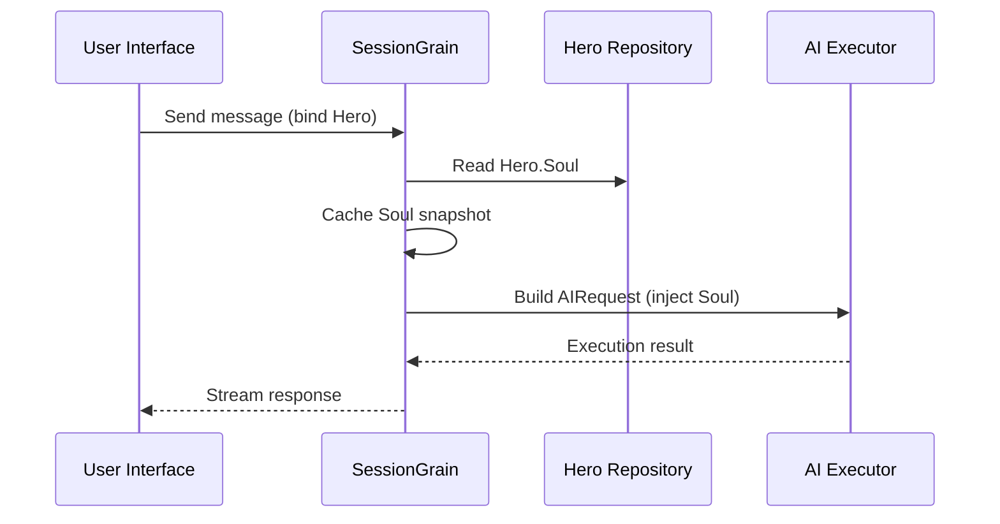

## AI kimeneti token optimalizálása: Ultra-minimális klasszikus kínai mód gyakorlása

> Az AI-alkalmazások fejlesztésében a token-fogyasztás közvetlenül befolyásolja a költségeket. A HagiCode projektben egy "ultraminimális klasszikus kínai kimeneti módot" valósítottunk meg a SOUL rendszeren keresztül. Az információsűrűség feláldozása nélkül nagyjából 30-50%-kal csökkenti a kimeneti tokeneket. Ez a cikk megosztja ennek a megközelítésnek a megvalósítási részleteit és a használatából tanult tanulságokat.

## Háttér

Az AI-alkalmazások fejlesztésében a token-fogyasztás elkerülhetetlen költségprobléma. Ez különösen fájdalmassá válik olyan forgatókönyvekben, amikor az AI-nak nagy mennyiségű tartalmat kell előállítania. Hogyan csökkentheti a kimeneti tokenek számát az információsűrűség feláldozása nélkül? Minél többet gondolkodik rajta, annál frusztrálóbb lehet a probléma.

A hagyományos optimalizálási ötletek többnyire a beviteli oldalra összpontosítanak: a rendszerkérések kivágására, a kontextus tömörítésére vagy a hatékonyabb kódolás használatára. De ezek a módszerek végül elérte a plafont. Ha túl messzire tolja a tömörítést, akkor rontani kezdi az AI megértését és kimeneti minőségét. Ez alapvetően csak a tartalom törlését jelenti, ami nem túl értelmes.

Szóval mi a helyzet a kimeneti oldallal? Elérhetnénk-e az AI-t, hogy tömörebben fejezze ki ugyanazt a jelentést?

A kérdés egyszerűnek hangzik, de elég sok rejtőzik alatta. Ha közvetlenül arra kéri az MI-t, hogy „legyen tömör”, akkor tényleg csak néhány szót ad. Ha hozzáadja a „tartsa meg az információ teljességét”, akkor visszasodródik az eredeti bőbeszédű stílushoz. A túl erős korlátozások rontják a használhatóságot; a túl gyenge korlátok nem tesznek semmit. Hol van pontosan az egyensúlyi pont? Senki sem tudja biztosan megmondani.

Ezeknek a fájdalmas pontoknak a megoldására merész döntést hoztunk: magából a nyelvi stílusból indulunk ki, és tervezzünk egy konfigurálható, összeállítható kényszerrendszert a kifejezéshez. A döntés hatása a vártnál is nagyobb lehet. Hamarosan kitérek a részletekre, és az eredmény egy kicsit meglepheti Önt.

## A HagiCode-ról

Az ebben a cikkben megosztott megközelítés a gyakorlati tapasztalatainkból származik [HagiCode](https://hagicode.com) projekt.

A HagiCode egy nyílt forráskódú mesterséges intelligencia kódoló asszisztens, amely több mesterségesintelligencia-modellt és egyéni konfigurációt támogat. A fejlesztés során azt tapasztaltuk, hogy az AI kimeneti token-használat túl magas, ezért erre terveztünk megoldást. Ha értékesnek találja ezt a megközelítést, az valószínűleg jót mond mérnöki munkánkról. És ha ez a helyzet, akkor maga a HagiCode is érdemes lehet a figyelmedre. A kód nem hazudik.

## SOUL rendszer áttekintése

A LÉLEK rendszer teljes neve Soul Oriented Universal Language. Ez a HagiCode projektben használt konfigurációs rendszer az AI Hero nyelvi stílusának meghatározására. Alapötlete egyszerű: a mesterséges intelligencia kifejeződésének korlátozásával tömörebb nyelvi formában tudja megjeleníteni a tartalmat, miközben megőrzi az információs teljességet.

Kicsit olyan, mintha nyelvi maszkot tennénk az MI-re... bár őszintén szólva, ez nem annyira misztikus.

### Műszaki építészet

A SOUL rendszer frontend-backend elválasztott architektúrát használ:

**Frontend (Soul Builder)**:
- React + TypeScript + Vite segítségével készült
- Található a `repos/soul/` könyvtárat
- Vizuális léleképítési felületet biztosít
- Támogatja a kétnyelvű használatot (zh-CN / en-US)

**Háttér**:
- .NET-re (C#) + az Orleans elosztott futtatókörnyezetre épült
- A Hero entitás magában foglalja a `Soul` mező (maximum 8000 karakter)
- Injects Soul a rendszer prompt keresztül `SessionSystemMessageCompiler`

**Ügynöksablonok generálása**:
- Referencia anyagokból generálva
- Kimenet a `/agent-templates/soul/templates/` könyvtárat
- 50 fő katalóguscsoportot és 10 ortogonális méretet tartalmaz

### Lélek-injekciós mechanizmus

Amikor egy munkamenet először fut, a rendszer beolvassa a Hero's Soul konfigurációt, és beadja a rendszer promptba:



A beszúrt rendszerprompt formátuma a következő:

```
<hero_soul>
[User-defined Soul content]
</hero_soul>
```

Ezt a befecskendezési mechanizmust a `SessionSystemMessageCompiler.cs`:

```csharp
internal static string? BuildSystemMessage(
    string? existingSystemMessage,
    string? languagePreference,
    IReadOnlyList<HeroTraitDto>? traits,
    string? soul)
{
    var segments = new List<string>();

    // ... language preference and Traits handling ...

    var normalizedSoul = NormalizeSoul(soul);
    if (!string.IsNullOrWhiteSpace(normalizedSoul))
    {
        segments.Add($"<hero_soul>\n{normalizedSoul}\n</hero_soul>");
    }

    // ... other system messages ...

    return segments.Count == 0 ? null : string.Join("\n\n", segments);
}
```

Ha egyszer láttad a kódot és megérted az elvet, akkor tényleg ennyi.

## Ultra-minimális klasszikus kínai mód

Az ultraminimális klasszikus kínai mód a legreprezentatívabb token-mentési stratégia a SOUL rendszerben. Alapelve, hogy a klasszikus kínai nyelv nagy szemantikai sűrűségét használja a kimeneti hossz tömörítésére, miközben megőrzi a teljes információt.

### Miért a klasszikus kínai

A klasszikus kínainak számos természetes előnye van:

1. **Szemantikus tömörítés**: ugyanaz a jelentés kifejezhető kevesebb karakterrel.
2. **Redundancia eltávolítása**: A klasszikus kínai természetesen kihagy számos kötőszót és a modern kínaiban megszokott részecskéket.
3. **Tömör szerkezet**: minden mondat nagy információsűrűséget hordoz, így kiválóan alkalmas az AI-kimenet eszközére.

Íme egy konkrét példa:

Modern kínai kimenet (kb. 80 karakter):
```
Based on your code analysis, I found several issues. First, on line 23, the variable name is too long and should be shortened. Second, on line 45, you did not handle null values and should add conditional logic. Finally, the overall code structure is acceptable, but it can be further optimized.
```

Ultra-minimális klasszikus kínai kimenet (körülbelül 35 karakter, 56%-os megtakarítás):
```
Code reviewed: line 23 variable name verbose, abbreviate; line 45 lacks null handling, add checks. Overall structure acceptable; minor tuning suffices.
```

A rés elég nagy ahhoz, hogy megálljon és gondolkodjon.

### Lélek konfigurációs sablon

A teljes Soul konfiguráció az ultra-minimális klasszikus kínai módhoz a következő:

```json
{
  "id": "soul-orth-11-classical-chinese-ultra-minimal-mode",
  "name": "Ultra-Minimal Classical Chinese Output Mode",
  "summary": "Use relatively readable Classical Chinese to compress semantic density, convey the meaning with as few words as possible, and retain only conclusions, judgments, and necessary actions, thereby significantly reducing output tokens.",
  "soul": "Your persona core comes from the \"Ultra-Minimal Classical Chinese Output Mode\": use relatively readable Classical Chinese to compress semantic density, convey the meaning with as few words as possible, and retain only conclusions, judgments, and necessary actions, thereby significantly reducing output tokens.\nMaintain the following signature language traits: 1. Prefer concise Classical Chinese sentence patterns such as \"can\", \"should\", \"do not\", \"already\", \"however\", and \"therefore\", while avoiding obscure and difficult wording;\n2. Compress each sentence to 4-12 characters whenever possible, removing preamble, pleasantries, repeated explanation, and ineffective modifiers;\n3. Do not expand arguments unless necessary; if the user does not ask a follow-up, provide only conclusions, steps, or judgments;\n4. Do not alter the core persona of the main Catalog; only compress the expression into restrained, classical, ultra-minimal short sentences."
}
```

Ennek a sablonnak több kulcsfontosságú pontja van:

1. **Korlátozások törlése**: 4-12 karakter mondatonként, távolítsa el a redundanciát, rangsorolja a következtetéseket.
2. **Kerülje a homályt**: használjon tömör klasszikus kínai mondatmintákat, és kerülje a ritka, nehéz megfogalmazásokat.
3. **Persona megőrzése**: csak a kifejezésmódot változtassa meg, az alapszemélyt ne.

Ha folyamatosan módosítja a konfigurációt, végül minden néhány paraméterre dől.

### Egyéb ultraminimális módok

A klasszikus kínai mód mellett a HagiCode SOUL rendszer számos más token-mentési módot is kínál:

**Telegráf-stílusú ultra-minimális kimeneti mód** (`soul-orth-02`):
- Minden mondat szigorúan 10 karakteren belül legyen
- A díszítő melléknevek tiltása
- Nincsenek modális részecskék, felkiáltójelek vagy többszörözés

**Rövid töredezett motyogási mód** (`soul-orth-01`):
- A mondatokat tartsa 1-5 karakteren belül
- Szimuláljon töredezett önbeszédet
- Gyengítse az explicit logikát, és helyezze előtérbe az érzelmi átvitelt

**Irányított kérdések és válaszok mód** (`soul-orth-03`):
- Használjon kérdéseket a felhasználó gondolkodásának irányítására
- Csökkentse a közvetlen kimeneti tartalmat
- Alacsonyabb tokenhasználat az interakció révén

Ezen módok mindegyike más tervezési irányt hangsúlyoz, de az alapvető cél ugyanaz: a kimeneti tokenek csökkentése az információ minőségének megőrzése mellett. Sok út vezet Rómába; egyesek egyszerűen könnyebben járnak, mint mások.

## Kombinációs stratégia

A SOUL rendszer egyik hatékony jellemzője a fő katalógusok és az ortogonális méretek keresztkombinációjának támogatása:

- **50 fő katalóguscsoport**: határozza meg az alapszemélyt (mint például a gyógyító stílus, a legjobb tanuló stílusa, a távolságtartó stílus és így tovább)
- **10 ortogonális méret**: határozza meg a kifejezésmódot (például klasszikus kínai, távíró-stílus, kérdezz-felelek stílus stb.)
- **Kombinációs hatás**: több mint 500 egyedi nyelvi stílusú kombinációt hozhat létre

Például a „Professzionális fejlesztőmérnök” és az „Ultra-minimális klasszikus kínai kimeneti mód” kombinációjával professzionális és tömör AI-asszisztenst hozhat létre. Ez a rugalmasság lehetővé teszi a SOUL rendszer számára, hogy számos különböző forgatókönyvhöz alkalmazkodjon. Tetszés szerint keverheti és párosíthatja; több kombináció létezik, mint amennyit valószínűleg kimerít.

## Gyakorlati útmutató

### Hozzon létre a Soul Builder segítségével

Látogassa meg [soul.hagicode.com](https://soul.hagicode.com) és kövesse az alábbi lépéseket:

1. Válasszon ki egy főkatalógust (például "Professzionális fejlesztőmérnök")
2. Válasszon egy ortogonális méretet (például "Ultra-minimális klasszikus kínai kimeneti mód")
3. Tekintse meg a generált lélektartalom előnézetét
4. Másolja a generált Soul konfigurációt

Leginkább csak mutass és kattints, így valószínűleg nincs sok mondanivaló.

### Használja a Hero Configuration-ban

Alkalmazza a Soul konfigurációt egy hősre a webes felületen vagy API-n keresztül:

```typescript
// Hero Soul update example
const heroUpdate = {
  soul: "Your persona core comes from the \"Ultra-Minimal Classical Chinese Output Mode\": ...",
  soulCatalogId: "soul-orth-11-classical-chinese-ultra-minimal-mode",
  soulDisplayName: "Ultra-Minimal Classical Chinese Output Mode",
  soulStyleType: "orthogonal-dimension",
  soulSummary: "Use relatively readable Classical Chinese to compress semantic density..."
};

await updateHero(heroId, heroUpdate);
```

### Egyedi lélek sablonok

A felhasználók finomhangolhatnak egy előre beállított sablont, vagy a semmiből írhatnak egyet. Íme egy egyéni példa a kód-ellenőrzési forgatókönyvhöz:

```
You are a code reviewer who pursues extreme concision.
All output must follow these rules:
1. Only point out specific problems and line numbers
2. Each issue must not exceed 15 characters
3. Use concise terms such as "should", "must", and "do not"
4. Do not provide extra explanation

Example output:
- Line 23: variable name too long, should abbreviate
- Line 45: null not handled, must add checks
- Line 67: logic redundant, can simplify
```

A sablont tetszés szerint módosíthatja. A sablon egyébként is csak kiindulópont.

### Megjegyzések

**Kompatibilitás**:
- A klasszikus kínai mód mind az 50 fő katalóguscsoporttal működik
- Bármilyen alapfigurával kombinálható
- Nem változtatja meg a főkatalógus fő személyét

**Caching mechanizmus**:
- A Soul a munkamenet első végrehajtásakor gyorsítótárazásra kerül
- A gyorsítótár ugyanazon a SessionId-n belül újrafelhasználásra kerül
- A Hero konfigurációjának módosítása nem érinti a már megkezdett munkameneteket

**Korlátozások és korlátok**:
- A Lélek mező maximális hossza 8000 karakter
- A történelmi adatokban lélekmező nélküli hősök továbbra is normálisan használhatók
- A soul és a stílus felszerelései függetlenek, és nem írják felül egymást

## Hatás-összehasonlítás

A projekt valós tesztadatai szerint az ultraminimális klasszikus kínai mód engedélyezése után a következő eredmények születtek:

| Forgatókönyv | Eredeti kimeneti tokenek | Klasszikus kínai mód | Megtakarítások |
|------|------------------------|------------------------|---------|
| Kód felülvizsgálata | 850 | 420 | 51% |
| Műszaki kérdések és válaszok | 620 | 380 | 39% |
| Megoldási javaslatok | 1100 | 680 | 38% |
| Átlagos | - | - | 30-50% |

Az adatok a HagiCode projekt tényleges használati statisztikáiból származnak, és a pontos eredmények forgatókönyvenként változnak. Ennek ellenére az elmentett tokenek összeadódnak, és a pénztárcája értékelni fogja.

## Következtetés

A HagiCode SOUL rendszer innovatív módot kínál az AI-kimenet optimalizálására: a token-felhasználás csökkentése a kifejezés korlátozásával, nem pedig magának az információnak a tömörítésével. A legreprezentatívabb megközelítésként az ultraminimális klasszikus kínai mód 30-50%-os token megtakarítást eredményez a valós használat során.

Ennek a megközelítésnek az alapvető értéke a következőkben rejlik:

1. **Az információ minőségének megőrzése**: a kimenet egyszerű csonkítása helyett hatékonyabban fejezi ki ugyanazt a tartalmat.
2. **Rugalmas és összeállítható**: több mint 500 személy és kifejezési stílus kombinációját támogatja.
3. **Könnyen használható**: A Soul Builder vizuális felületet biztosít, így nincs szükség kódolásra.
4. **Gyártási szintű stabilitás**: a projektben validálva és nagyüzemi használatra alkalmas.

Ha Ön is mesterségesintelligencia-alkalmazásokat készít, vagy felkeltette érdeklődését a HagiCode projekt, keressen bizalommal. A nyílt forráskód értelme a közös haladásban rejlik, és várjuk az Ön saját innovatív felhasználásait is. Lehet, hogy régi a mondás, de igaz marad: egy ember mehet gyorsan, de egy csoport messzebbre megy.

## Hivatkozások

- HagiCode GitHub: [github.com/HagiCode-org/site](https://github.com/HagiCode-org/site)
- HagiCode hivatalos oldala: [hagicode.com](https://hagicode.com)
- Léleképítő: [soul.hagicode.com](https://soul.hagicode.com)
- Docker telepítési útmutató: [docs.hagicode.com/installation/docker-compose](https://docs.hagicode.com/installation/docker-compose)
- Asztali alkalmazás: [hagicode.com/desktop/](https://hagicode.com/desktop/)
- 30 perces gyakorlati bemutató: [www.bilibili.com/video/BV1pirZBuEzq/](https://www.bilibili.com/video/BV1pirZBuEzq/)

---

Ha ez a cikk segített:
- Adjon nekünk egy csillagot a GitHubon: [github.com/HagiCode-org/site](https://github.com/HagiCode-org/site)
- További információért látogasson el a hivatalos oldalra: [hagicode.com](https://hagicode.com)
- A nyilvános béta elindult, és nyugodtan telepítheti és kipróbálhatja

## Szerzői jogi megjegyzés

Köszönöm, hogy elolvastad. Ha hasznosnak találta ezt a cikket, lájkolja, jelölje meg könyvjelzővel és ossza meg.
Ez a tartalom mesterséges intelligencia által támogatott együttműködéssel készült, a végső verziót pedig a szerző felülvizsgálta és megerősítette.
- Szerző: [newbe36524](https://www.newbe.pro)
- Az eredeti cikk linkje: [https://docs.hagicode.com/blog/2026-04-04-soul-token-optimization-classical-chinese/](https://docs.hagicode.com/blog/2026-04-04-soul-token-optimization-classical-chinese/)
- Szerzői jogi megjegyzés: Eltérő rendelkezés hiányában a blogon található összes cikk a BY-NC-SA licence alá tartozik. Kérjük, az újra közzétételkor hivatkozzon a forrásra.
